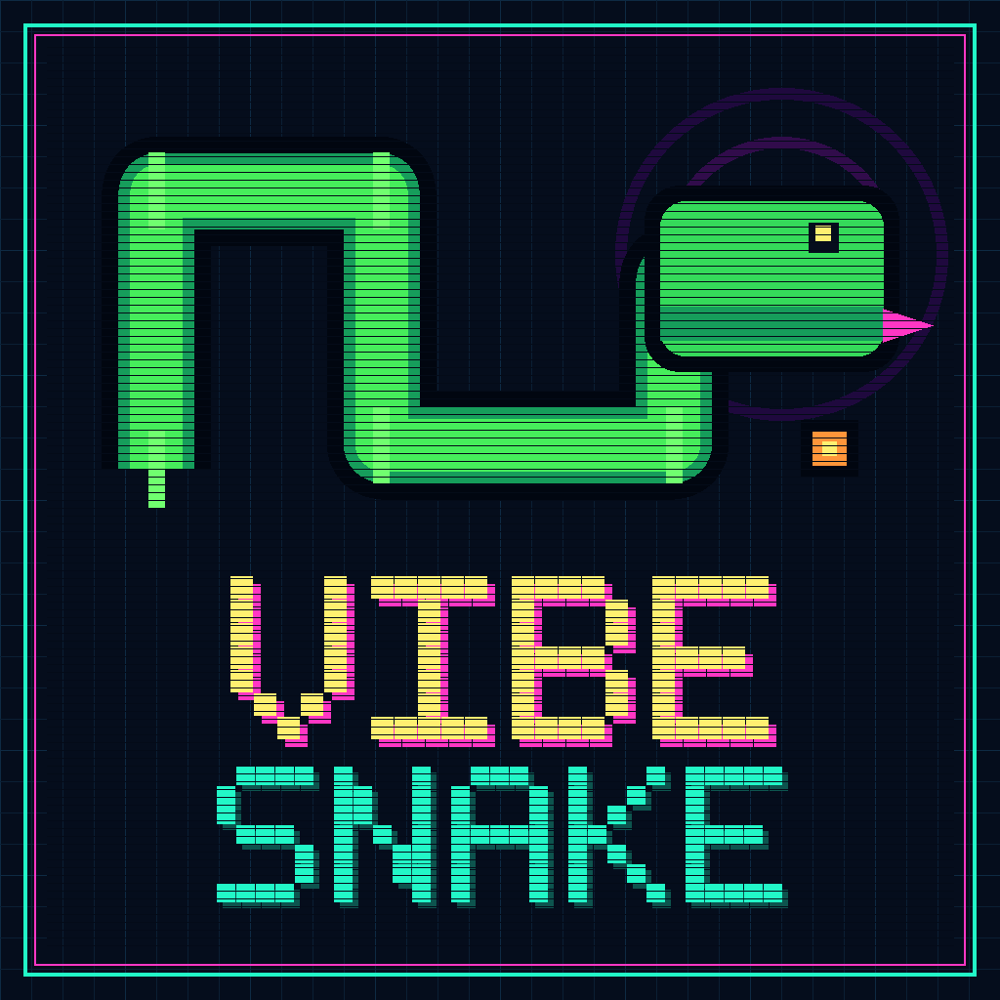
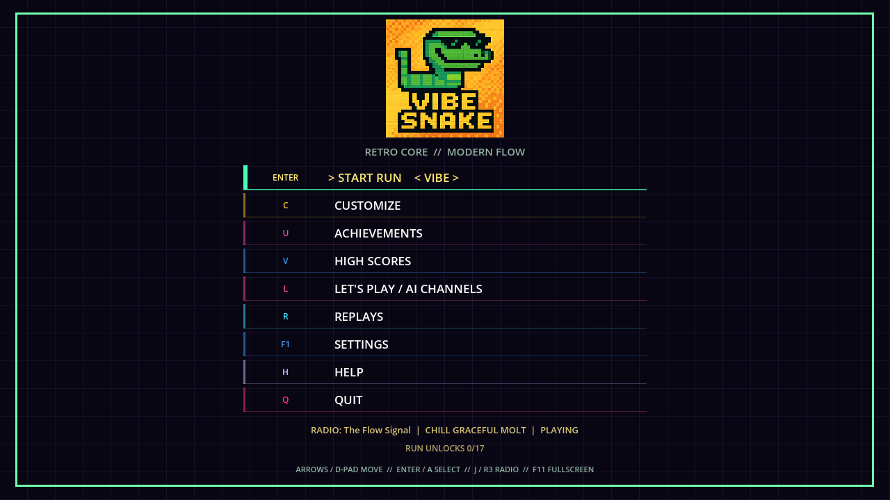
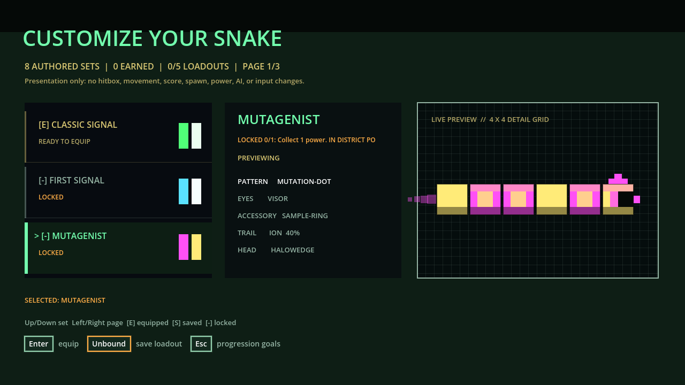
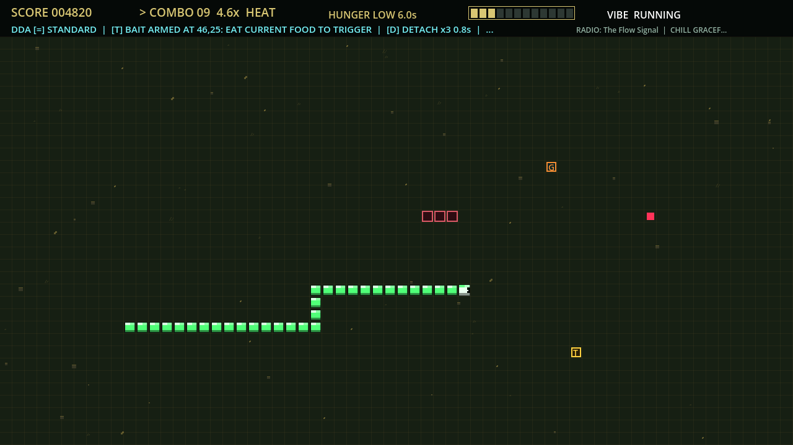

<p align="center">
  
</p>

<p align="center">
  <a href="https://github.com/blisspixel/VibeSnake/actions/workflows/ci.yml"></a>
  <a href="LICENSE"></a>
  <a href="https://www.python.org/"></a>
</p>

# Vibe Snake

Vibe Snake is an ambitious arcade successor to Snake. The playable alpha is built with Python and Pygame and combines wraparound movement, starvation pressure, smooth combo scoring, tactical powers, cosmetic progression, AI spectator channels, and an eight-station in-world radio framework. The gated 1.0 target is a native Godot 4 .NET game with deterministic rules in pure C#. The canonical repository is [blisspixel/VibeSnake](https://github.com/blisspixel/VibeSnake).

Status: Alpha 0.2.1. The source checkout is playable with all nine power-ups, versioned saves, adaptive 4:3-first presentation, and a full eight-station offline radio library (95 tracks). Hosted CI on [blisspixel/VibeSnake](https://github.com/blisspixel/VibeSnake) is green on a single `main` branch. Player updates use `vibesnake update` against GitHub `main`, and every successful push refreshes the floating [player-latest](https://github.com/blisspixel/VibeSnake/releases/tag/player-latest) package. The 0.3 qualification foundation includes a pinned Godot 4.7.1 and .NET 10.0.302 toolchain, a pure C# rules kernel with all nine powers, a platform-neutral persistence assembly, 214 native contract tests, shared Python-to-C# parity fixtures (movement, core rules, Shield, Phase Shift, Last Stand, remaining powers), live replay recording, bounded atomic replay storage, logical keyboard and controller actions, focus-loss safety, full-portfolio power presentation and Slow-Mo/Boost cadence in the Godot shell, essential fallback audio, and hosted native player smokes on Windows, macOS, and Linux. A store-ready 1.0 release is not ready yet: deeper parity fixtures, pack export approval, physical-controller and feel evidence, and structured playtesting remain. See the [current status](docs/release/STATUS.md) and [roadmap](ROADMAP.md).

Next milestone: 0.3.0, finish the measured Godot and C# vertical slice (remaining powers, parity depth, pack boundaries, and release-grade artifact evidence). The roadmap defines every dependent release through 1.0.0 without schedule estimates.

## Current alpha captures

<table>
  <tr>
    <th>Main menu</th>
    <th>Customization</th>
    <th>Powers active</th>
  </tr>
  <tr>
    <td></td>
    <td></td>
    <td></td>
  </tr>
</table>

These fixed staged 1280 by 720 captures come from the current Python alpha renderer, not concept art. They show the main menu with the preferred brand logo, the customization screen, and an in-run board with multiple powers active. Committed hashes, dimensions, README references, and presentation-source fingerprint are enforced by the [capture manifest](docs/images/screenshots/manifest.json). Regeneration currently uses host font fallback, so cross-platform byte identity is not claimed.

## Play from source

Use Python 3.11, 3.12, 3.13, or 3.14. Python 3.14 is the recommended development version. The source reference uses Pygame Community Edition so every supported interpreter has maintained native wheels on Windows, macOS, and Linux.

```powershell
git clone https://github.com/blisspixel/VibeSnake.git
cd VibeSnake
py -3.14 -m venv .venv
.\.venv\Scripts\Activate.ps1
python -m pip install --require-hashes --only-binary=:all: -r requirements-runtime.lock
python -m pip install --no-deps --no-build-isolation -e .
vibesnake
```

On macOS or Linux:

```bash
git clone https://github.com/blisspixel/VibeSnake.git
cd VibeSnake
python3.14 -m venv .venv
source .venv/bin/activate
python -m pip install --require-hashes --only-binary=:all: -r requirements-runtime.lock
python -m pip install --no-deps --no-build-isolation -e .
vibesnake
```

One-shot install scripts (clone + venv + install):

```powershell
./scripts/install_player.ps1
```

```bash
./scripts/install_player.sh
```

### Commands

| Command | Purpose |
| --- | --- |
| `vibesnake` or `vibesnake play` | Launch the game |
| `./play.ps1` / `./play.sh` / `play.bat` | Launch using the local `.venv` when present |
| `vibesnake update` | Fast-forward this checkout from GitHub `main` and reinstall |
| `vibesnake status` | Compare local commit to GitHub `main` without changing files |
| `vibesnake doctor` | Check Python, assets, and the offline radio library |
| `vibesnake version` | Print the installed package version |

```powershell
vibesnake status
vibesnake update
./play.ps1
```

`vibesnake update` pulls the latest `main` from [blisspixel/VibeSnake](https://github.com/blisspixel/VibeSnake), reinstalls the editable package, and keeps your local saves in the OS user-data directory. Use `vibesnake update --dry-run` to inspect without changing files.

**Always-current download:** every successful `main` push refreshes the floating
[player-latest](https://github.com/blisspixel/VibeSnake/releases/tag/player-latest)
release with `VibeSnake-player-source.zip`, wheels, and checksums. Tagged
releases publish the same artifacts under a version name.

## Controls

| Action | Controls |
| --- | --- |
| Move | Arrow keys, WASD, mouse click, or gamepad |
| Start or confirm | Enter |
| Pause or resume | P |
| Help | H |
| Fullscreen | F11 |
| Radio off or on | M |
| Next radio station | R or `]` |
| Previous radio station | `[` |
| Direct station selection | 1 through 8 |
| Leave a screen | Escape |

The main menu also exposes customization, achievements, high scores, settings, and AI channels. The complete reference is in the [player guide](docs/guides/PLAYER_GUIDE.md).

## What is here

- A 64 by 33 wraparound grid rendered at 1280 by 720.
- A 30-second starvation clock and near-miss reward system.
- Smooth combo multipliers from 1x to 10x.
- Nine power-up types with tested activation, gameplay, expiry, collision, and reset behavior.
- Twenty-five persistent achievements and 10,800 cosmetic combinations.
- Ten built-in AI personalities plus loadable JSON personalities.
- Eight authored radio-station identities and a 95-track offline GTA-style radio library under `assets/audio/radio/`, released with the project as original Vibe Snake soundtrack material. A clean clone starts the full station network; procedural SFX fallbacks still cover missing event cues.
- Versioned, atomic save repositories in the operating system's user-data directory.
- Headless automated tests, an enforced 80 percent line-coverage floor, full-tree Ruff and source-policy gates, hash-locked Python dependencies, audited locked NuGet restore, local pre-commit hooks, and a GitHub Actions workflow.
- A seeded gameplay QA laboratory with property-generated input, per-step invariants, replayed trace hashes, automated policies, and JSON reports.
- A tested native foundation with PCG32 randomness, ordered events, canonical state restore, complete pure C# contracts for all nine powers, Godot full-portfolio presentation and cadence, live verified replay recording, bounded atomic user-data storage, strict import diagnostics, generated state-machine campaigns, logical Godot input and lifecycle handling, fallback audio, checksum-verified exports, and a reproducible artifact manifest gate.

## Documentation

| Need | Document |
| --- | --- |
| Find any project document | [Documentation hub](docs/README.md) |
| Learn the controls and game loop | [Player guide](docs/guides/PLAYER_GUIDE.md) |
| Inspect native actions and lifecycle rules | [Input and lifecycle](docs/design/INPUT.md) |
| Understand the intended experience | [Game design](docs/design/GAME_DESIGN.md) |
| Understand what should make it fun | [Fun and player experience strategy](docs/design/FUN_DESIGN.md) |
| Explore the snake-universe canon and broadcast world | [World and broadcast bible](docs/design/WORLD_BIBLE.md) |
| Inspect power-up behavior and gaps | [Power-ups](docs/design/POWERUPS.md) |
| Understand saves, achievements, and cosmetics | [Progression and save data](docs/design/PROGRESSION.md) |
| Understand the code | [Architecture](docs/engineering/ARCHITECTURE.md) and [repository map](docs/engineering/REPOSITORY_MAP.md) |
| Understand native replay capture and files | [Replay recording and storage](docs/engineering/REPLAYS.md) |
| Change runtime settings | [Configuration](docs/guides/CONFIGURATION.md) |
| Add or tune AI players | [AI players](docs/design/AI_PLAYERS.md) |
| Work on music and sound | [Audio system](docs/content/AUDIO.md) |
| Understand asset licensing and pack delivery | [Asset licensing](docs/content/ASSET_LICENSING.md) |
| Add or audit source assets | [Assets and rights pipeline](docs/content/CONTENT_PIPELINE.md) |
| Build or validate player content packs | [Content pack contract](docs/content/CONTENT_PACKS.md) |
| Set up a development environment | [Development guide](docs/guides/DEVELOPMENT.md) |
| Apply the engineering standard | [Code quality standards](docs/engineering/CODE_QUALITY_STANDARDS.md) |
| Run quality checks | [Testing guide](docs/engineering/TESTING.md) |
| Run or extend automatic gameplay QA | [Automated QA laboratory](docs/engineering/AUTOMATED_QA.md) |
| Understand the native stack and migration | [Technology strategy](docs/decisions/TECHNOLOGY_STRATEGY.md) |
| See what works now | [Status](docs/release/STATUS.md) |
| See what comes next | [Roadmap](ROADMAP.md) |
| Review notable changes | [Changelog](CHANGELOG.md) |
| Prepare a release | [Release checklist](docs/release/RELEASE_CHECKLIST.md) |
| Contribute changes | [Contributing guide](CONTRIBUTING.md) |

## Project layout

```text
VibeSnake/
|-- .github/                CI, dependency updates, and repository policy
|-- assets/                 Rights-cleared source artwork and production metadata
|-- config/                 Content policy, generated inventory, and radio production plan
|-- data/                   Policy for ignored local migration and production inputs
|-- docs/                   Linked design, engineering, guide, content, decision, release, and research records
|-- game/                   Godot 4.7.1 C# application shell
|-- native/                 Pure C# rules, persistence, tests, solution, and toolchain manifest
|-- scripts/                Deterministic quality, content, screenshot, and build tools
|-- src/vibesnake/          Game package
|-- tests/                  Deterministic automated tests
|-- CHANGELOG.md            User-visible history of notable changes
|-- ROADMAP.md              Capability-gated path from the alpha to 1.0
|-- global.json             Stable .NET SDK resolver policy
|-- LICENSE                 Apache License 2.0 terms
|-- NOTICE                  Project attribution and content-rights boundary
`-- pyproject.toml          Package metadata, entry point, tests, coverage, lint, and build policy
```

See the [repository map](docs/engineering/REPOSITORY_MAP.md) for ownership and important files.

## Validate a change

```powershell
python -m pip install --require-hashes --only-binary=:all: -r requirements-ci.lock
python -m pip install --no-deps --no-build-isolation -e .
python scripts/lock_python_dependencies.py
python scripts/lock_python_dependencies.py --profile runtime
python -m pip_audit --strict --disable-pip --require-hashes --requirement requirements-ci.lock
python -m pip_audit --strict --disable-pip --require-hashes --requirement requirements-runtime.lock
python -m ruff format --check src tests scripts
python -m ruff check src tests scripts
python scripts/check_source_policy.py
python scripts/check_docs.py
python scripts/capture_readme_screenshots.py --check
python scripts/visual_generate_badges.py --check
python scripts/visual_generate_logo.py --check
python scripts/content_inventory.py --check
python -m vibesnake.qa.shared_traces --check
python -m vibesnake.qa.shared_rule_traces --check
python -m vibesnake.qa.shared_power_traces --check
python -m vibesnake.qa.shared_phase_shift_traces --check
python -m vibesnake.qa.shared_last_stand_traces --check
python -m vibesnake.qa.shared_remaining_power_traces --check
python -m vibesnake.qa --seeds 0 1 2 3 4 --steps 500 --output qa_reports/core.json
python -m pytest --cov=vibesnake --cov-report=term-missing --cov-report=xml
```

The native build, coverage, formatting, and Godot smoke commands are in the [development guide](docs/guides/DEVELOPMENT.md).

## License

Vibe Snake source code, documentation, and assets explicitly marked rights-cleared in the generated inventory are available under the [Apache License 2.0](LICENSE). Audio candidates with unresolved service-generation terms are not yet cleared for public distribution. See [NOTICE](NOTICE) and the [asset licensing policy](docs/content/ASSET_LICENSING.md).
