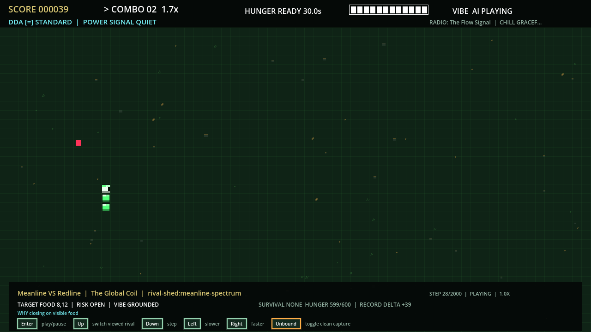

<p align="center">
  
</p>

<p align="center">
  <a href="https://github.com/blisspixel/VibeSnake/actions/workflows/ci.yml"></a>
  <a href="LICENSE"></a>
  
  
</p>

# Vibe Snake

Vibe Snake is a native Godot and C# arcade successor to Snake. It combines a clean wraparound core with starvation pressure, combos, tactical powers, cosmetic progression, AI spectator channels, replays, and an offline radio framework.

The product path is Godot 4.7.1, .NET 10, and pure C# rules. The older Python/Pygame implementation remains a frozen behavior oracle and migration reference. New product work belongs in `game/` and `native/`.

This is active `0.3.0-alpha.1` development. Automated Windows, macOS, and Linux qualification is extensive, but Store-ready 1.0 is not ready. Physical-device review, named-hardware performance, approved content packs, signing, and structured human playtesting remain release gates. See [current status](docs/release/STATUS.md) and the [roadmap](ROADMAP.md) for the evidence-backed details.

## Current native build

<table>
  <tr>
    <th>Main menu</th>
    <th>Vibe mode gameplay</th>
  </tr>
  <tr>
    <td></td>
    <td></td>
  </tr>
  <tr>
    <th>Customization</th>
    <th>Let's Play / AI channel</th>
  </tr>
  <tr>
    <td></td>
    <td></td>
  </tr>
</table>

These are direct 1280 by 720 captures from the current Godot renderer. Native `RepositoryChecks` enforces their complete PNG integrity, exact hashes, dimensions, README references, canonical manifest, and presentation-source fingerprint through the [capture manifest](docs/images/screenshots/manifest.json).

## Highlights

- Classic and Vibe modes with separate rules and score identities.
- Nine tactical powers, including the visible `T` bait trail.
- Detailed pixel-art snakes, procedural terrain, multimodal feedback, and accessibility profiles.
- Keyboard, mouse, D-pad, analog stick, and remappable controller input.
- 4:3, 16:9, 16:10, square, ultrawide, borderless, and exclusive-fullscreen presentation contracts.
- Idle pointer hiding, focus-safe pausing, reduced motion, flash-free presentation, high contrast, mono audio, and scalable text.
- Curated cosmetic sets, progression goals, Broadcast Tour, achievements, local scores, replays, and recovery tools.
- Let's Play / AI channels with equal-rules matches, a thin live ticker, contextual playback controls, standings, lore, and seed challenges.
- Post-1.0 Agent Arena source preview. Supported 1.0 player artifacts exclude it. See [Agent Arena](docs/design/AGENT_ARENA.md).
- Offline-first saves and content with no account or network requirement.

The complete player-facing behavior is in the [player guide](docs/guides/PLAYER_GUIDE.md).

## Release focus

The immediate goal is the first reproducible native alpha, not more feature surface.

[Release run 32421705560](https://github.com/blisspixel/VibeSnake/actions/runs/32421705560) at `e87db6e` remains historical automated qualification evidence. Later player and rules changes on `main` supersede those packages for physical release acceptance, so no current candidate-bound physical review is prepared. The hash-bound 12-track `the_bureau` listening record remains current at 0 of 12 decisions. Evidence, hashes, and open gates live in [current status](docs/release/STATUS.md).

1. Complete `the_bureau` listening and approve the first non-zero core and radio export allowlists.
2. Freeze the resulting content-bearing revision, run a fresh three-platform Release matrix, and generate a new candidate-bound review workspace.
3. Execute the corrected physical matrix against those exact packages.
4. Repair findings and rerun every affected gate without expanding feature scope.
5. Publish `v0.3.0-alpha.1` only when the reviewed revision, hosted CI, artifacts, content, and disclosures agree.

The [roadmap](ROADMAP.md#what-is-next-ordered-and-why) explains why this work precedes later milestones.

## Play from source

Prerequisites are Git, PowerShell 7, and the .NET 10.0.303 SDK. The launcher installs and verifies the pinned Godot 4.7.1 .NET editor on first use, builds the native game, imports its assets once for a new checkout, and starts it.

Windows:

```powershell
git clone https://github.com/blisspixel/VibeSnake.git
cd VibeSnake
./play.ps1
```

macOS or Linux:

```bash
git clone https://github.com/blisspixel/VibeSnake.git
cd VibeSnake
./play.sh
```

The current floating source build and checksums are published under [player-latest](https://github.com/blisspixel/VibeSnake/releases/tag/player-latest) from the newest successfully qualified `main` push. A newer qualified revision may cancel a superseded publisher before it finishes. The release contains the source archive, Python reference wheel and sdist, and `SHA256SUMS.txt`. The source archive includes development previews such as the Agent Plugin manifest and skill, the MCP host source and packaging script, and the generated Open Knowledge Format bundle. It is not a signed native player or a preassembled supported Agent Plugin. Versioned native alpha releases have a separate fail-closed pipeline, and the first tag remains blocked on approved packaged content and an exact artifact review. See [native release outputs](docs/release/PACKAGING.md) and [agent play integration](docs/engineering/AGENT_PLAY.md).

## Controls

| Action | Default input |
| --- | --- |
| Navigate or move | Arrow keys, WASD, D-pad, analog stick, or mouse |
| Confirm | Enter, controller south button, or left click |
| Back | Escape, controller east button, or right click |
| Pause | P, controller Start, or middle click |
| Radio | J or controller R3 |
| Fullscreen | F11 |
| Help | H |

All gameplay and shell actions are available through remappable keyboard and controller routes. See [input and lifecycle](docs/design/INPUT.md) for the exact action contract.

## Documentation

| Need | Start here |
| --- | --- |
| Browse all documentation | [Documentation hub](docs/README.md) |
| Play, configure, or troubleshoot | [Player guide](docs/guides/PLAYER_GUIDE.md) |
| Review accessibility features and limitations | [Accessibility guide](docs/guides/ACCESSIBILITY.md) |
| Understand the game and experience goals | [Game design](docs/design/GAME_DESIGN.md), [fun strategy](docs/design/FUN_DESIGN.md), and the post-1.0 [Agent Arena](docs/design/AGENT_ARENA.md) |
| See verified implementation status | [Current status](docs/release/STATUS.md) |
| Follow the path through 1.0 | [Roadmap](ROADMAP.md) |
| Understand Godot, C#, and the Python migration | [Technology strategy](docs/decisions/TECHNOLOGY_STRATEGY.md) |
| Connect an agent in the post-1.0 preview | [Agent play integration](docs/engineering/AGENT_PLAY.md) |
| Find code and directory ownership | [Repository map](docs/engineering/REPOSITORY_MAP.md) |
| Set up development and run checks | [Development guide](docs/guides/DEVELOPMENT.md) and [testing guide](docs/engineering/TESTING.md) |
| Work on audio, assets, or content packs | [Audio](docs/content/AUDIO.md), [content pipeline](docs/content/CONTENT_PIPELINE.md), and [content packs](docs/content/CONTENT_PACKS.md) |
| Prepare or audit a release | [Release checklist](docs/release/RELEASE_CHECKLIST.md) and [known issues](docs/release/KNOWN_ISSUES.md) |

## Development

The native quality loop builds the Godot project, runs the C# contract suite with enforced line and branch coverage, checks formatting and analyzers, validates the pinned toolchain, and executes the real scene smoke:

```powershell
./scripts/test_native.ps1
```

Python reference and cross-runtime checks remain temporarily in CI while their remaining validators move to .NET. Documentation, product-version, source-policy, candidate-freeze, dependency-lock, project-logo, Agent Knowledge, offline agent-interoperability baseline and contract-digest validation, station-badge, content-inventory, README screenshot capture/freshness, release-material, release-rehearsal, stable-promotion, achievement-candidate fixture generation/freshness, Last Stand fixture generation/freshness, Phase Shift fixture generation/freshness, Shield fixture generation/freshness, Remaining Powers fixture generation/freshness, Core Rules fixture generation/freshness, Movement fixture generation/freshness, and Agent Plugin qualification now run through native `RepositoryChecks`. The release-material routes validate the closed V090-09 foundation and can write either a pending foundation handoff or an exact candidate-bound structural decision. A passing candidate route sets `candidateMaterialComplete: true` while keeping `releaseAcceptance: false` pending artifact-manifest reconciliation, marketing-claim approval, visible image review, and video playback review. The rehearsal routes validate the V090-10 foundation or an externally executed, retained three-platform record. They require a separately accepted material decision and write `release-rehearsal-handoff-v2` with the exact revision stable promotion consumes. Stable promotion uses a separate checked-in exact-kind authority for ten upstream decisions and rejects a generic favorable JSON object. Nine review decisions bind the unsigned artifact and manifest cohort; platform signing binds that cohort as its input and the byte-changing signed public artifacts, manifests, and provenance as its result. Optional content is cross-bound separately. The routes write `stable-promotion-handoff-v2`, with protected execution and release acceptance explicitly pending in the foundation. The validator never performs review, signing, tagging, installation, upload, or publication. Achievement-candidate, Last Stand, Phase Shift, Shield, Remaining Powers, Core Rules, and Movement tooling render 167 frozen reviewed Python-origin vectors without executing native rules, reproduce their exact 2,682-byte, 3,596-byte, 3,534-byte, 4,489-byte, 9,548-byte, 57,031-byte, and 999,087-byte canonical LF identities, and retain separate live native parity consumers. The six small renderers keep their shared 65,536-byte fixed-fixture boundary. Movement uses a separate 1,000,000-byte lifecycle with the same stable-read, safe-path, atomic-replacement, cleanup, and exact self-verification guarantees. Agent Knowledge applies the hardened fixed-path lifecycle to five exact Open Knowledge Format 0.2 concepts and derives the current frame v9 and survival v1 contracts from canonical source. Agent interoperability uses the same strict bounded-input and atomic replacement contracts for review dates, canonical source alignment, documentation pins, SemVer history, and exact host and plugin digests. The scheduled Python probe is isolated and network-only. The screenshot route stages Godot output outside the committed evidence set, performs full PNG and canonical-manifest validation, and replaces the manifest last so interrupted multi-file capture fails closed. Ruff retains full Python syntax ownership while the frozen oracle exists. The remaining Python tools are explicit migration work. They are test-only scaffolding, not a second product path. Their CI and package-tool graph is audited, and Agent Host package validation is the next selected native slice. The frozen oracle stays until equivalent native gates exist. The ordered removal gates, full command set, dependency locks, screenshot workflow, and packaged-player qualification are documented in the [migration map](docs/engineering/MIGRATION_MAP.md#repository-wide-python-retirement) and [development guide](docs/guides/DEVELOPMENT.md). Contribution requirements are in [CONTRIBUTING.md](CONTRIBUTING.md).

## License

Source code, documentation, and assets marked rights-cleared in the generated inventory are available under the [Apache License 2.0](LICENSE). See [NOTICE](NOTICE), [credits](CREDITS.md), and the [asset licensing policy](docs/content/ASSET_LICENSING.md) for the content boundary.
