# Roadmap to 1.0

## How this roadmap works

This is a capability-gated plan, not a calendar. It contains no delivery dates or effort estimates. Work proceeds in dependency order, and a version is complete only when its acceptance gates have objective evidence.

Status terms:

- Completed: implemented and verified against the listed gate.
- Current: the only planned feature milestone that should receive broad implementation work.
- Queued: defined, but dependent on an earlier version.
- Conditional: included only if it passes the same quality bar as the primary scope.
- Deferred: explicitly outside the 1.0 critical path.

Version rules:

1. Finish every automatable acceptance gate and technically prerequisite contract for one minor version before beginning dependent feature work for the next. An unavailable human review leaves the experiential gate open and blocks version promotion or an exceptional-feel claim, but it does not stop reversible implementation that can continue under automated evidence.
2. Use patch releases such as `0.3.1` for defects, migrations, and narrowly scoped polish discovered after a minor release.
3. Do not move unfinished work forward silently. Either finish it, reduce the published scope, or record it as a known issue with a release decision.
4. Keep player-facing behavior, save compatibility, ruleset identity, tests, and documentation in the same change.
5. Preserve the project-wide 80 percent coverage floor at every step. Later milestones add stricter gates for critical modules.

## Current baseline: 0.2.1 alpha

### Verified strengths

| Area | Current evidence |
| --- | --- |
| Playable loop | Wraparound movement, food, growth, scoring, starvation, pause, death, restart, and menus work from a source checkout |
| Power-ups | All nine have documented gameplay contracts and integration coverage through `Game.update` |
| Persistence | Four schema-versioned repositories use atomic writes, migrations, corrupt-file backups, and OS user-data locations |
| Progression | Twenty-five achievements, local top-ten scores, cosmetics, and loadouts persist for human players |
| Identity | Eight radio-station identities, a public 95-track offline radio library under `assets/audio/radio/`, ten built-in AI personalities, and a custom AI channel |
| Presentation | Adaptive 4:3-first framing with integer pixel scaling for phone, square, and wide windows in the Python alpha; retro-modern menu chrome |
| Player path | `vibesnake play|update|status|doctor|version`, install scripts, play launchers, and continuous GitHub `player-latest` packages from `main` |
| Automation | Python deterministic suite green on 3.11 through 3.14 in hosted CI; 250 native xUnit contracts pass with coverage floors; shared movement, core-rule, Shield, Phase Shift, Last Stand, and remaining-power fixtures pass; rules throughput, inventory export, architecture, personality, multi-stream RNG, preferences schema 2, input bindings, and diagnostics gates; Godot headless and packaged-player smoke pass on hosted Windows, macOS, and Linux runners |
| Quality policy | Full-tree Ruff, executable source policy, documentation links, content inventory, shared fixtures, hash-locked Python dependencies, locked audited NuGet restore, compile checks, coverage floors, local pre-commit hooks, and green hosted CI on a single public `main` branch |

### Deep-audit findings that shape the order

| Finding | Repository evidence | Why it precedes 1.0 |
| --- | --- | --- |
| Installed assets are not trustworthy yet | Package metadata is consolidated in [pyproject.toml](pyproject.toml), but runtime paths in [settings.py](src/vibesnake/data/settings.py), [radio_manager.py](src/vibesnake/audio/radio_manager.py), [hud.py](src/vibesnake/rendering/hud.py), and [player.py](src/vibesnake/ai/player.py) still assume a checkout | A code install can succeed without an approved playable asset set |
| Source and release content need explicit boundaries | Public inventory is 114 rights-cleared files totaling 340,378,770 bytes, including 95 radio MP3 tracks. Export eligibility remains zero until pack quality gates pass. Optional ignored local archives may hold historical material on developer machines only | Build size, licensing, update size, and live-content authority require exact manifests rather than recursive packaging |
| Orchestration is concentrated | `game_state.py` is about 1,900 lines, `menus.py` is over 1,500 lines, and many state changes bypass `transition_to` | New UX, replay, accessibility, and balance work will become harder to verify if added directly |
| Gameplay randomness is global | Food, power-ups, AI, visuals, radio, and copy all use module-level `random` calls | Runs cannot be reproduced reliably, and cosmetic randomness can interfere with gameplay testing |
| Controller support is static | [InputManager](src/vibesnake/input/input_manager.py) opens only joystick zero at startup, uses hard-coded button indices, and has no hot-plug path | Controller-only play is not dependable enough to claim |
| Display handling is partial | Python alpha has adaptive 4:3-first framing and integer scale; native shell still needs full viewport, safe-area, remapping, and feel evidence | UI and pointer accuracy must stay correct across supported aspect ratios on the ship target |
| Settings are incomplete | Sound, one volume, and fullscreen persist; the former nonfunctional difficulty row is removed, but input, text, motion, flash, contrast, and independent bus controls remain | The current UI is honest but does not yet satisfy the accessibility and device-control promise |
| Authored feedback is not release-qualified | Radio tracks ship in public source; gameplay SFX still rely largely on procedural fallbacks | The game needs a typed event matrix, deliberate mix, minimal authored cue set, and accessibility alternatives |
| Custom content is weakly validated | Custom AI JSON is loaded directly and trait values are not clamped or schema-checked | One bad local file can produce confusing behavior without an actionable report |
| Release operations are incomplete | Hosted multi-platform CI smokes and continuous player-latest packages exist; signing, notarization, promotion controls, and support drills do not | Continuous smokes are not yet a supportable store release |

## The 1.0 player promise

Version 1.0 is not defined by feature count. It is defined by a dependable, legible, distinctive experience.

| Promise | What 1.0 must do | Required proof |
| --- | --- | --- |
| Install and launch | Install on Windows, macOS, and Linux, launch without Python or the repository, and work offline with the core asset pack | Clean-machine artifact tests from outside the checkout on native runners |
| Immediate control | Accept a legal direction from keyboard or controller without hidden setup and never lose buffered valid turns | Input-contract tests plus controller and keyboard play passes |
| Clear failure | Make collision, starvation, and recovery states attributable without relying on color or sound alone | Gameplay observation checklist and multimodal cue matrix |
| Fast recovery | Move from death to another run with no accidental restart and no unnecessary menu traversal | First-run and repeat-run playtest observations |
| Fair scores | Store the ruleset, rules version, difficulty policy, and DDA policy with every score | Leaderboard migration and category tests |
| Durable progress | Preserve supported saves across update, reject unsafe downgrade writes, and expose reset and recovery in the UI | Migration fixtures, fault injection, and recovery-flow tests |
| Accessible presentation | Offer readable text, visible focus, remappable single-action controls, separate audio controls, reduced motion, high contrast, and photosensitivity-safe settings | Automated checks plus a documented manual accessibility audit |
| Stable performance | Hold the published frame target at supported resolutions on declared minimum hardware without gameplay-speed drift | Repeatable performance scenarios and recorded frame statistics |
| Distinct identity | Make radio, AI channels, power-ups, environments, and feedback feel coherent while keeping rules readable | Content manifest, feedback matrix, and structured player feedback |
| Honest privacy | Work without an account or network connection and never upload run data without a later explicit consent design | Network-free test and published privacy statement |
| Supportable release | Include version, logs, checksums, dependency inventory, known issues, recovery instructions, and a support route | Release artifact inspection and support drill |

## 1.0 scope lock

### Included in the critical path

- Native Windows x64, macOS Universal, and Linux x64 player artifacts with the same product contract.
- Godot 4 .NET as the presentation shell and a pure C# deterministic rules assembly, after the 0.3 qualification gate.
- The Python and Pygame build as a temporary behavior reference during migration, not a runtime dependency of the 1.0 player artifacts.
- One bundled core asset pack that is sufficient for offline play.
- One optional full radio pack with a versioned manifest and clear missing-pack behavior.
- Classic and Vibe human rulesets with separate score categories.
- Keyboard-only, mouse, and common-controller operation.
- Local profiles, achievements, cosmetics, top-ten scores, replay files, and AI spectator channels.
- A finite offline Broadcast Tour that wraps authored challenges, rivals, station context, meaningful unlocks, and equal-rules seed rematches around Classic and Vibe without creating a third ruleset.
- English text with a localization-ready string system and pseudo-localization tests.
- Accessibility controls for text, contrast, focus, motion, flashes, particles, audio groups, and input remapping.
- Offline-first diagnostics and local, consent-aware playtest summaries.

### Conditional for 1.0

- A storefront-specific installer or depot. Store integration may wrap the release artifact, but it must not become a gameplay dependency.
- A small downloadable demo. It must use the same rules engine and content-manifest system as the full build.

### Deferred until after 1.0

- Online multiplayer.
- Global online leaderboards.
- Cloud saves and player accounts.
- A network-delivered daily challenge.
- A mod marketplace or arbitrary executable plugins.
- Mobile and console ports.
- Runtime generative-AI features.
- Shipping archived audio, generation prompts, raw production files, or development tools.
- Adding more power-up types before the existing nine pass final balance and accessibility review.

## Working product decisions

These decisions make the roadmap executable. Change one through a documented architecture or product decision, not an incidental implementation change.

| ID | Decision | Reason |
| --- | --- | --- |
| D-01 | Windows x64, macOS Universal, and Linux x64 are first-class 1.0 targets | Cross-platform behavior is part of the product promise, so none of the three may be treated as an unverified bonus |
| D-02 | Each platform receives a native Godot export plus an installer or archive appropriate to that platform | Native exports give every platform an inspectable, testable product artifact without requiring Python |
| D-03 | Ship a small core pack and a separate optional full radio pack | The radio identity remains available without forcing the full library into every install or CI run |
| D-04 | Keep 1.0 offline-first with no automatic telemetry upload | This removes account, service, privacy, outage, and moderation dependencies from the release path |
| D-05 | Classic uses fixed, disclosed rules with DDA off; Vibe may use the versioned adaptive policy and is scored separately | Comparable scores must never hide materially different assistance or challenge |
| D-06 | Use Xbox Accessibility Guidelines as the game-specific baseline and WCAG contrast calculations as measurable UI guidance | The project needs testable accessibility requirements, not a generic polish item |
| D-07 | Version application, rulesets, saves, replays, configuration, and content packs independently | Each format changes for different reasons and needs its own compatibility contract |
| D-08 | Optional content is never downloaded or replaced without an explicit player action | Large downloads and content changes must remain visible and consent-based |
| D-09 | Target Godot 4 .NET with a pure C# rules assembly and .NET 10 LTS, gated by a measured vertical slice | This separates deterministic game rules from a mature native presentation, input, audio, and export layer |
| D-10 | Treat the current Python game as a reference oracle until C# trace and data parity pass | The migration must preserve working behavior intentionally instead of becoming a blind rewrite |
| D-11 | Use the fun thesis "plan the route, build the vibe, flirt with disaster, and recover with style" to accept or reject features | Powers, effects, progression, radio, AI, and lore need one player-experience hierarchy rather than independent novelty |
| D-12 | Require depth and observed player value before feature breadth | Unlimited iteration increases the danger of polishing competing unfinished systems; it does not justify expanding them |
| D-13 | Use the [world and broadcast bible](docs/design/WORLD_BIBLE.md) as the continuity authority and keep the runtime world authored and offline-first | Deep world-building needs stable institutions, vocabulary, characters, triggers, and rights instead of improvised copy or required generative services |

## Excellence ordering locks

Technical correctness is necessary, but it cannot prove that the core fantasy is fun, legible, or memorable. Coverage, fixtures, manifests, and documentation protect the work. They never substitute for observing the ten-second loop under pressure. These locks apply across version boundaries and prevent later systems from hiding an unresolved foundation.

| Lock | Evidence required to open it | Work that remains blocked |
| --- | --- | --- |
| Ten-second control | Fixed-seed keyboard and controller observation shows precise buffering, readable next-cell decisions, immediate feedback, attributable failure, and a frictionless deliberate restart | Claims of exceptional feel, new human modes, and presentation intensity that could conceal input or board defects |
| One escalation language | A single typed Vibe Level transition drives HUD, background, particles, camera, haptics, and compatible audio while starvation and fatal-cell cues retain priority | Independent intensity heuristics, competing combo reactions, and decorative systems that guess game pressure |
| Authored recovery | Shield, Last Stand, Phase Shift, and Segment Detach communicate availability, trade-off, consumption, and temporary safety through at least two practical channels | Recovery balance sign-off and any claim that clutch moments feel stylish rather than lucky |
| Nine-power depth | Offer, detour, collection, activation, expiry, consumption, recovery, and death-adjacent events are recorded; every planned synergy and anti-synergy is simulated and observed on fixed seeds | A tenth power and default inclusion of Mutation Fork |
| Clean core identity | The small offline core pack has complete rights, integrity, credits, critical SFX, and enough musical and visual identity to communicate the Coil with radio off or the optional pack absent | Optional catalog expansion, richer host layers, and content-volume claims |
| Authored expression | Cosmetic sets pass contrast, head recognition, body continuity, accessory bounds, trail occlusion, preview, and meaningful-unlock review | Advertising raw combination count or adding more interchangeable cosmetic axes |
| Portable deterministic foundation | Rules parity, replay identity, content allowlists, user-data boundaries, and outside-checkout artifacts are green on Windows, macOS, and Linux | Building secondary systems on platform-specific or non-reproducible behavior |

Human observation begins with the 0.3 native slice and continues through every player-visible milestone. Use reviewed fixed seeds, preserve the exact build and rules identity, include muted and accessibility variants as soon as those controls exist, and retain negative and neutral outcomes. Automated QA owns correctness, reproducibility, and outlier discovery. People own tension, recovery feel, readability under pressure, content fatigue, and the desire to start another run. When human review is unavailable, record the open evidence gap, generate the complete automated handoff bundle, and continue the next reversible dependency-ordered implementation task. Never convert absent human evidence into a favorable result.

## Dependency path

```mermaid
flowchart LR
    V020["0.2.x<br>Stabilized source alpha"] --> V030["0.3.0<br>Technology proof and native slice"]
    V030 --> V040["0.4.0<br>Deterministic runtime core"]
    V040 --> V050["0.5.0<br>Accessible shell and onboarding"]
    V050 --> V060["0.6.0<br>Feedback and audio identity"]
    V060 --> V070["0.7.0<br>Fair modes and measured balance"]
    V070 --> V080["0.8.0<br>Replayability and content polish"]
    V080 --> V090["0.9.0<br>Release candidate"]
    V090 --> V100["1.0.0<br>Exceptional desktop release"]
```

Why this order:

1. The target architecture and native artifacts come first because a large investment in the incumbent packaging path would be discarded by a later engine migration.
2. Deterministic architecture comes next because replay, automated QA, fair balance, AI comparison, and reliable defect reproduction depend on it.
3. Accessibility and onboarding precede the feedback pass so new effects and sounds are built inside accessibility constraints.
4. Balance follows deterministic simulation and clear UX so test results describe the intended rules.
5. Replayability and content polish build on stable rules instead of preserving obsolete behavior.
6. The release candidate freezes features and spends its entire gate on evidence, compatibility, packaging, and support.
7. Depth locks remain active across versions, so abundant iteration improves the existing fantasy before it increases feature count.

## Version and compatibility policy

The project follows Semantic Versioning for its declared player and creator contracts:

- Before 1.0, a minor version may change incomplete contracts, but every save change still requires a tested migration.
- A patch version fixes defects without intentionally changing scored rules or breaking supported data.
- After 1.0, a major version is required for an intentionally incompatible public contract.
- Release candidates use prerelease identifiers such as `1.0.0-rc.1`.

Versioned contracts are separate:

| Contract | Stored identifier | Compatibility rule |
| --- | --- | --- |
| Application | `app_version` | Shown in UI, logs, artifacts, and release notes |
| Human gameplay | `ruleset_id` and `rules_version` | Every score and replay records both |
| Save document | `schema_version` per repository | Older supported schemas migrate; future schemas are not overwritten |
| Runtime config | `schema_version` | Invalid or future data falls back safely with an actionable report |
| Replay | `replay_schema_version` | Unsupported replays remain intact and display a compatibility message |
| Content pack | `pack_id`, `pack_version`, and compatible app range | Files are hash-checked before use |
| Custom personality | `personality_schema_version` | Invalid fields produce a filename-specific validation report |

The 1.0 compatibility floor is:

- Migrate real and fixture saves from 0.2.0 through the final 1.0 schema.
- Preserve unknown future files without downgrade writes.
- Never mix leaderboard entries whose rules identity differs.
- Keep old replays as files even when the active engine can no longer execute their rules.
- Back up data before a destructive migration or player-confirmed reset.

## Definition of done for every roadmap item

An item is complete only when:

1. Its player-visible contract is written before or with the implementation.
2. Tests cover its normal path, boundary behavior, failure behavior, and reset or teardown behavior.
3. The project line-coverage floor remains at least 80 percent.
4. New deterministic or persistence code has branch-oriented tests at its public boundary.
5. Keyboard and controller behavior are considered for every interactive screen.
6. Critical information is not conveyed by color, audio, motion, or text alone when a second practical cue is available.
7. Saved data either remains compatible or has a tested migration and recovery path.
8. Missing optional assets and unavailable audio or display capabilities fail gracefully.
9. Ruff, documentation links, compile checks, deterministic tests, and relevant artifact checks pass.
10. Debug prints, placeholder labels, unreachable menu items, and stale claims are removed.
11. Canonical documentation, release notes, and the status snapshot are updated.
12. Canonical source and documentation contain no emoji or em dash.
13. Player-visible changes include the earliest practical fixed-seed observation, with negative and neutral results retained beside favorable outcomes.
14. The change does not broaden a system whose applicable excellence lock is still closed.

## 0.2.x: stabilized source alpha

Status: Completed baseline, with patch releases reserved for blocking regressions.

### What this line established

- Corrected movement, scoring, achievement, radio, menu, and progression contracts.
- Completed all nine power-up behaviors through the main game loop.
- Unified high-score ownership.
- Added save schemas, migrations, atomic replacement, corruption backups, and OS user-data paths.
- Validated runtime configuration and persisted sound, volume, and fullscreen preferences.
- Established deterministic test collection, an 80 percent coverage floor, Ruff, documentation-link checks, and CI configuration.

### Maintenance rule

Only data-loss, crash, security, or release-blocking fixes should land on this line after 0.3 work begins. Broad features start in 0.3.0.

## 0.3.0: technology qualification and native vertical slice

Status: Current.

### Purpose

Prove the target Godot and C# architecture with a complete thin slice before porting the full game. Freeze the current Python behavior as a reference, establish shared deterministic fixtures, build native artifacts on all three desktop platforms, and create the asset boundaries every later version will use.

### Player-visible result

- A thin native build reaches menu, one core run, death, and immediate restart on Windows, macOS, and Linux.
- The vertical slice works offline without Python or the source checkout.
- Core movement, food, growth, scoring, starvation, and collision match reviewed Python reference traces.
- The project has measured evidence for continuing the Godot and C# migration rather than an assumption.

### Current implementation checkpoint

This checkpoint records verified work without treating a partial slice as a release:

| Work package | State | Verified now | Required to close |
| --- | --- | --- | --- |
| V030-01 Python reference | In progress | Seeded policies, schema 2 reports, per-step invariants, property-generated commands, JSON action traces, immediate replay, 100 movement fixtures with 25,600 steps, 35 targeted core-rule cases, 8 targeted Shield lifecycle cases, explicit queue acceptance, stable off-path food, normalized random-stream use and respawns, ordered events, explicit `vibesnake-core@4` and randomness-policy declarations, strict source and pack-content gates, and 466 passing Python tests plus 3 expected optional-radio skips on Python 3.11 through 3.14 | Extend the versioned corpus through the other eight powers, replay state restoration, and permanent delta-reduced regression fixtures |
| V030-02 toolchain scaffold | Complete | Godot 4.7.1 and .NET 10.0.302 pins, official editor and .NET template hashes, stable-only SDK resolution, Godot project and application solution, pure rules and test projects, shared fixture readers, export presets, a 51-package hash-locked universal Python graph with freshness enforcement, locked NuGet dependencies with transitive vulnerability audit, deterministic path mapping, warnings as errors, formatting, repository-owned local hooks, template bootstrap, and implementation ADR | Reopen only for a dedicated toolchain qualification change |
| V030-03 pure C# slice | Complete for rules kernel | Core rules plus all nine powers; snapshots, restore, replay integrity, live Godot recorder; pure `RulesCadenceClock` for presentation tempo; collect-after-move for Segment Detach parity | Reopen only for rules defects or intentional contract expansion |
| V030-04 differential parity | In progress | Shared fixtures for movement, core rules, Shield (8), Phase Shift (6), Last Stand (5), and remaining powers (9); delta reduction on movement first-fail prefixes with clean re-execution proofs | Permanent regression corpus compaction |
| V030-05 Godot slice | Prototype working | Real engine launch, menu, logical keyboard and any-controller defaults, buffered movement, focus-loss pause safety, deliberate resume, back and quit flows, simple run rendering, death reason, restart, Music/SFX/UI buses, fourteen finite cached 16-bit stereo PCM fallback cues, letter-marked pickups for all nine powers, composite active-power HUD, head outlines and body tints, bait marks, detached hazards, prioritized multi-power event captions, `RulesCadenceClock` Slow-Mo/Boost wall-clock stepping, rules and persistence assembly loading, canonical continuation, terminal replay capture, single-flight background save and verification, lossless terminal-save queuing, run-start gating, save-aware quit and window close, latest-replay input, read-only drop import, bounded sanitized compatibility captions, automated menu-run-death-restart smoke, warning-free clean seeded headless smoke on Windows, schema-1 keyboard and controller InputMap apply with opposite-device preservation, and `VirtualViewport` letterbox draw with live window resize and pointer mapping | Physical controller and hot-plug evidence, remapping and glyphs, scaling matrix, themes, accessibility settings, authored audio, device-failure recovery, and visible feel review |
| V030-06 native artifacts | In progress | Official editor and .NET template archives are pinned; hosted CI exports and smokes native players outside the checkout on Windows, macOS, and Linux; menu-run-death-restart automated in headless smoke; Windows packaged qualification historically proved a clean SHA-256 inventory without Python, secrets, or checkout paths; continuous Python `player-latest` packages publish from every green `main` push | Physical controller, audio failure, scaling screenshots, signing-ready manifests, and retained multi-platform release evidence |
| V030-07 decision close | In progress | 311 native contracts pass with coverage floors; pure rules throughput evidence JSON with conservative CI floor; presentation_frames smoke evidence; content inventory parse and export-eligibility lock; architecture purity tests; multi-stream RNG bank wired into Create; personality validation; preferences schema 2 store; input bindings schema 1 store with InputMap apply and restore-defaults; content pack budgets and ContentBudgetReport; offline diagnostics reports; virtual viewport transform applied in shell draw; opt-in near-miss scoring foundation; formatting, editor smoke, logical input and lifecycle smoke, finite fallback-audio and full-portfolio power feedback smoke, cadence-drain contracts, remaining-power parity fixtures, delta-reduced divergence bundles, replay recording, isolated atomic storage, strict import, hosted multi-platform player smoke, and artifact inspection exist | Presentation p50/p95/p99 on declared hardware, physical input, audio-device stress, complexity comparison, and final gate review |
| V030-08 asset inventory | In progress | Strict policy and a generated schema 1 inventory classify and hash 114 public assets totaling 340,378,770 bytes (95 radio MP3s, 9 PNGs, 7 JSON, 3 Markdown); all rights-cleared and structurally valid; 106 blocked for pack export and 8 excluded development references; export-eligible count remains zero until quality and credit gates pass; native `ContentInventoryGateTests` regression-locks zero eligibility and relative paths; pack validation requires exact approved allowlists and matching rights-derived credits | Complete loudness and listening review for radio, generate production credits, resolve the duplicate AI personality candidate, select the first export-approved core and radio manifests, and enforce those allowlists in native exports |
| V030-09 content boundaries | In progress | Schema 1 defines one dependency-free `vibesnake.core`, station-specific radio packs, exact inventory allowlists, canonical encoding, semantic-version and `vibesnake-core@4` ranges, rights-derived credits, file hashes, station track lists, actionable compatibility codes, build-time qualification, and optional failure isolation; public radio tracks are already assigned to pack id `vibesnake-radio`; pure C# `ContentInventory` parses the published inventory; `ContentPackBudgets` declare core/radio ceilings; `ContentBudgetReport` measures inventory totals against ceilings; Godot `ContentService` resolve codes (Ready/NotFound/NotExportEligible/InvalidPath), media-type listing, and smoke deny non-exportEligible packaging; artifact inspection fails closed on blocked inventory paths and non-zero eligibility until allowlists land | Full media loading/decoding service, first approved core and station manifests, core-only vertical-slice proof, exact allowlist matching once eligibility is non-zero, removal and tamper UI, and installed-artifact budget measurements |
| V030-10 artifact and directory contracts | In progress | Outside-checkout output, platform-specific required Rules, Persistence, and Game payload checks, per-file SHA-256 manifests, prohibited-content rules, deterministic source-path mapping, macOS ZIP inspection, isolated explicit replay roots, spaces and non-ASCII replay paths, bounded file-count and byte budgets, cross-process transaction locking, no-overwrite atomic replay writes, and published [USER_DATA.md](docs/engineering/USER_DATA.md) platform roots and layouts | Complete installer and archive shapes, read-only install paths, optional-pack removal, signing separation, and release manifest schema |
| V030-11 evidence pipeline | In progress | Hosted CI runs Python QA, native rules, Godot/player smoke, and inspection on Windows, macOS, and Linux; continuous `player-latest` release packaging refreshes from `main` | Broader differential reports, screenshots, content-pack checks in artifacts, dependency inventories, and provenance retention for release candidates |
| V030-12 migration and rollback | In progress | [MIGRATION_MAP.md](docs/engineering/MIGRATION_MAP.md) assigns owners, locks port order, defines save/replay/pack data-migration procedures, rollback, and dual-runtime freeze checklist | Feature-freeze sign-off at 0.3 close; retire Python ownership rows as dual-runtime ends |

### Ordered work

#### V030-01: freeze the Python behavior reference

- Keep the new `python -m vibesnake.qa` core laboratory green with seeded food-seeking, survival, and abusive-input policies.
- Add a reviewed corpus for movement, wrapping, buffered turns, food, growth, starvation, score, combo, collision, and full-grid behavior.
- Store action traces, normalized events, final state, and stable hashes in versioned JSON fixtures.
- Identify current behavior that is an intentional rule, a compatibility quirk, or a defect to correct during the port.
- Preserve global random state around legacy scenarios so the harness cannot contaminate other tests.

#### V030-02: pin and scaffold the target toolchain

- Pin Godot 4.7.1 .NET, matching export templates, official archive checksums, and the .NET 10.0.302 SDK feature band.
- Create the Godot project, C# solution, pure rules assembly, application assembly, unit-test project, scenario runner, and export presets.
- Commit dependency locks, formatting, static analysis, nullable-reference, warning-as-error, and deterministic-build settings.
- Keep the pure rules project runnable through `dotnet test` without opening Godot.
- Record the architecture, platform, renderer, data, and dependency decisions in [TECHNOLOGY_STRATEGY.md](docs/decisions/TECHNOLOGY_STRATEGY.md) and an implementation ADR.

#### V030-03: implement the minimal pure C# rules slice

- Define project-owned coordinate, direction, command, ruleset, state, event, terminal-result, and random-stream types.
- Implement fixed-step movement, bounded input buffering, edge wrapping, food collection, growth, starvation, base scoring, combo, self-collision, death, and restart.
- Use a versioned project-owned random algorithm instead of `System.Random` for gameplay.
- Produce a canonical state serialization and hash with no Godot, file, clock, or platform dependency.
- Cover normal, boundary, failure, reset, and generated command paths.
- Port Shield as the first complete native power contract because it exercises spawn identity, collection, held state, collision precedence, consumption, recovery events, and restart cleanup with minimal unrelated geometry.

#### V030-04: establish differential trace parity

- Convert Python reference traces and C# results into one normalized comparison format.
- Compare state and ordered events at every fixed step, not only final scores.
- Run at least 100 reviewed seeds spanning short, long, wrap-heavy, starvation, collision, and high-growth paths.
- Minimize a mismatch to its first divergent command and state field.
- Resolve every difference as a Python defect, preserved compatibility behavior, fixture defect, or C# migration defect.

#### V030-05: build one Godot vertical slice

- Implement launch, menu, start, keyboard movement, controller movement, pause, one complete run, death reason, restart, and quit through the C# rules boundary.
- Render through a logical 1280 by 720 viewport with aspect preservation and correct pointer mapping.
- Establish central themes, font ownership, scene layers, input actions, audio buses, and accessibility-setting placeholders without duplicating final content.
- Connect one safe music track and the essential food, starvation, collision, menu, and death cues with mute fallbacks.
- Prohibit Godot nodes from changing rules state except through commands.
- Record the first fixed-seed keyboard and controller observations for movement buffering, next-cell readability, death attribution, restart intent, and immediate replay desire; retain all findings as the baseline for 0.5 through 0.7.

#### V030-06: qualify all three native artifacts

- Export Windows x64, macOS Universal, and Linux x64 debug player artifacts from native CI runners.
- Launch each artifact from outside the checkout with a fresh user-data directory and no Python installation.
- Script menu, run, death, restart, save creation, log creation, and clean exit.
- Verify keyboard input, one representative controller path, audio unavailable behavior, display scaling, and correct user-data locations.
- Retain artifacts, logs, screenshots, manifests, and hashes as CI evidence.

#### V030-07: close the technology decision gate

- Measure rules throughput and presentation p50, p95, and p99 frame times on declared qualification hardware.
- Stress particles, text, radio streaming, viewport scaling, focus loss, and controller hot-plug without rules drift.
- Compare implementation complexity, artifact size, startup, diagnostics, iteration, platform behavior, and remaining migration risk with the incumbent.
- Accept the target only when every gate in [TECHNOLOGY_STRATEGY.md](docs/decisions/TECHNOLOGY_STRATEGY.md#technology-qualification-gate) passes.
- Require an evidence-backed ADR to fall back to Pygame.

#### V030-08: create an authoritative asset inventory

- Generate a machine-readable manifest with logical ID, media type, path, byte size, SHA-256, required or optional status, pack ID, source, license, and attribution fields.
- Classify every runtime image, font, badge, SFX, music file, AI definition, config file, and narrative fragment.
- Remove radio archives, prompts, lyrics working files, generation reports, and source material from export inputs.
- Fail validation on duplicate IDs, missing required files, hash mismatches, unsupported formats, or absent rights metadata.

#### V030-09: define core and optional content boundaries

- Make the core pack sufficient for menu navigation, one full run, required feedback fallbacks, death, restart, settings, and recovery while offline.
- Define versioned optional radio-pack manifests with stations, tracks, shuffle policy, hashes, sizes, rights, and app compatibility.
- Use one content service for Godot resources, installed packs, development overrides, and writable player content.
- Reject incomplete, incompatible, or tampered optional packs without preventing core play.
- Establish compressed, installed, and memory budgets and report actual values.

#### V030-10: define artifact and directory contracts

- Publish exact locations for read-only core resources, optional packs, preferences, saves, replays, logs, screenshots, crash reports, and temporary files on all three platforms.
- Define the Windows bundle, macOS app, Linux bundle, optional pack, installer or archive, checksums, and manifest as separate outputs.
- Keep save and optional-content removal consent separate from application removal.
- Exercise read-only install paths, spaces, non-ASCII user paths, and missing optional content.
- Keep signing material and platform credentials outside the repository.

#### V030-11: build the evidence pipeline

- Keep the Python reference suite green while adding C# format, analysis, unit, property, scenario, and differential jobs.
- Run Godot headless import and vertical-slice smoke checks.
- Build every native artifact on its matching runner and test the exported result, not an editor launch.
- Upload coverage, QA reports, divergence bundles, screenshots, logs, manifests, checksums, dependency inventories, and artifacts.
- Fail when archives, secrets, unmanifested content, or machine-specific paths enter an artifact.

#### V030-12: define migration and rollback

- Map every Python subsystem and data owner to its target C# or Godot owner.
- Define the order for powers, progression, saves, AI, radio, menus, cosmetics, effects, and content tooling.
- Keep the Python player available for reference until the target has feature and data parity.
- Define how a failed slice is reverted without invalidating reference fixtures or player saves.
- Do not add major features to both runtimes during migration.

### 0.3.0 acceptance gate

- The technology ADR accepts Godot 4 .NET and pure C#, or documents an evidence-backed fallback that meets the same product gates.
- At least 100 reviewed core traces have step-by-step parity or an approved intentional correction.
- The pure C# rules slice runs and tests without Godot.
- Windows x64, macOS Universal, and Linux x64 vertical-slice artifacts launch outside the checkout without Python.
- Each artifact completes menu, run, death, restart, save, log, and clean-exit smoke paths.
- Rules outcomes remain identical across the three artifacts for the same fixture.
- The core content inventory contains no archive, prompt, report, secret, unlicensed, or generation-only file.
- Required asset rights, hashes, and fallback behavior are complete for the slice.
- CI retains inspectable reports, manifests, screenshots, logs, and artifacts.
- The Python reference suite and current 0.2 save tests remain green.
- A retained native-slice observation record identifies every input, readability, death, and restart defect without claiming that the incomplete presentation is final-quality feel.

### Not part of 0.3.0

- Full feature or presentation parity.
- New modes, power-ups, achievements, or balance changes.
- Final signing, storefront integration, or marketing release.
- Automatic content downloading.

## 0.4.0: deterministic runtime core

Status: Queued after 0.3.0.

### Purpose

Complete the pure C# simulation boundary so gameplay defects can be reproduced, replays can be trusted, AI personalities can be compared, and future balance work does not depend on either presentation engine or the legacy Pygame coordinator.

### Player-visible result

- Runs can be identified by seed and rules version.
- A recorded input stream can reproduce the same run.
- Invalid custom AI files report what is wrong without breaking startup.
- Crashes produce a useful local report without exposing save contents or personal paths unnecessarily.
- All nine powers execute through the same deterministic engine, event stream, replay, and cleanup contracts instead of presentation-owned flags.

### Ordered work

#### V040-01: define the simulation boundary

- Complete pure `RunState`, `RunCommand`, `RunEvent`, and `RunEngine` contracts begun in the 0.3 slice.
- Keep snake movement, food resolution, starvation, scoring, collisions, power-up effects, and death resolution inside the engine.
- Keep Godot and Pygame input, audio, rendering, menus, and filesystem access outside it.
- Make one fixed gameplay step accept commands and return events plus the new state.

#### V040-02: inject clocks and random streams

- Create separate seeded random streams for gameplay, AI decisions, cosmetic effects, radio selection, and non-gameplay copy.
- Record the gameplay and AI seeds in replays and local run summaries.
- Prevent rendering, radio, menu copy, and particle calls from advancing gameplay randomness.
- Replace direct module-level `random` use inside the simulation boundary.

#### V040-03: make rules explicit

- Define immutable ruleset data for board dimensions, movement interval, starvation, scoring, wrapping, power-up policy, DDA policy, and collision precedence.
- Assign a stable `ruleset_id` and `rules_version`.
- Hash the effective rules into score and replay metadata.
- Reject a scored run when rules change after start.

#### V040-04: finish the state machine

- Route every state change through one transition service.
- Give each state explicit enter, input, update, draw, and exit behavior.
- Remove direct `self.state =` assignments outside initialization and the transition service.
- Test every allowed and rejected transition, including pause, help, focus loss, game over, name entry, and AI mode.

#### V040-05: publish typed gameplay events

- Emit events for movement, wrap, food, combo change, starvation warning, near miss, power-up spawn, collection, activation, expiry, recovery, achievement candidate, and death.
- Make feedback and analytics consume events without modifying simulation state.
- Define event ordering when several events occur in one step.
- Test that retries or redraws never duplicate events.
- **Progress (not closed):** `RulesEventCatalog` is the closed wire-name owner; `StarvationWarning` is emitted once at the warning band; `NearMiss` awards are opt-in via `EnableNearMiss`; food precedes near-miss in the same step; `ComboExpired` and `AchievementCandidate` are reserved in the catalog without emission until fixtures and progression wiring land.

#### V040-06: add replay schema version 1

- Store app version, replay schema, rules identity, config hash, seeds, initial state, and timestamp.
- Record logical actions by simulation step, not raw frame events.
- Generate periodic state hashes to detect divergence.
- Support playback, validation, and a clear incompatible-replay result.
- Keep replay files local and separate from profile saves.

#### V040-07: validate custom personalities

- Add a versioned schema for names, descriptions, traits, colors, and optional metadata.
- Reject booleans where numbers are expected, non-finite values, values outside 0 through 1, invalid RGB values, unknown required semantics, and unreadable files.
- Clamp only where the schema explicitly promises clamping; otherwise report and skip.
- Include filename, field, received value, and expected contract in validation output.

#### V040-08: replace debug output with diagnostics

- Route runtime information through structured logging levels.
- Remove menu key dumps and routine gameplay prints.
- Add a local crash report with app version, platform, rules identity, state name, exception, and sanitized stack trace.
- Add an in-game path to open or copy the diagnostics location.
- Keep network submission absent in 1.0.

#### V040-09: strengthen static and structural checks

- Keep Ruff and Python reference checks green while applying the pinned C# formatter, analyzers, nullable references, warnings as errors, and dependency audit.
- Add architectural tests that forbid Godot, Pygame, filesystem, global random, wall clock, and audio dependencies from the pure rules assembly.
- Enable branch coverage reporting and define per-namespace gates for the new core.
- Fail on cyclic project references or a presentation assembly referenced from rules.

#### V040-10: promote the automated QA laboratory

- Port every invariant and policy in [AUTOMATED_QA.md](docs/engineering/AUTOMATED_QA.md) to the authoritative C# engine.
- Add stateful start, pause, turn, power, death, restart, save, load, and replay sequences with minimized failures.
- Add exact regression fixtures for all nine powers, collision precedence, full-grid resolution, and every death cause.
- Emit versioned JSON reports with seed, first divergent step, recent commands, state slice, event slice, hashes, and a one-command reproduction.
- Retain every unexplained failure seed and promote confirmed defects to the permanent corpus.

#### V040-11: complete the native power portfolio

- Finish Shield first, then port Phase Shift and Last Stand to lock collision and recovery precedence.
- Port Slow-Mo and Boost through explicit tempo modifiers that cannot alter fixed-step correctness or consume buffered input.
- Port Magnet, Bait, and Gluttony through deterministic food, growth, timer, and score events.
- Port Segment Detach through canonical obstacle ownership, spawn exclusion, expiry, replay, and restart cleanup.
- Give every instance a stable ID and emit offer, spawn, collection, activation, duration, expiry, consumption, recovery, and death-adjacent events where applicable.
- Keep visual telegraphs, particles, audio, captions, and camera behavior outside the rules assembly as subscribers to those events.

### 0.4.0 acceptance gate

- Identical rules, seeds, and commands produce identical state hashes on Windows, macOS, and Linux.
- Replay validation detects any command or state divergence.
- Gameplay simulation runs headlessly without initializing Godot or Pygame.
- No simulation code reads the clock, filesystem, display, audio device, or module-global random source.
- Every game state transition uses the transition service.
- Invalid custom personalities cannot prevent the game from reaching the menu.
- The pure rules and persistence boundaries meet at least 90 percent branch coverage.
- The project line coverage remains above the global floor.
- The full invariant, property, stateful, regression, and differential corpora pass.
- All nine native power contracts pass exact lifecycle, precedence, replay, restoration, combination, and cleanup fixtures without Godot.
- Existing 0.2 saves and 0.3 artifacts remain readable or migrate through tested adapters.

### Not part of 0.4.0

- Balance tuning.
- Visual redesign.
- New player content.

## 0.5.0: accessible shell, input, and onboarding

Status: Queued after 0.4.0.

### Purpose

Make the complete front end and first-run experience operable, readable, configurable, and recoverable before adding more audiovisual intensity.

### Player-visible result

- Every screen works with keyboard or controller.
- Controllers can be connected or removed without restarting.
- Windowed, borderless, and fullscreen presentation preserve layout and pointer accuracy.
- A new player learns movement, wrapping, starvation, scoring, and restart inside the game.
- Players can reduce motion, improve contrast, resize text, separate audio groups, and remap controls.

### Ordered work

#### V050-01: rebuild settings information architecture

- Replace the placeholder list with Gameplay, Controls, Audio, Display, Accessibility, and Data sections.
- Add descriptions and current values for every setting.
- Support restore-default actions by section and a full reset that requires confirmation.
- Migrate `preferences.json` to schema version 2 without losing sound, volume, or fullscreen state.
- Save changes atomically and show failure or read-only state in the UI.

#### V050-02: introduce logical input actions

- Define actions such as Move Up, Move Down, Move Left, Move Right, Confirm, Back, Pause, Restart, Help, Radio Toggle, Next Station, and Previous Station.
- Map keyboard, mouse, D-pad, stick, and controller buttons to actions.
- Store mappings by device class with defaults and schema migration.
- Detect binding conflicts and require an explicit replace, swap, or cancel choice.
- Preserve a guaranteed way to confirm, go back, and restore defaults.
- Prove that every legal buffered turn is consumed exactly once at the intended simulation step across keyboard, D-pad, and stick input, including rapid alternating turns and frame-rate stress.

#### V050-03: support controller lifecycle

- Handle device-added and device-removed events.
- Track opened controllers by instance ID rather than startup index.
- Prefer standardized controller mappings when available.
- Support deadzone configuration and digital fallback.
- Change on-screen prompts to the last active device without passive stick drift switching modes.
- Test disconnect during menus, gameplay, pause, and remapping.

#### V050-04: implement a virtual viewport

- Render gameplay and UI to a known internal canvas.
- Scale and letterbox to windowed, borderless, and fullscreen surfaces without stretching the grid.
- Transform mouse coordinates back into canvas coordinates.
- Respect safe margins across 4:3, 16:9, and ultrawide displays.
- Define minimum window size and behavior below it.
- Pause safely on focus loss and never accept buffered movement from another application.

#### V050-05: make text and focus measurable

- Centralize fonts, sizes, spacing, and focus styles into a UI theme.
- Meet a 4.5:1 contrast target for normal important text and 3:1 for large text and essential non-text UI.
- Provide a high-contrast theme targeting 7:1 where practical.
- Never use color alone for selection, lock state, danger, power-up identity, or score category.
- Ensure every interactive element has a visible focus state.
- Add text scaling and verify no critical clipping at the largest supported setting.

#### V050-06: add motion and photosensitivity controls

- Add screen-shake intensity with zero as a valid value.
- Add reduced motion that disables nonessential background animation and reduces particles and transitions.
- Add flash intensity or a flash-free mode.
- Ensure gameplay remains understandable with particles, shake, scanlines, and animated backgrounds disabled.
- Review every full-screen flash and rapid color change against the photosensitivity policy.

#### V050-07: separate audio preferences

- Establish the audio-bus boundary needed to address Master, Music, SFX, and UI independently.
- Add Master, Music, SFX, and UI volume controls plus individual mute states.
- Add a mono-output option if the runtime mixer can support it reliably.
- Keep every critical audio cue paired with a visual or textual cue.
- Allow settings adjustment before the first run.
- Migrate the current single-volume preference safely.

#### V050-08: build first-run onboarding

- Detect a new profile and offer a short interactive tutorial or direct play.
- Teach turning, invalid reversal, edge wrapping, food, starvation, one power-up, pause, and restart through actions.
- Use prompts for the active input device.
- Keep tutorial scores out of competitive tables.
- Allow skip, replay, and reset tutorial progress.

#### V050-09: simplify death and restart

- Show cause of death, relevant recovery interaction, score summary, new records, and unlocked items in a consistent order.
- Make restart a deliberate action with no hidden alternate key.
- Preserve access to menu, settings, replay save, and high scores.
- Prevent the input that caused death from also confirming restart.

#### V050-10: expose save reset and recovery

- Add profile reset confirmation that lists exactly what will be removed.
- Create a backup before confirmed reset.
- Detect corrupt backups and explain their location and recovery choices.
- Separate reset for preferences, progression, leaderboard, replays, and optional content.
- Verify cancel paths never write.

#### V050-11: qualify the bare arcade loop

- Run Classic with radio off, optional content absent, minimum effects, default cosmetics, and no progression prompts so movement, wrapping, food, growth, collision, death, and restart stand on their own.
- Define machine-checkable input response, buffer ordering, fatal-cell visibility, head-food contrast, wrap continuity, frame pacing, death attribution, restart intent, and state-reset budgets.
- Generate fixed-seed keyboard, D-pad, and stick action streams under low, normal, and stressed render rates and prove identical command consumption and rules hashes.
- Capture quiet, wrap, long-body, collision, game-over, and restart frames across supported aspect ratios and accessibility profiles.
- Produce an automated experience-handoff bundle and continue implementation if human feel review is unavailable, leaving the subjective result explicitly pending.

### 0.5.0 acceptance gate

- A keyboard-only player can reach, configure, play, pause, die, restart, and quit.
- A controller-only player can complete the same flow.
- Controller hot-plug and removal work in every interactive state.
- No supported keyboard or controller path loses, duplicates, reorders, or carries a legal buffered turn across pause, focus loss, death, or restart.
- No supported screen contains a dead, placeholder, or unlabeled control.
- Important text and focus styling meet the documented contrast targets.
- The largest text setting does not hide required actions at supported aspect ratios.
- Reduced-motion and flash-free settings remove nonessential effects without hiding gameplay.
- Every critical sound has a non-audio counterpart.
- First-run participants can start a second run without external instructions.
- Save reset and recovery are tested with real migration fixtures.
- The bare-loop automation pack has no unexplained input, visibility, frame-pacing, death-attribution, or restart defect; human feel evidence may remain pending without stopping 0.6 implementation.

### Not part of 0.5.0

- New scored modes.
- Additional content volume.
- Online accessibility services.

## 0.6.0: feedback, audio, and visual identity

Status: Queued after 0.5.0.

### Purpose

Turn the current collection of effects and audio files into one deliberate escalation language that makes decisions clearer, gives successful runs a memorable arc, and turns the radio network into an authored part of the world.

### Player-visible result

- Food, danger, combos, power-ups, achievements, pause, and death each have distinct, restrained feedback.
- Music, SFX, and UI audio can be balanced independently.
- Radio stations show reliable identity and track state.
- Combo milestones build through Grounded, Flow, Heat, Overdrive, and Transcendent presentation levels without changing hidden rules.
- Hosts, stingers, station identity, and optional lore react at natural run boundaries without interrupting critical play.
- Reduced-motion, flash-free, high-contrast, and mute settings remain fully respected.

### Ordered work

#### V060-01: create the feedback matrix

- Add a typed cue catalog and canonical matrix mapping every `RunEvent` and UI action to visual, audio, text, haptic, priority, cooldown, polyphony, and accessibility alternatives.
- Identify one dominant cue per event.
- Define which events may stack, interrupt, duck music, shake, flash, or create hitstop.
- Mark absent assets and unused shipped assets explicitly.

#### V060-02: complete audio mixing policy

- Route every approved sound through the audio buses established in 0.5.0.
- Define channel allocation, polyphony, priority, cooldowns, and interruption behavior.
- Handle unavailable mixers, missing codecs, missing files, and device changes without crashing.
- Apply saved volumes immediately and consistently.
- Make audio unit-testable without real playback.

#### V060-03: connect and curate SFX

- Connect menu navigation, food, combo tiers, combo break, starvation warning, each power-up, shield break, Last Stand, achievement, pause, restart, and each death cause.
- Remove duplicate or indistinguishable cues.
- Normalize approved files to one documented loudness and peak policy.
- Keep a provenance and license entry for every shipped sound.
- Exclude generation candidates and reports from the artifact.

#### V060-04: make critical events multimodal

- Pair starvation audio with timer, shape, text, and color progression.
- Pair combo changes with score motion and readable multiplier text.
- Pair each power-up with a stable icon, name, timer or held state, and effect-specific cue.
- Pair recovery effects with a clear temporary protection indicator.
- Keep feedback readable with sound muted and with effects minimized.
- Make every death cause attributable through at least two practical channels that survive muted audio, reduced motion, and flash-free play.
- Telegraph protection and recovery before consumption so a successful clutch reads as an anticipated player resource rather than a random automatic rescue.

#### V060-05: formalize radio behavior

- Drive stations and track metadata from validated content-pack manifests.
- Show station, track, pack state, mute state, and missing-pack help consistently.
- Define shuffle, no-immediate-repeat, resume, station switch, and end-of-track behavior.
- Keep radio random state separate from gameplay.
- Add graceful recovery for a missing track during playback.

#### V060-06: tune the visual hierarchy

- Set maximum simultaneous particles, shake, flashes, popups, and overlays.
- Reserve the strongest feedback for death prevention, death, major achievement, and maximum combo.
- Keep the snake head, legal movement space, food, obstacles, starvation state, and active effects readable at all times.
- Ensure background palettes do not reduce foreground contrast.
- Add screenshot-based review scenarios for quiet, busy, warning, recovery, and game-over states.

#### V060-07: measure performance cost

- Capture frame statistics with effects at minimum, default, and maximum settings.
- Add deterministic stress scenes with maximum snake length, particles, popups, obstacles, and visible collectibles.
- Prevent feedback from changing simulation speed.
- Establish published budgets for particles, audio channels, draw calls, and frame time on minimum hardware.

#### V060-08: implement one Vibe Level director

- Map the current combo milestones at 3, 5, 10, and 20 to one typed escalation state owned by presentation.
- Give each level a documented background, HUD, trail, particle, camera, music-layer, stinger, and accessibility budget.
- Fire each transition once and keep collision, food, active powers, and starvation visually dominant.
- Make the director the only presentation authority for escalation intensity; subscribers may render the declared level but may not infer a competing level from score, combo, starvation, or elapsed time.
- Ensure reduced-motion, zero-shake, flash-free, high-contrast, muted, and low-particle profiles preserve identical rules and score categories.
- Add fixed presentation scenes for every level, transition, combo break, recovery, and death.

#### V060-09: author the broadcast layer

- Give each shipped station a musical inclusion rule, host perspective, visual identity, short ID set, transition stingers, and relationship to the Coil fiction.
- Use a shuffle bag, track cooldown, resume state, and event-aware ducking rather than unrestricted random selection.
- Permit host and lore material only at defined boundaries such as run start, major milestone, recovery, and post-run.
- Keep the chosen track continuous through ordinary combo changes and introduce adaptive layers only where musical material supports them.
- Test repetition, interruption, missing files, long-session fatigue, caption alternatives, and critical-cue intelligibility.

### 0.6.0 acceptance gate

- Every feedback-matrix row is implemented, intentionally silent, or explicitly deferred.
- All nine power-ups are distinguishable by more than color alone.
- Critical gameplay remains understandable with sound muted.
- Critical gameplay remains readable with motion and flashes minimized.
- Music, SFX, and UI controls affect only their intended buses.
- No required SFX or radio failure can end a run or block startup.
- No unlicensed, unmanifested, archived, or generation-only audio ships.
- Stress scenes meet the published performance budget.
- Every Vibe Level passes fatal-cell readability checks at default and maximum safe intensity.
- Combo escalation is recognizable with sound muted and with motion minimized.
- Every death cause remains attributable and every recovery resource remains understandable in muted, zero-shake, reduced-motion, flash-free, and controller-only review scenes.
- The Coil identity remains recognizable from the core visual language and minimal cue set with radio disabled and the optional radio pack absent.
- Every shipped station passes identity, repetition, rights, loudness, metadata, and missing-content review.
- No host, lore, or musical transition masks a critical warning or steals control.
- Structured listening and readability review records actionable results and their resolution.

### Not part of 0.6.0

- More stations or power-ups.
- Network streaming radio.
- Competitive balance claims.

## 0.7.0: fair modes and measured balance

Status: Queued after 0.6.0.

### Purpose

Turn the current feature set into explicit, reproducible rulesets and tune them from simulation and observed play instead of intuition.

### Player-visible result

- Classic and Vibe modes explain what they include.
- Difficulty and adaptive behavior are real settings, not placeholders.
- Scores are comparable only within the same rules identity.
- Players can understand why a run became easier, harder, faster, or more valuable.

### Ordered work

#### V070-01: freeze mode contracts

- Define Classic as movement, wrapping, food, growth, fixed speed policy, self-collision, pause, and a minimal score model.
- Define Vibe as starvation, combos, near misses, power-ups, progression, full feedback, and the disclosed adaptive policy.
- Decide exact pause, seed, board, and restart rules for each.
- Give every mode a stable ID, rules version, description, and score category.

#### V070-02: resolve DDA fairness

- Disable DDA in Classic.
- Show Vibe's adaptive state and policy in mode help and score metadata.
- Never compare a DDA-enabled score against a DDA-disabled category.
- Add a player preference to disable adaptation in unranked Vibe runs.
- Define whether achievements require a specific mode or accept all human modes.

#### V070-03: promote the deterministic balance laboratory

- Extend the 0.4 QA runner with safe, greedy, risk-seeking, power-hunting, boundary, idle, input-chaos, personality, and replay policies.
- Add scenarios for open-board routing, long-body traps, starvation pressure, power overlap, Last Stand recovery, detached obstacles, near-miss scoring, combo escalation, full-grid resolution, and restart leaks.
- Produce machine-readable distributions, outlier replays, first-divergence bundles, and state hashes.
- Keep reviewed fixed, exploratory, and previous-failure seed corpora under version control.
- Follow the campaign and human-handoff contracts in [AUTOMATED_QA.md](docs/engineering/AUTOMATED_QA.md).

#### V070-04: establish balance baselines

- Run at least 100 fixed seeds per ruleset with each reference AI policy.
- Record score, survival steps, length, food rate, starvation deaths, collision deaths, combo peak, power-up encounters, pickups, activations, and outcomes.
- Separate AI simulation metrics from human targets.
- Document observed distributions before setting target ranges.

#### V070-05: define local playtest summaries

- Store only versioned local run facts needed for balance review.
- Exclude names, raw input timing, system paths, and unrelated device information.
- Add an in-game export and deletion path.
- Keep upload absent.
- Document every field and retention rule.

#### V070-06: run structured human playtests

- Include first-time keyboard, first-time controller, returning arcade, and accessibility-focused cohorts.
- Use the same first-launch, tutorial, run, death, restart, settings, and mode-selection scenarios.
- Run formative cohorts, targeted follow-up cohorts after material changes, and a fresh validation cohort that has not seen earlier builds.
- Continue until no unaddressed repeated critical pattern remains and the fresh cohort confirms the repaired flow.
- Record comprehension, observed errors, chosen routes, death attribution, restart success, settings discovery, and qualitative feedback.
- Repeat fixed-seed recovery scenarios under default, muted, reduced-motion, flash-free, high-contrast, and controller-only profiles, asking whether the clutch was anticipated, attributable, controllable, and worth attempting again.
- Record whether participants voluntarily start another run and what specific skill or unresolved curiosity motivates that choice.
- Separate observation from interpretation and record design decisions that follow.

#### V070-07: tune one system at a time

- Establish target ranges before changing starvation, speed, combos, power-up frequency, power-up weights, near misses, or DDA bounds.
- Change one balance family per experiment.
- Re-run the fixed seed corpus and relevant human scenario.
- Record config, rules hash, result, and keep or revert decision.
- Never tune only to raise average score.
- State the intended competence, autonomy, tension, or recovery effect before each experiment and review it against [FUN_DESIGN.md](docs/design/FUN_DESIGN.md).

#### V070-08: version scores and achievements

- Store mode, rules version, seed category, DDA policy, and relevant difficulty with every score.
- Migrate legacy scores into a visible `Legacy 0.2` category instead of pretending they used new rules.
- Separate tutorial, practice, seeded challenge, AI, modified, and normal human runs.
- Audit every achievement against both modes and document exclusions.

#### V070-09: deepen power-up decisions

- Classify the nine powers into protection, tempo, harvest, and geometry families.
- Telegraph type and visibility before collection and record offer, detour, collection, activation, expiry, consumption, save, and death adjacency.
- Prevent tactically redundant family offers and make every duration or held state readable.
- Define and test the intended synergy and anti-synergy matrix in [FUN_DESIGN.md](docs/design/FUN_DESIGN.md#powers-deepen-choice-before-adding-breadth).
- Run dedicated seeded and human scenarios for Boost plus Phase Shift, Slow-Mo plus Magnet, Bait plus Boost, Gluttony plus Magnet, Segment Detach plus protection, and Last Stand after a long combo.
- Prototype the two-choice Mutation Fork behind an experiment flag, then keep it only if seeded and human evidence shows more planning without more confusion.

### 0.7.0 acceptance gate

- Classic and Vibe have complete rule references and separate leaderboard categories.
- The Settings menu exposes only functioning controls and has no fake difficulty control.
- A fixed seed corpus produces stable hashes.
- Balance target ranges are based on recorded baselines and are written before final tuning.
- Formative, targeted, and fresh validation cohorts complete the defined flow with no unresolved repeated critical pattern.
- Critical confusion and death-attribution findings are fixed or explicitly block release.
- Every power creates a readable route decision, and no unreviewed power or combination dominates the balance corpus.
- Recovery observations show that players can identify the resource, explain the trade-off, anticipate consumption, and attribute the resulting save without relying on audio or motion alone.
- The Mutation Fork is either supported by evidence and fully specified or removed cleanly.
- DDA state is never hidden in score comparison.
- Legacy scores remain visible without contaminating new categories.
- No local playtest data leaves the device.

### Not part of 0.7.0

- Online ranking.
- Seasonal balance.
- Unbounded game modes.

## 0.8.0: replayability, AI, progression, and content polish

Status: Queued after 0.7.0.

### Purpose

Polish the systems that make Vibe Snake distinctive after core rules are stable, without expanding into online-service scope.

### Player-visible result

- Players can save and replay notable runs.
- AI channels behave measurably differently and expose useful spectator controls.
- Achievements and cosmetics provide self-chosen mastery, discovery, and identity goals without mechanical advantage or grind pressure.
- Radio hosts, AI rivalries, cosmetic collections, and an optional codex reveal a coherent world without interrupting play.
- Seed rematches, local ghosts, and run cards create offline comparison and sharing.
- Radio and visual content are curated, licensed, validated, and fatigue-tested.
- A finite Broadcast Tour provides named rivals, authored event cards, visible goals, strong post-run momentum, and expression-focused unlocks without grind or permanent power.

### Ordered work

#### V080-01: add a replay browser

- List replay date, mode, rules version, score, seed, duration in steps, and compatibility.
- Support playback speed, pause, step, HUD toggle, restart, and return.
- Distinguish verified deterministic replays from incompatible or modified files.
- Allow export and deletion without exposing save internals.

#### V080-02: create the AI league harness

- Run every built-in personality across the same reviewed seed corpus.
- Record score, survival, food efficiency, power-up preference, risk exposure, dead-end rate, and route efficiency.
- Compare results by personality and rules version.
- Detect traits that do not materially affect decisions.
- Keep league results out of human leaderboards.

#### V080-03: make personalities truthful

- Tune or rewrite personalities whose measured behavior does not match their name and description.
- Consume or remove reserved traits such as greed.
- Validate custom files through the same schema and report.
- Show custom-content status without implying official balance.
- Add spectator overlays for target, risk, current policy, and recent decision.

#### V080-04: polish progression

- Review unlock order against real run distributions.
- Ensure every locked cosmetic shows an exact requirement and current progress.
- Add achievement progress where the condition supports it.
- Verify no cosmetic changes hitboxes, visibility unfairly, movement, scoring, or AI.
- Make unlock notifications queue safely and remain readable with reduced motion.
- Organize goals into mastery, discovery, and identity lanes and let the player highlight one next goal.
- Replace repetition thresholds that outlive interesting play with authored challenges or collection goals.
- Give early, middle, and mastery play meaningful expression choices without a paid currency, daily obligation, or permanent stat advantage.
- Validate every loadout at quiet and maximum Vibe Level for contrast, clipping, head recognition, body continuity, and trail occlusion.
- Cull interchangeable, incoherent, or accessibility-failing combinations instead of preserving a large theoretical combination count.
- Implement Local Frequency, District Relay, Regional Coil, and Crown Broadcast as a finite Broadcast Tour over the existing Classic and Vibe rulesets.
- Give every event card a stable ID, rules identity, seed policy, featured rival, station context, primary mastery goal, optional style goal, exact reward, practice path, replay path, and immediate rematch.
- Unlock authored cosmetic sets, station material, rival dossiers, replay frames, run-card treatments, archive fragments, and challenge configurations without survival upgrades, currencies, schedules, or destructive failure.
- Validate event reachability, dependency cycles, impossible goals, duplicate rewards, grind outliers, rules-category contamination, save migration, and complete copy IDs automatically.

#### V080-05: finish content curation

- Select the 1.0 core music and optional radio catalog from the manifest.
- Remove duplicates, broken files, temporary tests, unapproved tracks, and unused badges from release inputs.
- Verify every station has a distinct written identity and balanced track inventory.
- Complete license, attribution, checksum, source, and pack metadata.
- Generate a human-readable credits and third-party notices document from the manifest.

#### V080-06: validate creator-facing content

- Provide commands to validate radio packs and personality files.
- Publish schemas, examples, error codes, and compatibility rules.
- Ensure validation never executes content.
- Define precedence and collision rules for multiple packs.
- Keep arbitrary code plugins outside 1.0.

#### V080-07: prepare text for localization

- Move player-facing strings out of simulation and scattered render methods.
- Use stable string IDs and format parameters.
- Add pseudo-localization for expansion, accented characters, and missing-glyph detection.
- Keep English as the only required 1.0 language unless another localization passes the same review.
- Verify input glyphs and variable text do not break layout.

#### V080-08: prepare capture and sharing

- Add a clean screenshot mode that can hide debug or spectator overlays.
- Make replay playback suitable for deterministic trailer capture.
- Add version and rules metadata to exported run summaries.
- Never place private save paths or player identity in captures by default.

#### V080-09: turn Let's Play into an interactive spectator mode

- Let viewers choose personality, ruleset, seed class, rivalry, playback speed, explanation level, and immediate seed challenge.
- Show the AI's target, risk band, active survival resources, Vibe Level, record delta, and concise reason for surprising choices.
- Add local league standings, rivalry records, personality milestones, and handcrafted event-driven commentary.
- Let a player replay or challenge the exact AI seed under identical human rules without copying AI-only information.
- Keep predictions cosmetic and informational, with no currency, wagering, or human progression advantage.
- Recover automatically from stalled targets, invalid custom channels, missing commentary, unavailable audio, and repeated channel switches without changing the underlying run.
- Require every final rival identity in the [world bible](docs/design/WORLD_BIBLE.md#rival-signal-serpents) to have measured policy truth, equal rules, authored commentary, a distinct shed, a station affinity, and a seed challenge.

#### V080-10: deliver optional lore in three depths

- Implement the approved foundation canon, vocabulary, tone, stations, hosts, rival identities, mutations, and continuity rules from the [world and broadcast bible](docs/design/WORLD_BIBLE.md).
- Deliver surface lore through names, portraits, short host lines, arena detail, achievements, and cosmetic descriptions.
- Deliver discoverable lore through rival histories, track notes, themed collections, replay milestones, and broadcast fragments.
- Keep long transcripts, timelines, mysteries, and alternate interpretations in an optional codex or archive.
- Never require lore to understand controls, danger, scoring, powers, accessibility, or a death.

#### V080-11: add offline comparison and challenge tools

- Encode rules identity, content version, gameplay seed, and allowed challenge options into stable seed codes.
- Add local ghosts and household rival slots with explicit import, validation, size limits, and deletion.
- Generate a run card containing score, combo, length, mode, seed, station, powers, selected look, and verification state.
- Make run cards readable, privacy-safe, and useful without an online service.
- Reject modified or incompatible imports without deleting the original file.

### 0.8.0 acceptance gate

- Every bundled AI personality is schema-valid and measurably distinct on at least one declared behavior dimension.
- Replay playback reaches the recorded final state hash for all supported fixtures.
- Incompatible replay files remain intact and explain why they cannot play.
- Every cosmetic unlock has accurate copy and visible progress.
- Unlock pacing has no unresolved grind outlier, permanent power advantage, or unreadable reward.
- Every Broadcast Tour event is reachable, replayable, finite, rules-versioned, free of filler and manipulative schedules, and explicit about its goal and reward.
- Every AI channel offers useful viewer control and a truthful explanation without exposing overwhelming internal detail.
- Every AI channel passes equal-rules, no-stall, policy-separation, commentary-coverage, repeated-switch, replay, and immediate-seed-challenge automation; appeal remains explicitly unverified until human evidence exists.
- A player can challenge an AI seed, play a local ghost, and export a privacy-safe run card under versioned rules.
- Surface, discoverable, and deep lore each have an explicit delivery path, and none appears in critical instructions.
- Every shipped content file appears once in the release manifest with complete rights metadata.
- Credits and third-party notices are generated and reviewed.
- Long-session content review finds no unresolved immediate repetition, cue masking, or dominant station fatigue issue.
- Pseudo-localized UI completes the full menu and run flow without critical clipping.
- Creator validators return actionable file and field errors.

### Not part of 0.8.0

- Downloading third-party packs from an in-game marketplace.
- Online replay hosting.
- Additional official rulesets.

## 0.9.0: release candidate and product hardening

Status: Queued after 0.8.0.

### Purpose

Freeze features and prove that the complete product can be built, installed, updated, played, diagnosed, supported, and rolled back.

### Player-visible result

- The candidate behaves like the intended 1.0 release.
- Install, update, optional content, settings, saves, and removal are predictable.
- Known limitations, accessibility features, privacy behavior, and support options are visible before purchase or download.

### Severity policy

| Severity | Definition | Release effect |
| --- | --- | --- |
| P0 | Data loss, security exposure, launch failure, artifact corruption, or a defect that makes the core product broadly unusable | Always blocks |
| P1 | Common crash, broken core rule, inaccessible required flow, save incompatibility, major input failure, or materially false player-facing claim | Always blocks |
| P2 | Degraded but recoverable behavior with a documented workaround | Requires an explicit ship or fix decision |
| P3 | Cosmetic or low-impact issue that does not mislead or block play | May enter known issues |

### Ordered work

#### V090-01: freeze the candidate

- Stop feature additions.
- Freeze rules, save schemas, replay schema, content manifests, input defaults, and accessibility defaults.
- Permit only defect, compatibility, performance, documentation, and release-operation changes.
- Require every candidate change to identify the failed gate it repairs.

#### V090-02: build the release matrix

- Build from a clean, tagged revision through CI.
- Produce Windows x64, macOS Universal, and Linux x64 release artifacts on native runners.
- Generate SHA-256 checksums, SBOM or dependency inventory, content manifests, and provenance.
- Authenticode-sign and verify Windows executables and installers when the release channel requires direct distribution.
- Sign with Developer ID, enable the hardened runtime, notarize, staple, and verify the macOS artifact.
- Verify Linux executable permissions, declared runtime baseline, desktop entry, and archive contents.

#### V090-03: exercise install lifecycle

- Test first install, repair or reinstall, update from every supported pre-1.0 save fixture, optional-pack add and removal, rollback, application removal, and data reset on all three platforms.
- Verify read-only install paths and user paths containing spaces and non-ASCII characters.
- Verify running without administrator privileges after installation.
- Ensure rollback never silently downgrades or overwrites a newer save schema.

#### V090-04: run reliability and fault campaigns

- Execute at least 100 consecutive clean launches.
- Execute at least 100,000 deterministic simulation steps per ruleset and reference AI.
- Restart AI spectator runs at least 100 times and verify no monotonic state or resource growth.
- Inject interrupted writes, corrupt JSON, full-disk errors, read-only data directories, missing resources, invalid content packs, and unavailable audio.
- Capture and triage every crash or divergence.

#### V090-05: verify performance

- Publish minimum and recommended hardware based on measured results.
- Verify the 60 FPS presentation target at 1280 by 720 and 1920 by 1080 on published minimum hardware for Windows, macOS, and Linux.
- Keep the 99th percentile frame time within the published budget outside declared loading transitions.
- Verify gameplay-step frequency remains correct under render stress.
- Verify memory and resource counts return to their documented baseline after repeated runs and state transitions.

#### V090-06: run the accessibility audit

- Audit text, contrast, focus, remapping, single-action navigation, controller-only use, keyboard-only use, audio separation, visual alternatives, reduced motion, flash safety, and documentation.
- Test at every supported resolution and maximum text scale.
- Include players who use relevant accessibility settings in the candidate review.
- Publish exactly which accessibility features are supported.
- Treat an inaccessible required flow as P1.

#### V090-07: run the manual product matrix

- Test first launch, tutorial, Classic, Vibe, all death causes, all power-ups, every settings section, achievements, customization, scores, radio, optional pack states, AI channels, replays, reset, recovery, focus loss, and quit.
- Cover keyboard, mouse, and at least one Xbox-layout and one PlayStation-layout controller.
- Cover sound device absent, sound muted, zero shake, reduced motion, flash-free presentation, high contrast, maximum text scale, and missing optional content.
- Run the full required flow on Windows, macOS, and Linux, including Apple Silicon and Intel validation for the macOS Universal artifact.
- Record build hash, platform, operating-system version, hardware class, renderer, input device, result, and evidence.

#### V090-08: close the external validation loop

- Distribute the candidate to a controlled test group using the real artifact.
- Include clean-install users who have never seen the repository.
- Collect structured defect reports, comprehension feedback, accessibility feedback, and crash reports.
- Require fresh participants to explain a death, identify an available recovery, describe a route decision caused by a power, recognize escalation, and state whether and why they want another run.
- Re-run affected acceptance gates after every fix.
- Begin another candidate only from a clean revision.

#### V090-09: complete release materials

- Finalize README, player guide, accessibility feature guide, privacy statement, support route, recovery guide, known issues, third-party notices, credits, and changelog.
- Capture screenshots and video from the candidate with current UI.
- Publish exact input support, operating systems, install size, optional content size, offline behavior, and save location.
- Ensure marketing claims match the candidate.

#### V090-10: rehearse release and rollback

- Stage the exact artifacts intended for release.
- Verify download, checksum, install, launch, save creation, and optional content from the staged location.
- Rehearse withdrawal or rollback without deleting user data.
- Preserve the previous artifact and migration fixtures.
- Record who can publish, halt, replace, and communicate a release.

### 0.9.0 acceptance gate

- No open P0 or P1 defects.
- Every P2 has an explicit fix or ship decision and player-facing workaround where needed.
- All automated checks pass on the supported matrix.
- Overall line coverage is at least 85 percent, with at least 90 percent branch coverage for the deterministic engine and persistence boundaries.
- All three final artifacts pass clean install, update, rollback, optional-pack, and removal tests.
- Every supported save fixture migrates without data loss.
- Reliability and performance campaigns meet their published budgets.
- Accessibility audit findings that block a required flow are closed.
- Candidate screenshots, feature claims, version numbers, manifests, checksums, and documentation all match.
- Windows signature verification, macOS signing and notarization, and Linux permission and runtime-baseline checks pass.
- Release and rollback rehearsal succeeds from the staged artifacts.

### Not part of 0.9.0

- Any new feature not required to close a release gate.

## 1.0.0: exceptional desktop release

Status: Queued after the 0.9 release candidate passes every gate.

### Purpose

Promote a proven candidate into the first stable player contract. Version 1.0 adds no late features.

### What 1.0 contains

- Self-contained Windows x64, macOS Universal, and Linux x64 artifacts with one complete core asset pack.
- An optional, validated full radio pack.
- Classic and Vibe modes with versioned, fair score categories.
- All nine integrated power-ups.
- Keyboard, mouse, and controller input with remapping and hot-plug behavior.
- First-run onboarding, clear death and restart, full settings, and save recovery.
- Accessible text, focus, contrast, audio, motion, flash, and input options.
- Versioned saves, replays, custom personality schema, and content manifests.
- Curated radio, distinct AI channels, meaningful progression, authored cosmetic sets, and replay browsing.
- A finite Broadcast Tour with authored rivals, station context, skill goals, immediate rematches, and no paid or grind-driven power progression.
- Offline operation with no required account or network service.

### Promotion checklist

- Tag `1.0.0` from the exact candidate revision.
- Rebuild through the protected release workflow rather than renaming candidate files.
- Verify artifact hashes and provenance.
- Publish release notes, known issues, accessibility features, privacy statement, support route, credits, notices, and recovery guidance.
- Publish all three platform artifacts and the optional pack with matching manifests.
- Install the public files once more and execute the smoke and manual launch gates.
- Preserve the source revision, build logs, manifests, SBOM, checksums, migration fixtures, and previous supported artifact.

### Stable contract beginning at 1.0

- Patch releases preserve scored rules unless they fix an exploit or correctness defect that is explicitly disclosed.
- Save migrations remain non-destructive and tested.
- Existing score categories retain their rules identity.
- Replay and content incompatibility is reported without deleting files.
- Network features remain opt-in additions and never become required for core offline play in a patch release.
- Accessibility settings do not regress silently.

## Quality ladder

| Version | Additional quality gate |
| --- | --- |
| 0.2.x | At least 80 percent line coverage, Ruff, docs links, deterministic headless suite |
| 0.3.0 | Python reference traces, C# differential parity, Godot vertical slice, and native Windows, macOS, and Linux artifact smoke tests |
| 0.4.0 | Critical branch coverage, full deterministic state hashes, property and stateful campaigns, replay divergence detection, architectural boundaries |
| 0.5.0 | Input-device matrix, contrast checks, text-scale layouts, focus and accessibility flows |
| 0.6.0 | Feedback matrix, missing-audio tests, visual stress scenes, mix and readability review |
| 0.7.0 | Fixed-seed corpus, rules identity tests, balance reports, structured human playtests |
| 0.8.0 | Replay fixtures, AI league metrics, content schemas, manifest and rights validation, pseudo-localization |
| 0.9.0 | At least 85 percent line coverage, critical-module branch gates, reliability campaign, artifact matrix, release rehearsal |
| 1.0.0 | Exact candidate promotion with signed or attested artifacts, checksums, support, and rollback evidence |

Additional 1.0 quality practices:

- Add targeted mutation testing for scoring, death resolution, save migration, and rules identity.
- Quarantine no flaky test. Fix nondeterminism or remove the invalid assertion.
- Store screenshots and logs for artifact smoke failures.
- Treat warning growth as a regression, while tracking unavoidable upstream warnings separately.
- Keep production API credentials absent from runtime, tests, manifests, logs, and artifacts.

## 1.0 release artifact contents

Each platform artifact should contain:

- Executable and required runtime libraries.
- Core asset pack.
- Core content manifest.
- App version and build revision.
- License, third-party notices, credits, privacy statement, support information, and known issues.
- Optional content instructions.

The optional radio pack should contain:

- Pack manifest.
- Approved station and track files only.
- Checksums, version compatibility, license, source, and attribution metadata.

Release-adjacent files should include:

- SHA-256 checksum list.
- SBOM or dependency inventory.
- Build provenance or attestation.
- Release notes.
- Install, update, rollback, repair, and removal instructions.

The player artifact must not contain:

- `radio_archive`.
- Generation prompts, API scripts, raw candidates, grading reports, or rename plans.
- Tests, coverage files, caches, bytecode, logs, local saves, or environment files.
- Development credentials or machine-specific paths.

## Risk register

| Risk | Current signal | Control |
| --- | --- | --- |
| Radio provenance evidence is incomplete | Historical records identify service-assisted generation while the owner intends an Apache-2.0 release | Preserve exact generation and plan evidence, verify applicable provider terms, and keep player-pack approval separate from the owner's license declaration |
| Artifact size grows without control | The local radio review library is 338,592,122 bytes before any track is approved for public source or a player pack | Keep only the small approved core in source; deliver hash-checked, versioned station packs as optional release assets; report size in CI |
| Engine migration changes game feel | Rules live inside a large Python coordinator while the target is pure C# and Godot | Python reference traces, step-level differential tests, vertical slices, and reviewed mismatch decisions |
| Determinism is contaminated by visuals or audio | Module-global random is widely used | Separate injected random streams and architectural import tests |
| Controller claims exceed real support | One startup joystick and hard-coded indices | Hot-plug handling, instance IDs, action maps, device matrix |
| Accessibility becomes a late cosmetic pass | Strong effects already exist | Accessibility release precedes feedback expansion and blocks required flows |
| Save migrations overwrite newer data | Schema guards exist but UI recovery is absent | Future-schema write block, backups, reset confirmation, full fixture chain |
| Feature scope prevents release | Many possible modes and content extensions | Scope lock and no new features in 0.9 |
| CI passes while the player artifact fails | Current CI tests an editable checkout | Clean artifact jobs and launch outside the repository |
| One platform becomes second-class | Development currently happens on Windows and no native release matrix has run | Matching acceptance gates, native CI runners, platform owners, and no 1.0 promotion with a missing artifact |
| Automated agents optimize the fun out of the game | Simulation rewards measurable outcomes more easily than delight, clarity, or taste | Separate correctness and balance automation from structured human experience gates |
| Store claims drift from the build | No release material pipeline exists | Capture and documentation only from the candidate revision |

## Research basis

The roadmap applies these primary references:

- [Godot 4.7.1 maintenance release](https://godotengine.org/article/maintenance-release-godot-4-7-1/), [C# platform support](https://docs.godotengine.org/en/4.7/tutorials/scripting/c_sharp/index.html), and [project export](https://docs.godotengine.org/en/4.7/tutorials/export/exporting_projects.html): the pinned target is stable and supports native Windows, macOS, and Linux exports, C#, 2D rendering, profiling, resource packaging, and command-line automation.
- [.NET support policy](https://dotnet.microsoft.com/en-us/platform/support/policy): .NET 10 is an active LTS line and the project pins its SDK and runtime contract.
- [Python `importlib.resources`](https://docs.python.org/3.12/library/importlib.resources.html), [PyInstaller multi-OS guidance](https://pyinstaller.org/en/stable/usage.html#supporting-multiple-operating-systems), and [SDL platform support](https://wiki.libsdl.org/SDL2/Introduction): these define the incumbent's portability and packaging constraints while it remains the reference.
- [Semantic Versioning 2.0.0](https://semver.org/): version numbers communicate compatibility for declared public contracts.
- [Hypothesis stateful testing](https://hypothesis.readthedocs.io/en/latest/stateful.html) and [search-based model game testing](https://zenodo.org/records/5140432): operation generation, invariants, minimization, model coverage, and mutation detection shape the automated QA laboratory.
- [Ryan, Rigby, and Przybylski](https://selfdeterminationtheory.org/SDT/documents/2006_RyanRigbyPrzybylski_MandE.pdf), [MDA](https://aaai.org/papers/ws04-04-001-mda-a-formal-approach-to-game-design-and-game-research/), and [GameFlow](https://www.valuesatplay.org/wp-content/uploads/2007/09/sweetser.pdf): competence, autonomy, relatedness, control, challenge, feedback, and the mechanics-to-experience chain shape the fun gates.
- [Xbox Accessibility Guideline 101: text](https://learn.microsoft.com/en-us/xbox/accessibility/xbox-accessibility-guidelines/101), [102: contrast](https://learn.microsoft.com/en-us/xbox/accessibility/xbox-accessibility-guidelines/102), [105: audio](https://learn.microsoft.com/en-us/gaming/accessibility/xbox-accessibility-guidelines/105), [107: input](https://learn.microsoft.com/en-us/xbox/accessibility/xbox-accessibility-guidelines/107), [113: focus](https://learn.microsoft.com/en-us/xbox/accessibility/xbox-accessibility-guidelines/113), [117: motion](https://learn.microsoft.com/en-us/gaming/accessibility/xbox-accessibility-guidelines/117), [118: photosensitivity](https://learn.microsoft.com/en-us/gaming/accessibility/xbox-accessibility-guidelines/118), and [121: feature documentation](https://learn.microsoft.com/en-us/gaming/accessibility/xbox-accessibility-guidelines/121): these define concrete game accessibility behaviors and disclosure.
- [WCAG 2.2](https://www.w3.org/TR/WCAG22/): its contrast calculations provide a measurable UI target. This roadmap uses them as design guidance and does not claim web conformance for the game.
- [GitHub Actions workflow artifacts](https://docs.github.com/en/actions/concepts/workflows-and-actions/workflow-artifacts) and [artifact attestations](https://docs.github.com/en/actions/how-tos/secure-your-work/use-artifact-attestations/use-artifact-attestations): release builds should preserve evidence and provenance.
- [Apple notarization](https://developer.apple.com/documentation/security/notarizing-macos-software-before-distribution) and [Microsoft SignTool](https://learn.microsoft.com/en-us/windows/win32/seccrypto/signtool): native release security and verification are platform gates, not optional finishing touches.
- [Steamworks build manifests](https://partner.steamgames.com/doc/store/application/builds) and [store-page requirements](https://partner.steamgames.com/doc/store/page): if Steam is selected later, store claims, content manifests, controller support, and accessibility disclosures must match the reviewed build.

## Roadmap maintenance

After every minor or release-candidate milestone:

1. Update [STATUS.md](docs/release/STATUS.md) with verified evidence.
2. Move completed behavior into [CHANGELOG.md](CHANGELOG.md).
3. Update [RELEASE_CHECKLIST.md](docs/release/RELEASE_CHECKLIST.md).
4. Add or revise architecture and product decisions.
5. Record actual test, coverage, artifact, size, migration, performance, accessibility, and playtest evidence.
6. Remove stale future tense from subsystem documentation.
7. Keep this roadmap focused on outcomes and gates, never delivery-date speculation.

## Start here

The next implementation queue is:

1. Complete. The shared parity corpus now covers 100 seeds and 25,600 movement steps, every current combo, speed, length, and score-ceiling boundary, explicit command acceptance and overflow, monotonic combo expiry, and normalized random-respawn legality across 35 targeted cases.
2. Complete. All nine powers have pure C# contracts. Shared fixtures cover Shield (8), Phase Shift (6), Last Stand (5), and remaining powers (9). Godot presents the full portfolio with cadence-aware stepping.
3. Complete. Live Godot recording preserves accepted and rejected logical attempts, verifies each step against a private deterministic mirror, compares final canonical state, writes only verified envelopes through bounded same-directory atomic storage, reloads after write, exposes latest-replay and read-only drop-import feedback, preserves incompatible sources, and promotes divergence, encoding, size, path, capacity, conflict, I/O, future-schema, and integrity failures into native regression tests.
4. Complete. `ParityDeltaReducer` binary-searches the shortest failing command prefix, drops safe empty interior batches, re-executes the minimized prefix from a clean rules state in unit tests, and attaches `minimized_command_prefix` plus `minimized_step_count` to movement first-divergence bundles.
5. Complete V030-05 with physical-controller and hot-plug proof, persistent remapping and conflict handling, glyph families, logical viewport scaling, theme ownership, reduced-motion and high-contrast placeholders, authored core cues, audio-device failure, and visible feel review.
6. Close V030-08 before adding current Python assets to the native player: bind service-assisted audio to exact generation and provider-term evidence, resolve the remaining duplicate candidate, run complete media analysis, generate credits, decide the public-repository radio set, and make exports consume only approved pack manifests.
7. Apply V030-09's proven schema to the first approved minimal core and station manifests, then make the native content service the only asset-loading boundary and connect export inspection to the same exact allowlists.
8. Complete V030-10's user-data and bundle contracts, including read-only installs, spaces, non-ASCII paths, fresh profiles, separate save and optional-pack removal consent, log placement, recovery, and cleanup.
9. Run the defined native artifact matrix from a real remote, retain macOS Universal and Linux x64 evidence, and expand all three smokes through menu, run, death, restart, persistence, physical input, audio failure, display scaling, and clean exit.
10. Complete V030-11 and V030-12 with differential bundles, screenshots, allowlists, dependency inventories, checksums, provenance, migration and rollback maps, performance measurements on declared hardware, and the final decision-gate review.

No 0.4 domain feature work begins until the automatable 0.3.0 acceptance gates and technical prerequisites pass. If human observation is unavailable, its evidence remains explicitly pending while reversible implementation continues; the version cannot be promoted and no final feel claim may be made from automation alone.
