# Roadmap to 1.0

## How this roadmap works

This is a capability-gated plan, not a calendar. It contains no delivery dates or effort estimates. Work proceeds in dependency order, and a version is complete only when its acceptance gates have objective evidence.

Status terms:

- Completed: implemented and verified against the listed gate.
- Current: the only planned feature milestone that should receive broad implementation work.
- Queued: defined, but dependent on an earlier version.
- Conditional: included only if it passes the same quality bar as the primary scope.
- Deferred: explicitly outside the 1.0 critical path.

Version rules:

1. Finish every automatable acceptance gate and technically prerequisite contract for one minor version before beginning dependent feature work for the next. An unavailable human review leaves the experiential gate open and blocks version promotion or an exceptional-feel claim, but it does not stop reversible implementation that can continue under automated evidence.
2. Use patch releases such as `0.3.1` for defects, migrations, and narrowly scoped polish discovered after a minor release.
3. Do not move unfinished work forward silently. Either finish it, reduce the published scope, or record it as a known issue with a release decision.
4. Keep player-facing behavior, save compatibility, ruleset identity, tests, and documentation in the same change.
5. Preserve the project-wide 80 percent coverage floor at every step. Later milestones add stricter gates for critical modules.

## Product path (read this first)

**Ship target:** Godot 4.7.1 .NET presentation + pure C# `VibeSnake.Rules` / `VibeSnake.Persistence`. Desktop players launch without Python and without the source checkout.

**Python/Pygame role:** Frozen behavior oracle and dual-runtime fixture generator only. It is not the 1.0 runtime, not the place for new player features, and not a second product. Keep the reference suite green; do not expand Python gameplay surface unless a parity defect requires an oracle correction.

**Why dual-runtime still appears in the plan:** Shared JSON fixtures prove C# matches the reviewed oracle. That is migration insurance, not a product bet on Python. Prefer new behavior in pure C# + Godot; touch Python only when regenerating or correcting parity corpora.

### What is next (ordered) and why

| Priority | Next work | Why this order | Blocks the next promotion? |
| --- | --- | --- | --- |
| 1 | **Retain the exact 0.3 native review build** - manually dispatch the three-platform Release matrix for one clean revision, then preserve its packages, manifests, provenance, and qualification evidence | Human and content decisions must refer to exact player bytes, not a moving `main` build | Yes - first native alpha |
| 2 | **Close the 0.3 product-evidence gaps** - run physical controller and hot-plug routes, audio-device changes, real window-manager/display checks, retained platform captures, declared-hardware frame measurement, and visible feel/recovery review | Automation already covers the contracts; these are the highest-risk claims that automation cannot honestly close | Yes - first native alpha and later feel claims |
| 3 | **Approve the first export packs (V030-08/09)** - produce non-zero `exportEligible` core/radio allowlists with credits, loudness, decode, listening, and exact manifests | The alpha pipeline fails closed while production content is unapproved, and the offline-pack promise cannot be reviewed without the real pack | Yes - first native alpha |
| 4 | **Publish the first native alpha** - fix review findings, rerun the exact Release matrix, and create `v0.3.0-alpha.1` only when content, artifacts, provenance, and hosted CI agree | This creates the first reproducible Windows, macOS, and Linux build that outside players can test | Yes - structured external validation |
| 5 | **Run structured human validation and protected delivery work** - execute the qualified playtest cohorts, then complete signing, notarization, selected-channel lifecycle, rollback, and support rehearsals against reviewed candidates | Player evidence should shape polish before 0.8 acceptance; protected publication work must use an accepted artifact rather than a development snapshot | Yes - 0.8, 0.9, and stable promotion |
| 6 | **Retire Python scaffolding in bounded slices (V030-13)** - replace validators and fixture generation with tested .NET equivalents while external reviews or credentials are pending | It reduces maintenance without diverting product work or duplicating features in the frozen oracle | No - safe parallel technical work only |
| 7 | **Retain supported-artifact preview isolation** - the dedicated Release assertion now excludes Agent Arena assemblies, host tools, integration bundles, generated plugin material, and compiled `--agent-watch-*` entry points; retain it on the exact three-platform Release candidate | Post-1.0 source work can continue without risking accidental inclusion in the supported 1.0 product | Automated foundation complete; exact candidate evidence still required |

**Explicitly deprioritized:** further pure architecture-ban spam, regenerating the entire core/power fixture corpus with achievement defaults on, and new Python gameplay systems. Do those only if a ship gate demands them.

**Open release and human gates:** pack `exportEligible` > 0 with approved manifests; declared-hardware frame evidence; physical controller and audio-device passes; retained platform pixels; recovery/feel observation; and, for later signed channels, signed/notarized candidates plus selected-store validation. Do not claim 0.8 acceptance while its required human and content gates remain open.

## Current baseline: 0.3.0-alpha.1 development

### Verified strengths

| Area | Current evidence |
| --- | --- |
| Playable loop | Wraparound movement, food, growth, scoring, starvation, pause, death, restart, and menus work from a source checkout |
| Power-ups | All nine have documented gameplay contracts and integration coverage through `Game.update` |
| Persistence | Four schema-versioned repositories use atomic writes, migrations, corrupt-file backups, and OS user-data locations |
| Progression | Twenty-five achievements, local top-ten scores, cosmetics, and loadouts persist for human players |
| Identity | Eight radio-station identities, a public 95-track offline radio library under `assets/audio/radio/`, ten built-in AI personalities, and a custom AI channel |
| Presentation | Native 1280 by 720 logical rendering with aspect-preserving 4:3, 16:9, 16:10, square, ultrawide, 4K, and 5K contracts; retro-modern menu chrome, procedural terrain, detailed pixel-art snakes, and a compact spectator ticker |
| Player path | Root `play.ps1`, `play.sh`, and `play.bat` launch the native Godot product; continuous GitHub `player-latest` packages remain source/reference snapshots until the first versioned native alpha passes its separate Release gate |
| Automation | Python oracle suite green on 3.11 through 3.14 in hosted CI; **1,217** native xUnit contracts pass with 90 percent line and 85 percent branch floors per measured module under Coverlet 10; shared movement, core-rule, power, achievement-candidate, and onboarding fixtures pass; rules throughput, viewport, shell-presentation/contrast, multimodal and visual-hierarchy budgets, bounded audio allocation/mixing/recovery, manifest-driven radio and broadcast behavior, stable Classic/Vibe mode contracts, bounded adaptive fairness and DDA category isolation, deterministic balance laboratory, observed-baseline, native AI league, schema-2 local-playtest-summary, human-handoff, balance-experiment-guard, score-identity, score-browser, power-decision, replay-browser, offline-comparison, progression, content-curation, creator-content, candidate reliability, and seven-class fault/triage gates, strict content-pack parsing/isolation, atomic archive installation, core-only offline and recoverable optional-pack lifecycle, release signing-readiness, deterministic channel-shape packaging, inventory export, architecture purity, personality, multi-stream RNG, preferences schema 7, input bindings, structured logging, diagnostics, multi-power synergy campaigns, onboarding, run-end/personal-best, separated player-data reset/recovery, achievements browse, deterministic replay browser/playback, and post-1.0 agent-play preview gates; Godot headless and packaged-player smoke pass on hosted Windows, macOS, and Linux runners |
| Quality policy | Full-tree Ruff, executable source policy, documentation links, content inventory, shared fixtures, hash-locked Python dependencies, locked audited NuGet restore, compile checks, coverage floors, local pre-commit hooks, and green hosted CI on a single public `main` branch |

### Deep-audit findings that shape the order

| Finding | Repository evidence | Why it precedes 1.0 |
| --- | --- | --- |
| Release content remains deliberately unavailable | Public inventory is 114 rights-cleared files totaling 340,378,770 bytes, including 95 radio MP3 tracks. Native manifests, strict pack resolution, deterministic packaging, and source-checkout discovery exist, but export eligibility remains zero until pack quality gates pass | The first alpha cannot publish, and the offline content promise cannot be evaluated, until exact content is approved |
| Product orchestration is concentrated | The native shell's `Main.cs` still coordinates many screen, persistence, audio, qualification, and lifecycle adapters even though rules and reusable policies are separated | New presentation work needs small typed owners and focused failure contracts instead of further coordinator growth |
| Determinism is qualified on the product path | Pure C# rules, AI, replay, presentation isolation, and named random streams are deterministic; the remaining global-random debt is confined to the frozen Python oracle | Keep native identity stable and remove the oracle only after its fixture and validator replacements pass |
| Automated input coverage exceeds physical evidence | Native logical keyboard, mouse, any-controller, remapping, conflict handling, hot-plug safety, deadzone, prompt-family, and cadence gates pass | Physical Xbox-layout and PlayStation-layout devices, multi-controller changes, and real platform focus/window behavior still need retained review |
| Display handling is partially qualified | Native smoke now requires an exact eight-case minimum/16:9/4:3/16:10/ultrawide/square/4K/5K matrix with aspect preservation, pointer round trips, and letterbox exclusion | Retained platform screenshots, window-manager behavior, and visible feel evidence remain |
| Settings and player-data foundation is qualified | Godot persists remaps, stick deadzone, text scale, motion, flash-free, contrast, fullscreen, independent Master/Music/SFX/UI controls, Master-bus mono downmix, Vibe adaptation opt-out, and default-off local playtest consent through 34 described rows; five reset categories use verified backups and fail-closed recovery, while playtest summaries have separate local export and deletion | Physical-device accessibility/audio review and human recovery comprehension remain |
| Authored feedback is not release-qualified | The typed event matrix, procedural cue fallback, and accessibility alternatives exist, but no authored player cue or native export radio set is approved | Approve authored assets, retain listening and mix evidence on physical devices, and confirm warning and recovery readability with people |
| Custom content executes no code | Native creator validation is strict, bounded, data-only, and rejects unsafe, unknown, duplicate, non-finite, reserved, or incompatible input | Production pack manifests remain unavailable until curation approval; that is a content gate, not a parser gap |
| Release operations are prepared but unexecuted | Hosted multi-platform Debug smokes, deterministic package shapes, provenance routes, promotion guards, release handoffs, and rollback/rehearsal contracts exist | Exact retained Release artifacts, protected signing/notarization, selected-channel execution, support drills, and final human approval still separate continuous CI from a supportable release |

## The 1.0 player promise

Version 1.0 is not defined by feature count. It is defined by a dependable, legible, distinctive experience.

| Promise | What 1.0 must do | Required proof |
| --- | --- | --- |
| Install and launch | Install on Windows, macOS, and Linux, launch without Python or the repository, and work offline with the core asset pack | Clean-machine artifact tests from outside the checkout on native runners |
| Immediate control | Accept a legal direction from keyboard or controller without hidden setup and never lose buffered valid turns | Input-contract tests plus controller and keyboard play passes |
| Clear failure | Make collision, starvation, and recovery states attributable without relying on color or sound alone | Gameplay observation checklist and multimodal cue matrix |
| Fast recovery | Move from death to another run with no accidental restart and no unnecessary menu traversal | First-run and repeat-run playtest observations |
| Fair scores | Store the ruleset, rules version, difficulty policy, and DDA policy with every score | Leaderboard migration and category tests |
| Durable progress | Preserve supported saves across update, reject unsafe downgrade writes, and expose reset and recovery in the UI | Migration fixtures, fault injection, and recovery-flow tests |
| Accessible presentation | Offer readable text, visible focus, remappable single-action controls, separate audio controls, reduced motion, high contrast, and photosensitivity-safe settings | Automated checks plus a documented manual accessibility audit |
| Stable performance | Hold the published frame target at supported resolutions on declared minimum hardware without gameplay-speed drift | Repeatable performance scenarios and recorded frame statistics |
| Distinct identity | Make radio, AI channels, power-ups, environments, and feedback feel coherent while keeping rules readable | Content manifest, feedback matrix, and structured player feedback |
| Honest privacy | Work without an account or network connection and never upload run data without a later explicit consent design | Network-free test and published privacy statement |
| Supportable release | Include version, logs, checksums, dependency inventory, known issues, recovery instructions, and a support route | Release artifact inspection and support drill |

## 1.0 scope lock

### Included in the critical path

- Native Windows x64, macOS Universal, and Linux x64 player artifacts with the same product contract.
- Godot 4 .NET as the presentation shell and a pure C# deterministic rules assembly, after the 0.3 qualification gate.
- The Python and Pygame build as a temporary behavior reference during migration, not a runtime dependency of the 1.0 player artifacts.
- One bundled core asset pack that is sufficient for offline play.
- One optional full radio pack with a versioned manifest and clear missing-pack behavior.
- Classic and Vibe human rulesets with separate score categories.
- Keyboard-only, mouse, and common-controller operation.
- Local profiles, achievements, cosmetics, top-ten scores, replay files, and AI spectator channels.
- A finite offline Broadcast Tour that wraps authored challenges, rivals, station context, meaningful unlocks, and equal-rules seed rematches around Classic and Vibe without creating a third ruleset.
- English text with a localization-ready string system and pseudo-localization tests.
- Accessibility controls for text, contrast, focus, motion, flashes, particles, audio groups, and input remapping.
- Offline-first diagnostics and local, consent-aware playtest summaries.

### Conditional for 1.0

- A storefront-specific installer or depot. Store integration may wrap the release artifact, but it must not become a gameplay dependency.
- A small downloadable demo. It must use the same rules engine and content-manifest system as the full build.

### Deferred until after 1.0

- Online multiplayer.
- Global online leaderboards.
- Cloud saves and player accounts.
- A network-delivered daily challenge.
- A mod marketplace or arbitrary executable plugins.
- Mobile and console ports.
- Runtime generative-AI features.
- Shipping archived audio, generation prompts, raw production files, or development tools.
- Adding more power-up types before the existing nine pass final balance and accessibility review.

## Working product decisions

These decisions make the roadmap executable. Change one through a documented architecture or product decision, not an incidental implementation change.

| ID | Decision | Reason |
| --- | --- | --- |
| D-01 | Windows x64, macOS Universal, and Linux x64 are first-class 1.0 targets | Cross-platform behavior is part of the product promise, so none of the three may be treated as an unverified bonus |
| D-02 | Each platform receives a native Godot export plus an installer or archive appropriate to that platform | Native exports give every platform an inspectable, testable product artifact without requiring Python |
| D-03 | Ship a small core pack and a separate optional full radio pack | The radio identity remains available without forcing the full library into every install or CI run |
| D-04 | Keep 1.0 offline-first with no automatic telemetry upload | This removes account, service, privacy, outage, and moderation dependencies from the release path |
| D-05 | Classic uses fixed, disclosed rules with DDA off; Vibe may use the versioned adaptive policy and is scored separately | Comparable scores must never hide materially different assistance or challenge |
| D-06 | Use Xbox Accessibility Guidelines as the game-specific baseline and WCAG contrast calculations as measurable UI guidance | The project needs testable accessibility requirements, not a generic polish item |
| D-07 | Version application, rulesets, saves, replays, configuration, and content packs independently | Each format changes for different reasons and needs its own compatibility contract |
| D-08 | Optional content is never downloaded or replaced without an explicit player action | Large downloads and content changes must remain visible and consent-based |
| D-09 | Target Godot 4 .NET with a pure C# rules assembly and .NET 10 LTS, gated by a measured vertical slice | This separates deterministic game rules from a mature native presentation, input, audio, and export layer |
| D-10 | Treat the current Python game as a reference oracle until C# trace and data parity pass | The migration must preserve working behavior intentionally instead of becoming a blind rewrite |
| D-11 | Use the fun thesis "plan the route, build the vibe, flirt with disaster, and recover with style" to accept or reject features | Powers, effects, progression, radio, AI, and lore need one player-experience hierarchy rather than independent novelty |
| D-12 | Require depth and observed player value before feature breadth | Unlimited iteration increases the danger of polishing competing unfinished systems; it does not justify expanding them |
| D-13 | Use the [world and broadcast bible](docs/design/WORLD_BIBLE.md) as the continuity authority and keep the runtime world authored and offline-first | Deep world-building needs stable institutions, vocabulary, characters, triggers, and rights instead of improvised copy or required generative services |

## Excellence ordering locks

Technical correctness is necessary, but it cannot prove that the core fantasy is fun, legible, or memorable. Coverage, fixtures, manifests, and documentation protect the work. They never substitute for observing the ten-second loop under pressure. These locks apply across version boundaries and prevent later systems from hiding an unresolved foundation.

| Lock | Evidence required to open it | Work that remains blocked |
| --- | --- | --- |
| Ten-second control | Fixed-seed keyboard and controller observation shows precise buffering, readable next-cell decisions, immediate feedback, attributable failure, and a frictionless deliberate restart | Claims of exceptional feel, new human modes, and presentation intensity that could conceal input or board defects |
| One escalation language | A single typed Vibe Level transition drives HUD, background, particles, camera, haptics, and compatible audio while starvation and fatal-cell cues retain priority | Independent intensity heuristics, competing combo reactions, and decorative systems that guess game pressure |
| Authored recovery | Shield, Last Stand, Phase Shift, and Segment Detach communicate availability, trade-off, consumption, and temporary safety through at least two practical channels | Recovery balance sign-off and any claim that clutch moments feel stylish rather than lucky |
| Nine-power depth | Offer, detour, collection, activation, expiry, consumption, recovery, and death-adjacent events are recorded; every planned synergy and anti-synergy is simulated and observed on fixed seeds | A tenth power and default inclusion of Mutation Fork |
| Clean core identity | The small offline core pack has complete rights, integrity, credits, critical SFX, and enough musical and visual identity to communicate the Coil with radio off or the optional pack absent | Optional catalog expansion, richer host layers, and content-volume claims |
| Authored expression | Cosmetic sets pass contrast, head recognition, body continuity, accessory bounds, trail occlusion, preview, and meaningful-unlock review | Advertising raw combination count or adding more interchangeable cosmetic axes |
| Portable deterministic foundation | Rules parity, replay identity, content allowlists, user-data boundaries, and outside-checkout artifacts are green on Windows, macOS, and Linux | Building secondary systems on platform-specific or non-reproducible behavior |

Human observation begins with the 0.3 native slice and continues through every player-visible milestone. Use reviewed fixed seeds, preserve the exact build and rules identity, include muted and accessibility variants as soon as those controls exist, and retain negative and neutral outcomes. Automated QA owns correctness, reproducibility, and outlier discovery. People own tension, recovery feel, readability under pressure, content fatigue, and the desire to start another run. When human review is unavailable, record the open evidence gap, generate the complete automated handoff bundle, and continue the next reversible dependency-ordered implementation task. Never convert absent human evidence into a favorable result.

## Dependency path

```mermaid
flowchart LR
    V020["0.2.x<br>Stabilized source alpha"] --> V030["0.3.0<br>Technology proof and native slice"]
    V030 --> V040["0.4.0<br>Deterministic runtime core"]
    V040 --> V050["0.5.0<br>Accessible shell and onboarding"]
    V050 --> V060["0.6.0<br>Feedback and audio identity"]
    V060 --> V070["0.7.0<br>Fair modes and measured balance"]
    V070 --> V080["0.8.0<br>Replayability and content polish"]
    V080 --> V090["0.9.0<br>Release candidate"]
    V090 --> V100["1.0.0<br>Exceptional desktop release"]
```

Why this order:

1. The target architecture and native artifacts come first because a large investment in the incumbent packaging path would be discarded by a later engine migration.
2. Deterministic architecture comes next because replay, automated QA, fair balance, AI comparison, and reliable defect reproduction depend on it.
3. Accessibility and onboarding precede the feedback pass so new effects and sounds are built inside accessibility constraints.
4. Balance follows deterministic simulation and clear UX so test results describe the intended rules.
5. Replayability and content polish build on stable rules instead of preserving obsolete behavior.
6. The release candidate freezes features and spends its entire gate on evidence, compatibility, packaging, and support.
7. Depth locks remain active across versions, so abundant iteration improves the existing fantasy before it increases feature count.

## Version and compatibility policy

The project follows Semantic Versioning for its declared player and creator contracts:

- Before 1.0, a minor version may change incomplete contracts, but every save change still requires a tested migration.
- A patch version fixes defects without intentionally changing scored rules or breaking supported data.
- After 1.0, a major version is required for an intentionally incompatible public contract.
- Release candidates use prerelease identifiers such as `1.0.0-rc.1`.

Versioned contracts are separate:

| Contract | Stored identifier | Compatibility rule |
| --- | --- | --- |
| Application | `app_version` | Shown in UI, logs, artifacts, and release notes |
| Human gameplay | `ruleset_id` and `rules_version` | Every score and replay records both |
| Save document | `schema_version` per repository | Older supported schemas migrate; future schemas are not overwritten |
| Runtime config | `schema_version` | Invalid or future data falls back safely with an actionable report |
| Replay | `replay_schema_version` | Unsupported replays remain intact and display a compatibility message |
| Content pack | `pack_id`, `pack_version`, and compatible app range | Files are hash-checked before use |
| Custom personality | `personality_schema_version` | Invalid fields produce a filename-specific validation report |

The 1.0 compatibility floor is:

- Migrate real and fixture saves from 0.2.0 through the final 1.0 schema.
- Preserve unknown future files without downgrade writes.
- Never mix leaderboard entries whose rules identity differs.
- Keep old replays as files even when the active engine can no longer execute their rules.
- Back up data before a destructive migration or player-confirmed reset.

## Definition of done for every roadmap item

An item is complete only when:

1. Its player-visible contract is written before or with the implementation.
2. Tests cover its normal path, boundary behavior, failure behavior, and reset or teardown behavior.
3. The project line-coverage floor remains at least 80 percent.
4. New deterministic or persistence code has branch-oriented tests at its public boundary.
5. Keyboard and controller behavior are considered for every interactive screen.
6. Critical information is not conveyed by color, audio, motion, or text alone when a second practical cue is available.
7. Saved data either remains compatible or has a tested migration and recovery path.
8. Missing optional assets and unavailable audio or display capabilities fail gracefully.
9. Ruff, documentation links, compile checks, deterministic tests, and relevant artifact checks pass.
10. Debug prints, placeholder labels, unreachable menu items, and stale claims are removed.
11. Canonical documentation, release notes, and the status snapshot are updated.
12. Canonical source and documentation contain no emoji or em dash.
13. Player-visible changes include the earliest practical fixed-seed observation, with negative and neutral results retained beside favorable outcomes.
14. The change does not broaden a system whose applicable excellence lock is still closed.

## 0.2.x: stabilized source alpha

Status: Completed baseline, with patch releases reserved for blocking regressions.

### What this line established

- Corrected movement, scoring, achievement, radio, menu, and progression contracts.
- Completed all nine power-up behaviors through the main game loop.
- Unified high-score ownership.
- Added save schemas, migrations, atomic replacement, corruption backups, and OS user-data paths.
- Validated runtime configuration and persisted sound, volume, and fullscreen preferences.
- Established deterministic test collection, an 80 percent coverage floor, Ruff, documentation-link checks, and CI configuration.

### Maintenance rule

Only data-loss, crash, security, or release-blocking fixes should land on this line after 0.3 work begins. Broad features start in 0.3.0.

## 0.3.0: technology qualification and native vertical slice

Status: Promotion is current. Implementation has a complete native automated foundation; retained Release, physical-platform, content-approval, and human acceptance evidence remain open.

### Purpose

Prove the target Godot and C# architecture with a complete thin slice before porting the full game. Freeze the current Python behavior as a reference, establish shared deterministic fixtures, build native artifacts on all three desktop platforms, and create the asset boundaries every later version will use.

### Player-visible result

- A thin native build reaches menu, one core run, death, and immediate restart on Windows, macOS, and Linux.
- The vertical slice works offline without Python or the source checkout.
- Core movement, food, growth, scoring, starvation, and collision match reviewed Python reference traces.
- The project has measured evidence for continuing the Godot and C# migration rather than an assumption.

### Current implementation checkpoint

This checkpoint records verified work without treating a partial slice as a release:

| Work package | State | Verified now | Required to close |
| --- | --- | --- | --- |
| V030-01 Python reference | Frozen oracle; retirement in progress | Seeded policies, schema 2 reports, per-step invariants, property-generated commands, JSON action traces, immediate replay, 100 movement fixtures with 25,600 steps, 35 targeted core-rule cases, power fixtures (Shield/Phase Shift/Last Stand/remaining), explicit queue acceptance, stable off-path food, normalized random-stream use and respawns, ordered events, explicit `vibesnake-core@4` and randomness-policy declarations, strict source and pack-content gates, and 616 passing Python tests measured locally on Python 3.14 while hosted CI covers 3.11 through 3.14 | Keep the oracle green only until its validators and fixture generators have native replacements; **do not add product features or optional refactors in Python**. Follow V030-13 for complete removal. |
| V030-02 toolchain scaffold | Complete | Godot 4.7.1 and .NET 10.0.303 pins, official editor and .NET template hashes, exact stable SDK resolution, Godot project and application solution, pure rules and test projects, shared fixture readers, export presets, a 51-package hash-locked universal Python graph with freshness enforcement, locked NuGet dependencies with transitive vulnerability audit, deterministic path mapping, warnings as errors, formatting, repository-owned local hooks, template bootstrap, and implementation ADR | Reopen only for a dedicated toolchain qualification change |
| V030-03 pure C# slice | Complete for rules kernel | Core rules plus all nine powers; snapshots, restore, replay integrity, live Godot recorder; pure `RulesCadenceClock` for presentation tempo; collect-after-move for Segment Detach parity | Reopen only for rules defects or intentional contract expansion |
| V030-04 differential parity | In progress | Shared fixtures for movement, core rules, Shield (8), Phase Shift (6), Last Stand (5), remaining powers (9), and achievement-candidate product-path (4, flag on); delta reduction on movement first-fail prefixes with clean re-execution proofs | Permanent regression corpus compaction; no default-on full corpus flip unless a ship gate requires it |
| V030-05 Godot slice | Prototype working (**primary product surface**) | Real engine launch, menu, logical keyboard and any-controller defaults, buffered movement, focus-loss pause safety, deliberate resume, back and quit flows, simple run rendering, death reason, restart, Music/SFX/UI buses, 31 finite cached 16-bit stereo PCM fallback cues with bounded mixing and fail-closed retry/recovery evidence, letter-marked pickups for all nine powers, composite active-power HUD, head outlines and body tints, bait marks, detached hazards, prioritized multi-power event captions, `RulesCadenceClock` Slow-Mo/Boost wall-clock stepping, rules and persistence assembly loading, canonical continuation, terminal replay capture, single-flight background save and verification, lossless terminal-save queuing, run-start gating, save-aware quit and window close, bounded replay browser, verified deterministic playback controls, read-only replay import, atomic radio-pack drop installation outside active play, bounded sanitized compatibility captions, automated menu-run-death-restart-replay smoke, warning-free clean seeded headless smoke on Windows, schema-1 keyboard/controller remap capture and persistence with opposite-device preservation, drift-resistant axis capture, physical conflict-owner detection with explicit swap/cancel, Xbox/PlayStation/Nintendo/generic prompt families that switch only after deliberate input, centralized palette/font ownership, family-aware vector key/button/axis badges with text fallback on menu/run-end/achievements/scores/bindings/content-packs/replays/settings, six-section settings with raw keyboard/controller completion, required contrast evidence, accessibility controls (mute, volume, text scale, contrast, motion, flash-free, fullscreen, diagnostics, section/all reset) with persistence and presentation gates, controller connection tracker with last-disconnect pause, permanent achievements load/save and browse screen (`U`/LB) via pure `AchievementsBrowseReport`, versioned local-score browse through keyboard and controller with confirmed Python 0.2 import, content-pack contract browse (`C`/west face), `RunScoreIdentity` ended caption, and a required eight-case `VirtualViewport` matrix with live resize, pointer mapping, selected aspect preservation in windowed and fullscreen modes, small-display fitting, high-density scaling, and letterbox exclusion evidence | Physical multi-controller hardware evidence, retained platform scaling screenshots, authored audio and physical-device observations, and visible feel review - **highest-leverage remaining product review after packaging** |
| V030-06 native artifacts | In progress | Official editor and .NET template archives are pinned; hosted CI exports and smokes native players outside the checkout on Windows, macOS, and Linux; menu-run-death-restart is automated in headless smoke; each exported player is launched from a read-only install with a fresh external user profile and log, all three paths contain spaces and non-ASCII characters, and exact before/after hashes are retained; artifact inspection proves a clean SHA-256 inventory without Python, secrets, or checkout paths; every export emits manifest-linked signing-readiness evidence; `player-latest` is source-only while versioned alpha tags are owned exclusively by the native matrix | Approve packaged content, perform the exact first alpha artifact review, retain the tagged three-platform candidate, then complete physical controller, physical audio-device, scaling screenshot, signature, and notarization evidence |
| V030-07 decision close | In progress | **1,217** native contracts pass with 90 percent line and 85 percent branch floors per measured module under Coverlet 10; pure rules throughput evidence JSON with config hash and a 750-step-per-second shared-host regression floor; presentation_frames, required nine-case keyboard/D-pad/stick input-cadence evidence, eight-case viewport-matrix evidence, `shell-presentation-v1`, onboarding, run-end, player-data, audio, SFX, radio, broadcast, `mode-contract-qualification-v2`, `adaptive-fairness-qualification-v1`, deterministic balance-laboratory/observed-baseline/native-AI-league, schema-2 local-playtest-summary, human-handoff, balance-experiment-guard, score-identity, score-browser, power-decision, replay-browser, offline-comparison, progression, content-curation, creator-content, candidate reliability, fault campaign, and core-only evidence all pass; strict content-pack parsing/isolation and recoverable lifecycle, signing readiness, deterministic package shape, inventory policy, architecture purity, separate RNG streams, preferences schema 7 with schema-1/2/3/4/5/6 migration, input bindings, controller lifecycle, deterministic onboarding, schema-2 fair-category personal bests, versioned top-ten history and Python 0.2 import, replay recording/browse/playback, hosted multi-platform player smoke, and artifact inspection exist. Test failures fail immediately; only invalid coverage output receives one clean retry | Raise Rules and Persistence to the 0.4 acceptance target of 90 percent branch coverage; presentation p50/p95/p99 on declared hardware, physical input and device-change observations, physical audio-device behavior/listening, complexity comparison, and final gate review |
| V030-08 asset inventory | In progress | Strict policy and a generated schema 1 inventory classify and hash 114 public assets totaling 340,378,770 bytes (95 radio MP3s, 9 PNGs, 7 JSON, 3 Markdown); all rights-cleared and structurally valid; 106 blocked for pack export and 8 excluded development references; export-eligible count remains zero until quality and credit gates pass; pure ContentEligibilityReport summarizes ship/rights/media breakdown for pack-approval handoffs; native `ContentInventoryGateTests` regression-locks zero eligibility and relative paths; pack validation requires exact approved allowlists and matching rights-derived credits | Complete loudness and listening review for radio, generate production credits, resolve the duplicate AI personality candidate, select the first export-approved core and radio manifests, and enforce those allowlists in native exports |
| V030-09 content boundaries | In progress | Python and pure C# schema 1 now share bounded strict JSON, collection, text, path, identifier, and numeric-version limits while enforcing one dependency-free `vibesnake.core`, station-specific radio packs, duplicate-field rejection, exact inventory allowlists, canonical encoding, semantic-version and `vibesnake-core@4` ranges, rights-derived credits, file hashes, station track lists, actionable compatibility codes, and optional failure isolation. `OptionalPackStore` validates installed payloads, atomically installs a bounded `.vibesnake-pack.zip` from drag and drop through same-volume staging, returns only bounded rehashed asset bytes plus media metadata, uses consent-bound recoverable quarantine, rediscovers valid recovery receipts after restart, revalidates restore, and retains player data. Godot `ContentService` owns the boundary and `core-only-offline-v1` proves optional failures cannot block the complete offline flow. Public radio tracks remain source-classified; budget/timing reports, media-type queries, packaging resolve codes, and artifact allowlist inspection pass | First human-approved core and station manifests, generated production credits, player-facing removal/recovery management, and installed-artifact budget measurements |
| V030-10 artifact and directory contracts | In progress | Outside-checkout output, platform-specific required Rules, Persistence, and Game payload checks, per-file SHA-256 manifests, prohibited-content rules, deterministic source-path mapping, macOS ZIP inspection, isolated explicit replay roots, spaces and non-ASCII replay paths, bounded file-count and byte budgets, cross-process transaction locking, no-overwrite atomic replay writes, and published directory contracts. Export qualification stages read-only install, user data, logs, and evidence outside the checkout and proves unchanged bytes. Strict signing policy keeps credentials out of ordinary CI/artifacts, routes platform verification, and marks debug/unversioned artifacts non-promotable. `ReleaseOutputPlan` and the native tool produce exact versioned Windows ZIP, macOS app-bundle ZIP, and Linux tar.gz qualification outputs plus store-depot shapes, rehash the manifest allowlist, reproduce package bytes, keep optional packs/player data separate, and emit checksums while blocking stable publication. A separate deterministic builder binds one approved station manifest to the exact inventory and listening decisions, emits a bounded stored `.vibesnake-pack.zip`, manifest, assembly evidence, and checksums, and refuses incomplete curation. `unsigned-native-alpha-preview-v1` can assemble only canonical alpha tags from one complete Release matrix, three matching packages, provenance, and that separately verified radio artifact | Approved packaged content and exact artifact review for the first alpha; player-facing pack recovery and quarantine cleanup policy; protected platform-signing execution; selected-store depot/update/rollback integration; final stable package evidence |
| V030-11 evidence pipeline | In progress | Hosted CI runs Python QA, native rules, Godot/player smoke, and inspection on Windows, macOS, and Linux; each Godot job uploads every native qualification JSON as a 14-day platform-specific artifact even when a later gate fails; `dependency-inventory-v1` records unique NuGet/Python packages, all eleven committed lock hashes, combined lock-set digest, pinned tools, runtime ID, Git revision, and dirty state; `artifact-read-only-install-v1` records install shape, qualified paths, fresh-profile state, write rejection, before/after digest, user-data/log separation, and smoke hash; `core-only-offline-v1` records strict pack resolution, optional failure isolation, validated installation, recoverable quarantine/restore, player-data preservation, and required offline flows; `release-signing-readiness-v1` binds the unsigned-input state and protected verification route to the artifact manifest; tag/manual qualification uses a separate OIDC/Sigstore provenance job with detached bundles. Native alpha publication depends on the complete matrix, all provenance jobs, and exactly one approved radio-pack job, revalidates every package and radio byte, and refuses non-alpha, version-mismatched, incomplete-curation, or content-blocked tags. The source workflow no longer handles versioned tags | Approve production content, retain the first manually dispatched three-platform Release/provenance run, complete exact artifact review, then retain the tagged run and later signed release-candidate evidence |
| V030-12 migration and rollback | In progress | [MIGRATION_MAP.md](docs/engineering/MIGRATION_MAP.md) assigns owners, locks port order, defines save/replay/pack data-migration procedures, rollback, and dual-runtime freeze checklist | Feature-freeze sign-off at 0.3 close; retire Python ownership rows as dual-runtime ends |
| V030-13 Python retirement | Planned | The shipped source player and every native artifact already use Godot plus .NET without Python. Python is frozen test-only scaffolding for legacy behavior, fixture generation, and several repository validators; no product features may land there. [MIGRATION_MAP.md](docs/engineering/MIGRATION_MAP.md#repository-wide-python-retirement) defines the ordered exit gates. | Move authoritative validators and fixture generation to .NET, replace the Python CI matrix with equivalent native cross-platform gates, then remove the Python player, tests, packaging metadata, dependency locks, and source-snapshot path in one clean audited sequence. |

### Ordered work

#### V030-01: freeze the Python behavior reference

- Keep the new `python -m vibesnake.qa` core laboratory green with seeded food-seeking, survival, and abusive-input policies.
- Add a reviewed corpus for movement, wrapping, buffered turns, food, growth, starvation, score, combo, collision, and full-grid behavior.
- Store action traces, normalized events, final state, and stable hashes in versioned JSON fixtures.
- Identify current behavior that is an intentional rule, a compatibility quirk, or a defect to correct during the port.
- Preserve global random state around legacy scenarios so the harness cannot contaminate other tests.

#### V030-02: pin and scaffold the target toolchain

- Pin Godot 4.7.1 .NET, matching export templates, official archive checksums, and the exact .NET 10.0.303 SDK.
- Create the Godot project, C# solution, pure rules assembly, application assembly, unit-test project, scenario runner, and export presets.
- Commit dependency locks, formatting, static analysis, nullable-reference, warning-as-error, and deterministic-build settings.
- Keep the pure rules project runnable through `dotnet test` without opening Godot.
- Record the architecture, platform, renderer, data, and dependency decisions in [TECHNOLOGY_STRATEGY.md](docs/decisions/TECHNOLOGY_STRATEGY.md) and an implementation ADR.

#### V030-03: implement the minimal pure C# rules slice

- Define project-owned coordinate, direction, command, ruleset, state, event, terminal-result, and random-stream types.
- Implement fixed-step movement, bounded input buffering, edge wrapping, food collection, growth, starvation, base scoring, combo, self-collision, death, and restart.
- Use a versioned project-owned random algorithm instead of `System.Random` for gameplay.
- Produce a canonical state serialization and hash with no Godot, file, clock, or platform dependency.
- Cover normal, boundary, failure, reset, and generated command paths.
- Port Shield as the first complete native power contract because it exercises spawn identity, collection, held state, collision precedence, consumption, recovery events, and restart cleanup with minimal unrelated geometry.

#### V030-04: establish differential trace parity

- Convert Python reference traces and C# results into one normalized comparison format.
- Compare state and ordered events at every fixed step, not only final scores.
- Run at least 100 reviewed seeds spanning short, long, wrap-heavy, starvation, collision, and high-growth paths.
- Minimize a mismatch to its first divergent command and state field.
- Resolve every difference as a Python defect, preserved compatibility behavior, fixture defect, or C# migration defect.

#### V030-05: build one Godot vertical slice

- Implement launch, menu, start, keyboard movement, controller movement, pause, one complete run, death reason, restart, and quit through the C# rules boundary.
- Render through a logical 1280 by 720 viewport with aspect preservation and correct pointer mapping.
- Establish central themes, font ownership, scene layers, input actions, audio buses, and accessibility-setting placeholders without duplicating final content.
- Connect one safe music track and the essential food, starvation, collision, menu, and death cues with mute fallbacks.
- Prohibit Godot nodes from changing rules state except through commands.
- Record the first fixed-seed keyboard and controller observations for movement buffering, next-cell readability, death attribution, restart intent, and immediate replay desire; retain all findings as the baseline for 0.5 through 0.7.

#### V030-06: qualify all three native artifacts

- Export Windows x64, macOS Universal, and Linux x64 debug player artifacts from native CI runners.
- Launch each artifact from outside the checkout with a fresh user-data directory and no Python installation.
- Script menu, run, death, restart, save creation, log creation, and clean exit.
- Verify keyboard input, one representative controller path, audio unavailable behavior, display scaling, and correct user-data locations.
- Retain artifacts, logs, screenshots, manifests, and hashes as CI evidence.

#### V030-07: close the technology decision gate

- Measure rules throughput and presentation p50, p95, and p99 frame times on declared qualification hardware.
- Stress particles, text, radio streaming, viewport scaling, focus loss, and controller hot-plug without rules drift.
- Compare implementation complexity, artifact size, startup, diagnostics, iteration, platform behavior, and remaining migration risk with the incumbent.
- Accept the target only when every gate in [TECHNOLOGY_STRATEGY.md](docs/decisions/TECHNOLOGY_STRATEGY.md#technology-qualification-gate) passes.
- Require an evidence-backed ADR to fall back to Pygame.

#### V030-08: create an authoritative asset inventory

- Generate a machine-readable manifest with logical ID, media type, path, byte size, SHA-256, required or optional status, pack ID, source, license, and attribution fields.
- Classify every runtime image, font, badge, SFX, music file, AI definition, config file, and narrative fragment.
- Remove radio archives, prompts, lyrics working files, generation reports, and source material from export inputs.
- Fail validation on duplicate IDs, missing required files, hash mismatches, unsupported formats, or absent rights metadata.

#### V030-09: define core and optional content boundaries

- Make the core pack sufficient for menu navigation, one full run, required feedback fallbacks, death, restart, settings, and recovery while offline.
- Define versioned optional radio-pack manifests with stations, tracks, shuffle policy, hashes, sizes, rights, and app compatibility.
- Use one content service for Godot resources, installed packs, development overrides, and writable player content.
- Reject incomplete, incompatible, or tampered optional packs without preventing core play.
- Establish compressed, installed, and memory budgets and report actual values.

#### V030-10: define artifact and directory contracts

- Publish exact locations for read-only core resources, optional packs, preferences, saves, replays, logs, screenshots, crash reports, and temporary files on all three platforms.
- Define the Windows bundle, macOS app, Linux bundle, optional pack, installer or archive, checksums, and manifest as separate outputs.
- Keep save and optional-content removal consent separate from application removal.
- Exercise read-only install paths, spaces, non-ASCII user paths, and missing optional content.
- Keep signing material and platform credentials outside the repository.

#### V030-11: build the evidence pipeline

- Keep the Python reference suite green while adding C# format, analysis, unit, property, scenario, and differential jobs.
- Run Godot headless import and vertical-slice smoke checks.
- Build every native artifact on its matching runner and test the exported result, not an editor launch.
- Upload coverage, QA reports, divergence bundles, screenshots, logs, manifests, checksums, dependency inventories, and artifacts.
- Fail when archives, secrets, unmanifested content, or machine-specific paths enter an artifact.

#### V030-12: define migration and rollback

- Map every Python subsystem and data owner to its target C# or Godot owner.
- Define the order for powers, progression, saves, AI, radio, menus, cosmetics, effects, and content tooling.
- Keep the Python player available for reference until the target has feature and data parity.
- Define how a failed slice is reverted without invalidating reference fixtures or player saves.
- Do not add major features to both runtimes during migration.

#### V030-13: retire Python from the repository

- Treat Godot plus .NET as the only product and destination architecture.
- Move content, version, policy, documentation, screenshot, dependency, and release validators to tested .NET tools.
- Move shared fixture generation and divergence reduction to native QA while preserving reviewed JSON contracts until exact reproduction passes.
- Replace the Python-version CI matrix with native tests and packaged-player qualification on Windows, macOS, and Linux.
- Remove the Python player, tests, package metadata, dependency locks, and source-snapshot path only after clean-checkout replacement gates pass.
- Audit source, artifacts, docs, licenses, and dependencies to prove no hidden Python runtime or release requirement remains.

### 0.3.0 acceptance gate

- The technology ADR accepts Godot 4 .NET and pure C#, or documents an evidence-backed fallback that meets the same product gates.
- At least 100 reviewed core traces have step-by-step parity or an approved intentional correction.
- The pure C# rules slice runs and tests without Godot.
- Windows x64, macOS Universal, and Linux x64 vertical-slice artifacts launch outside the checkout without Python.
- Each artifact completes menu, run, death, restart, save, log, and clean-exit smoke paths.
- Rules outcomes remain identical across the three artifacts for the same fixture.
- The core content inventory contains no archive, prompt, report, secret, unlicensed, or generation-only file.
- Required asset rights, hashes, and fallback behavior are complete for the slice.
- CI retains inspectable reports, manifests, screenshots, logs, and artifacts.
- The Python reference suite and current 0.2 save tests remain green.
- A retained native-slice observation record identifies every input, readability, death, and restart defect without claiming that the incomplete presentation is final-quality feel.

### Not part of 0.3.0

- Full feature or presentation parity.
- New modes, power-ups, achievements, or balance changes.
- Final signing, storefront integration, or marketing release.
- Automatic content downloading.

## 0.4.0: deterministic runtime core

Status: Promotion is queued after 0.3 acceptance. Implementation is active and substantially automated; the 90 percent branch target and remaining oracle retirement work stay open.

### Purpose

Complete the pure C# simulation boundary so gameplay defects can be reproduced, replays can be trusted, AI personalities can be compared, and future balance work does not depend on either presentation engine or the legacy Pygame coordinator.

### Player-visible result

- Runs can be identified by seed and rules version.
- A recorded input stream can reproduce the same run.
- Invalid custom AI files report what is wrong without breaking startup.
- Crashes produce a useful local report without exposing save contents or personal paths unnecessarily.
- All nine powers execute through the same deterministic engine, event stream, replay, and cleanup contracts instead of presentation-owned flags.

### Ordered work

#### V040-01: define the simulation boundary

- Complete pure `RunState`, `RunCommand`, `RunEvent`, and `RunEngine` contracts begun in the 0.3 slice.
- Keep snake movement, food resolution, starvation, scoring, collisions, power-up effects, and death resolution inside the engine.
- Keep Godot and Pygame input, audio, rendering, menus, and filesystem access outside it.
- Make one fixed gameplay step accept commands and return events plus the new state.

#### V040-02: inject clocks and random streams

- Create separate seeded random streams for gameplay, AI decisions, cosmetic effects, radio selection, and non-gameplay copy.
- Record the gameplay and AI seeds in replays and local run summaries.
- Prevent rendering, radio, menu copy, and particle calls from advancing gameplay randomness.
- Replace direct module-level `random` use inside the simulation boundary.

#### V040-03: make rules explicit

- Define immutable ruleset data for board dimensions, movement interval, starvation, scoring, wrapping, power-up policy, DDA policy, and collision precedence.
- Assign a stable `ruleset_id` and `rules_version`.
- Hash the effective rules into score and replay metadata.
- Reject a scored run when rules change after start.
- **Progress (complete automated identity contract):** `RulesetIdentity` is `vibesnake-core@4`; `RunConfig.ComputeConfigHash` (`sha256-canonical-runconfig-v3`) and `SnakeRun.ConfigHash` cover stable mode identity plus every scoring field and DDA policy. `RunModeCatalog` freezes `classic@1` and `vibe@1` with Classic, Vibe DDA-on, and Vibe DDA-off score categories. `RunScoreIdentity` explicitly carries mode, difficulty, score category, DDA enabled state, DDA policy, captured adaptive state, ruleset, and config hash. Replay envelopes store `configHash` / `configHashAlgorithm`; verification rejects restore and mid-step config identity drift (`ConfigIdentityDiverged`); state-machine campaigns assert config-hash stability mid-run. Personal-best schema 2 and score-history schema 1 now store explicit mode and purpose identity under V070-08.

#### V040-04: finish the state machine

- Route every state change through one transition service.
- Give each state explicit enter, input, update, draw, and exit behavior.
- Remove direct `self.state =` assignments outside initialization and the transition service.
- Test every allowed and rejected transition, including pause, help, focus loss, game over, name entry, and AI mode.

#### V040-05: publish typed gameplay events

- Emit events for movement, wrap, food, combo change, starvation warning, near miss, power-up spawn, collection, activation, expiry, recovery, achievement candidate, and death.
- Make feedback and analytics consume events without modifying simulation state.
- Define event ordering when several events occur in one step.
- Test that retries or redraws never duplicate events.
- **Progress (not closed):** `RulesEventCatalog` is the closed wire-name owner; `StarvationWarning` is emitted once at the warning band; `NearMiss` awards are default-on after dual-runtime regen (`EnableNearMiss`, clutch/body through Python `CoreSimulation` + pure C# detector); food precedes near-miss in the same step; `ComboExpired` is default-on (`EnableComboExpiredEvent`); pure `AchievementCatalog` evaluates run-local candidates; terminal `AchievementCandidate` events emit once when `EnableAchievementCandidates` is true (default false for dual-runtime parity; product `Main.ProductRunConfig` enables true); shell shows ACHIEVEMENT captions; catalog index is the event Value payload; Python `CoreSimulation` mirrors gated `achievement_candidate` emission via `qa.achievement_candidates` with matching catalog order; PD-009 records the product gate. Session counters restore via canonical state schema 3 / `fnv1a64-canonical-json-v4` (PD-010; mid-run restore preserves unlock eligibility). Pure `AchievementsDocument` schema 1 + atomic `AchievementsStore` (`achievements.json`) merge catalog IDs, reject unknowns/future schemas, and integrate with `EvaluateCandidates` already-unlocked filtering. Shell loads `achievements.json`, applies unlocks to suppress re-emission, and persists new terminal candidates. Menu and ended overlay show RUN UNLOCKS progress via pure `AchievementsBrowseReport` (catalog projection, rarity progress, filtered entries, truncated preview). Full-catalog browse screen opens from menu/ended (`U` / LB) with unlock markers and rarity progress; shell transition graph includes `Achievements`. Python `CoreSimulation` accepts `already_unlocked_achievements` for dual-runtime experiments. Dedicated `achievement_candidates_rules_v1` dual-runtime fixture proves product-flag ordered events without flipping default-off core/power corpora (PD-009). Remaining: optional default-on corpus regen; profile-lifetime/wall-clock achievements beyond rules-local catalog.

#### V040-06: add replay schema version 1

- Store app version, replay schema, rules identity, config hash, seeds, initial state, and timestamp.
- Record logical actions by simulation step, not raw frame events.
- Generate periodic state hashes to detect divergence.
- Support playback, validation, and a clear incompatible-replay result.
- Keep replay files local and separate from profile saves.
- **Progress (not closed):** Schema 1 envelope with rules identity, RNG and state-hash algorithms, config hash, optional shell `appVersion`, canonical shell-supplied UTC capture time, explicit gameplay and AI seeds, initial state, step commands, checkpoints, outcome, and SHA-256 integrity; live mirror recorder; bounded atomic store and newest-first listing; verification and compatibility codes; pure clock-free playback with exact reset/seek; and the V080-01 metadata, status, speed, HUD, export, and exact deletion-consent browser foundation. Legacy envelopes without optional capture metadata remain canonical and readable. Remaining: ghost/challenge presentation, retained platform evidence, and accessibility review.

#### V040-07: validate custom personalities

- Add a versioned schema for names, descriptions, traits, colors, and optional metadata.
- Reject booleans where numbers are expected, non-finite values, values outside 0 through 1, invalid RGB values, unknown required semantics, and unreadable files.
- Clamp only where the schema explicitly promises clamping; otherwise report and skip.
- Include filename, field, received value, and expected contract in validation output.
- **Progress (not closed):** Fail-closed native `PersonalityDocument` schema 1 with trait range, boolean rejection, non-finite rejection, RGB checks, path-safe file names, filename-scoped issues, and unit coverage. Remaining: in-shell import UX and player-facing validation report surface.

#### V040-08: replace debug output with diagnostics

- Route runtime information through structured logging levels.
- Remove menu key dumps and routine gameplay prints.
- Add a local crash report with app version, platform, rules identity, state name, exception, and sanitized stack trace.
- Add an in-game path to open or copy the diagnostics location.
- Keep network submission absent in 1.0.
- **Progress (not closed):** `LocalDiagnostics` crash reports with path sanitization, retention, optional config hash; `EnsureDiagnosticsDirectory`; F12 opens folder and copies absolute path to clipboard; no network. `StructuredLocalLog` writes leveled JSONL under `logs/` (Information default minimum, path sanitization, rotation, retention); shell `WriteLocalCrashReport` pairs Error log lines with crash files; sparse session, run start, run won/dead, diagnostics-open, smoke crash probe, preferences/input load faults, controller connection events, and terminal replay finalize success/failure. Remaining: broader gameplay event logging policy and optional log tail UI.

#### V040-09: strengthen static and structural checks

- Keep Ruff and Python reference checks green while applying the pinned C# formatter, analyzers, nullable references, warnings as errors, and dependency audit.
- Add architectural tests that forbid Godot, Pygame, filesystem, global random, wall clock, and audio dependencies from the pure rules assembly.
- Enable branch coverage reporting and define per-namespace gates for the new core.
- Fail on cyclic project references or a presentation assembly referenced from rules.
- **Progress (not closed):** Architecture boundary tests forbid Godot/presentation references from Rules and Persistence, forbid Persistence from Rules, ban wall-clock/global-random/env access and HTTP client surface from Rules sources, and ban System.Net.Http from Persistence references. Coverlet 10 enforces 90 percent line and 85 percent branch coverage independently for every instrumented module, and the wrapper rejects reports missing Rules, Persistence, AgentPlay, AgentViewer, or AgentHost. The latest completed three-platform hosted baseline measures 95.77/88.43 percent Rules line/branch and 93.53-93.55/87.12 percent Persistence line/branch; small platform differences come from runtime-specific branches. The more complete branch instrumentation replaced the earlier Coverlet 6 baseline without removing tests. CI gates ProductIdentity.AppVersion against pyproject package version until V030-13 moves the final product-version gate to .NET. Architecture boundary tests also ban filesystem I/O fragments (`System.IO`, `File.*`, `Directory.*`, `Path.Combine`/`GetFullPath`/`GetTemp`, streams) from pure Rules sources. Persistence source scans also ban wall-clock, global random, and environment variable access; Rules sources ban Process.Start/GetCurrentProcess, Thread.Sleep, and Task.Delay. Remaining: reach the 0.4 target of 90 percent branch coverage and expand static analyzer package policy.

#### V040-10: promote the automated QA laboratory

- Port every invariant and policy in [AUTOMATED_QA.md](docs/engineering/AUTOMATED_QA.md) to the authoritative C# engine.
- Add stateful start, pause, turn, power, death, restart, save, load, and replay sequences with minimized failures.
- Add exact regression fixtures for all nine powers, collision precedence, full-grid resolution, and every death cause.
- Emit versioned JSON reports with seed, first divergent step, recent commands, state slice, event slice, hashes, and a one-command reproduction.
- Retain every unexplained failure seed and promote confirmed defects to the permanent corpus.
- **Progress (not closed):** Generated native state-machine campaigns (8 seeds x 512 ops) with restore/restart equivalence and score monotonicity; achievement-candidate once-only campaign under product flag; shared power/core parity fixtures; divergence bundles; rules throughput evidence JSON. Property campaign report producer (`rules-property-campaign-v1` / `property_campaign.json`) checks score, geometry, food, session-counter restore/restart-clear, queue capacity, combo bounds, and config-hash invariants across 8 seeds x 256 ops (evidence JSON includes seed list). Death-cause contract fixtures cover SelfCollision, Starvation, None/Won closed set; state-machine campaigns assert session-counter parity after restore. Remaining: broader invariant port and permanent corpus compaction.

#### V040-11: complete the native power portfolio

- Finish Shield first, then port Phase Shift and Last Stand to lock collision and recovery precedence.
- Port Slow-Mo and Boost through explicit tempo modifiers that cannot alter fixed-step correctness or consume buffered input.
- Port Magnet, Bait, and Gluttony through deterministic food, growth, timer, and score events.
- Port Segment Detach through canonical obstacle ownership, spawn exclusion, expiry, replay, and restart cleanup.
- Give every instance a stable ID and emit offer, spawn, collection, activation, duration, expiry, consumption, recovery, and death-adjacent events where applicable.
- Keep visual telegraphs, particles, audio, captions, and camera behavior outside the rules assembly as subscribers to those events.
- **Progress (not closed):** All nine powers have pure C# lifecycle contracts, unit coverage, Godot presentation and cadence for Slow-Mo/Boost, and shared dual-runtime fixtures (Shield, Phase Shift, Last Stand, remaining six). Multi-power synergy/anti-synergy campaigns cover protection stack coexistence and handoff (Phase→Shield→Last Stand), tempo+protection+harvest composition, Magnet+Gluttony eat-without-growth, Phase+detached-obstacle bypass with Shield intact, same-kind anti-stack Theory matrix, cross-kind collection while another power is active, full-portfolio canonical restore, and restart cleanup of the full power portfolio (`MultiPowerSynergyTests`). Remaining: permanent corpus compaction and human recovery-feel observation.

### 0.4.0 acceptance gate

- Identical rules, seeds, and commands produce identical state hashes on Windows, macOS, and Linux.
- Replay validation detects any command or state divergence.
- Gameplay simulation runs headlessly without initializing Godot or Pygame.
- No simulation code reads the clock, filesystem, display, audio device, or module-global random source.
- Every game state transition uses the transition service.
- Invalid custom personalities cannot prevent the game from reaching the menu.
- The pure rules and persistence boundaries meet at least 90 percent branch coverage.
- The project line coverage remains above the global floor.
- The full invariant, property, stateful, regression, and differential corpora pass.
- All nine native power contracts pass exact lifecycle, precedence, replay, restoration, combination, and cleanup fixtures without Godot.
- Existing 0.2 saves and 0.3 artifacts remain readable or migrate through tested adapters.

### Not part of 0.4.0

- Balance tuning.
- Visual redesign.
- New player content.

## 0.5.0: accessible shell, input, and onboarding

Status: Promotion is queued behind 0.3 and 0.4 acceptance. Implementation's automated foundation is complete; physical-device, retained-platform-pixel, first-run, recovery-language, and feel evidence remain human acceptance gates.

### Purpose

Make the complete front end and first-run experience operable, readable, configurable, and recoverable before adding more audiovisual intensity.

### Player-visible result

- Every screen works with keyboard or controller.
- Controllers can be connected or removed without restarting.
- Windowed, borderless, and fullscreen presentation preserve layout and pointer accuracy.
- A new player learns movement, wrapping, starvation, scoring, and restart inside the game.
- Players can reduce motion, improve contrast, resize text, separate audio groups, and remap controls.

### Ordered work

#### V050-01: rebuild settings information architecture

- Replace the placeholder list with Gameplay, Controls, Audio, Display, Accessibility, and Data sections.
- Add descriptions and current values for every setting.
- Support restore-default actions by section and a full reset that requires confirmation.
- Migrate `preferences.json` without losing schema-1 or schema-2 sound, volume, fullscreen, or accessibility state.
- Save changes atomically and show failure or read-only state in the UI.
- **Progress (complete foundation):** F1 or controller Start opens a six-section Godot settings browser with 34 non-placeholder rows and current values/descriptions. Gameplay publishes rules identity/cadence/buffer values and owns the functioning Vibe adaptation opt-out plus default-off local playtest consent; Controls owns a 10 to 90 percent shared stick deadzone, opens remapping, preserves D-pad digital fallback, and restores safe defaults; Audio owns independent group values, mutes, and Master-bus mono downmix; Display owns windowed, borderless-fullscreen, and exclusive-fullscreen modes plus 1024 by 768 4:3, 1280 by 720 16:9, 1440 by 900 16:10, and 1920 by 1080 16:9 window presets; Accessibility owns contrast, motion, text scale, shake, and flash-free; Data owns diagnostics, separated reset/recovery, and local summary export/deletion. Section reset, atomic schema-7 save/reload with schema-1/2/3/4/5/6 migration, lossless cancel, and visible session-only fallback on simulated save failure pass retained keyboard/controller smoke. Reopen for future preference-schema additions only.

#### V050-02: introduce logical input actions

- Define actions such as Move Up, Move Down, Move Left, Move Right, Confirm, Back, Pause, Restart, Help, Radio Toggle, Next Station, and Previous Station.
- Map keyboard, mouse, D-pad, stick, and controller buttons to actions.
- Store mappings by device class with defaults and schema migration.
- Detect binding conflicts and require an explicit replace, swap, or cancel choice.
- Preserve a guaranteed way to confirm, go back, and restore defaults.
- Prove that every legal buffered turn is consumed exactly once at the intended simulation step across keyboard, D-pad, and stick input, including rapid alternating turns and frame-rate stress.
- **Progress (not closed):** Logical movement, confirm, back, pause, replay, Help, radio, settings, and quit actions are centralized; schema-1 per-device-class remaps, explicit conflict swap/cancel, restore defaults, opposite-device preservation, and remapped InputMap application pass. Required `input-cadence-qualification-v1` evidence maps real Godot keyboard, D-pad, and stick events through the live gameplay mapper. Low, normal, and stressed render schedules each accept and consume the same five rapid alternating turns exactly once, leave no queued direction, and finish on the same rules hash. Remaining: future binding-schema migration and retained physical-device evidence.

#### V050-03: support controller lifecycle

- Handle device-added and device-removed events.
- Track opened controllers by instance ID rather than startup index.
- Prefer standardized controller mappings when available.
- Support deadzone configuration and digital fallback.
- Change on-screen prompts to the last active device without passive stick drift switching modes.
- Test disconnect during menus, gameplay, pause, and remapping.
- **Progress (not closed):** Device-added/removed tracking uses stable instance IDs, sanitizes player captions, and pauses gameplay or replay when the last controller disconnects. Keyboard, D-pad, and stick movement share the live action mapper; controller prompts change only after deliberate input. Preferences schema 7 persists a bounded 10 to 90 percent deadzone and applies it uniformly to all four stick directions, while D-pad buttons remain an independent digital fallback. Headless smoke proves below-threshold stick rejection, full-stick acceptance, fallback retention at the maximum deadzone, restore defaults, and save/reload. Remaining: physical multi-controller, hotplug across every menu/remap state, and per-device calibration evidence.

#### V050-04: implement a virtual viewport

- Render gameplay and UI to a known internal canvas.
- Scale and letterbox to windowed, borderless, and fullscreen surfaces without stretching the grid.
- Transform mouse coordinates back into canvas coordinates.
- Respect safe margins across 4:3, 16:9, and ultrawide displays.
- Define minimum window size and behavior below it.
- Pause safely on focus loss and never accept buffered movement from another application.
- **Progress (complete automated foundation):** `VirtualViewport` owns a 1280x720 logical canvas, minimum 640x360 effective surface, aspect-preserving scale, centered letterbox/pillarbox destination, bidirectional pointer transform, and letterbox rejection. Display settings expose 1024x768 4:3, 1280x720 16:9, 1440x900 16:10, and 1920x1080 16:9 window presets plus windowed, borderless-fullscreen, and exclusive-fullscreen modes. The exact eight-case minimum/16:9/4:3/16:10/ultrawide/square/4K/5K evidence matrix passes, oversized windows fit the usable screen without aspect distortion, live resize uses the same mapper, and focus-loss smoke pauses immediately and rejects hidden movement. Remaining acceptance evidence is retained screenshots and real window-manager behavior on Windows, macOS, and Linux.

#### V050-05: make text and focus measurable

- Centralize fonts, sizes, spacing, and focus styles into a UI theme.
- Meet a 4.5:1 contrast target for normal important text and 3:1 for large text and essential non-text UI.
- Provide a high-contrast theme targeting 7:1 where practical.
- Never use color alone for selection, lock state, danger, power-up identity, or score category.
- Ensure every interactive element has a visible focus state.
- Add text scaling and verify no critical clipping at the largest supported setting.
- **Progress (complete automated foundation):** One `ShellTheme` owns the interface font and standard/high-contrast palettes. Retained evidence measures standard primary 15.86:1, standard secondary 8.77:1, and high-contrast primary 21:1 against their canvas backgrounds while enforcing the wider 4.5:1 text and 3:1 essential non-text palette floors. Selection, capture, conflict, bound/unbound, and achievement states use distinct text markers in addition to color. At 150 percent text, the real fallback-font metrics pass width and vertical budgets; bindings use scale-aware rows, the 17-entry achievement catalog is keyboard/controller paged, settings reserve a dedicated description line, all 723 pseudo-localized entries fit, the seven composed Agent Arena overlay rows pass their shared geometry, the worst-case English watch-overlay survival, verification, and outcome rows keep every character, and the six-cell run HUD row keeps every character with a real gutter at every seam and a 14-point floor under composed worst-case English for both mode presentations. Remaining acceptance evidence is retained platform screenshots and human visible-focus/readability review.

#### V050-06: add motion and photosensitivity controls

- Add screen-shake intensity with zero as a valid value.
- Add reduced motion that disables nonessential background animation and reduces particles and transitions.
- Add flash intensity or a flash-free mode.
- Ensure gameplay remains understandable with particles, shake, scanlines, and animated backgrounds disabled.
- Review every full-screen flash and rapid color change against the photosensitivity policy.
- **Progress (complete automated foundation):** A typed accessibility-presentation policy now owns reduced-motion, flash-free, shake, caption-duration, and cue-retention decisions. The native shell permits no full-screen flash in any profile. Required four-profile evidence covers default, reduced motion, flash-free, and combined settings: nonessential motion is disabled under reduced motion, effective shake is zero under either protective setting, standard caption reading time is never shortened, flash-free captions receive extra time, all 31 audio cues remain available, critical text remains present, and the rules hash is unchanged. This fixes the former coupling where flash-free suppressed unrelated audio and reduced motion shortened captions. Remaining: authored effect/particle inventory as 0.6 presentation arrives, retained visual captures, and human photosensitivity review.

#### V050-07: separate audio preferences

- Establish the audio-bus boundary needed to address Master, Music, SFX, and UI independently.
- Add Master, Music, SFX, and UI volume controls plus individual mute states.
- Add a mono-output option if the runtime mixer can support it reliably.
- Keep every critical audio cue paired with a visual or textual cue.
- Allow settings adjustment before the first run.
- Migrate the current single-volume preference safely.
- **Progress (complete automated foundation):** Master, Music, SFX, and UI buses, independent volume and mute values, atomic persistence, pre-run settings access, critical visual/text counterparts, and failure recovery are wired and tested. Preferences schema 7 migrates schemas 1 through 6 and retains mono output, the Vibe adaptation preference, and default-off local playtest consent. Godot's documented `AudioEffectStereoEnhance` downmix runs once at the end of the Master bus, toggles immediately, restores safely, survives save/reload, and resets without duplicate effects. Remaining acceptance evidence is physical-device, hot-swap, audible mono, loudness, latency, and mix review on Windows, macOS, and Linux.

#### V050-08: build first-run onboarding

- Always enter through the title menu. A new profile may explicitly open a short interactive tutorial from Help or start playing immediately.
- Teach turning, invalid reversal, edge wrapping, food, starvation, one power-up, pause, and restart through actions.
- Use prompts for the active input device.
- Keep tutorial scores out of competitive tables.
- Allow skip, replay, and reset tutorial progress.
- **Progress (complete automated foundation):** A missing profile-local `onboarding.json` remains on the title menu. Help opens an optional offer for an eight-lesson interactive tutorial or immediate scored play. Pure deterministic micro-scenarios teach legal turning, rejected opposite reversal, edge wrapping, food/growth/score, starvation warning/death, Shield collection, pause, and deliberate restart through the active keyboard or controller prompts. The tutorial owns no competitive run, recorder, achievement writes, or score eligibility. Skip and completion persist atomically; H/controller left-stick reopens it; Data resets only tutorial progress; malformed progress fails safe without automatic overwrite. Required evidence proves title-first startup, explicit keyboard/controller access, and score, achievement, and replay isolation. Remaining acceptance evidence is voluntary tutorial comprehension and second-run success with new human participants.

#### V050-09: simplify death and restart

- Show cause of death, relevant recovery interaction, score summary, new records, and unlocked items in a consistent order.
- Make restart a deliberate action with no hidden alternate key.
- Preserve access to menu, settings, replay save, and high scores.
- Prevent the input that caused death from also confirming restart.
- **Progress (complete automated foundation):** The run-end overlay presents outcome, exact collision or starvation cause, relevant recovery guidance, score, fair-category personal best and new-record state, length, survival steps, food, peak combo, newly unlocked items, replay status, and rules/config identity in a stable order. Confirm is the only restart action. `RestartIntentGate` rejects the terminal input sequence and accepts only a later deliberate input; raw keyboard Enter and controller South routes pass. Menu, settings, replay/save status, and high-score foundation access remain available. Required `run-end-qualification-v1` evidence covers attribution, recovery, persistent category separation, same-input rejection, both devices, and maximum-text layout. Remaining acceptance evidence is human game-over readability and repeat-run feel.

#### V050-10: expose save reset and recovery

- Add profile reset confirmation that lists exactly what will be removed.
- Create a backup before confirmed reset.
- Detect corrupt backups and explain their location and recovery choices.
- Separate reset for preferences, progression, leaderboard, replays, and optional content.
- Verify cancel paths never write.
- **Progress (complete automated foundation):** Data settings expose five separate categories: preferences/bindings, progression, local scores and personal bests, replays, and optional content. The local-score category owns both `personal_bests.json` and `score_history.json`. A read-only plan lists exact `user://` targets. Confirm starts bounded background work that copies every allowlisted file, hashes source and copy, writes a strict canonical manifest, verifies the complete backup, rechecks source stability, and only then removes the selected targets. Quit waits for completion. Backup inspection rejects unknown entries, unsafe links, malformed manifests, changed hashes, interrupted staging, over-budget data, and category/path mismatches. Restore revalidates, never overwrites current data, leaves the backup intact, and reloads runtime state; corrupt/incomplete entries show their `user://backups/` location and offer keep/open choices instead of restore. Required keyboard/controller evidence covers exact confirmation, cancel-without-write, separate reset, backup-before-removal, integrity, corruption, conflicts, and restore. Remaining acceptance evidence is human recovery-language comprehension on real platform file browsers.

#### V050-11: qualify the bare arcade loop

- Run Classic with radio off, optional content absent, minimum effects, default cosmetics, and no progression prompts so movement, wrapping, food, growth, collision, death, and restart stand on their own.
- Define machine-checkable input response, buffer ordering, fatal-cell visibility, head-food contrast, wrap continuity, frame pacing, death attribution, restart intent, and state-reset budgets.
- Generate fixed-seed keyboard, D-pad, and stick action streams under low, normal, and stressed render rates and prove identical command consumption and rules hashes.
- Capture quiet, wrap, long-body, collision, game-over, and restart frames across supported aspect ratios and accessibility profiles.
- Produce an automated experience-handoff bundle and continue implementation if human feel review is unavailable, leaving the subjective result explicitly pending.
- **Progress (complete automated foundation):** `bare-arcade-loop-qualification-v1` runs with optional content and progression prompts absent and minimum effects. It locks one-rules-step input response, exact three-turn buffer ordering/overflow, same-step death attribution, one-sequence deliberate restart, zero transient reset residue, wrap continuity, and host-smoke p95/max pacing budgets after 30 unmeasured stabilization frames per attempt. Packaged smoke retains this focused burst after the complete three-profile runtime qualification, so the exercised runtime and rendering paths complete their stabilization sequence first without dropping samples or changing ceilings. Production gameplay tokens now exceed 3:1 for head/board, body/board, food/board, head/food, and fatal-outline/board pairs; head, body, food, and detached hazards retain distinct geometry. Six deterministic semantic frame descriptors cover quiet, wrap, long-body, collision, game-over, and restart across six aspect cases and default/high-contrast/reduced-motion/flash-free/combined profiles. The retained handoff references input, viewport, accessibility, shell, pacing, core-only, and run-end evidence and lists four human checks as `pending`. Remaining acceptance evidence is retained real platform pixels, physical keyboard/controller play, and human repeat-run feel; those subjective gaps do not block 0.6 implementation.

### 0.5.0 acceptance gate

- A keyboard-only player can reach, configure, play, pause, die, restart, and quit.
- A controller-only player can complete the same flow.
- Controller hot-plug and removal work in every interactive state.
- No supported keyboard or controller path loses, duplicates, reorders, or carries a legal buffered turn across pause, focus loss, death, or restart.
- No supported screen contains a dead, placeholder, or unlabeled control.
- Important text and focus styling meet the documented contrast targets.
- The largest text setting does not hide required actions at supported aspect ratios.
- Reduced-motion and flash-free settings remove nonessential effects without hiding gameplay.
- Every critical sound has a non-audio counterpart.
- First-run participants can start a second run without external instructions.
- Save reset and recovery are tested with real migration fixtures.
- The bare-loop automation pack has no unexplained input, visibility, frame-pacing, death-attribution, or restart defect; human feel evidence may remain pending without stopping 0.6 implementation.

### Not part of 0.5.0

- New scored modes.
- Additional content volume.
- Online accessibility services.

## 0.6.0: feedback, audio, and visual identity

Status: Promotion is queued after 0.5 acceptance. Implementation foundations for typed feedback, fallback cues, radio, broadcast, and accessibility are complete; authored-asset approval, listening, mix, and human readability evidence remain open.

### Purpose

Turn the current collection of effects and audio files into one deliberate escalation language that makes decisions clearer, gives successful runs a memorable arc, and turns the radio network into an authored part of the world.

### Player-visible result

- Food, danger, combos, power-ups, achievements, pause, and death each have distinct, restrained feedback.
- Music, SFX, and UI audio can be balanced independently.
- Radio stations show reliable identity and track state.
- Combo milestones build through Grounded, Flow, Heat, Overdrive, and Transcendent presentation levels without changing hidden rules.
- Hosts, stingers, station identity, and optional lore react at natural run boundaries without interrupting critical play.
- Reduced-motion, flash-free, high-contrast, and mute settings remain fully respected.

### Ordered work

#### V060-01: create the feedback matrix

- Add a typed cue catalog and canonical matrix mapping every `RunEvent` and UI action to visual, audio, text, haptic, priority, cooldown, polyphony, and accessibility alternatives.
- Identify one dominant cue per event.
- Define which events may stack, interrupt, duck music, shake, flash, or create hitstop.
- Mark absent assets and unused shipped assets explicitly.
- **Progress (complete automated foundation):** `FeedbackMatrixCatalog` is the closed presentation policy for all 19 ordered `RunEventKind` values and 15 shell-action families. Every row declares one dominant channel, production visual cue, audio policy and complete fallback-cue set, text alternative, haptic pattern, Rules-aligned priority, cooldown, bounded polyphony, stack/replace/interrupt behavior, music ducking, shake, flash, hitstop, criticality, and muted/reduced-motion/flash-free alternatives. Qualification proves unique exhaustive triggers, all 31 fallback cues accounted for, safe ranges, zero full-screen flash/hitstop policy, and explicit authored-asset absence on 27 rows. No native authored feedback asset is export-approved, so unused shipped feedback assets are explicitly empty rather than inferred. Haptics remain metadata-only until implementation and physical review.

#### V060-02: complete audio mixing policy

- Route every approved sound through the audio buses established in 0.5.0.
- Define channel allocation, polyphony, priority, cooldowns, and interruption behavior.
- Handle unavailable mixers, missing codecs, missing files, and device changes without crashing.
- Apply saved volumes immediately and consistently.
- Make audio unit-testable without real playback.
- **Progress (complete automated foundation):** `AudioMixAllocator` is a clock-injected, playback-free C# policy with bounded identifiers, buses, voices, cooldown groups, request ranges, and lease lifetimes. The Godot fallback player routes all 31 cues through a closed policy with 8 SFX voices, 4 UI voices, per-cue cooldown/polyphony, stable priority victims, critical interruption, and strongest-active music ducking. Saved bus volumes apply immediately and independently; a one-second output-topology probe repairs buses and settings after output changes; unavailable buses still fail closed into the bounded recovery tracker. `audio-mixing-policy-v2` retains pure policy decisions plus real Dummy-backend bus routing, duck/restore, 992-retrigger bounds, mute, device-repair, failure/backoff/recovery, cleanup, and rules-isolation evidence. Physical hot-swap, latency, and mix listening remain explicit Windows/macOS/Linux human gates.

#### V060-03: connect and curate SFX

- Connect menu navigation, food, combo tiers, combo break, starvation warning, each power-up, shield break, Last Stand, achievement, pause, restart, and each death cause.
- Remove duplicate or indistinguishable cues.
- Normalize approved files to one documented loudness and peak policy.
- Keep a provenance and license entry for every shipped sound.
- Exclude generation candidates and reports from the artifact.
- **Progress (complete automated fallback foundation):** The runtime now has separate Navigate, Confirm, Back, Pause, Restart, Achievement, Food, four exact combo-milestone, Combo Break, starvation warning, self-collision death, starvation death, Victory, lifecycle/recovery, and nine one-to-one power-activation cues. `StepFeedback` selects combo tiers from the post-step combo count and preserves the same result in live and replay playback. `SfxCueCatalog` requires 31 unique PCM fingerprints, exact runtime IDs, families, buses, allocation metadata, deterministic-runtime provenance, Apache-2.0 licensing, stereo 22.05 kHz format, and a measured -24.5 to -18.0 dBFS procedural peak window with no clipping. It declares the future authored target as -18 LUFS integrated and -1 dBTP without claiming any authored file has passed. `sfx-catalog-qualification-v1` proves all cue connections, non-duplication, one-to-one power identities, candidate exclusion, and rules isolation. Generation metadata and the 95-track review library remain `exportEligible: false`, while artifact inspection rejects every blocked inventory path. Remaining human gates are authored-file rights, decode, normalization, repetition, headphones/speakers, physical-device, and three-platform listening review.

#### V060-04: make critical events multimodal

- Pair starvation audio with timer, shape, text, and color progression.
- Pair combo changes with score motion and readable multiplier text.
- Pair each power-up with a stable icon, name, timer or held state, and effect-specific cue.
- Pair recovery effects with a clear temporary protection indicator.
- Keep feedback readable with sound muted and with effects minimized.
- Make every death cause attributable through at least two practical channels that survive muted audio, reduced motion, and flash-free play.
- Telegraph protection and recovery before consumption so a successful clutch reads as an anticipated player resource rather than a random automatic rescue.
- **Progress (complete automated foundation):** `HungerFeedback`, `ComboFeedback`, `PowerFeedbackCatalog`, and `DeathFeedback` now form one production-used typed contract. The live HUD renders four named hunger phases with exact time, 12-segment geometry, distinct safe/low/critical/empty shapes, palette roles, and the starvation threshold cue; score and readable count/multiplier move together on combo changes while reduced motion retains a static marker. All nine powers have unique stable letter icons, names, timed or held state language, pickup-effect telegraphs, and one-to-one activation cues. Shield, Phase Shift, held Last Stand, and temporary Last Stand recovery immunity receive explicit `PROTECTION` state before consumption. Run end adds distinct `[X]` collision and `[0]` empty-meter geometry beside exact cause and recovery text. `multimodal-feedback-v1` proves the four hunger phases, four combo milestones, nine powers, two death causes, unchanged rules hash, and default, muted, reduced-motion, flash-free, and combined minimum-effects profiles; both death causes retain at least text and stable geometry when audio is unavailable. Pressure readability, anticipation, and recovery comprehension remain human play-observation gates.

#### V060-05: formalize radio behavior

- Drive stations and track metadata from validated content-pack manifests.
- Show station, track, pack state, mute state, and missing-pack help consistently.
- Define shuffle, no-immediate-repeat, resume, station switch, and end-of-track behavior.
- Keep radio random state separate from gameplay.
- Add graceful recovery for a missing track during playback.
- **Progress (complete automated foundation):** `RadioCatalog` projects station identity, ordered track IDs, display title, path, media type, bytes, checksum, pack ID, and version only from fully validated optional-pack manifests. `OptionalPackStore.InspectRadioCatalog` isolates invalid installations before catalog construction, while the exact generated inventory is copied beside both editor and published managed builds. The playback-free `RadioPlaybackPolicy` defines shuffled selection, no immediate repeat when alternatives exist, explicit single-track repeat, exact-position pause/resume delegation, last-track-from-start station retune, station cycling, end-of-track advance, mute state, catalog refresh, pack removal, and same-station missing-track recovery. It consumes only an injected named radio PCG stream. `RadioStreamPlayer` loads one hash-verified MP3 at a time on the Music bus and reports read/decode failure back to policy. Menu, run HUD, and Content Packs show bounded station, track, pack, mute, and help state; `J` and controller `R3` cycle stations. Twelve focused native tests plus `radio-behavior-qualification-v1` prove manifest projection, six-track behavior scenarios, missing-pack core continuity, packaged inventory availability, keyboard/controller routes, decoder presence, rules isolation, and gameplay-RNG isolation. No radio pack is currently export-approved, so physical decode, audible resume, loudness, station fit, and listening remain explicit human/content gates rather than favorable claims.

#### V060-06: tune the visual hierarchy

- Set maximum simultaneous particles, shake, flashes, popups, and overlays.
- Reserve the strongest feedback for death prevention, death, major achievement, and maximum combo.
- Keep the snake head, legal movement space, food, obstacles, starvation state, and active effects readable at all times.
- Ensure background palettes do not reduce foreground contrast.
- Add screenshot-based review scenarios for quiet, busy, warning, recovery, and game-over states.
- **Progress (complete automated foundation):** `VisualHierarchyPolicy` is now the production authority for a 160-particle global cap, 64 particles per event, one shake source at no more than 0.35 strength, zero full-screen flashes, three simultaneous popups, one overlay, three prioritized head-effect outlines, bounded popup text, and terminal-overlay opacity. Peak presentation is reserved for death prevention, death, epic or legendary achievement, grid completion, and the maximum combo milestone; ordinary achievements and lower combo states resolve below peak. The live renderer consumes the policy for caption priority and bounds, terminal overlay opacity, and protection-first outline selection, while a permanent direction marker preserves head and route recognition. Foreground colors for the head, body, food, obstacle signal, and all nine power signals maintain at least 3:1 contrast against both standard and high-contrast board palettes. `visual-hierarchy-qualification-v1` writes and hash-verifies five deterministic 640 by 360 PNG review rasters for quiet, maximum-safe busy, starvation warning, reduced-motion recovery, and flash-free game-over states, proves capacity use and an unchanged rules hash, and is required by `scripts/test_native.ps1`. Retained live Windows, macOS, and Linux pixel comparison plus peripheral-vision and subjective hierarchy review remain human gates.

#### V060-07: measure performance cost

- Capture frame statistics with effects at minimum, default, and maximum settings.
- Add deterministic stress scenes with maximum snake length, particles, popups, obstacles, and visible collectibles.
- Prevent feedback from changing simulation speed.
- Establish published budgets for particles, audio channels, draw calls, and frame time on minimum hardware.
- **Progress (complete automated foundation):** The real Godot scene stabilizes every minimum, default, and maximum-safe effect profile for 30 unmeasured process frames before measuring 40 live frames. Both counts are published and checked, keeping known exported-player startup, JIT, renderer initialization, and profile transitions outside the retained distribution. The shared-host stress gate rejects averages above 25 ms or p95 above 70 ms; this is a gross-regression envelope for timer batching observed on shared macOS runners, not product frame-rate acceptance. The later minimum-effects bare-loop burst separately retains the stricter 60 ms p95 and 100 ms hard-frame ceilings. The maximum mixed scene uses every one of the 2,112 board cells through 2,107 snake cells, three distinct obstacle signals, food, and a power signal, while also submitting the full 160-particle, three-popup, one-shake-source safe capacity. Logical draw submissions increase from 88 to 610 to 2,303 and remain below the published 2,400 limit; the audio budget remains the production 8 SFX plus 4 UI channels. If every average remains inside budget and only a profile's p95 fails, smoke may resample that affected profile once while retaining already-passing sibling rows; every profile must pass its unchanged envelope, while structural, sustained, or repeated failures still fail. Percentile interpolation is clamped to its source interval, preventing floating-point rounding from reporting p99 above the observed maximum. The actual minimum-hardware target is published as 60 FPS and 16.67 ms and remains a named-hardware acceptance gate. `performance-qualification-v1` records average, p50, p95, p99, maximum, and driver draw-call availability for all profiles, including failed packaged runs. A 256-step seeded rules probe reaches the same final hash under every presentation profile, so feedback cannot alter rules cadence or score. Headless driver draw-call metrics are explicitly unavailable rather than reported as zero-cost GPU evidence; retained Windows, macOS, and Linux minimum-hardware captures, allocations, memory growth, thermals, and long-session behavior remain pending.

#### V060-08: implement one Vibe Level director

- Map the current combo milestones at 3, 5, 10, and 20 to one typed escalation state owned by presentation.
- Give each level a documented background, HUD, trail, particle, camera, music-layer, stinger, and accessibility budget.
- Fire each transition once and keep collision, food, active powers, and starvation visually dominant.
- Make the director the only presentation authority for escalation intensity; subscribers may render the declared level but may not infer a competing level from score, combo, starvation, or elapsed time.
- Ensure reduced-motion, zero-shake, flash-free, high-contrast, muted, and low-particle profiles preserve identical rules and score categories.
- Add fixed presentation scenes for every level, transition, combo break, recovery, and death.
- **Progress (complete automated foundation):** `VibeLevelDirector` is the only presentation authority for the exact Grounded/Flow/Heat/Overdrive/Transcendent thresholds at combo 0/3/5/10/20. `ComboFeedback`, `StepFeedback`, visual priority, and `Main` now consume typed levels or transitions instead of re-deriving milestones. Each level declares one background role, HUD role, trail-cell cap, particle cap, camera cap, music layer, stinger, and static accessibility signal. The live board palette, combo treatment, and bounded trail consume that state; high contrast keeps the base black board. Duplicate combo observations emit no transition, the four upward transitions fire once, and combo break returns once to Grounded. Fatal cells, food, active powers, and starvation retain priority above Vibe presentation, and all level/palette combinations keep at least 4.56:1 gameplay foreground contrast. `vibe-level-qualification-v1` gates five levels, five transitions including break, 13 fixed level/transition/break/recovery/death scenes, and default, reduced-motion, zero-shake, flash-free, high-contrast, muted, and low-particle profiles. Every profile retains a static level signal, identical rules hash, and identical score category. Authored music layers, stinger fit, camera feel, fatigue, and muted/minimal recognition remain human content and play-observation gates.

#### V060-09: author the broadcast layer

- Give each shipped station a musical inclusion rule, host perspective, visual identity, short ID set, transition stingers, and relationship to the Coil fiction.
- Use a shuffle bag, track cooldown, resume state, and event-aware ducking rather than unrestricted random selection.
- Permit host and lore material only at defined boundaries such as run start, major milestone, recovery, and post-run.
- Keep the chosen track continuous through ordinary combo changes and introduce adaptive layers only where musical material supports them.
- Test repetition, interruption, missing files, long-session fatigue, caption alternatives, and critical-cue intelligibility.
- **Progress (complete automated foundation):** `BroadcastStationCatalog` declares all eight planned SBN identities with a musical inclusion rule, unique host and perspective, visual identity, three short IDs, four transition stingers, and Coil relationship. Every station remains explicitly `PlannedUnapproved`, exposes no adaptive layer, and cannot imply approved audio. `BroadcastPolicy` permits optional host material only at run start, major milestone, recovery, and post-run; suppresses ordinary combo interruptions; caps delivery at eight segments per run with a 100-step cooldown; uses a per-station no-repeat shuffle bag; supplies captions when audio is absent; ducks by boundary; and lets critical gameplay interrupt broadcast content. `RadioPlaybackPolicy` now also exhausts each station's playable track shuffle bag before refill and prevents the refill boundary from immediately repeating. `broadcast-qualification-v1` proves complete identity metadata, explicit approval state, track continuity, cooldown/resume, safe boundaries, event-aware ducking, critical-cue priority, caption fallback, fatigue bounds, host no-repeat, adaptive-layer refusal, and gameplay RNG plus rules-state isolation. Authored music, hosts, stingers, rights, loudness, metadata, long-session listening, and station approval remain content and human gates.

### 0.6.0 acceptance gate

- Every feedback-matrix row is implemented, intentionally silent, or explicitly deferred.
- All nine power-ups are distinguishable by more than color alone.
- Critical gameplay remains understandable with sound muted.
- Critical gameplay remains readable with motion and flashes minimized.
- Music, SFX, and UI controls affect only their intended buses.
- No required SFX or radio failure can end a run or block startup.
- No unlicensed, unmanifested, archived, or generation-only audio ships.
- Stress scenes meet the published performance budget.
- Every Vibe Level passes fatal-cell readability checks at default and maximum safe intensity.
- Combo escalation is recognizable with sound muted and with motion minimized.
- Every death cause remains attributable and every recovery resource remains understandable in muted, zero-shake, reduced-motion, flash-free, and controller-only review scenes.
- The Coil identity remains recognizable from the core visual language and minimal cue set with radio disabled and the optional radio pack absent.
- Every shipped station passes identity, repetition, rights, loudness, metadata, and missing-content review.
- No host, lore, or musical transition masks a critical warning or steals control.
- Structured listening and readability review records actionable results and their resolution.

### Not part of 0.6.0

- More stations or power-ups.
- Network streaming radio.
- Competitive balance claims.

## 0.7.0: fair modes and measured balance

Status: Promotion is queued behind 0.3 through 0.6 acceptance. Implementation foundations V070-01 through V070-05, V070-08, and V070-09 are complete; V070-06 human observation is pending, V070-07 tuning remains gated on its targets, and V070-09 human synergy and Mutation Fork decisions remain open.

### Purpose

Turn the current feature set into explicit, reproducible rulesets and tune them from simulation and observed play instead of intuition.

### Player-visible result

- Classic and Vibe modes explain what they include.
- Difficulty and adaptive behavior are real settings, not placeholders.
- Scores are comparable only within the same rules identity.
- Players can understand why a run became easier, harder, faster, or more valuable.

### Ordered work

#### V070-01: freeze mode contracts

- Define Classic as movement, wrapping, food, growth, fixed speed policy, self-collision, pause, and a minimal score model.
- Define Vibe as starvation, combos, near misses, power-ups, progression, full feedback, and the disclosed adaptive policy.
- Decide exact pause, seed, board, and restart rules for each.
- Give every mode a stable ID, rules version, description, and score category.
- **Progress (complete automated foundation):** `RunModeCatalog` is the closed authority for `classic@1` and `vibe@1`, their player descriptions, 64 by 33 board, fresh local seed, pause-freezes-rules, fresh-seed same-mode restart, difficulty/DDA policy, and fair-score categories. `sha256-canonical-runconfig-v3` binds mode, starvation/combo/speed/length switches, and DDA policy into replay and fair-score identity. Classic disables starvation, hunger events, combo scoring, speed and length bonuses, near misses, combo-expiry events, powers, progression candidates, and adaptation while retaining movement, wrapping, food, growth, fixed cadence, self-collision, and pause. Vibe retains the full current rules and defaults to the disclosed bounded policy completed in V070-02. The Godot menu exposes descriptions and effective categories, selects with remappable left/right keyboard, D-pad, or stick input, confirms on keyboard/controller, retains the mode on restart, and simplifies the Classic HUD. `mode-contract-qualification-v2` proves all boundaries, deterministic per-mode hashes, exact Classic score and lifecycle behavior, Vibe pressure, restart identity, DDA opt-out isolation, and cross-mode score isolation.

#### V070-02: resolve DDA fairness

- Disable DDA in Classic.
- Show Vibe's adaptive state and policy in mode help and score metadata.
- Never compare a DDA-enabled score against a DDA-disabled category.
- Add a player preference to disable adaptation in unranked Vibe runs.
- Define whether achievements require a specific mode or accept all human modes.
- **Progress (complete automated foundation):** Pure `AdaptiveDifficultyPolicy` implements versioned `vibe-bounded-hunger-v1` using only effective config, rules tick, combo, and hunger. Support applies in the hunger-warning band below combo 3 and drains zero or one tick on alternating steps; Standard drains one; Pressure applies at combo 10 or higher outside the warning band and drains one extra tick every fourth step. The exact zero-to-two-tick bound is deterministic, stateless, canonical-state/replay safe, and visible in the live HUD. Classic rejects adaptation. Vibe defaults on; preferences schema 5 introduced the functioning Gameplay opt-out, and current schema 7 retains it while migrating schemas 1 through 6. Raw keyboard and logical controller routes both reach the toggle. Enabled and disabled runs use `vibe-standard-v1-dda-on` and `vibe-standard-v1-dda-off`, distinct config hashes, and explicit mode, difficulty, category, DDA policy, enabled state, and captured adaptive state in `RunScoreIdentity`. Current native run-local achievements explicitly require Vibe; the completed V070-08 audit documents every exclusion. `adaptive-fairness-qualification-v1` proves policy bounds and states, determinism, preference round-trip, score metadata, achievement eligibility, and category isolation.

#### V070-03: promote the deterministic balance laboratory

- Extend the 0.4 QA runner with safe, greedy, risk-seeking, power-hunting, boundary, idle, input-chaos, personality, and replay policies.
- Add scenarios for open-board routing, long-body traps, starvation pressure, power overlap, Last Stand recovery, detached obstacles, near-miss scoring, combo escalation, full-grid resolution, and restart leaks.
- Produce machine-readable distributions, outlier replays, first-divergence bundles, and state hashes.
- Keep reviewed fixed, exploratory, and previous-failure seed corpora under version control.
- Follow the campaign and human-handoff contracts in [AUTOMATED_QA.md](docs/engineering/AUTOMATED_QA.md).
- **Progress (complete):** The pure C# laboratory runs safe survivor, greedy food, risk seeking, power hunting, boundary walker, idle, input chaos, seeded personality, and replay ghost policies across Classic, Vibe DDA-on, and Vibe DDA-off. Twelve reviewed fixed, exploratory, and previous-failure seeds produce 324 paired runs and 124,242 step-by-step deterministic comparisons. Ten targeted scenarios cover open routing, long-body traps, starvation pressure, power overlap, Last Stand, detached obstacles, near misses, combo escalation, full-grid victory, and restart cleanup. `balance-laboratory-v1` retains 27 distributions, 324 state hashes, seven verified outlier replays, exact reproduction metadata, and a null first-divergence result. The native gate verifies every report field, replay file boundary, and replay SHA-256.

#### V070-04: establish balance baselines

- Run at least 100 fixed seeds per ruleset with each reference AI policy.
- Record score, survival steps, length, food rate, starvation deaths, collision deaths, combo peak, power-up encounters, pickups, activations, and outcomes.
- Separate AI simulation metrics from human targets.
- Document observed distributions before setting target ranges.
- **Progress (complete):** A reviewed fixed corpus of 100 explicit seeds runs all nine laboratory policies against Classic, Vibe DDA-on, and Vibe DDA-off for 2,700 runs capped at 900 rules steps. Six policies are explicitly classified as reference AI; idle, input-chaos, and replay-ghost remain stress or oracle instruments. `observed-balance-baseline-evidence-v1` records every run's state hash, score, survival, final and maximum length, food, combo peak, power encounters, pickups, activations, death cause, and outcome, plus 27 min/p50/p95/p99/max distributions. The checked-in baseline hash rejects drift. [Observed balance baselines](docs/design/BALANCE_BASELINES.md) records the distributions while leaving human target ranges empty.

#### V070-05: define local playtest summaries

- Store only versioned local run facts needed for balance review.
- Exclude names, raw input timing, system paths, and unrelated device information.
- Add an in-game export and deletion path.
- Keep upload absent.
- Document every field and retention rule.
- **Progress (complete automated foundation):** Preferences schema 6 introduced explicit local collection consent that defaults off. Current schema 7 retains it and migrates schemas 1 through 6 to off. Only terminal seeded `normal-human` runs can produce the exact 26-field schema 2 balance record; schema 1 migrates only after its original summary identity verifies. Names, accounts, free text, raw input events or timing, device and system details, paths, diagnostics, and replay commands are structurally absent. The new `powerDecisions` field contains exactly nine aggregate-only rows for offered, detour-observed, collected, activated, expired, consumed, saved, and death-adjacent counts. The strict store rejects unknown, duplicate, missing, conflicting, oversized, and future data without overwriting it, retains the newest 200 unique summaries within 512 KiB, and keeps the newest 20 player-requested exports under `user://`. Gameplay and Data settings expose keyboard/controller consent, local export, and separately confirmed permanent deletion of the source, exports, and owned temporary files. There is no uploader or network surface. [Local playtest summaries](docs/design/PLAYTEST_SUMMARIES.md) documents every source, summary, and export field plus all retention and deletion rules; pure tests, `local-playtest-summary-qualification-v1`, and `power-decision-qualification-v1` retain the automated evidence. Actual collection and interpretation from people begins at V070-06.

#### V070-06: run structured human playtests

- Include first-time keyboard, first-time controller, returning arcade, and accessibility-focused cohorts.
- Use the same first-launch, tutorial, run, death, restart, settings, and mode-selection scenarios.
- Run formative cohorts, targeted follow-up cohorts after material changes, and a fresh validation cohort that has not seen earlier builds.
- Continue until no unaddressed repeated critical pattern remains and the fresh cohort confirms the repaired flow.
- Record comprehension, observed errors, chosen routes, death attribution, restart success, settings discovery, and qualitative feedback.
- Repeat fixed-seed recovery scenarios under default, muted, reduced-motion, flash-free, high-contrast, and controller-only profiles, asking whether the clutch was anticipated, attributable, controllable, and worth attempting again.
- Record whether participants voluntarily start another run and what specific skill or unresolved curiosity motivates that choice.
- Separate observation from interpretation and record design decisions that follow.
- **Progress (protocol-qualified, human execution pending):** The hash-locked `vibesnake-human-playtest-protocol-v1` defines the exact first-time keyboard, first-time controller, returning arcade, and accessibility-focused cohorts; formative, targeted follow-up, and fresh validation stages; nine shared first-launch-through-voluntary-replay scenarios plus six V070-09 power-synergy scenarios; reviewed seeds 0, 1, 7, 42, 20260808, and 32452843; and default, muted, reduced-motion, flash-free, high-contrast, and controller-only recovery profiles. Thirteen build-identity fields, nineteen observation fields, four severities, repeated-pattern and stop rules, privacy exclusions, and keep/revise/remove/blocked decisions are closed. `human-playtest-handoff-v1` hash-verifies that protocol and eleven automated prerequisite artifacts while explicitly retaining zero human sessions, `experienceVerified: false`, and no human target ranges. [Structured human playtesting](docs/design/HUMAN_PLAYTESTING.md) is the facilitator and review procedure. Actual formative, targeted, and fresh participant evidence remains required and this milestone is not complete.

#### V070-07: tune one system at a time

- Establish target ranges before changing starvation, speed, combos, power-up frequency, power-up weights, near misses, or DDA bounds.
- Change one balance family per experiment.
- Re-run the fixed seed corpus and relevant human scenario.
- Record config, rules hash, result, and keep or revert decision.
- Never tune only to raise average score.
- State the intended competence, autonomy, tension, or recovery effect before each experiment and review it against [FUN_DESIGN.md](docs/design/FUN_DESIGN.md).
- **Progress (guard complete, tuning pending human targets):** The hash-locked schema 1 [balance experiment registry](docs/design/BALANCE_EXPERIMENTS.md) permits only starvation, speed, combo, power frequency, power weights, near miss, or DDA bounds and requires exactly one family, a predeclared competence/autonomy/tension/recovery hypothesis, a target metric and range, baseline/candidate config hashes, rules and seed-corpus identity, automated result hash, relevant human scenario, evidence references, and keep/revert/blocked decision. `balance-experiment-guard-v1` currently passes only because human target ranges and experiments are both empty and `tuningEligible` is false. No balance value changed and no subjective tuning claim is made. Actual experiments remain blocked on reviewed V070-06 observations.

#### V070-08: version scores and achievements

- Store mode, rules version, seed category, DDA policy, and relevant difficulty with every score.
- Migrate legacy scores into a visible `Legacy 0.2` category instead of pretending they used new rules.
- Separate tutorial, practice, seeded challenge, AI, modified, and normal human runs.
- Audit every achievement against both modes and document exclusions.
- **Progress (complete automated foundation):** `ScoreRunContextCatalog` closes eight exact run-kind/seed-category pairs for normal human, tutorial, practice, seeded challenge, AI, replay, modified, and legacy play. Only normal-human/fresh-local and seeded-challenge/fixed-challenge are competitive, and purpose plus seed class are part of category comparison. Personal-best schema 2 persists 14 explicit identity and score fields; score-history schema 1 retains the top ten per exact category with 18 fields per row. Existing personal bests seed history idempotently. Keyboard V or Down and controller Down open the player-facing Local Scores browser; both input families navigate it and complete or cancel the explicit two-step import. Import reads only `user://imports/high_scores.json`, enforces a 64 KiB and ten-row limit, records SHA-256, never changes the source, runs once, and presents all imported names and scores as noncompetitive `Legacy 0.2`. Local-score reset and recovery own both native documents. The hash-locked [score identity and achievement audit](docs/design/SCORE_IDENTITY.md) accounts for all 25 reference achievements: all 17 native rules-local candidates remain explicitly Vibe-only under frozen `classic@1`, and eight reference-only goals have documented profile, redundancy, or wall-clock exclusions. `score-identity-qualification-v1` and `score-browser-qualification-v1` retain the complete evidence.

#### V070-09: deepen power-up decisions

- Classify the nine powers into protection, tempo, harvest, and geometry families.
- Telegraph type and visibility before collection and record offer, detour, collection, activation, expiry, consumption, save, and death adjacency.
- Prevent tactically redundant family offers and make every duration or held state readable.
- Define and test the intended synergy and anti-synergy matrix in [FUN_DESIGN.md](docs/design/FUN_DESIGN.md#powers-deepen-choice-before-adding-breadth).
- Run dedicated seeded and human scenarios for Boost plus Phase Shift, Slow-Mo plus Magnet, Bait plus Boost, Gluttony plus Magnet, Segment Detach plus protection, and Last Stand after a long combo.
- Prototype the two-choice Mutation Fork behind an experiment flag, then keep it only if seeded and human evidence shows more planning without more confusion.
- **Progress (complete automated foundation, human decision pending):** `PowerDecisionCatalog` classifies all nine stable kinds under `power-decisions-v1`. Product `vibe@1` deterministically reaches all nine; Classic remains power-free and default/shared-fixture configs retain their Shield-only random path. Protection resources suppress redundant protection offers, Slow-Mo and Boost suppress each other, exact harvest duplicates are removed while harvest synergies remain, and Segment Detach is withheld while its hazards remain. The immediate movement destination is reserved, so every offer has a typed spawn boundary before collection; Godot keeps family, stable marker, effect text, and visibility beside active durations and held states. Opted-in local summary schema 2 records the eight aggregate lifecycle stages per power with no raw input or timing. Six reviewed seeded scenarios are automated and added to the human protocol. `power-decision-qualification-v1` hash-locks the complete portfolio, policy, HUD, trace, summary, scenario, and config identity evidence. The pure two-choice Mutation Fork prototype deterministically withdraws the unchosen offer, remains default-off and unwired, and is explicitly `automated-prototype-human-unverified`. Actual six-scenario observation, route-decision quality, balance targets, and the keep/remove Mutation Fork decision remain human gates.

### 0.7.0 acceptance gate

- Classic and Vibe have complete rule references and separate leaderboard categories.
- The Settings menu exposes only functioning controls and has no fake difficulty control.
- A fixed seed corpus produces stable hashes.
- Balance target ranges are based on recorded baselines and are written before final tuning.
- Formative, targeted, and fresh validation cohorts complete the defined flow with no unresolved repeated critical pattern.
- Critical confusion and death-attribution findings are fixed or explicitly block release.
- Every power creates a readable route decision, and no unreviewed power or combination dominates the balance corpus.
- Recovery observations show that players can identify the resource, explain the trade-off, anticipate consumption, and attribute the resulting save without relying on audio or motion alone.
- The Mutation Fork is either supported by evidence and fully specified or removed cleanly.
- DDA state is never hidden in score comparison.
- Legacy scores remain visible without contaminating new categories.
- No local playtest data leaves the device.

### Not part of 0.7.0

- Online ranking.
- Seasonal balance.
- Unbounded game modes.

## 0.8.0: replayability, AI, progression, and content polish

Status: Promotion is queued behind earlier milestone acceptance. All V080 implementation foundations are complete; version acceptance remains open for the explicit human, content-approval, physical-platform, and release gates below.

### Purpose

Polish the systems that make Vibe Snake distinctive after core rules are stable, without expanding into online-service scope.

### Player-visible result

- Players can save and replay notable runs.
- AI channels behave measurably differently and expose useful spectator controls.
- Achievements and cosmetics provide self-chosen mastery, discovery, and identity goals without mechanical advantage or grind pressure.
- Radio hosts, AI rivalries, cosmetic collections, and an optional codex reveal a coherent world without interrupting play.
- Seed rematches, local ghosts, and run cards create offline comparison and sharing.
- Radio and visual content are curated, licensed, validated, and fatigue-tested.
- A finite Broadcast Tour provides named rivals, authored event cards, visible goals, strong post-run momentum, and expression-focused unlocks without grind or permanent power.

### Ordered work

#### V080-01: add a replay browser

- List replay date, mode, rules version, score, seed, duration in steps, and compatibility.
- Support playback speed, pause, step, HUD toggle, restart, and return.
- Distinguish verified deterministic replays from incompatible or modified files.
- Allow export and deletion without exposing save internals.
- **Progress (complete automated foundation, human/platform review pending):** The bounded background browser presents capture date, mode, rules version, score, seed, duration in steps, and explicit `VERIFIED`, `INCOMPATIBLE`, `MODIFIED`, or `UNREADABLE` status without displaying internal filenames or hashes. Only verified deterministic entries can play or export. Playback supports 0.5x, 1x, 2x, and 4x speed, pause/play, single-step, back-ten, HUD toggle, restart, and return. Keyboard and controller routes cover every action; focus loss and last-controller disconnect still pause. Export is atomic and bounded below `user://replay-exports/`. Deletion first prepares an exact content-hashed plan, requires separate confirmation, rejects stale plans, removes one stored replay, and preserves exports. Replay reset/recovery owns stored replays, exports, and offline challenges. `replay-browser-qualification-v2` proves raw input routes, lossless cancel, exact delete, export, metadata/status shape, and progression isolation. Ghost and challenge integration is complete under V080-11. Remaining: accessibility review and retained multi-platform pixels.

#### V080-02: create the AI league harness

- Run every built-in personality across the same reviewed seed corpus.
- Record score, survival, food efficiency, power-up preference, risk exposure, dead-end rate, and route efficiency.
- Compare results by personality and rules version.
- Detect traits that do not materially affect decisions.
- Keep league results out of human leaderboards.
- **Progress (complete):** `native-ai-league-v1` runs all ten compatibility personality definitions through the same twelve reviewed fixed, exploratory, and previous-failure seeds under `vibesnake-core@4`. The current 120-run matrix retains 98,984 paired deterministic steps, per-run decision-trace SHA-256 and final state hashes, and rules-version-grouped distributions for score, survival, food per 1,000 steps, power preference, risk exposure, dead-end rate, and route efficiency. Sixty opposite-extreme counterfactual interventions use identical observed states and random samples; the first pass exposed fifteen low-materiality pairs, and V080-03 resolves all sixty above the declared 1 percent threshold. Every run carries the canonical noncompetitive `ai` run kind and `ai-simulation` seed category, and the harness constructs no persistence store.

#### V080-03: make personalities truthful

- Tune or rewrite personalities whose measured behavior does not match their name and description.
- Consume or remove reserved traits such as greed.
- Validate custom files through the same schema and report.
- Show custom-content status without implying official balance.
- Add spectator overlays for target, risk, current policy, and recent decision.
- **Progress (complete automated foundation):** `native-personality-controller-v2` tunes risk, patience, greed, chaos, and power targeting so all sixty opposite-extreme trait interventions change at least 1 percent of observed decisions. The ten compatibility IDs now present the reviewed Redline, Shelter Coil, Crownchaser, Mutagenist, Noise Coil, The Proof, Edge Prophet, Meanline, Rimkeeper, and Stillwater identities. One measured behavior claim per built-in passes against the 120-run, 98,984-step league; these AI regression ranges are not human balance targets. `greed` affects both food routing and power detours. The shared schema-1 custom parser rejects unknown and duplicate fields, oversized documents, invalid or reserved IDs, non-finite/out-of-range traits, unsafe links, and invalid RGB while reporting the source name. Valid custom profiles are always labeled `CUSTOM / UNOFFICIAL`; built-ins are `BUILT-IN / LEAGUE-QUALIFIED`. The pure overlay snapshot exposes target, risk band, controller/personality policy ID, current reason, and five recent decisions. `ai-personality-qualification-v1` proves all contracts independently of test order. Full player-flow rendering remains owned by the later V080-09 spectator package.

#### V080-04: polish progression

- Review unlock order against real run distributions.
- Ensure every locked cosmetic shows an exact requirement and current progress.
- Add achievement progress where the condition supports it.
- Verify no cosmetic changes hitboxes, visibility unfairly, movement, scoring, or AI.
- Make unlock notifications queue safely and remain readable with reduced motion.
- Organize goals into mastery, discovery, and identity lanes and let the player highlight one next goal.
- Replace repetition thresholds that outlive interesting play with authored challenges or collection goals.
- Give early, middle, and mastery play meaningful expression choices without a paid currency, daily obligation, or permanent stat advantage.
- Validate every loadout at quiet and maximum Vibe Level for contrast, clipping, head recognition, body continuity, and trail occlusion.
- Cull interchangeable, incoherent, or accessibility-failing combinations instead of preserving a large theoretical combination count.
- Implement Local Frequency, District Relay, Regional Coil, and Crown Broadcast as a finite Broadcast Tour over the existing Classic and Vibe rulesets.
- Give every event card a stable ID, rules identity, seed policy, featured rival, station context, primary mastery goal, optional style goal, exact reward, practice path, replay path, and immediate rematch.
- Unlock authored cosmetic sets, station material, rival dossiers, replay frames, run-card treatments, archive fragments, and challenge configurations without survival upgrades, currencies, schedules, or destructive failure.
- Validate event reachability, dependency cycles, impossible goals, duplicate rewards, grind outliers, rules-category contamination, save migration, and complete copy IDs automatically.
- **Progress (complete automated foundation, human progression review pending):** Schema-1 `progression.json` stores monotonic canonical-human metrics, one highlighted goal, exact earned rewards, selected cosmetic set, five unique saved loadouts, and dependency-closed Tour completion. Twenty exact goals span mastery, discovery, identity, and early/middle/mastery pacing without repetition-only thresholds. Eight curated sets render distinct patterns, head markers, accessories, and trails capped at 50 percent opacity; selection and locked-state requirements are keyboard/controller complete and cannot enter rules identity. The finite twelve-event `broadcast-tour-v1` spans Local Frequency, District Relay, Regional Coil, and Crown Broadcast with fixed seeds, canonical rival/station references, exact primary/style goals, expression-only rewards, replay recording, immediate same-seed rematch, and noncompetitive practice isolation. Validation covers reachability, cycles, theoretical goal feasibility, duplicate rewards, rules/category contamination, copy IDs, context IDs, strict save integrity, forged human identity, unearned rewards, and cosmetic rules isolation. `progression-qualification-v1` passes while retaining zero reviewed human sessions; unlock pacing, attachment, rivalry appeal, and quiet/maximum-effect visual judgment remain human gates.

#### V080-05: finish content curation

- Select the 1.0 core music and optional radio catalog from the manifest.
- Remove duplicates, broken files, temporary tests, unapproved tracks, and unused badges from release inputs.
- Verify every station has a distinct written identity and balanced track inventory.
- Complete license, attribution, checksum, source, and pack metadata.
- Generate a human-readable credits and third-party notices document from the manifest.
- **Progress (complete automated handoff, human selection and listening pending):** `vibesnake-content-curation-v1` accounts for every one of the 95 runtime-radio assets exactly once under the eight canonical stations and records every decision as pending, approved, or rejected. The current candidate counts remain balanced from 11 to 13 per station; all 95 have cleared source rights and structural MPEG integrity, with zero duplicate radio bytes and zero temporary/test filename tokens. All eight station names, inclusion rules, hosts, and visual identities are distinct. `content-credits-v1` deterministically renders human-readable credits and third-party notices only from exact validated manifests, with stable ordering and no timestamps or machine paths. `content-curation-qualification-v1` passes but deliberately reports zero approved radio tracks, zero authored core-music candidates, zero retained full-decode/loudness/listening reviews, zero production manifests, and zero export-eligible files. Source audio is not deleted or promoted by this handoff; retained technical analysis, listening, badge review, final selection, exact pack assignment, and generated production notices remain release gates.

#### V080-06: validate creator-facing content

- Provide commands to validate radio packs and personality files.
- Publish schemas, examples, error codes, and compatibility rules.
- Ensure validation never executes content.
- Define precedence and collision rules for multiple packs.
- Keep arbitrary code plugins outside 1.0.
- **Progress (complete automated foundation):** The pure native `ValidateCreatorContent` tool exposes `personality` and `pack-set` commands with schema-1 JSON reports and exit codes for accepted content, rejected content, and invalid usage. Published closed schemas and examples cover current custom personalities and optional radio manifests; the creator guide defines all sixteen personality codes, fifteen pack-set/compatibility codes, canonical encoding, exact inventory/rights/hash requirements, and current compatibility ranges. Pack resolution is fixed to one core followed by ordinal unique optional IDs; duplicate IDs are hard collisions with no override or last-writer semantics. Qualification source-scans the tool for process, reflection-load, native-load, scripting, network, and dynamic-activation surfaces, checks assembly references, and proves every report declares `executesContent: false` and `arbitraryCodeSupported: false`. `creator-content-qualification-v1` passes. Real production manifests remain blocked by V080-05 approval gates, but creator validation itself is complete and arbitrary code plugins remain outside 1.0.

#### V080-07: prepare text for localization

- Move player-facing strings out of simulation and scattered render methods.
- Use stable string IDs and format parameters.
- Add pseudo-localization for expansion, accented characters, and missing-glyph detection.
- Keep English as the only required 1.0 language unless another localization passes the same review.
- Verify input glyphs and variable text do not break layout.
- **Progress (complete automated foundation):** `ShellLocalization` owns 723 stable English copy IDs, 111 strict named-parameter templates, and the deterministic development locale `qps-ploc`. Menu, onboarding, settings, bindings, progression, Broadcast Tour, cosmetics, local scores, content packs, replays, interactive spectator mode, optional lore, offline comparisons, runtime statuses, step feedback, and broadcast captions consume the catalog across thirteen supported shell flows; preview-only Agent Arena watch copy uses the same catalog without becoming a supported 1.0 flow. Rules onboarding and Persistence broadcast scheduling expose stable copy IDs instead of presentation strings. Real Godot qualification measures at least 1.3125 expansion, preserves input-glyph parameters, rejects missing, unexpected, and duplicate parameters, finds zero missing fallback-font glyphs, fits every pseudo-localized entry at 150 percent text on the logical canvas, and measures the seven composed Agent Arena overlay rows under worst-case pseudo-localized content. Retained evidence resolves all 18 onboarding, 24 feedback, and 24 broadcast caption IDs and requires zero direct draw, prompt, static status, composed status, or audited domain-presentation expressions. Visible keyboard and controller review on Windows, macOS, and Linux remains open as the human acceptance gate. See [Localization contract](docs/design/LOCALIZATION.md).

#### V080-08: prepare capture and sharing

- Add a clean screenshot mode that can hide debug or spectator overlays.
- Make replay playback suitable for deterministic trailer capture.
- Add version and rules metadata to exported run summaries.
- Never place private save paths or player identity in captures by default.
- **Progress (complete automated foundation):** The remappable Help action toggles clean capture during live runs, replay playback, and spectator broadcasts through keyboard H or controller L3. One typed capture state hides the run HUD, replay controls, terminal panel, audio status, debug overlays, and spectator overlays without mutating rules state. Clock-free replay playback retains 0.5x, 1x, 2x, and 4x speeds, deterministic seek/reset hashes, and clean control-free frames. Explicit verified replay export now also writes an atomic, idempotent, no-overwrite `vibesnake-run-capture-summary-v1` sidecar with exactly 24 closed fields covering exporting/replay app versions, rules, mode, score category, config, replay integrity, capture time, gameplay seed, and outcome. Player identity, profile fields, arbitrary text, machine paths, and `user://` paths are absent. `capture-sharing-qualification-v1` passes both raw input families and all privacy/metadata gates. Retained captures on Windows, macOS, and Linux plus final trailer composition remain human gates.

#### V080-09: turn Let's Play into an interactive spectator mode

- Let viewers choose personality, ruleset, seed class, rivalry, playback speed, explanation level, and immediate seed challenge.
- Show the AI's target, risk band, active survival resources, Vibe Level, record delta, and concise reason for surprising choices.
- Add local league standings, rivalry records, personality milestones, and handcrafted event-driven commentary.
- Let a player replay or challenge the exact AI seed under identical human rules without copying AI-only information.
- Keep predictions cosmetic and informational, with no currency, wagering, or human progression advantage.
- Recover automatically from stalled targets, invalid custom channels, missing commentary, unavailable audio, and repeated channel switches without changing the underlying run.
- Require every final rival identity in the [world bible](docs/design/WORLD_BIBLE.md#rival-signal-serpents) to have measured policy truth, equal rules, authored commentary, a distinct shed, a station affinity, and a seed challenge.
- **Progress (complete automated foundation, human experience review pending):** The native Godot shell now opens a complete local broadcast circuit through the same remappable menu actions on keyboard and controller. Viewers select either rival, `classic@1` or `vibe@1`, one of twelve reviewed/exploratory/previous-failure seeds, 0.5x through 4x speed, Hidden/Concise/Detailed explanation, and one of four informational predictions. Two deterministic lanes use the same gameplay seed and exact rules while keeping separate AI decision streams; active playback uses a translucent 44-pixel two-line ticker for the viewed target, risk, typed survival resources, Vibe Level, record delta, and bounded reason. Control hints appear briefly at broadcast start or after viewer interaction, auto-hide after three seconds of inactivity, remain while paused or complete, and disappear with clean capture. All ten final world-bible rivals are bound to one measured policy claim, one station affinity, ten distinct sheds, and fifty authored start/food/power/pressure/terminal lines. Schema-1 local storage tracks ten standings, pairwise rivalry records, seven milestone types, and ten human challenge records without player identity or progression data, and it participates in verified player-data backup/reset recovery. Exact seed challenges recreate the human run from seed and config only, exclude AI decisions and random state, use isolated score identity, and award no AI or ordinary human progression. Stall recovery, invalid custom-channel fallback, missing commentary, unavailable audio, terminal commentary priority, and repeated view switching are deterministic or presentation-only. `spectator-experience-qualification-v1` passes real raw keyboard/controller routes, equal-rule results, replay-safe switching, all recovery families, atomic round-trip persistence, privacy, and progression isolation. Physical controller-family checks on Windows, macOS, and Linux plus overlay readability, editorial, pacing, and entertainment review remain human gates.

#### V080-10: deliver optional lore in three depths

- Implement the approved foundation canon, vocabulary, tone, stations, hosts, rival identities, mutations, and continuity rules from the [world and broadcast bible](docs/design/WORLD_BIBLE.md).
- Deliver surface lore through names, portraits, short host lines, arena detail, achievements, and cosmetic descriptions.
- Deliver discoverable lore through rival histories, track notes, themed collections, replay milestones, and broadcast fragments.
- Keep long transcripts, timelines, mysteries, and alternate interpretations in an optional codex or archive.
- Never require lore to understand controls, danger, scoring, powers, accessibility, or a death.
- **Progress (complete automated foundation, human editorial and pacing review pending):** Pure C# owns a closed 41-entry schema-1 catalog with stable copy, entity, continuity, canon, unlock, and safety metadata. Nineteen always-visible surface entries cover all eight stations, all ten rivals, and all nine mutations; fourteen discoverable entries span rival and station histories, track notes, themed collections, replay milestones, and broadcast fragments; eight archive entries span transcripts, timelines, a mystery, and alternate interpretations. Discoverable and archive entries unlock only from existing local progression rewards, seven spectator milestones, or bounded replay counts. The native Godot archive is reachable from spectator selection and supports depth filtering, scrolling, exact locked-state explanations, and return through raw keyboard and controller routes. Browsing is offline, read-only, cannot interrupt active play, awards no progression, changes no rules state, and shares no critical onboarding or feedback namespace. `optional-lore-qualification-v1` verifies counts, copy resolution, continuity, unlock completeness, input routes, isolation, and safety. Canon, tone, humor, maximum-text-scale presentation on Windows, macOS, and Linux, and curiosity pacing remain human gates.

#### V080-11: add offline comparison and challenge tools

- Encode rules identity, content version, gameplay seed, and allowed challenge options into stable seed codes.
- Add local ghosts and household rival slots with explicit import, validation, size limits, and deletion.
- Generate a run card containing score, combo, length, mode, seed, station, powers, selected look, and verification state.
- Make run cards readable, privacy-safe, and useful without an online service.
- Reject modified or incompatible imports without deleting the original file.
- **Progress (complete automated foundation, human household and platform review pending):** Pure C# owns schema-1 tamper-evident seed codes that bind `vibesnake-core@4`, core content version, exact mode and configuration hash, gameplay seed, and the allowed same-seed, ghost-race, and household-rival options. `OfflineChallengeStore` owns four fixed household slots, a 16 MiB import bound, strict verified-replay copying, cross-process locking, same-directory atomic no-overwrite writes, and exact content-hashed deletion consent. Imports are explicit and preserve their source; modified, incompatible, oversized, missing, and changed sources write no slot. `GhostRaceSession` advances replay and player under identical rules while keeping ghost commands, collision, scoring, random state, and persistence outside the player state. Closed schema-1 run cards contain exactly 26 fields for version, rules, content, mode, configuration, seed, score, peak combo, length, steps, outcome, station, powers, look, and replay verification while excluding names and private paths. The native Godot comparison browser exposes import, race, run-card export, cancel, and delete through raw keyboard and controller routes and renders a non-colliding ghost plus score/length delta. `offline-comparison-qualification-v1` proves stable round-trip codes, tamper rejection, four-slot bounds, source preservation, equal-rules and isolated ghost state, atomic idempotent cards, exact deletion, progression isolation, and core-offline operation. Household handoff language, maximum-text-scale controller presentation on Windows, macOS, and Linux, and live ghost readability remain human gates.

### 0.8.0 acceptance gate

- Every bundled AI personality is schema-valid and measurably distinct on at least one declared behavior dimension.
- Replay playback reaches the recorded final state hash for all supported fixtures.
- Incompatible replay files remain intact and explain why they cannot play.
- Every cosmetic unlock has accurate copy and visible progress.
- Unlock pacing has no unresolved grind outlier, permanent power advantage, or unreadable reward.
- Every Broadcast Tour event is reachable, replayable, finite, rules-versioned, free of filler and manipulative schedules, and explicit about its goal and reward.
- Every AI channel offers useful viewer control and a truthful explanation without exposing overwhelming internal detail.
- Every AI channel passes equal-rules, no-stall, policy-separation, commentary-coverage, repeated-switch, replay, and immediate-seed-challenge automation; appeal remains explicitly unverified until human evidence exists.
- A player can challenge an AI seed, play a local ghost, and export a privacy-safe run card under versioned rules.
- Surface, discoverable, and deep lore each have an explicit delivery path, and none appears in critical instructions.
- Every shipped content file appears once in the release manifest with complete rights metadata.
- Credits and third-party notices are generated and reviewed.
- Long-session content review finds no unresolved immediate repetition, cue masking, or dominant station fatigue issue.
- Pseudo-localized UI completes the full menu and run flow without critical clipping.
- Creator validators return actionable file and field errors.

### Not part of 0.8.0

- Downloading third-party packs from an in-game marketplace.
- Online replay hosting.
- Additional official rulesets.

## 0.9.0: release candidate and product hardening

Status: Promotion is queued after 0.8 acceptance. Implementation foundations for freeze policy, release matrix, lifecycle, materials, rehearsal, and stable-promotion handoff exist; retained Release and protected operations remain open.

### Purpose

Freeze features and prove that the complete product can be built, installed, updated, played, diagnosed, supported, and rolled back.

### Player-visible result

- The candidate behaves like the intended 1.0 release.
- Install, update, optional content, settings, saves, and removal are predictable.
- Known limitations, accessibility features, privacy behavior, and support options are visible before purchase or download.

### Severity policy

| Severity | Definition | Release effect |
| --- | --- | --- |
| P0 | Data loss, security exposure, launch failure, artifact corruption, or a defect that makes the core product broadly unusable | Always blocks |
| P1 | Common crash, broken core rule, inaccessible required flow, save incompatibility, major input failure, or materially false player-facing claim | Always blocks |
| P2 | Degraded but recoverable behavior with a documented workaround | Requires an explicit ship or fix decision |
| P3 | Cosmetic or low-impact issue that does not mislead or block play | May enter known issues |

### Ordered work

#### V090-01: freeze the candidate

- Stop feature additions.
- Freeze rules, save schemas, replay schema, content manifests, input defaults, and accessibility defaults.
- Permit only defect, compatibility, performance, documentation, and release-operation changes.
- Require every candidate change to identify the failed gate it repairs.
- **Progress (pre-freeze controls complete; activation blocked by dependencies):** `candidate-freeze-policy-v1` defines the six frozen contract surfaces, the four permitted candidate change classes plus release operations, exact P0 through P3 release effects, and eight mandatory change-evidence fields. CI resolves 93 current surface files and rejects unsafe, missing, empty, reordered, or broadened policy data. A deterministic baseline builder binds every resolved file and contract ID to SHA-256. The policy remains explicitly `pre-freeze`, with no baseline and all four prerequisites open, until the complete 0.8.0 acceptance gate, a clean revision, green CI, and release-matrix readiness are reviewed. Once activated, any added, removed, renamed, or changed frozen file fails CI. See [Candidate freeze](docs/release/CANDIDATE_FREEZE.md).

#### V090-02: build the release matrix

- Build from a clean, tagged revision through CI.
- Produce Windows x64, macOS Universal, and Linux x64 release artifacts on native runners.
- Generate SHA-256 checksums, SBOM or dependency inventory, content manifests, and provenance.
- Authenticode-sign and verify Windows executables and installers when the release channel requires direct distribution.
- Sign with Developer ID, enable the hardened runtime, notarize, staple, and verify the macOS artifact.
- Verify Linux executable permissions, declared runtime baseline, desktop entry, and archive contents.
- **Progress (unsigned automated matrix complete; protected release operations pending):** Native Windows x64, macOS Universal, and Linux x64 jobs export and smoke outside the checkout, inventory every artifact file, generate deterministic channel-shape packages and checksums, retain lock-derived dependency inventories, and emit unsigned signing-readiness and read-only-install evidence. `release-matrix-qualification-v1` downloads all three jobs and cross-binds the exact source revision, build mode, state hash, lock-set hash, manifest SHA-256, signing-readiness identity, package digest, privacy boundary, and install immutability into one 3-row decision. Missing rows, dirty sources, mixed identities, or hash drift block the matrix and its dependent provenance job. Clean tagged-Release execution, protected Windows signing, Developer ID signing and notarization, final post-sign provenance, Linux runtime-baseline and desktop integration, and channel approval remain release gates.

#### V090-03: exercise install lifecycle

- Test first install, repair or reinstall, update from every supported pre-1.0 save fixture, optional-pack add and removal, rollback, application removal, and data reset on all three platforms.
- Verify read-only install paths and user paths containing spaces and non-ASCII characters.
- Verify running without administrator privileges after installation.
- Ensure rollback never silently downgrades or overwrites a newer save schema.
- **Progress (exported-player preflight complete; channel lifecycle pending):** Qualification launches the real exported player through first-install and repair-copy paths, while the install is read-only and both install and external user-data paths contain spaces and non-ASCII characters. It migrates and preserves all eight known supported legacy fixtures: preferences schemas 1 through 6, personal-best schema 1, and local-playtest-summary schema 1. A future preferences schema is rejected without a byte change. Existing core-only and player-data recovery evidence binds explicit optional-pack removal, quarantine, restoration, category reset, backup, conflict-safe restore, and application removal with external data retained. `release-matrix-qualification-v1` requires this evidence on all three platforms. Hosted Debug execution passes on Windows, macOS, and Linux, and the Windows Release artifact passes locally. Retained hosted three-platform Release execution, selected-channel installer update/removal behavior, and a real old/new binary rollback remain open, so V090-03 is not closed.

#### V090-04: run reliability and fault campaigns

- Execute at least 100 consecutive clean launches.
- Execute at least 100,000 deterministic simulation steps per ruleset and reference AI.
- Restart AI spectator runs at least 100 times and verify no monotonic state or resource growth.
- Inject interrupted writes, corrupt JSON, full-disk errors, read-only data directories, missing resources, invalid content packs, and unavailable audio.
- Capture and triage every crash or divergence.
- **Progress (complete automated campaign implemented; retained three-platform Release execution pending):** Release-mode native CI runs the real exported player 100 consecutive times per Windows x64, macOS Universal, and Linux x64 artifact. Every launch uses a distinct fresh external profile while the install remains read-only, requires a clean exit and explicit launch marker within 30 seconds, and rejects engine warnings, errors, or leaked objects. The packaged smoke mirrors the balanced reference AI for 100,000 compared steps in each of `classic@1` and `vibe@1`, requiring identical decisions, queue outcomes, ordered events, state hashes, and a null first divergence. It creates and advances 100 fresh spectator sessions, verifies initial-state reset, forces collection of prior sessions, and samples Godot node, object, resource, and orphan counts every ten restarts. `candidate-fault-campaign-v1` injects interrupted atomic replacement, corrupt JSON, a disk-full HRESULT, access-denied player data, absent optional resources, invalid content packs, and unavailable audio through production boundaries. Every row must preserve committed data, expose recovery, and leave rules unchanged. Local diagnostics retain privacy-bounded crash and first-divergence reports with exact seed, run, step, hashes, and recent commands. `release-matrix-qualification-v1` requires 300 clean launches, 600,000 compared rules steps, 300 spectator restarts, 21 injected fault rows, and both triage probes on all three platforms. The Windows Release campaign passes locally with zero retained sessions, stable 9-node, 1,683-object, 2-resource, 0-orphan samples, all seven faults, and both triage records. Retained Release execution on all three platforms is the only remaining V090-04 gate, so V090-04 is not closed.

#### V090-05: verify performance

- Publish minimum and recommended hardware based on measured results.
- Verify the 60 FPS presentation target at 1280 by 720 and 1920 by 1080 on published minimum hardware for Windows, macOS, and Linux.
- Keep the 99th percentile frame time within the published budget outside declared loading transitions.
- Verify gameplay-step frequency remains correct under render stress.
- Verify memory and resource counts return to their documented baseline after repeated runs and state transitions.
- **Progress (automated shared-host and aggregate foundation complete; named-hardware acceptance pending):** `performance-qualification-v1` gives every minimum, default, and maximum-safe effect profile 30 unmeasured stabilization frames before retaining 40 live frames, publishes both counts, validates average/p50/p95/p99/maximum ordering, rejects shared-host average above 25 ms or p95 above 70 ms, and retains p99 plus maximum as diagnostics instead of failing on one scheduler outlier. A tail-only profile with every average still in budget permits one profile-scoped resample; already-passing rows remain authoritative, and the affected profile must pass the unchanged envelope on its final attempt. The stabilization window excludes known exported-player startup and profile-transition work from the retained distribution, while the 70 ms gross-regression envelope covers the observed shared macOS timer-batching mode and the tighter average ceiling still detects sustained regressions. The separate focused bare-loop gate remains 60 ms p95 and 100 ms maximum. It fills the 2,112-cell maximum-safe stress scene, enforces 2,400 logical draws, 160 particles, 12 audio channels, and zero full-screen flashes, and proves all three profiles reach the same rules hash after 256 steps. Spectator reliability separately returns Godot nodes, objects, resources, orphans, and managed sessions to baseline over 100 restarts. `release-matrix-qualification-v1` now requires 360 performance samples, one shared rules hash, the exact stress shapes and budgets, and no shared-host regression across Windows, macOS, and Linux. Ordinary headless runners do not establish the 16.67 ms acceptance target. Named minimum and recommended hardware, 1280 by 720 and 1920 by 1080 captures, long-session allocation/memory/thermal evidence, and publication remain open, so V090-05 is not closed.

#### V090-06: run the accessibility audit

- Audit text, contrast, focus, remapping, single-action navigation, controller-only use, keyboard-only use, audio separation, visual alternatives, reduced motion, flash safety, and documentation.
- Test at every supported resolution and maximum text scale.
- Include players who use relevant accessibility settings in the candidate review.
- Publish exactly which accessibility features are supported.
- Treat an inaccessible required flow as P1.
- **Progress (automated aggregate and feature publication complete; retained human audit pending):** `candidate-accessibility-audit-v1` cross-binds seven packaged-player records by SHA-256 and fails closed across the exact twelve roadmap audit areas. It requires raw keyboard-only and controller-only settings routes, independent keyboard/controller remapping with conflict swap/cancel and opposite-device retention, single-action navigation, D-pad/stick cadence and drift rejection, independent Master/Music/SFX/UI control, Master-bus mono output, non-color focus/state markers, multimodal critical feedback, reduced-motion static fallbacks, zero full-screen flashes, and unchanged rules state. The maximum 150 percent text layout is crossed with all eight required minimum/16:9/4:3/16:10/ultrawide/square/4K/5K display classes, and the three-platform aggregate requires 24 such rows plus exact source digests. The published [accessibility feature guide](docs/guides/ACCESSIBILITY.md) states exact support and limitations, and inaccessible required flows are P1 blockers. Retained visible Windows/macOS/Linux review, maximum-text platform captures, physical keyboard/controller-only flows, human focus/contrast/readability/photosensitivity review, and candidate participation by players who use relevant settings remain open, so V090-06 is not closed.

#### V090-07: run the manual product matrix

- Test first launch, tutorial, Classic, Vibe, all death causes, all power-ups, every settings section, achievements, customization, scores, radio, optional pack states, AI channels, replays, reset, recovery, focus loss, and quit.
- Cover keyboard, mouse, and at least one Xbox-layout and one PlayStation-layout controller.
- Cover sound device absent, sound muted, zero shake, reduced motion, flash-free presentation, high contrast, maximum text scale, and missing optional content.
- Run the full required flow on Windows, macOS, and Linux, including Apple Silicon and Intel validation for the macOS Universal artifact.
- Record build hash, platform, operating-system version, hardware class, renderer, input device, result, and evidence.
- **Progress (closed automated handoff and native mouse foundation complete; physical matrix unexecuted):** `vibesnake-manual-product-matrix-v1` defines four exact platform rows for Windows x64, macOS Universal on Apple Silicon, macOS Universal on Intel, and Linux x64. Its 36-flow allowlist expands every roadmap family into 144 required platform-flow cells, with four device classes, eight audio/accessibility profiles, exact session/result schemas, candidate revision and artifact SHA-256 identity, retained safe evidence files, and fail/blocked release rejection. `check_manual_product_matrix.py` produces a protocol-qualified handoff with zero manual sessions and cannot set `releaseAcceptance` until all cells, devices, and profiles are retained against one candidate revision and one artifact per platform, with one identical Universal artifact hash across both macOS architecture rows. The native shell now adds real mouse actions through the logical input boundary: nine scaled menu targets, left-confirm, right-Back, middle-pause, two-axis wheel navigation, head-relative gameplay direction, and letterbox rejection. `mouse-input-qualification-v1` passes through the real `_Input` route without changing keyboard or controller bindings. The [manual product matrix](docs/release/MANUAL_PRODUCT_MATRIX.md) publishes the execution procedure. Physical execution remains completely open, so V090-07 is not closed.

#### V090-08: close the external validation loop

- Distribute the candidate to a controlled test group using the real artifact.
- Include clean-install users who have never seen the repository.
- Collect structured defect reports, comprehension feedback, accessibility feedback, and crash reports.
- Require fresh participants to explain a death, identify an available recovery, describe a route decision caused by a power, recognize escalation, and state whether and why they want another run.
- Re-run affected acceptance gates after every fix.
- Begin another candidate only from a clean revision.
- **Progress (closed automated handoff; controlled execution pending):** `vibesnake-external-validation-v1` defines four required cohorts for fresh keyboard, fresh controller, fresh accessibility-focused, and returning regression review across the exact Windows x64, macOS Universal, and Linux x64 artifacts. Every retained session binds a clean candidate revision and platform artifact SHA-256, clean-install and repository-exposure state, all four input classes, accessibility profiles, separate consent, four de-identified report families, six exact fresh-participant comprehension results, crash outcome, findings, and existing safe evidence files. The ordered candidate ledger rejects dirty revisions, undeclared or mismatched artifacts, broken predecessor chains, fixes without trigger findings, and missing affected-gate rerun evidence. Finding review rejects P0/P1 ship decisions, open P0/P1/P2 findings, and P2 ship decisions without a player-facing workaround. `external-validation-handoff-v1` cross-binds the existing human, manual-matrix, and accessibility prerequisites while honestly retaining zero candidates, sessions, and findings, with `externalValidationComplete: false` and `releaseAcceptance: false`. [Controlled external validation](docs/release/EXTERNAL_VALIDATION.md) publishes the execution and privacy procedure. Real controlled distribution and participant evidence remain completely open, so V090-08 is not closed.

#### V090-09: complete release materials

- Finalize README, player guide, accessibility feature guide, privacy statement, support route, recovery guide, known issues, third-party notices, credits, and changelog.
- Capture screenshots and video from the candidate with current UI.
- Publish exact input support, operating systems, install size, optional content size, offline behavior, and save location.
- Ensure marketing claims match the candidate.
- **Progress (release-material foundation complete; candidate publication pending):** `vibesnake-release-materials-v1` names the ten required README, player, accessibility, privacy, support, recovery, known-issues, notice, credits, and changelog documents; three artifact platforms; four physical input classes; six screenshot roles; two video roles; and eight closed marketing claim IDs. `release-materials-handoff-v1` hash-binds every nonempty foundation document while retaining `candidateMaterialComplete: false` and `releaseAcceptance: false`. A supplied candidate record must match the expected clean source revision and canonical application version; exact artifact-manifest hashes; per-platform download and installed bytes; qualified operating-system versions; physical input evidence; offline behavior; save locations; separate core and optional-content bytes; all document hashes; recognized and SHA-256-bound image/video bytes; and every evidence-linked claim. It rejects current pending markers, missing media, tampering, reference-player claims, qualification-only output, and unapproved-content claims. Privacy, recovery, known-issues, credits, and third-party-notice foundations are now published, and the accessibility guide no longer points to a disabled issue tracker. Exact candidate screenshots, video, final OS and size disclosures, runtime notices, claim review, and a tested public support route remain open, so V090-09 is not closed.

#### V090-10: rehearse release and rollback

- Stage the exact artifacts intended for release.
- Verify download, checksum, install, launch, save creation, and optional content from the staged location.
- Rehearse withdrawal or rollback without deleting user data.
- Preserve the previous artifact and migration fixtures.
- Record who can publish, halt, replace, and communicate a release.
- **Progress (closed automated handoff; staged execution pending):** `vibesnake-release-rehearsal-v1` defines the exact Windows x64, macOS Universal, and Linux x64 candidate, previous-artifact, and manifest records plus eleven required operations per platform: staged download, checksum, signature verification, install, launch, save creation, optional-content install and removal, update, rollback, and application removal. The 33 operation cells require retained `pass` evidence. Candidate artifacts, previous artifacts, manifests, the accepted release-material decision, migration fixtures, every operation file, withdrawal evidence, and authority evidence are covered by exact SHA-256 values. Protected preexisting user-data digests must match before update and after rollback/removal. Withdrawal must make the candidate unavailable, restore the previous artifact, preserve user data, and prepare communication. Publish, halt, replace, and communicate use verified non-personal operational role IDs. `release-rehearsal-handoff-v1` cross-binds the packaging, signing, recovery, and release-material prerequisites while retaining no rehearsal record and false completion and acceptance. The [release and rollback rehearsal](docs/release/REHEARSAL.md) publishes the procedure. Final signed artifacts, approved optional content, protected roles, and real staged execution remain open, so V090-10 is not closed.

### 0.9.0 acceptance gate

- No open P0 or P1 defects.
- Every P2 has an explicit fix or ship decision and player-facing workaround where needed.
- All automated checks pass on the supported matrix.
- Overall line coverage is at least 85 percent, with at least 90 percent branch coverage for the deterministic engine and persistence boundaries.
- All three final artifacts pass clean install, update, rollback, optional-pack, and removal tests.
- Every supported save fixture migrates without data loss.
- Reliability and performance campaigns meet their published budgets.
- Accessibility audit findings that block a required flow are closed.
- Candidate screenshots, feature claims, version numbers, manifests, checksums, and documentation all match.
- Windows signature verification, macOS signing and notarization, and Linux permission and runtime-baseline checks pass.
- Release and rollback rehearsal succeeds from the staged artifacts.
- The supported 1.0 candidate excludes Agent Arena preview assemblies, host tools, integration bundles, and compiled `--agent-watch-*` entry points. The dedicated schema-3 artifact assertion is implemented and must pass on every exact candidate before promotion; source-tree intent is not sufficient.

### Not part of 0.9.0

- Any new feature not required to close a release gate.

## 1.0.0: exceptional desktop release

Status: Queued after the 0.9 release candidate passes every gate.

### Purpose

Promote a proven candidate into the first stable player contract. Version 1.0 adds no late features.

### What 1.0 contains

- Self-contained Windows x64, macOS Universal, and Linux x64 artifacts with one complete core asset pack.
- An optional, validated full radio pack.
- Classic and Vibe modes with versioned, fair score categories.
- All nine integrated power-ups.
- Keyboard, mouse, and controller input with remapping and hot-plug behavior.
- First-run onboarding, clear death and restart, full settings, and save recovery.
- Accessible text, focus, contrast, audio, motion, flash, and input options.
- Versioned saves, replays, custom personality schema, and content manifests.
- Curated radio, distinct AI channels, meaningful progression, authored cosmetic sets, and replay browsing.
- A finite Broadcast Tour with authored rivals, station context, skill goals, immediate rematches, and no paid or grind-driven power progression.
- Offline operation with no required account or network service.

### Promotion checklist

- Tag `1.0.0` from the exact candidate revision.
- Rebuild through the protected release workflow rather than renaming candidate files.
- Verify artifact hashes and provenance.
- Publish release notes, known issues, accessibility features, privacy statement, support route, credits, notices, and recovery guidance.
- Publish all three platform artifacts and the optional pack with matching manifests.
- Install the public files once more and execute the smoke and manual launch gates.
- Preserve the source revision, build logs, manifests, SBOM, checksums, migration fixtures, and previous supported artifact.
- **Progress (stable promotion guard complete; protected execution pending):** `vibesnake-stable-promotion-v1` fixes version and tag `1.0.0`, the three artifact platforms, ten mandatory upstream release decisions, seven preserved evidence categories, and six stable compatibility acknowledgements. `stable-promotion-handoff-v1` cannot accept until every upstream decision passes and explicitly accepts release for the same revision; a protected workflow rebuilds the exact tag; each public artifact, manifest, provenance bundle, and checksum matches; the approved optional pack remains separate and hash-bound; each downloaded public file installs and emits the expected deterministic smoke identity; and all retained release records match one complete SHA-256 map. Renamed, copied, manually uploaded, qualification-only, unsigned, unattested, or human-unverified output fails the contract. The [stable 1.0 promotion](docs/release/STABLE_PROMOTION.md) publishes the non-mutating verification procedure. No protected promotion record exists, so 1.0 remains queued.

### Stable contract beginning at 1.0

- Patch releases preserve scored rules unless they fix an exploit or correctness defect that is explicitly disclosed.
- Save migrations remain non-destructive and tested.
- Existing score categories retain their rules identity.
- Replay and content incompatibility is reported without deleting files.
- Network features remain opt-in additions and never become required for core offline play in a patch release.
- Accessibility settings do not regress silently.

## After 1.0: Agent Arena

Status: Developer preview implemented in the development tree; outside the supported 1.0 release contract and release gates. `ExportRelease` omits the preview assemblies and compiles out the watch route, while schema-3 inspection enforces that boundary. The exact three-platform 1.0 candidate must still retain passing exclusion evidence before promotion. Post-1.0 release qualification and human spectator validation remain pending.

### Purpose

Let an external agent learn Vibe Snake, develop a recognizable style, challenge a named built-in rival under equal rules, produce a verified replay, and give a human a match worth watching or taking as an exact same-seed challenge.

The [Agent Arena experience contract](docs/design/AGENT_ARENA.md) owns the product loop. [ADR 0002](docs/decisions/ADR_0002_AGENT_ARENA.md) owns the architecture, privacy, and interoperability boundary.

### Delivery operating model

Human review is an evidence lane, not a queue lock. Engineering, security, accessibility automation, content tooling, protocol qualification, deterministic evaluation, packaging, and presentation polish continue whenever their dependencies are satisfied. Human observation gates claims and irreversible promotion decisions. It does not block reversible implementation work from reaching the rolling development channel.

Every slice follows the same loop:

1. Name one player or agent experience outcome and its measurable contract.
2. Implement the smallest complete vertical slice through core, transport, viewer, docs, and recovery.
3. Add deterministic tests, privacy and architecture checks, accessibility copy, and failure handling in the same change.
4. Run the full repository qualification, commit one coherent revision to `main`, and keep both hosted CI and Player build green.
5. Refresh the rolling `player-latest` source release from that exact revision.
6. Record human observations whenever participants are available. Convert evidence into keep, revise, or remove decisions without suspending unrelated work.

The project does not wait for a large launch to polish. Every completed slice must improve at least one of clarity, agency, anticipation, expression, rivalry, recovery, accessibility, or replay desire without weakening determinism or trust.

### Dependency-ordered build queue

This post-1.0 preview queue uses `Implemented preview`, `Active preview`, `Planned preview`, and `Later option` only inside this table. It does not replace the roadmap-wide status terms, make Agent Arena the `Current` supported 1.0 milestone, or put preview work ahead of the Product path.

| Order | Work package | Status | Depends on | Exit evidence |
| --- | --- | --- | --- | --- |
| AA-00 | Trustworthy play foundation | Implemented preview | Existing deterministic Rules and replay contracts | Closed observations; exact one-step mutation; zero-step rejection; idempotency; replay verification; human progression isolation |
| AA-01 | Local agent connection | Implemented preview | AA-00 | MCP 2026-07-28 stdio host foundation with seventeen current closed tools and eight resources; the original six tools remain unchanged while AA-04 added `play_burst`, AA-05 added `start_lesson`, AA-06 added `get_exhibition_receipt`, `archive_exhibition`, `list_exhibitions`, and `forget_exhibition`, AA-07 added `record_passport`, `list_passports`, and `forget_passport`, AA-09b added `get_exhibition_story`, and AA-08 added `get_qualification_report`; no listener, arbitrary path, rules override, or agent code execution |
| AA-02 | Trustworthy live exhibition | Implemented preview | AA-00, AA-01 | Current `vibesnake-agent-viewer-frame-v9`; read-only same-user Godot viewer; exact initial, step, burst, and finish origin; pre-mutation tick and state anchor; actual steps advanced; burst stop reason and event; monotonic sequence and coalescing truth; immutable catalog-bound match identity; exact action acceptance and rejection; exact terminal or failed-closed state; verified-result availability; malformed input clears pending frames; ordered lesson progress and combined-evidence outcome truth; replay-bound style outcome truth; equal-seed rival; viewer loss cannot affect match state |
| AA-03 | Legible agent character | Active preview | AA-02 | AA-03a established catalog-bound identity and independent avatar presentation. AA-03b established exactly two ordered replay-derived criteria per Style Contract. Those foundations now travel through Passport v4, observation v5, viewer frame v9, and style progress, outcome, and catalog v3 contracts whose raw booleans and counts are explicitly threshold crossings rather than grades. Live rules-advanced-step facts remain explicitly unverified; successful terminal outcomes are independently reconstructed from and bound to the verified replay hash. AA-03c added `vibesnake-agent-survival-state-v1` on frame v9 and a survival overlay row, so observed exit, risk, and recovery-resource state is exposed as threshold crossings of published board facts without naming a route, and the viewer rejects a block that disagrees with its own frame. Next retain human legibility and spectator-appeal evidence for that presentation. |
| AA-04 | Efficient symbolic control | Implemented preview | AA-00, AA-01 | `four-direction-burst-v1` applies one initial action, continues for at most 16 steps, and stops under fixed `decision-event-stop-v1`; shared mutation idempotency, step-equivalent replay/rival/metric proof, separate division identity, one final viewer frame, and 30-minute capacity-only live-handle reclamation are enforced without using viewer activity as match control |
| AA-05 | Learnable agent journey | Implemented preview | AA-00, AA-03, AA-04 | Eight canonical two-requirement practices are selectable through `start_lesson`; expose ordered progress, exact mutation deltas, and the first unmet requirement; stop bursts when every requirement is satisfied; recommend `finish_match` when step-profile progress reaches every requirement; and return replay plus attempt-evidence hash-bound outcomes. Rejection-aware first-turn evidence is separate from replay schema 1, bounded to 32 witnesses, and exact retries never duplicate it. A successful outcome omits retry guidance, while factual incomplete and failed-closed review leads only to a fresh same-lesson session. `death-read` publishes a deterministic self-collision route because starvation exceeds its cap. Every canonical route has locked replay, attempt, and combined evidence hashes; two committed non-practice seeds per lesson exercise the same evaluator; and 16 measured lesson/profile records publish exact action-call, MCP arguments JSON, and structured-response UTF-8 costs. Observation-derived bounded burst routes never use more action calls than paired step routes and reduce calls for at least six of eight lessons. These fixtures prove deterministic practice mechanics, not mastery or general qualification. |
| AA-06 | Exhibition receipt and human handoff | Active preview | AA-02, AA-03 | The canonical receipt is complete: `vibesnake-agent-exhibition-receipt-v2` hash-links both verified lane replays, a closed division identity, the passport, the replay-derived style and lesson evidence, and the ordered accepted presentation events into an instance `receipt_hash`, and publishes a rematch-stable `route_identity_hash` that omits the match handle, passport, presentation events, and idempotency-derived attempt evidence so the same seed and route reproduce it across matches and host processes. Presentation display time is carried beside both hashes and excluded from them. It is transport-neutral, fails closed for live, unverified, failed-closed, and half-verified rivalry matches, and is read through `get_exhibition_receipt`. The optional two-lane archive is now implemented: `archive_exhibition` keeps one verified exhibition in a bounded 32-entry, four-megabyte local store outside the supported Persistence assembly, beside the saved replay file name of every lane the receipt contains. The write is atomic, the oldest exhibition is evicted first at capacity with an exact evicted count, repeat archiving writes nothing, a different exhibition is never written under an existing receipt hash, presentation display time is stripped before storage, and a document that cannot recompute its own canonical hashes is quarantined rather than repaired. Playtest round 5 then reshaped it into a store a person can actually live with: the index promotes mode, end reason, run status, and lesson and style identity so exhibitions are distinguishable without opening a receipt; every response publishes the bytes used and both remaining bounds because a byte ceiling can bind before the entry count; eviction and removal name what they took instead of counting it; `list_exhibitions` reads the archive without writing and can narrow to one route identity; `forget_exhibition` removes one exhibition or clears the store; a listing reports whether each named lane replay file still exists; and the stored schema advanced to 2 with a lossless migration from schema 1 rather than a quarantine. The browser's machine half is now implemented as `vibesnake-agent-exhibition-browse-report-v1`: archive-ordered rows, per-row watch availability naming the missing lane, rematch that survives a deleted recording because it replays the line rather than the tape, end-clamped selection, and `vibesnake-agent-exhibition-challenge-v1` as the exact same-seed handoff whose seeded-challenge score category is proven in tests to be neither an ordinary human score nor an agent one. The Godot screen over that report is now implemented behind a preview-only `--agent-watch-exhibitions` launch: archive-ordered rows naming mode, seed, score, ending, step count, and what each exhibition was; keyboard and controller selection that clamps at both ends; watch through ordinary verified replay playback that refuses a removed recording before it starts and names the missing lane; and the exact same-seed challenge starting in the seeded-challenge score category. AA-06 is complete as an implemented preview. Human legibility and handoff-desire evidence for it remain open, as they do for every other preview surface. |
| AA-07 | Persistent public identity | Implemented preview | AA-05, AA-06 | Versioned local Agent Passport store `vibesnake-agent-passport-document-v1` containing only verified exhibition receipts, styles, lessons, milestones, and rival ahead/level/behind records; explicit `record_passport`, `list_passports`, and `forget_passport`; atomic writes; corruption quarantine; refuse-at-capacity; receipt-hash ledger rebuilt from remaining records; 16-agent, 32-receipt-per-agent, and 1,048,576-byte caps; no display names or human data. Schema 1 is the first document, so no migration exists yet. Human legibility of the public record remains open. |
| AA-08 | Fair local qualification | Active preview | AA-05, AA-07 | The machine half is implemented: an immutable eight-division manifest; public practice and qualification-time decks (the AA-05 non-practice lesson boards plus a closed Stillwater and Proof rivalry board); eligibility that treats voluntary `finish_match` as non-qualifying and completed practice as practice evidence; a generalization report; standings that never mix divisions or policy versions; and Rival Breaker on published characteristic terms. `get_qualification_report` and `vibesnake://agent/qualification` are the host read path. The Godot standings screen is implemented behind `--agent-watch-qualification`: eight division pages, score order inside one division and policy, practice and voluntary finish kept off the list, Rival Breaker copy on published terms, and Confirm into exhibitions. Human fairness-comprehension evidence remains open |
| AA-09a | Live spectator polish | Implemented preview | AA-02, AA-04 | The current `vibesnake-agent-viewer-frame-v9` preserves AA-09a's closed operation origin and actual advancement bound to a pre-mutation tick and state hash, publishes burst stop, terminal truth, optional replay-bound style or combined-evidence lesson outcomes, and rejects contradictory or identity-drifting wire facts; the newest-unsent server and latest-frame client expose every sequence gap as coalesced earlier updates; slow control says rules are paused; localized event, two-criterion style, and two-requirement lesson copy exposes only observed public facts; packaged-host viewer transcript, reduced-motion snap proof, and composed 150-percent pseudo-localized overlay geometry pass without changing rules timing |
| AA-09b | Recorded spectator story | Implemented preview | AA-06, AA-09a | Typed highlights including first-crossing style and lesson beats reconstructed from the named agent tape; deterministic turning-point selection; recorded-first broadcast pacing and montage bound to the exhibition receipt; `vibesnake-agent-exhibition-story-report-v1` loads named lane files and refuses a missing or disagreeing tape; Confirm on `--agent-watch-exhibitions` plays that montage with linger, skip jumps, turning-point seek, a cut on lane switch, rival-lane events from the rival tape, and ordinary pause, seek, speed, restart, and clean-capture controls. Human spectator-appeal evidence remains open |
| AA-10 | Supported symbolic desktop packaging | Planned preview | AA-01 through AA-09b | Self-contained Windows, macOS, and Linux host packages; viewer artifact qualification; exact manifests, checksums, SBOM, provenance, signing, install, update, rollback, and removal guidance |
| AA-11 | Visual-agent division | Later option | AA-04, AA-09a | Rendered-frame observation and logical controls; declared cadence; accessibility profiles; no shared ranking with symbolic agents |
| AA-12 | Optional ecosystem surfaces | Later option | Stable neutral contracts and AA-10 | MCP App replay viewer, separate Gymnasium or PettingZoo adapter, and only then separately decided authenticated remote play or hosted tournaments |

AA-04 was completed before curriculum qualification because hundreds of one-step tool calls are a poor default learning interface. It now satisfies AA-05's efficient-control dependency. AA-09a then closed the automated live-truth layer on top of AA-02 and AA-04; AA-09b's recorded-first story is an implemented preview, with human spectator-appeal evidence still open. AA-03a catalog identity and AA-03b replay-derived style truth are the stable machine dependencies for AA-05 and AA-06. Human legibility evidence for the implemented risk and recovery-resource presentation remains an active AA-03 lane in parallel and cannot be claimed complete from automation. With AA-05's bounded practice contract complete, AA-06 receipt and handoff is implemented while those AA-03 legibility lanes continue. AA-07's local passport store now reads those durable exhibition identities instead of inferring history from two unrelated ordinary replay files. AA-08 classifies those receipts against an immutable division manifest and public decks, and `--agent-watch-qualification` pages the eight divisions so a person can see that voluntary `finish_match` is not a standing, completed practice is not qualification, and Rival Breaker uses published characteristic terms. AA-09b reads those receipts into a recorded-first montage with first-crossing highlights and a cut on lane switch. AA-10 waits for the experience and storage surfaces to stabilize because signed packages should not churn around unsettled public contracts. AA-11 and AA-12 cannot redefine the symbolic divisions or share their results silently.

### Near-term Agent Arena execution

This is the safe parallel automated queue while product evidence, content approval, hardware review, or protected credentials are unavailable:

1. Retain the implemented supported-artifact exclusion assertion on all three Release package shapes. Exact allowlists, adversarial filenames, integration bundles, host and viewer assemblies, and compiled Agent Arena command-line markers are automated; a real Windows x64 Release export passes locally, while the first retained three-platform Release execution remains pending.
2. Retain the completed AA-09a automated live-truth gate: viewer frame v8 binds operation kind and actual steps to a pre-mutation tick and state hash, cross-validates immutable identity, two-criterion style evidence, two-requirement lesson evidence, action, stop, event, lifecycle, and outcome facts, clears pending content after invalid wire input, proves newest-unsent server coalescing, and retains paused awaiting-agent copy, packaged-host viewer execution, reduced-motion snap, and composed 150-percent-text overlay evidence without letting presentation pace rules.
3. Retain AA-03 identity and composite truth: Passport v4 accepts only closed avatar, accent, and station IDs and declares `symbolic-step-v4`; viewer frame v9 rejects unknown, mixed, identity-drifting, requirement-drifting, criterion-drifting, replay-identity-drifting, or survival-drifting data; the agent avatar renders independently of human cosmetics and progression; and every terminal style outcome is independently replay-derived and hash-bound. Observed exit, risk, and recovery-resource state is now published on frame v9 and drawn on its own overlay row. Next retain human legibility and spectator-appeal evidence for it.
4. Retain the completed AA-05 automated practice contract: eight observable behaviors represented by eight canonical lessons, a maximum-32 action-attempt evidence chain for the one rejection claim, independently replay-derived step truth, factual incomplete and failed-closed review, fresh canonical retry guidance, two non-practice-seed evaluator fixtures per lesson, 16 exact MCP-argument and structured-response accounting records, and paired burst-call regression. Failed-closed sessions are never resumed, retries write no practice history, and these public fixtures are neither withheld qualification nor evidence of mastery.
5. Retain the completed AA-06 receipt, archive, browse report, and exhibition browser. The receipt hash-links both verified lane replays, division identity, passport, style, outcome, and accepted presentation events while keeping display time outside its canonical hash. `archive_exhibition` keeps one verified exhibition durably beside its saved lane replays. The Godot browser watches and starts the exact same-seed challenge. Human handoff-desire evidence remains open.
6. Playtest AA-08's ranking screen for fairness comprehension, then AA-10 supported packaging if that copy still reads as facts rather than grades. AA-08's machine half and Godot standings screen are implemented: public decks, an immutable division manifest, eligibility that refuses voluntary `finish_match`, generalization, standings that are not passport ahead/level/behind, Rival Breaker on published terms, and `--agent-watch-qualification`. Human fairness-comprehension evidence remains open. AA-09b's recorded-first story is an implemented preview. AA-07 persistent public identity is implemented as the local passport store. Checked-in AA-05 fixtures are the public qualification-time lesson deck; they are not secret.

### Fun and polish ladder

Each build package is evaluated against the following ladder. Automation proves Correct and the objective prerequisites for later levels. Retained human review is required before Legible, Expressive, Dramatic, Compelling, or Durable is claimed as an achieved experience.

| Level | Question | Required proof |
| --- | --- | --- |
| Correct | Did the declared action produce the exact verified rules transition? | State hash, typed events, replay verification, cross-platform identity |
| Legible | Can an observer see the goal, plan, danger, resource, rejection, and outcome? | Closed public intent, Style Contract, multimodal cues, localized copy, layout evidence |
| Expressive | Do different styles and identities create materially distinguishable play? | Fixed-seed style interventions, episode metrics, cosmetics-only identity, no hidden reward changes |
| Dramatic | Does the presentation build anticipation and make turning points attributable? | Rival score context, risk and recovery highlights, recorded pacing, deterministic turning-point selection |
| Compelling | Do viewers choose to continue watching, replay, or take the same-seed challenge? | Retained spectator sessions with neutral and negative findings included |
| Durable | Does the desire survive repeated sessions, accessibility profiles, different agents, and non-practice or qualification-time seeds? | Returning-viewer evidence, qualification-time results, fatigue review, accessibility cohorts |

Do not hold objective Legible through Dramatic implementation work for later evidence. Do not claim those experiential levels, Compelling, or Durable until their human evidence exists.

### Main branch and release discipline

- `main` is the only persistent branch. Keep the open pull-request list empty while external contribution intake is closed.
- Commit complete, reviewable vertical slices directly to `main` only after local CI-equivalent qualification passes. Never push a knowingly broken intermediate revision.
- After every push, monitor both hosted CI and Player build. Fix a failure forward immediately on `main`; do not leave the default branch red while starting unrelated work.
- The newest accepted main revision refreshes the floating `player-latest` source and reference prerelease with checksums; concurrency may cancel a superseded publisher. Its notes must identify the exact revision and distinguish development previews from supported player features.
- Update README, roadmap status, current status, changelog, privacy, security, and operator guidance in the same revision that changes the contract.
- Do not create a new versioned tag merely because Agent Arena advanced. Versioned native alpha, candidate, and stable releases remain controlled by the existing fail-closed version, content, artifact, provenance, signing, and promotion gates.
- When a milestone warrants a version change, update the single `VERSION` authority and changelog first, rebuild the exact tag through the protected release workflow, and verify downloaded assets before announcing it.

### Preview implementation evidence

- Complete in source: the current preview decision contracts and initial experience scaffolding; Rules-only session core; local stateless-era stdio MCP 2026-07-28 host; exact one-step play; a separate maximum-16-step event-stopping symbolic burst; shared cross-operation mutation idempotency; capacity-only idle live-handle reclamation without result creation; explicit verified replay save; live read-only same-user pipe viewer with exact action, lesson, style, and terminal truth; five two-criterion Style Contracts with live rules-advanced-step evidence and replay-hash-bound terminal outcomes; eight selectable Signal School practices with ordered two-requirement progress, exact deltas, all-requirements burst stops, bounded rejection-aware attempt evidence, and replay plus attempt-evidence hash-bound outcomes; Passport v4 with closed avatar, accent, and station catalogs; agent presentation independent of human cosmetics; closed presentation-only public intents; equal-seed named rivals; a published lifecycle, run-status, requirement, and argument-binding vocabulary that separates the agent session from the snake; a spectator overlay that prints the match seed and state-hash prefix already carried by the viewer frame, plus a survival row naming observed structural exits, their closed pressure tier, and held recovery resources; a bounded, atomic, self-verifying local exhibition archive that keeps a verified receipt beside the saved replay file name of every lane it contains, outside the supported Persistence assembly; a separate bounded passport store that records only verified-receipt facts and never a display name; a recorded-first exhibition story that loads named lane tapes, refuses a missing or disagreeing file, reconstructs first-crossing style and lesson highlights from the agent tape, cuts on a lane switch, and plays linger, skip, and turning-point seek from `vibesnake-agent-exhibition-story-report-v1`; a local qualification report that classifies archived receipts against an immutable division manifest and public decks, treats voluntary `finish_match` as non-qualifying, and never mixes standings across divisions; minimal Agent Skill; Agent Plugins 1.0.0 source and package validators; and generated Open Knowledge Format 0.2 concepts with an executable absolute-date freshness gate. Observed risk and recovery-resource presentation is implemented on viewer frame v9 as `vibesnake-agent-survival-state-v1` plus a survival overlay row; its human legibility evidence remains AA-03 work. AA-05 practice fixtures are the public qualification-time lesson deck and remain distinct from human evidence of learnability or fun.
- Verified by focused automation: exact one-step and zero-step rejection semantics; step-equivalent burst execution, fixed event stops, and all-requirements lesson stops; lesson exact-retry, maximum-32 attempt-witness, independent replay evaluation, factual review, and combined evidence-hash semantics; locked canonical routes plus two non-practice evaluator seeds per lesson; 16 exact action-call, MCP arguments JSON, and structured-response UTF-8 measurements; observation-derived bounded burst routes that use no more calls than paired step routes and fewer for at least six lessons; profile separation; bounded shared mutation idempotency and exhaustion; concurrent serialization; transactional replay-finalization failure; closed observation projection; rival isolation; replay mirror verification; saved replay reload and final-hash playback; capacity-only idle reclamation with an injected monotonic clock; all-tool call-tool argument-name and JSON-type rejection before method binding, including the numeric `gameplaySeed` case and its quoted recovery; a stateless official C# SDK subprocess integration transcript; legacy-protocol rejection; protocol-clean stdout; viewer authentication and disconnect isolation; three-platform packaged transcripts launched from the generated `mcp.json`; complete package checksum and containment validation; and knowledge drift. This is not broad client compatibility certification.
- Still required before a supported symbolic Agent Arena release: retained cross-style behavioral-distinction evidence; human legibility of the implemented risk and recovery-resource presentation; human spectator-appeal evidence for the recorded-first story; per-platform self-contained and signed packages; SBOM and artifact inspection; exported-player and cross-platform viewer qualification; local league policy beyond the implemented read-time standings; accessibility review; and structured human evidence for pacing, clarity, personality, and rematch desire. The exhibition browser, same-seed handoff, persisted passport store, recorded-first story playback, and local qualification report are implemented in source. Visual-input and other higher-throughput divisions remain separate later options with distinct qualification and rankings. Separately, the implemented supported-1.0 preview-exclusion gate must pass on the exact retained candidate across all three platforms.
- Explicitly deferred: remote HTTP, OAuth, accounts, uploads, matchmaking, hosted tournaments, MCP Apps presentation, and Gymnasium or PettingZoo adapters. Each needs a separate decision and evidence boundary.

### Acceptance principles

- Rules, modes, configuration, observation, action, replay, protocol, plugin, and knowledge identities are explicit and independently versioned.
- External agents receive only the closed public logical-state division. Exact pending directions and public rules timers support deterministic symbolic control, so equal rules do not imply identical human and agent observations. Random state and future outcomes are never transmitted; agents may infer or simulate from the revealed seed only in the separately identified open-seed division. Controller internals, private user data, prompts, hidden reasoning, credentials, paths, and diagnostics remain unavailable.
- Agent response time never changes score. Stale, illegal, wrong-profile, and duplicate-conflicting requests reject predictably without double-stepping, and the declared step cap finalizes predictably. Each match retains at most 4,096 unique step-or-burst mutation records; known keys remain authoritative and unseen keys fail closed after exhaustion. The current symbolic-step and symbolic-burst divisions have no request timeout or disconnect-driven match termination. At capacity, a live handle with no valid handle-bearing host operation for 30 minutes may be reclaimed without a score, result, ranking, or replay; the opaque handle is the bearer capability and viewer activity never refreshes or controls that lease.
- A replay proves the captured action trace and final state. It does not claim that an external policy is deterministic.
- Agent matches are local and ephemeral by default. Persistence is explicit, bounded, verified, and application-owned.
- Agent code never executes in the game or rules process. Remote HTTP, OAuth, accounts, uploads, matchmaking, and hosted tournaments require separate decisions.
- Classic, Vibe configuration, seed visibility, control profile, memory policy, and agent version define separate competition divisions.
- New measured code meets the repository's 90 percent line and 85 percent branch coverage floors, and all existing lint, deterministic, architecture, replay, Godot, privacy, artifact, and cross-platform gates remain mandatory.
- Human review must show understandable goals, visible style, clear turning points, tolerable pacing, accessible presentation, and desire to watch or rematch before the spectator experience is called fun.

## Quality ladder

| Version | Additional quality gate |
| --- | --- |
| 0.2.x | At least 80 percent line coverage, Ruff, docs links, deterministic headless suite |
| 0.3.0 | Python reference traces, C# differential parity, Godot vertical slice, and native Windows, macOS, and Linux artifact smoke tests |
| 0.4.0 | Critical branch coverage, full deterministic state hashes, property and stateful campaigns, replay divergence detection, architectural boundaries |
| 0.5.0 | Input-device matrix, contrast checks, text-scale layouts, focus and accessibility flows |
| 0.6.0 | Feedback matrix, missing-audio tests, visual stress scenes, mix and readability review |
| 0.7.0 | Fixed-seed corpus, rules identity tests, balance reports, structured human playtests |
| 0.8.0 | Replay fixtures, AI league metrics, content schemas, manifest and rights validation, pseudo-localization |
| 0.9.0 | At least 85 percent line coverage, critical-module branch gates, reliability campaign, artifact matrix, release rehearsal |
| 1.0.0 | Exact candidate promotion with signed or attested artifacts, checksums, support, and rollback evidence |

Additional 1.0 quality practices:

- Add targeted mutation testing for scoring, death resolution, save migration, and rules identity.
- Quarantine no flaky test. Fix nondeterminism or remove the invalid assertion.
- Store screenshots and logs for artifact smoke failures.
- Treat warning growth as a regression, while tracking unavoidable upstream warnings separately.
- Keep production API credentials absent from runtime, tests, manifests, logs, and artifacts.

## 1.0 release artifact contents

Each platform artifact should contain:

- Executable and required runtime libraries.
- Core asset pack.
- Core content manifest.
- App version and build revision.
- License, third-party notices, credits, privacy statement, support information, and known issues.
- Optional content instructions.

The optional radio pack should contain:

- Pack manifest.
- Approved station and track files only.
- Checksums, version compatibility, license, source, and attribution metadata.

Release-adjacent files should include:

- SHA-256 checksum list.
- SBOM or dependency inventory.
- Build provenance or attestation.
- Release notes.
- Install, update, rollback, repair, and removal instructions.

The player artifact must not contain:

- `radio_archive`.
- Generation prompts, API scripts, raw candidates, grading reports, or rename plans.
- Tests, coverage files, caches, bytecode, logs, local saves, or environment files.
- Development credentials or machine-specific paths.

## Risk register

| Risk | Current signal | Control |
| --- | --- | --- |
| Radio provenance evidence is incomplete | Historical records identify service-assisted generation while the owner intends an Apache-2.0 release | Preserve exact generation and plan evidence, verify applicable provider terms, and keep player-pack approval separate from the owner's license declaration |
| Artifact size grows without control | All 95 radio tracks are already public source and contribute 338,592,122 bytes, while the native export-eligible set remains zero | Keep the native player core separate, deliver any approved station set as a hash-checked optional pack, and report source-archive and player-pack sizes independently |
| Engine migration changes game feel | Pure C# Rules is the product kernel, but the frozen Python oracle still supplies some validators and fixture generators | Preserve trace and fixture parity, review mismatches, replace bounded Python tooling in .NET, then remove the oracle |
| Determinism is contaminated by visuals or audio | Product Rules uses named injected streams; module-global randomness remains frozen-oracle debt | Keep architecture and replay checks on product streams and retire the remaining oracle dependency |
| Controller claims exceed retained evidence | Production uses instance IDs, hot-plug tracking, logical action maps, and prompt families, but retained physical multi-controller sessions are absent | Run the physical device matrix on the exact candidate and retain disconnect, reconnect, remap, and prompt evidence |
| Accessibility becomes a late cosmetic pass | Strong effects already exist | Accessibility release precedes feedback expansion and blocks required flows |
| Save migrations overwrite newer data | Version guards, backup, restore, reset confirmation, and recovery UI exist; human comprehension and platform permission evidence remain open | Retain full migration fixtures and review recovery language and real platform behavior on the exact candidate |
| Feature scope prevents release | Many possible modes and content extensions | Scope lock and no new features in 0.9 |
| CI passes while the player artifact fails | Every platform now exports and smokes outside the checkout from a read-only install, but no exact three-platform Release candidate is retained | Retain one cross-bound Release matrix and execute its selected-channel lifecycle before promotion |
| One platform becomes second-class | A three-platform Debug matrix passes, but no retained three-platform Release matrix has run | Matching acceptance gates, native runners, platform owners, and no 1.0 promotion with a missing Release artifact |
| Automated agents optimize the fun out of the game | Simulation rewards measurable outcomes more easily than delight, clarity, or taste | Separate correctness and balance automation from structured human experience gates |
| Store claims drift from the build | Release-material, rehearsal, and stable-promotion handoff validators exist, but candidate-bound media, channel execution, and approval are pending | Generate claims and media only from the accepted candidate, then bind them through the existing handoffs |

## Research basis

The roadmap applies these primary references:

- [Godot 4.7.1 maintenance release](https://godotengine.org/article/maintenance-release-godot-4-7-1/), [C# platform support](https://docs.godotengine.org/en/4.7/tutorials/scripting/c_sharp/index.html), and [project export](https://docs.godotengine.org/en/4.7/tutorials/export/exporting_projects.html): the pinned target is stable and supports native Windows, macOS, and Linux exports, C#, 2D rendering, profiling, resource packaging, and command-line automation.
- [.NET support policy](https://dotnet.microsoft.com/en-us/platform/support/policy) and [.NET 10.0.11 security servicing release](https://github.com/dotnet/core/blob/main/release-notes/10.0/10.0.11/10.0.11.md): .NET 10 is an active LTS line, and the project requires its exact 10.0.303 SDK plus the current 10.0.11 hosting graph.
- [Python `importlib.resources`](https://docs.python.org/3.12/library/importlib.resources.html), [PyInstaller multi-OS guidance](https://pyinstaller.org/en/stable/usage.html#supporting-multiple-operating-systems), and [SDL platform support](https://wiki.libsdl.org/SDL2/Introduction): these define the incumbent's portability and packaging constraints while it remains the reference.
- [Semantic Versioning 2.0.0](https://semver.org/): version numbers communicate compatibility for declared public contracts.
- [MCP 2026-07-28](https://modelcontextprotocol.io/specification/2026-07-28) and the [official C# SDK 2.2.0 release](https://github.com/modelcontextprotocol/csharp-sdk/releases/tag/v2.2.0): the agent host pins the stateless, no-handshake protocol era, uses per-request protocol metadata and optional `server/discover`, and rejects legacy initialize-era clients rather than silently changing behavior.
- [Agent Plugins 1.0.0 website](https://agent-plugins.org/specification), the [immutable normative 1.0.0 specification](https://github.com/agentplugins/agent-plugins-spec/blob/1fc1b6270e3cc492ec2d24ad7a34277c6d53b9c1/spec/1.0.0.md), and the [Agent Skills specification](https://agentskills.io/specification): portable discovery and advisory instructions remain optional, versioned developer-preview surfaces with narrow producer validation. The interoperability baseline records that the normative source says Published while the website still says Working Draft and checks both the specification text and schemas for drift.
- [MCP Apps](https://modelcontextprotocol.io/extensions/apps/overview): client-side interactive rendering remains a tracked optional viewer path after neutral replay and frame contracts stabilize.
- [Open Knowledge Format 0.2](https://github.com/GoogleCloudPlatform/knowledge-catalog/blob/main/okf/SPEC.md): generated agent knowledge carries deterministic provenance, verification, and lifecycle metadata without becoming gameplay authority.
- [Hypothesis stateful testing](https://hypothesis.readthedocs.io/en/latest/stateful.html) and [search-based model game testing](https://zenodo.org/records/5140432): operation generation, invariants, minimization, model coverage, and mutation detection shape the automated QA laboratory.
- [Ryan, Rigby, and Przybylski](https://selfdeterminationtheory.org/SDT/documents/2006_RyanRigbyPrzybylski_MandE.pdf), [MDA](https://aaai.org/papers/ws04-04-001-mda-a-formal-approach-to-game-design-and-game-research/), and [GameFlow](https://www.valuesatplay.org/wp-content/uploads/2007/09/sweetser.pdf): competence, autonomy, relatedness, control, challenge, feedback, and the mechanics-to-experience chain shape the fun gates.
- [Xbox Accessibility Guideline 101: text](https://learn.microsoft.com/en-us/xbox/accessibility/xbox-accessibility-guidelines/101), [102: contrast](https://learn.microsoft.com/en-us/xbox/accessibility/xbox-accessibility-guidelines/102), [105: audio](https://learn.microsoft.com/en-us/gaming/accessibility/xbox-accessibility-guidelines/105), [107: input](https://learn.microsoft.com/en-us/xbox/accessibility/xbox-accessibility-guidelines/107), [113: focus](https://learn.microsoft.com/en-us/xbox/accessibility/xbox-accessibility-guidelines/113), [117: motion](https://learn.microsoft.com/en-us/gaming/accessibility/xbox-accessibility-guidelines/117), [118: photosensitivity](https://learn.microsoft.com/en-us/gaming/accessibility/xbox-accessibility-guidelines/118), and [121: feature documentation](https://learn.microsoft.com/en-us/gaming/accessibility/xbox-accessibility-guidelines/121): these define concrete game accessibility behaviors and disclosure.
- [WCAG 2.2](https://www.w3.org/TR/WCAG22/): its contrast calculations provide a measurable UI target. This roadmap uses them as design guidance and does not claim web conformance for the game.
- [GitHub Actions workflow artifacts](https://docs.github.com/en/actions/concepts/workflows-and-actions/workflow-artifacts) and [artifact attestations](https://docs.github.com/en/actions/how-tos/secure-your-work/use-artifact-attestations/use-artifact-attestations): release builds should preserve evidence and provenance.
- [Apple notarization](https://developer.apple.com/documentation/security/notarizing-macos-software-before-distribution) and [Microsoft SignTool](https://learn.microsoft.com/en-us/windows/win32/seccrypto/signtool): native release security and verification are platform gates, not optional finishing touches.
- [Steamworks build manifests](https://partner.steamgames.com/doc/store/application/builds) and [store-page requirements](https://partner.steamgames.com/doc/store/page): if Steam is selected later, store claims, content manifests, controller support, and accessibility disclosures must match the reviewed build.

## Roadmap maintenance

After every minor or release-candidate milestone:

1. Update [STATUS.md](docs/release/STATUS.md) with verified evidence.
2. Move completed behavior into [CHANGELOG.md](CHANGELOG.md).
3. Update [RELEASE_CHECKLIST.md](docs/release/RELEASE_CHECKLIST.md).
4. Add or revise architecture and product decisions.
5. Record actual test, coverage, artifact, size, migration, performance, accessibility, and playtest evidence.
6. Remove stale future tense from subsystem documentation.
7. Keep this roadmap focused on outcomes and gates, never delivery-date speculation.

## Start here

The next implementation queue is:

1. Dispatch the native workflow in Release mode for one clean `main` revision. Retain all three platform players, the cross-bound release matrix, manifests, checksums, dependency inventory, and provenance so every remaining 0.3 review names exact bytes.
2. Execute the physical 0.3 shell review against those artifacts: keyboard, mouse, Xbox-layout and PlayStation-layout controllers, hot-plug and focus changes, real audio devices, 4:3 and widescreen window/fullscreen paths, retained platform captures, recovery comprehension, and p50/p95/p99 frames on declared hardware.
3. In parallel, close V030-08 and V030-09 by approving the minimal core and first radio pack. Record non-zero `exportEligible` allowlists, exact credits, full decode, loudness, listening, manifest, compressed-size, and installed-size evidence; exports must continue to fail closed until this passes.
4. Fix every release-blocking finding in C# or Godot, rerun the affected automated and physical gates, and review the resulting exact artifacts. Do not expand the frozen Python player.
5. Create `v0.3.0-alpha.1` only after the reviewed revision has green hosted CI, a complete three-platform Release matrix, detached provenance, approved content, and explicit unsigned-preview disclosure. Download the published files and repeat the short install, launch, input, audio, display, and content check.
6. Use the native alpha for the qualified structured-human sessions. Convert observed control, readability, recovery, power, progression, replay, spectator, audio, and accessibility findings into explicit keep, revise, or remove decisions before claiming 0.8 acceptance.
7. While human sessions, content decisions, or credentials are pending, replace one bounded Python validator or fixture generator at a time with tested .NET tooling under V030-13. Remove Python only after the complete replacement matrix passes; never treat new Python features as roadmap progress.
8. Complete protected signing, notarization, selected-channel install/update/rollback, external validation, release materials, and rehearsal against an accepted candidate before 0.9 or stable promotion.

No 0.4 domain feature work begins until the automatable 0.3.0 acceptance gates and technical prerequisites pass. If human observation is unavailable, its evidence remains explicitly pending while reversible implementation continues; the version cannot be promoted and no final feel claim may be made from automation alone.
