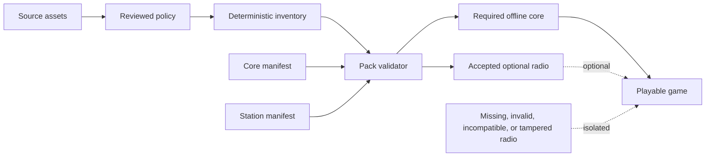

# Content Pack Contract

## Purpose and current status

Vibe Snake must remain fully playable offline while allowing its large radio library to ship separately. The implemented schema 1 contract defines one required core pack and zero or more optional station packs. It validates identity, compatibility, dependencies, exact file metadata, cleared rights, credits, station track order, and the approved source-inventory allowlist before any content is loaded.

The contract and optional-pack resolver are implemented and tested in both the Python qualification oracle and the pure C# product path. The Godot content service uses the native parser and resolver. No real source asset or release pack is approved yet. The current source inventory deliberately reports zero export-eligible files, so a production manifest cannot pass either validator until file-level rights and quality review are complete.

## Authorities

| File | Authority |
| --- | --- |
| [packs.py](../../src/vibesnake/content/packs.py) | Schema 1 structure, inventory matching, compatibility, dependency, core, radio, and resolution rules |
| [content_packs.py](../../scripts/content_packs.py) | Build-time qualification command for canonical manifests |
| [test_content_packs.py](../../tests/qa/test_content_packs.py) | Normal, malformed, unsafe, incomplete, tampered, incompatible, missing, and duplicate-pack contracts |
| [ContentPackManifest.cs](../../native/src/VibeSnake.Persistence/ContentPackManifest.cs) | Pure C# bounded schema, canonical encoding, allowlist, metadata, rights, and radio validation |
| [ContentPackResolver.cs](../../native/src/VibeSnake.Persistence/ContentPackResolver.cs) | Pure C# compatibility decisions and core-safe optional-pack isolation |
| [OptionalPackStore.cs](../../native/src/VibeSnake.Persistence/OptionalPackStore.cs) | User-data-only installed-pack validation, recoverable quarantine, and revalidated restore |
| [ContentPackManifestTests.cs](../../native/tests/VibeSnake.Rules.Tests/ContentPackManifestTests.cs) | Native schema, canonical, range, tamper, duplicate, and isolation contracts |
| [OptionalPackStoreTests.cs](../../native/tests/VibeSnake.Rules.Tests/OptionalPackStoreTests.cs) | Native filesystem allowlist, hash, stale-consent, quarantine, restore, and player-data separation contracts |
| [ContentService.cs](../../game/scripts/ContentService.cs) | Godot-facing inventory, manifest, and pack-set boundary |
| [content_inventory.json](../../config/content_inventory.json) | Exact source file hashes, sizes, policy state, rights state, and export eligibility |
| [CONTENT_PIPELINE.md](CONTENT_PIPELINE.md) | Source classification, rights review, media integrity, and approval workflow |
| [CREATOR_CONTENT.md](CREATOR_CONTENT.md) | Creator-facing commands, schemas, examples, error codes, compatibility, and collision rules |

The Python validator remains the frozen qualification oracle. The native implementation owns product runtime decisions and matches the same observable schema and compatibility codes before player assets enter Godot exports.

## Boundary



The source tree is never a runtime search path for the target player. A manifest admits an exact allowlist of approved inventory entries. A directory scan cannot silently add files to a pack.

## Pack classes

### Required core

The one core pack has ID `vibesnake.core`, kind `core`, no dependencies, and at least one file whose inventory use is `required`. Its eventual acceptance is broader than schema validation: the built player must prove launch, menu navigation, one complete run, critical visual and audio feedback, settings, death, restart, and recovery with every optional pack absent.

The core pack must remain small enough to make the base game a complete purchase or download. Radio stations, archives, production material, and nonessential alternates do not enter it merely to increase content volume.

### Optional radio

Each radio pack has kind `radio` and ID `vibesnake.radio.<station-id>`. It depends only on a compatible `vibesnake.core` version. Every included file has optional runtime use. Radio metadata supplies:

- A stable station ID.
- A player-facing station name.
- An ordered, unique list of track asset IDs.
- Track entries that resolve to `audio/mpeg` files with role `radio-track`.

Canonical station IDs use lowercase underscore names, such as `flow_signal`. Pack IDs use the corresponding filesystem-safe hyphen slug, such as `vibesnake.radio.flow-signal`; validation rejects any pair that does not match under that exact conversion.

A station pack may later include approved badges, stingers, host segments, or metadata files outside `trackIds`, but every file still belongs to the same exact inventory allowlist and rights record.

## Schema 1 fields

The top-level document is strict. Unknown or missing fields fail qualification.

| Field | Contract |
| --- | --- |
| `schemaVersion` | Integer `1` |
| `id` | Lowercase dotted or hyphenated stable ID |
| `version` | Strict `MAJOR.MINOR.PATCH` pack version |
| `kind` | `core` or `radio` |
| `displayName` | Non-empty player-facing name |
| `description` | Non-empty purpose statement |
| `compatibility` | Game-version and ruleset half-open ranges |
| `inventory` | Inventory schema, asset root, and policy SHA-256 binding |
| `dependencies` | Exact pack IDs and semantic-version ranges |
| `files` | Exact approved file allowlist |
| `credits` | Source, license, attribution, and review evidence |
| `radio` | `null` for core or strict station metadata for radio |

Version ranges use `minInclusive` and `maxExclusive`. Schema 1 accepts stable three-part versions only. A range whose minimum is not lower than its maximum is invalid.

The ruleset range contains a stable ID plus integer version bounds. Current packs target `vibesnake-core` version 4 through, but not including, version 5. A future rules change does not silently reinterpret an old pack.

## File admission

Every file entry contains:

- Inventory asset ID in the form `asset:<relative-path>`.
- Relative POSIX path with no traversal, absolute path, backslash, or case-insensitive collision.
- Media type, positive byte size, and lowercase SHA-256.
- Runtime role and required or optional use.
- A credit ID.

The validator compares ID, path, media type, bytes, SHA-256, role, and runtime use to the generated inventory. It also requires:

- The inventory pack ID equals the manifest pack ID.
- Shipping state is `approved`.
- Export eligibility is true.
- Basic media integrity is `valid`.
- The entry is not a duplicate copy.
- Rights state is `cleared`.
- Source, license, attribution, and review evidence exactly match the referenced manifest credit.
- Manifest IDs equal the complete approved inventory allowlist for that pack, with nothing missing or added.

This makes a policy change, byte change, renamed path, altered credit, or unexpected file an explicit review event.

## Compatibility results

Structurally valid manifests receive an actionable compatibility result before file loading.

| Code | Meaning |
| --- | --- |
| `compatible` | Game, ruleset, and dependencies satisfy the manifest |
| `game-version-too-old` | The app is below the supported range |
| `game-version-too-new` | The app is at or above the exclusive maximum |
| `ruleset-mismatch` | The stable ruleset ID differs |
| `rules-version-too-old` | The rules version is below the range |
| `rules-version-too-new` | The rules version is at or above the exclusive maximum |
| `missing-dependency` | A required pack is absent |
| `dependency-version-too-old` | An installed dependency is below its range |
| `dependency-version-too-new` | An installed dependency is at or above its range |
| `invalid-pack` | An optional document fails schema, inventory, rights, hash, or station validation |
| `core-unavailable` | Optional content cannot load because the required core is incompatible |

The pack-set resolver treats an invalid core as fatal. It evaluates optional documents independently. Missing or removed optional content is normal, and malformed, incompatible, duplicate, or tampered optional content is reported and skipped while a compatible core stays ready. Removal requires an immutable, version-bound consent token that can target only one optional radio pack and has no save, profile, achievement, preference, or replay deletion capability.

`OptionalPackStore` accepts only canonical radio manifests under an absolute user-data root. It rejects links and reparse points, bounds active and quarantined pack counts plus per-pack entries, requires the directory name to equal the pack ID, requires the complete manifest file allowlist with no extra file, and verifies every size and SHA-256 before exposing an installed pack. A requested asset is returned only as at most 32 MiB of bytes plus manifest media metadata after complete pack validation and a second size/hash check; callers never receive a machine path.

Confirmation moves the selected pack on the same volume into `packs/.removed/`; it does not recursively delete content. Quarantine inspection reconstructs version-bound receipts only from a valid canonical manifest and payload, so recovery remains available after restart. Restore revalidates the complete pack before moving it back. Tampered quarantine stays in place and cannot be restored. Invalid packs remain isolated, stale consent cannot move a changed pack, and a store lock serializes lifecycle operations.

`core-only-offline-v1` evidence exercises resolution states and the real filesystem lifecycle through Godot smoke. It requires validated installation, bounded asset reads, recoverable quarantine, receipt rediscovery, revalidated restore, unchanged player data, and launch, menu, run, critical feedback, settings, content-pack browse, death, restart, and recovery without optional content.

## Integrity and trust boundary

Per-file SHA-256 detects changed or substituted payloads relative to the reviewed inventory. The inventory policy hash detects classification changes. Canonical JSON makes manifest diffs and checksums stable across platforms.

These hashes provide integrity evidence, not publisher authenticity by themselves. Release artifacts still need retained build provenance, a published manifest checksum, and platform signing where applicable. The game must never execute scripts or native code from a content pack in 1.0.

## Qualification command

Once real manifests exist, qualify exactly one core plus any intended optional packs:

```powershell
python scripts/content_packs.py `
  config/packs/vibesnake.core.json `
  config/packs/vibesnake.radio.flow-signal.json `
  --game-version 0.3.0 `
  --ruleset-id vibesnake-core `
  --ruleset-version 4
```

The command first regenerates and compares the authoritative inventory, requires canonical manifest encoding, validates every allowlisted file and credit, then resolves compatibility. It exits nonzero on any build-time rejection. Runtime optional-pack isolation is a separate tested behavior and does not lower the release gate.

No production command can pass today because no inventory entry is export eligible. That is the intended fail-closed state.

## Order for the first real packs

1. Define the smallest player-visible core content set required by the native vertical slice.
2. Resolve or remove empty and duplicate candidates before selection.
3. Create file-specific policy rules with reviewed source, license, attribution, and quality evidence.
4. Regenerate the inventory and confirm only the selected entries become export eligible under final pack IDs.
5. Generate canonical credits and manifests from those approved entries.
6. Run full decode and format-specific quality checks in addition to the basic inventory screen.
7. Make the native content service load the core only through the validated manifest.
8. Prove core-only launch and the full required offline flow from a read-only installation.
9. Add one station pack and prove missing, removed, incompatible, incomplete, hash-mismatched, and corrupt states without blocking core play.
10. Connect export inspection so player artifacts contain exactly the manifest allowlists and generated credits.
11. Measure compressed, installed, decoded-memory, scan, and startup impact for each real pack.
12. Repeat the artifact and install lifecycle on Windows, macOS, and Linux.

## Completion gate

V030-09 is complete only when one human-approved core manifest passes and supports the entire offline vertical slice, at least one approved station manifest passes independently, export inspection consumes those production allowlists and generated credits, actual size and performance evidence is retained, and player-facing removal and recovery UI explains failures without exposing machine paths. The strict native contract, core-only automated vertical slice, optional absence/removal/tamper/incompatibility/duplicate isolation, and recoverable installed-pack lifecycle are complete.
