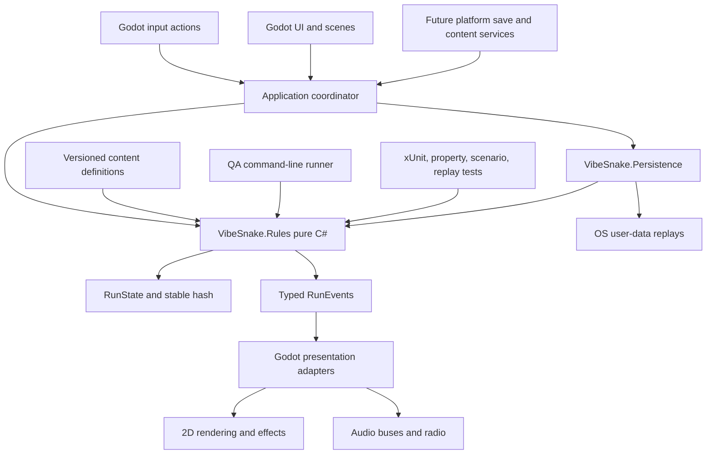

# Technology and Cross-Platform Strategy

## Decision

The target 1.0 architecture is a native Godot 4 .NET desktop game with gameplay rules in a pure C# assembly. Windows, macOS, and Linux are first-class release platforms. No browser or HTML runtime is in the 1.0 plan.

This is a working architecture decision, not a claim that migration is complete. The current Python and Pygame game remains the playable reference until the Godot vertical slice, deterministic trace parity, and three-platform export gates pass. Reversing the target decision requires a written architecture record with measured evidence.

The accepted qualification decision is recorded in [ADR 0001](ADR_0001_NATIVE_RUNTIME.md). Cross-language behavior corrections and unresolved differences are recorded in [PARITY_DECISIONS.md](../engineering/PARITY_DECISIONS.md).

As of 2026-08-05, Godot 4.7.1 is the pinned stable maintenance release and Godot 4 C# supports Windows, Linux, and macOS. The repository pins Godot 4.7.1 Mono commit `a13da4feb`, official editor and .NET export-template hashes, and .NET SDK 10.0.302. .NET 10 is an active LTS release. The project targets `net10.0` with **445** native contract tests, shared Python→C# parity for movement/core/powers/achievement product-path fixtures, real Godot headless smoke, isolated replay storage, and hosted packaged-player export smokes on **Windows, macOS, and Linux** outside the checkout without Python. Python remains the frozen oracle only; product work continues in pure C# and Godot.

## Why change from the incumbent

Pygame and SDL can run a 2D Snake game quickly on all three desktop operating systems. The problem is not raw grid simulation cost. The problem is the amount of release-quality engine infrastructure this project is rebuilding by hand.

The Python reference has direct source-tree asset paths, a large coordinator,
software-surface rendering, many direct font constructions, static controller
assumptions, limited display scaling, a hand-built audio layer, and global random
streams. The new native artifact matrix addresses packaging proof for the Godot
slice, but it does not repair those reference-runtime boundaries or establish
macOS and Linux evidence. PyInstaller would also require a separate build on each
target operating system. These issues can be fixed in Python, but doing so spends
substantial design and maintenance effort recreating systems already present in
a mature game engine.

Godot provides native desktop exports, a scene and resource pipeline, input actions, controller events, audio buses, 2D rendering and shaders, localization, UI layout, profiling, command-line export, headless execution, and a supported C# integration. C# supplies a strong type system and mature test ecosystem for a pure deterministic rules library. That combination fits the game's presentation ambition and QA requirements better than a larger Pygame coordinator.

## Qualification matrix

| Requirement | Python plus Pygame today | Godot 4 .NET target | Decision consequence |
| --- | --- | --- | --- |
| Native Windows, macOS, Linux | SDL supports them, but no self-contained reference artifact is qualified | First-class editor and export targets; Windows slice qualified locally | Godot reduces custom platform shell work while macOS and Linux still require native evidence |
| Deterministic rules | Possible after major extraction | Pure C# assembly independent of Godot | Both can work; C# boundary is the target |
| Polished 2D effects | Possible through custom surfaces and shaders with added tooling | Built-in 2D renderers, shaders, animation, particles, profiling | Godot has lower presentation risk |
| Adaptive audio and mix | Current custom mixer is partial | Audio buses, effects, streams, and routing | Godot better fits radio and cue hierarchy |
| Input and remapping | Must build device lifecycle and prompt system | Input Map plus platform events, still requiring product logic | Godot supplies the lower layer |
| Responsive UI | Hand-built menus and font/layout paths | Control nodes, themes, focus, containers, localization | Godot lowers layout and accessibility risk |
| Packaging | PyInstaller per OS plus custom assets | Export presets and templates per target | Both need native release jobs; Godot owns more of the bundle |
| Automated headless QA | SDL dummy plus custom harness | Headless engine plus pure rules CLI | Both are viable; pure rules remains primary |
| Migration cost | No port | Port and parity work | Reference traces and vertical slices control this risk |
| Web export | Possible with a separate approach | C# web export is unsupported | Irrelevant because web is outside 1.0 scope |

## Target architecture



### Rules assembly

`VibeSnake.Rules` owns grid movement, command buffering, starvation, food, scoring, combo, powers, death resolution, ruleset definitions, seeded randomness, AI decision inputs, replays, and stable state hashes. It references only the .NET base class library and deliberately small audited packages, if any.

It must not reference Godot objects, nodes, vectors, resources, audio, files, clocks, environment variables, or platform APIs. Coordinates and colors at this boundary are project-owned value types.

### Godot application shell

Godot owns windows, display scaling, rendering, animation, shaders, particles, fonts, localization, input devices, action remapping, audio devices, buses, scene transitions, and platform lifecycle. Adapters convert logical commands into the rules engine and typed events into presentation. Presentation cannot mutate rules state directly.

### Platform services

`VibeSnake.Persistence` is the first implemented platform-neutral service assembly. It owns bounded replay file inspection, compatibility results, injected timestamps, and atomic storage beneath an absolute user-data root supplied by Godot. Future interfaces own profile saves, user preferences, content packs, logs, clipboard, screenshots, and other platform-specific paths. JSON schemas remain versioned and validated. The game uses Godot's user-data path only through these services, not from domain code.

## Project shape

```text
game/
  project.godot
  export_presets.cfg
  VibeSnake.Game.sln
  scenes/
  scripts/
  VibeSnake.Game.csproj
native/
  VibeSnake.slnx
  toolchain.json
  src/VibeSnake.Persistence/
  src/VibeSnake.Rules/
  tests/VibeSnake.Rules.Tests/
src/vibesnake/
tests/
```

The listed directories now exist. `game/` is the Godot presentation shell (product surface), `native/` owns engine-independent C# rules/persistence and tests (product kernel), and the existing Python paths remain the **behavior oracle** for dual-runtime fixtures - not a parallel product. Export presets and a Godot-required application solution define all three desktop targets. Remaining 0.3 work deepens the Godot shell, installer/archive shapes, pack export eligibility, and evidence - not new Python gameplay systems.

## Current qualification evidence

| Capability | Evidence now | Still required |
| --- | --- | --- |
| Stable tools | `global.json` pins .NET 10.0.302; `native/toolchain.json` pins Godot 4.7.1 plus official editor and .NET export-template hashes; bootstrap scripts verify both before installation | Verify upgrades only through dedicated qualification changes and the complete matrix |
| Pure rules | `VibeSnake.Rules` has no Godot reference and implements PCG32, bounded input, movement, food, growth, combo scoring, starvation, collision precedence, win state, the complete Shield lifecycle and recovery contract, immutable typed events, explicit restart, snapshots, strict canonical JSON schema 3 restoration with session achievement counters, explicit `vibesnake-core@4` identity, a canonical replay envelope, live mirror-verified recording, and `fnv1a64-canonical-json-v4` hashes | Add AI inputs and remaining reviewed presentation semantics |
| Replay persistence | `VibeSnake.Persistence` has no Godot dependency and implements bounded strict UTF-8 import, precise compatibility and resource-limited verification results, traversal-safe stored names, cross-process transaction locking, idempotent hash matching, file-count and byte limits, and same-directory atomic writes without overwrite | Retain hosted evidence on every target platform, publish platform paths, and integrate the later browser and playback UX |
| Automated proof | 177 xUnit tests pass. `VibeSnake.Rules` measures 91.73 percent line and 87.77 percent branch coverage; `VibeSnake.Persistence` measures 90.73 percent line and 84.48 percent branch coverage; aggregate native coverage is 91.55 percent line, 87.26 percent branch, and 97.53 percent method. Generated restore-and-continue state machines, replay recording, compatibility, integrity, resource bounds, concurrent storage, 100 movement traces with 25,600 compared steps, 35 targeted core-rule fixtures, 8 targeted Shield fixtures, and retained first-divergence bundle contracts pass | Add delta reduction beyond the first failing step prefix and parity for the other powers and unported rules |
| Engine bridge | Godot imports the C# project, loads the rules and persistence assemblies, validates logical keyboard and controller defaults, exercises focus-loss pause, records and atomically verifies a terminal replay in isolated user data, validates bounded background latest-replay and read-only import feedback, retains terminal saves behind inspection, gates new runs during replay work, defers quit through save completion, bounds displayed diagnostics, runs deterministic restoration, renders Shield pickup and active state, resolves typed Shield captions and cues, plays finite PCM fallback cues, rejects warnings and leaks, and exits cleanly headlessly on Windows | Add physical-device and hot-plug evidence, remapping, scaling, accessibility settings, authored audio, device-loss recovery, and reviewed feel on all three systems |
| CI definition | Python, native rules, Godot smoke, native export, packaged-player smoke, inspection, and artifact-upload matrices are defined for Windows, macOS, and Linux | Run the workflow from a real remote and retain evidence |
| Player artifacts | A Windows x64 debug bundle launches outside the checkout, emits hash `643077d90db75e8c`, writes and verifies one replay under an isolated user-data root, and passes a 198-file, 189,615,786-byte inventory with no Python runtime, `.env` variant, checkout path, export lock, engine warning, or leaked object; the schema 2 inspector requires and path-scans the Rules, Persistence, and Game payloads and binds the editor executable to the executable inside the pinned archive; two independent payloads reproduce manifest SHA-256 `bae7d6369d61c6a57f2fe295f0308c238acc6ccd1e057c20abffc880e8c2ae74` | Reproduce and retain the macOS Universal and Linux x64 artifacts, then expand lifecycle, input, audio, display, and user-data checks on all three |
| Content boundary | Schema 1 policy and generated inventory account for 114 public assets and 340,378,770 bytes (including 95 radio MP3s) with exact hashes, bounded integrity checks, duplicates, roles, pack intent, rights status, and zero current export approvals | Complete loudness and listening review for radio, production credits, first approved core and radio manifests, and allow exports to read only those approved allowlists |

## Rules and rendering cadence

- Keep a fixed rules cadence, initially matching the current configured 0.05-second grid tick.
- Sample logical commands into a bounded queue and consume them only at rules steps.
- Render independently at the display cadence and interpolate presentation where useful.
- Keep animation, camera, particles, and audio on presentation clocks.
- Store integer rules steps in replays rather than floating-point wall time.
- Never change rules speed because render frames were missed.

The target is a stable 60 frames per second presentation on the published minimum hardware, with correct rules still maintained when rendering is slower or faster. Performance gates use frame-time percentiles and fixed-step throughput on controlled hardware.

## Rendering strategy

- Begin with Godot's Compatibility renderer to cover a wider range of desktop hardware for a 2D game.
- Use a logical 1280 by 720 viewport, aspect-preserving scaling, and tested letterbox or pillarbox behavior.
- Keep gameplay coordinates independent of window and monitor coordinates.
- Put world, gameplay indicators, effects, HUD, modal UI, and accessibility overlays in explicit layers.
- Centralize fonts in a theme and define fallback coverage before localization.
- Implement Vibe Level effects through one presentation state, with reduced-motion and flash-free variants from the start.
- Profile batches, draw calls, shader compilation, particles, allocations, and frame percentiles before adding more effects.

Forward+ is not required for this game. A renderer change needs a visible benefit and full platform evidence.

## Audio strategy

Use explicit buses for Master, Music, SFX, UI, Voice, and Accessibility. The native slice currently registers Music, SFX, and UI under Master and can always synthesize essential offline cues. Voice, Accessibility, authored assets, per-bus settings, priority, cooldown, ducking, caption, and haptic metadata remain qualification work. Radio tracks use streamed formats and do not load the entire library into memory.

The core download includes a small curated audio set. The full radio is one or more optional, manifest-validated packs. Content tools verify decode, duration, loudness, clipping, metadata, rights, and hashes before export. Archived tracks, prompts, lyrics working files, and production reports never enter export inputs.

Adaptive music begins with authored station material and event-driven layers or stingers. Runtime music generation is outside 1.0.

## Input strategy

- Define logical actions for movement, confirm, back, pause, radio, inspect, screenshot, and accessibility shortcuts.
- Support keyboard-only and common controller-only completion of every required flow.
- Track devices by stable runtime identity and handle add, removal, and remap events.
- Use action glyph families, not hard-coded button numbers.
- Persist remaps by logical action with schema migration and conflict resolution.
- Define deadzones, repeat delay, repeat rate, simultaneous-device policy, focus-loss behavior, and buffered-input clearing.
- Test Xbox-layout and PlayStation-layout devices on all three platforms where drivers permit.

The native slice already centralizes movement, confirm, back, pause, and quit actions, registers arrows, WASD, D-pad, left stick, common face buttons, Start, and platform quit shortcuts, and pauses without accepting hidden movement on focus loss. Device hot-plug, persistent remapping, glyph switching, conflict resolution, and physical controller evidence remain open.

## Determinism and replay

Implement a project-owned, versioned pseudo-random algorithm such as PCG32 for gameplay and AI streams. Do not use `System.Random` as a replay contract. Store algorithm ID, stream state, ruleset, rules version, content version, seed, and commands in each replay.

The state hash uses a canonical field order and excludes presentation, logs, platform paths, and wall-clock timestamps. The Python reference and C# engine must normalize known legacy differences and compare after every step during migration.

## Test stack

- xUnit 2.9.3 for pure C# unit and integration tests.
- A property-based C# library selected and pinned during qualification.
- Shared JSON scenario and replay fixtures.
- A custom headless campaign runner that emits the same report concepts as `python -m vibesnake.qa`.
- Godot headless scene, input, resource, and render smoke tests.
- Native exported-artifact tests on Windows, macOS, and Linux runners.
- Content validators outside the runtime.

No test framework plugin may become the rules architecture. The pure C# suite must run with `dotnet test` without opening Godot.

## Supported 1.0 artifacts

| Platform | 1.0 artifact | Required architecture |
| --- | --- | --- |
| Windows | Signed x64 executable bundle plus installer or archive | x86-64 |
| macOS | Developer ID-signed and notarized application bundle or disk image | Universal binary for Apple Silicon and Intel, if the pinned export templates continue to support both |
| Linux | x86-64 application bundle or archive with desktop integration guidance | x86-64 |

Minimum operating-system and driver versions are not claimed until tested against the pinned Godot and .NET support floors. Every platform is built and smoke-tested on a native runner. Platform-specific signing credentials remain outside the repository.

## Technology qualification gate

The target stack is accepted only when a vertical slice proves all of the following:

1. A pure C# core runs without Godot and produces stable hashes.
2. At least 100 shared movement, food, growth, starvation, score, and collision traces match the Python reference or have reviewed corrections.
3. A Godot scene completes menu, run, death, and restart using only the C# rules boundary.
4. Keyboard and controller actions remain correct through pause, focus loss, and hot-plug.
5. The 1280 by 720 logical viewport scales correctly at representative 16:9, 16:10, ultrawide, and high-density displays.
6. Radio streaming, bus ducking, missing audio, and device loss recover cleanly.
7. Windows x64, macOS Universal, and Linux x86-64 debug exports launch outside the checkout and write to the correct user location.
8. Controlled performance scenes meet the 60 frames per second presentation target without rules drift and report p50, p95, and p99 frame times.
9. The headless rules campaign runs substantially faster than real time and retains a failing seed and trace.
10. Exported content contains only the allowlisted core pack and no development or archived material.

If a gate fails, first fix the vertical slice. A fallback to Pygame requires evidence that the failure is inherent to the target stack and that the incumbent can meet the same three-platform, presentation, accessibility, packaging, and QA contracts with lower total risk.

## Migration sequence

1. Freeze Python rules behavior with scenarios, replay-like action traces, and documented intentional defects.
2. Scaffold the pinned Godot .NET project, pure rules solution, tests, export presets, and empty platform artifacts.
3. Port movement, command buffering, food, starvation, scoring, collision, and stable random streams.
4. Pass shared trace parity and decide each mismatch as a Python defect, compatibility behavior, or migration defect.
5. Build one complete vertical slice with accessible input, viewport, basic audio, death, and restart.
6. Port each power as one contract with differential fixtures and cleanup tests.
7. Port progression, saves, radio manifests, AI, menus, cosmetics, and presentation behind services.
8. Run cross-platform artifact, performance, input, audio, accessibility, and reliability gates.
9. Make Godot the default only after feature and data parity. Preserve the Python reference for fixture reproduction until the first stable release no longer needs it.

This sequence avoids a blind rewrite. Every ported slice is runnable, testable, and comparable.

## Dependency and upgrade policy

- Pin the Godot editor, export templates, .NET SDK feature band, NuGet lock file, and content-tool versions.
- Prefer LTS .NET and a supported Godot minor line.
- Record checksums for downloaded build tools and templates.
- Use minimal third-party runtime packages and maintain license and vulnerability inventories.
- Upgrade engine or SDK in a dedicated change with the full scenario, artifact, render, and platform matrix.
- Keep secrets, certificates, notarization credentials, and store credentials in protected release environments only.

## Primary references

- [Godot 4.7.1 maintenance release](https://godotengine.org/article/maintenance-release-godot-4-7-1/): current stable patch, commit identity, and upgrade guidance.
- [Godot 4.7 C# platform support](https://docs.godotengine.org/en/4.7/tutorials/scripting/c_sharp/index.html): C# projects support Windows, Linux, and macOS desktop exports.
- [Godot project export documentation](https://docs.godotengine.org/en/4.7/tutorials/export/exporting_projects.html): export presets, templates, resource filters, and command-line artifact generation.
- [Godot headless command-line documentation](https://docs.godotengine.org/en/latest/tutorials/editor/command_line_tutorial.html): headless display and audio drivers, automated export, benchmarks, and fixed movie output.
- [.NET support policy](https://dotnet.microsoft.com/en-us/platform/support/policy): .NET 10 is the active LTS line in the current review and receives a longer support window than .NET 8.
- [.NET `global.json` policy](https://learn.microsoft.com/en-us/dotnet/core/tools/global-json): SDK version, stable-only selection, search paths, and patch roll-forward behavior.
- [SDL platform support](https://wiki.libsdl.org/SDL2/Introduction) and [PyInstaller multi-OS guidance](https://pyinstaller.org/en/stable/usage.html#supporting-multiple-operating-systems): the incumbent's lower layer is portable, but executable bundles still need a separate build on each operating system.
- [Apple notarization requirements](https://developer.apple.com/documentation/security/notarizing-macos-software-before-distribution): directly distributed macOS software needs signed, hardened, notarized, and tested release handling.
- [Microsoft SignTool](https://learn.microsoft.com/en-us/windows/win32/seccrypto/signtool): Windows signing and verification belong in the native release pipeline.
