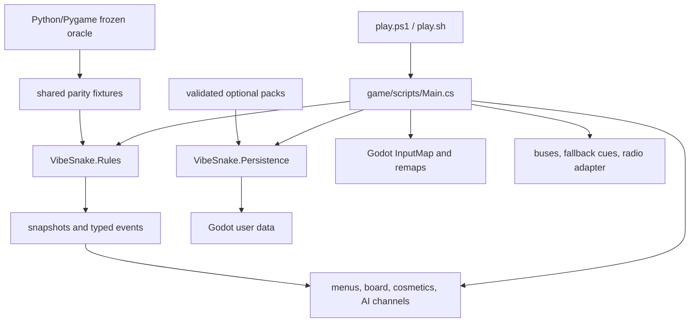

# Architecture

## Current product overview

The default source player uses Godot 4.7.1 .NET for presentation, input, audio, UI, and platform lifecycle. Pure `VibeSnake.Rules` owns deterministic gameplay, and `VibeSnake.Persistence` owns platform-neutral storage and content boundaries. The Python/Pygame package remains a frozen oracle for shared fixtures and migration checks.



## Product architecture

Godot 4 .NET with pure C# rules is both the implemented source product and the gated 1.0 architecture. Windows, macOS, and Linux are first-class targets. Automated parity and artifact foundations have passed far enough to make Godot the default source launcher; signing, approved packs, physical devices, named hardware, and human acceptance still block release promotion.

See [TECHNOLOGY_STRATEGY.md](../decisions/TECHNOLOGY_STRATEGY.md) for the decision, boundaries, platform contract, qualification gate, and migration sequence. See [AUTOMATED_QA.md](AUTOMATED_QA.md) for the shared trace and differential-test strategy.

### Native product boundary

The first target-architecture seam now exists:

```text
Godot input and drawing
        |
        v
game/scripts/Main.cs
       / \
      v   v
VibeSnake.Rules    VibeSnake.Persistence
      ^                    |
      |____________________|
                           v
                    OS user-data replays
```

The optional post-1.0 Agent Arena preview adds a sibling path without changing rules ownership:

```text
external agent -> local stdio MCP host -> VibeSnake.AgentPlay -> VibeSnake.Rules
                         |                         |
                         |                         `-> verified replay
                         `-> same-user read-only pipe -> VibeSnake.AgentViewer -> Godot
```

`VibeSnake.AgentPlay` depends only on Rules and is the sole external-match state owner. It projects a versioned player-visible observation, serializes requests per session, rejects stale or illegal actions without stepping, mirrors each accepted action into a verified replay, and optionally advances an independent same-seed built-in rival. `VibeSnake.AgentHost` adapts that contract to local MCP stdio and uses Persistence only for explicit application-owned replay save. `VibeSnake.AgentViewer` reads full public frames from a one-time same-user local-pipe capability and has no action surface. Godot can render those frames, but viewer state, timing, loss, and input cannot affect match rules or replay identity. Agent paths construct no human progression, achievement, score-history, preference, or household-comparison store. See [AGENT_PLAY.md](AGENT_PLAY.md) for the protocol and operational contract.

`VibeSnake.Rules` has no Godot dependency. It owns seeded PCG32 randomness, bounded commands, wraparound movement, food, growth, combo interpolation, speed and length scoring, exact starvation and collision precedence, completion, the complete Shield spawn, collection, duration, expiry, collision-recovery, starvation-bypass, restart, restore, live replay recording, snapshots, immutable ordered event detail, strict canonical JSON state schema 3 restoration (including session achievement counters), explicit `vibesnake-core@4` identity, `fnv1a64-canonical-json-v4` state hashes, schema 1 replay envelopes with canonical SHA-256 integrity and deterministic verification-work limits, closed tamper-evident seed challenges, and isolated equal-rules ghost sessions. `VibeSnake.Persistence` depends on the public replay contract and owns strict UTF-8 inspection, compatibility and verification results, bounded replay directories, four fixed household rival slots, closed privacy-safe run cards, timestamps, cross-process transaction locking, same-directory atomic writes, playback-free bounded audio voice allocation, manifest-derived radio policy, and the station/boundary broadcast policy. It has no Godot dependency. `Main.cs` translates logical keyboard and controller actions into commands, mirrors every attempt into `RunReplayRecorder`, supplies the absolute `user://` path to the persistence stores, runs one persistence or verification operation at a time away from the main thread, bounds player-facing status, translates snapshots, ghost state, and replay results into drawing, and adapts pure audio, radio, and broadcast decisions to Godot nodes. `StepFeedback.cs` maps ordered typed events to prioritized cues and persistent captions. `MultimodalFeedback.cs` owns the presentation-only hunger, combo, power, protection, and death descriptors consumed by `Main.cs`; it cannot alter rules state. `VisualHierarchy.cs` owns presentation capacity, event tiers, foreground/background contrast, popup bounds, protection-first head-outline selection, and deterministic PNG review fixtures. `VibeLevelDirector.cs` is the only owner of escalation thresholds and emits typed levels/transitions with complete subsystem and accessibility budgets. `Main.cs` consumes these policies for live caption priority, board palette, HUD treatment, bounded trails, terminal opacity, and outline limits. The shell also owns focus-loss pause and read-only dropped-file policy. A headless mode starts the real scene and proves equal seeded runs, restored continuation, live terminal replay recording, isolated atomic storage, exact reload, read-only import, bounded compatibility feedback, background latest-replay input, stable seed-code round trips, source-preserving household import, live equal-rules ghost play, private run-card export, exact ghost deletion, logical movement input, focus lifecycle, audio-bus registration, every finite PCM fallback cue, bounded allocation, music duck/restore, output repair, complete power feedback resolution, five-profile multimodal attribution, visual-hierarchy frames, three performance profiles, 13 Vibe Level scenes, eight-station broadcast policy, and clean shutdown without engine warnings or leaked objects. Native parity assertions retain schema 1 first-divergence bundles with the shortest executed failing prefix and exact filtered reproduction. The same smoke contract runs from an exported player outside the checkout, followed by isolated user-data inspection, process-exit, required Rules, Persistence, and Game payload checks, portability, prohibited-content, packed-lock, and per-file hash checks. See [REPLAYS.md](REPLAYS.md) for the complete replay boundary.

`RunModeCatalog` is the closed product-mode boundary over `vibesnake-core@4`. It defines `classic@1` and `vibe@1`, exact product configurations, player descriptions, board, pause, seed, restart, difficulty/DDA policy, and effective score categories. Pure `AdaptiveDifficultyPolicy` owns deterministic `vibe-bounded-hunger-v1`; its closed inputs are effective config, rules tick, combo, and hunger, and its sole output is a bounded zero-to-two-tick hunger drain. `sha256-canonical-runconfig-v3` binds mode, score switches, DDA enabled state, and policy into fair-score and replay identity. `RunScoreIdentity` discloses those fields, and Vibe DDA-on/off categories are distinct. Godot selects modes and the opt-out through logical remappable actions and renders the contract, but it cannot redefine mechanics.

The product remains incomplete for approved authored audio content, signed delivery, and final human-reviewed presentation. Pure C# owns all nine powers, near misses, profile achievements, Classic/Vibe mode contracts, the bounded Vibe adaptive policy, replay browsing/playback, stable seed challenges, isolated local ghosts, private run cards, interactive equal-rules AI spectators, a closed optional-lore catalog, and radio behavior; Godot owns their player-facing adapters. The lore adapter is an offline, presentation-only archive whose unlock checks read existing progression, spectator, and replay state without awarding progression or mutating rules. The comparison adapter uses fixed household slots and never permits ghost state to enter player collision, scoring, randomness, or progression. These systems still require their explicit content, physical-device, performance, and human review gates before promotion.

The content inventory tooling scans source assets without loading them into either game runtime, requires every file to match exactly one human-reviewed policy rule, and generates deterministic hashes, integrity results, duplicate links, rights state, and export eligibility. Pure C# pack parsing and resolution validate dependency-free core and station-specific optional manifests against approved inventory, compatibility, credits, and exact file metadata. Godot uses that native service and isolates optional failure from core play. The native player continues to ship no legacy source assets while export eligibility remains zero.

## Temporary Python oracle entry and lifecycle

The console script and `python -m vibesnake` both call [__main__.py](../../src/vibesnake/__main__.py). This path is retained only for frozen behavior reproduction while the remaining validators and fixture generators move to .NET. It is not a product runtime or a permanent repository architecture.

The loop in [game_state.py](../../src/vibesnake/core/game_state.py) is:

```text
clock tick -> input dispatch -> state update -> state-specific draw -> display flip
```

Rendering targets 60 FPS. Snake movement uses a separate logic tick, currently 0.05 seconds from configuration unless a temporary effect overrides it.

## State machine

`GameState` defines 12 states:

- Meta: Menu, Help, Settings, High Scores, Customize, Achievements.
- Gameplay: Running, Paused, Game Over, Name Entry.
- AI: Channel Browser and Let's Play.

`Game._fsm_transitions` is an explicit whitelist. `transition_to` validates supported transitions, but some older input paths still assign `self.state` directly. A future refactor should route every transition through one function and attach entry and exit actions there.

## Core model boundaries

| Component | Responsibility | Important file |
| --- | --- | --- |
| Snake | Body order, occupied-cell set, queued direction, movement, cosmetic rendering | [snake.py](../../src/vibesnake/core/snake.py) |
| Food | Legal spawning and food rendering | [food.py](../../src/vibesnake/core/food.py) |
| ScoreManager | Combo timer, multiplier, food points, and bonus points | [scoring.py](../../src/vibesnake/core/scoring.py) |
| MetricsTracker | Run-local collision and starvation death counts | [metrics.py](../../src/vibesnake/core/metrics.py) |
| NearMissDetector | Risk events, warnings, cooldowns, and near-miss combo | [near_miss.py](../../src/vibesnake/core/near_miss.py) |
| PowerUpManager | Spawn, collect, update, and draw power-up instances | [manager.py](../../src/vibesnake/powerups/manager.py) |

The snake intentionally keeps both an ordered deque and a set of positions. The deque supports movement and drawing order; the set makes occupancy checks constant time. Mutations must keep both structures synchronized.

## Rendering

- [menus.py](../../src/vibesnake/rendering/menus.py) draws all non-gameplay screens and overlays.
- [hud.py](../../src/vibesnake/rendering/hud.py) draws score, combo, radio, and active effect information.
- [visual_effects.py](../../src/vibesnake/rendering/visual_effects.py) owns particles, hitstop, shake, flashes, environment progression, grid, and scanlines.
- [snake.py](../../src/vibesnake/core/snake.py) also renders the customized snake and its trail. This is a deliberate model-view overlap that should eventually be separated if new renderers are added.

Headless rendering tests use SDL dummy drivers and exercise every menu and game-state dispatcher branch.

## Input and AI

[InputManager](../../src/vibesnake/input/input_manager.py) combines keyboard, mouse, and gamepad direction sources. It tracks the last active input mode so passive mouse movement does not override keyboard control.

[AIPlayer](../../src/vibesnake/ai/player.py) uses the same direction queue as a human. Each decision chooses food or a power-up target, rejects immediate unsafe moves and direct reversal, scores valid directions, and optionally injects chaos. It is reactive rather than a full path planner.

## Persistence

Profile, cosmetic, leaderboard, and preference repositories each own one schema-versioned JSON document. Achievement state is embedded in the profile, and the HUD reads the canonical `HighScoreTable` instead of writing its own file.

[json_store.py](../../src/vibesnake/data/json_store.py) supplies atomic replacement and non-overwriting corrupt-file backups. [paths.py](../../src/vibesnake/data/paths.py) selects the platform user-data directory, honors `VIBESNAKE_DATA_DIR`, and performs a non-destructive one-time import from the former checkout-local `data/` directory. Schema 0 documents migrate on load, while future schemas are read-protected from downgrade writes. See [PROGRESSION.md](../design/PROGRESSION.md).

## Assets and configuration

The runtime resolves config, images, sounds, and radio tracks from directories beside the source tree. That makes editable installs work but prevents a normal wheel from being self-contained. Asset lookup needs a resource abstraction before release.

Configuration is loaded once at import time by [config.py](../../src/vibesnake/data/config.py) and exposed as module constants in [settings.py](../../src/vibesnake/data/settings.py). This means most changes require restart and makes test-time reconfiguration harder.

## Main technical debt

1. `core/game_state.py` is a large coordinator containing input, state transitions, run rules, persistence calls, telemetry output, and death handling.
2. `rendering/menus.py` contains every screen in one large renderer.
3. Power-up behavior is integrated, but effect resolution still lives inside the large game coordinator.
4. Asset paths assume a repository checkout.
5. Several modules initialize configuration or Pygame resources at import time.
6. Some state changes bypass the transition validator.
7. The frozen Python oracle has no reset/recovery workflow. The native product path now owns separated, verified backup/reset/recovery and must not be backported into Python.

## Retirement seams

While the temporary oracle remains, change it only through tested seams that repair a migration defect or unblock its removal:

1. Do not refactor the Python player for architectural elegance. Put that effort into the native owner.
2. Correct only behavior that invalidates reviewed parity, migration, or release evidence.
3. Keep checked-in fixtures deterministic and move their generators to native QA.
4. Move each remaining Python-owned validation command to a tested .NET tool before deleting its source command.
5. Remove a Python subsystem as soon as its native owner, migration fixtures, rollback evidence, and CI replacement are complete.

Do not build the same broad feature twice. Every temporary-oracle change must either repair a release-blocking reference defect, preserve a reusable data contract, or support verified removal. Keep its tests green until the deletion change replaces the gate. The repository-wide exit order is in [MIGRATION_MAP.md](MIGRATION_MAP.md#repository-wide-python-retirement).
