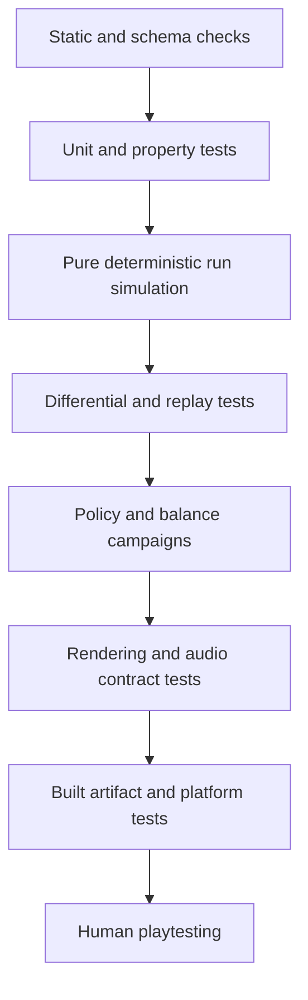

# Automated Gameplay QA Laboratory

This document defines the automatic testing system that should bring each build to human playtesting with correctness, determinism, compatibility, and obvious balance failures already removed. It does not claim that bots can certify fun. Human availability never pauses safe technical progress: automation must exhaust every objective check, package the unresolved experience questions, and continue dependency-ordered reversible work.

## Current implemented foundation

The repository now includes a seeded reference-core laboratory under [src/vibesnake/qa](../../src/vibesnake/qa). It exercises the production `Snake`, `Food`, and `ScoreManager` implementations without rendering or audio.

It currently provides:

- Food-seeking, survival, and abusive-input policies.
- Separate seeded streams for gameplay placement and policy decisions inside the harness.
- Per-step checks for body-index synchronization, valid coordinates, legal food overlap, growth accounting, score monotonicity, timer validity, combo bounds, direction reversal, and report consistency.
- Immediate replay of every scenario and SHA-256 trace comparison.
- Reproducible scenario identity through policy, seed, step count, and fixed delta.
- JSON report schema version 2 with ordered events, win state, action traces, outcome aggregates, failure codes, and trace hash.
- Property-based generated input sequences through Hypothesis.
- A compact versioned Python-to-C# movement fixture with 100 cases and 25,600 step-level comparisons, including each command's queue-acceptance result.
- Thirty-five targeted cross-language cases spanning every current combo, speed, length, and score-ceiling boundary, queue rejection and overflow, monotonic combo expiry, normalized random respawns, collision precedence, tail movement, wrapping, exact starvation outcomes, full-grid victory, and ordered events.
- Eight targeted Shield cases built from the production Python `Snake`, `PowerUpManager`, and `ShieldPowerUp`, covering collection on entry, pickup and active expiry, collision consumption and prevention, expiry precedence, starvation bypass, the simultaneous collision and starvation boundary, normalized state, and ordered power events.
- Three hundred seventy-six native xUnit contracts with an 80 percent line floor per module. Recent coverlet runs measure about 90 percent line and 82 percent branch aggregate. The real Godot scene smoke uses isolated replay storage and asserts structured log event codes.
- Strict canonical-state restoration with schema, rules, RNG, geometry, command-queue, counter, and terminal-state validation.
- Generated native state-machine campaigns spanning eight seeds and 512 operations per seed, with command abuse, repeated restoration, terminal restoration, and restart equivalence checks.
- Logical Godot keyboard and any-controller actions, focus-loss pause safety, audio-bus registration, fallback-cue execution, typed Shield feedback priority, and clean headless shutdown checks.
- A deterministic public content inventory with path safety, strict classification, SHA-256 hashes, bounded JSON, MPEG structural, and decoded PNG integrity, duplicate reporting, rights state, export eligibility, and release-blocker output. Export eligibility remains zero until pack quality and credit gates pass.
- A 51-package universal Python lock with exact SHA-256 hashes and an input digest, locked NuGet restore with transitive vulnerability audit, full-tree Ruff format and lint gates, and an executable anti-slop policy over active source and canonical docs.
- A strict schema 1 content-pack laboratory with exact approved allowlists, rights-derived credits, file hashes and sizes, game and ruleset ranges, station metadata, dependency checks, canonical encoding, and isolated optional-pack rejection.
- Schema 1 native first-divergence bundles that retain the shortest executed prefix reaching a mismatch, expected and actual normalized state and events, native canonical state and hash, fixture identity, seed, engine contract, platform metadata, and an exact test-filter reproduction command.
- A canonical replay schema with explicit `vibesnake-core@4` rules identity, RNG and state-hash algorithms, embedded schema 2 initial state, step-indexed logical actions, deterministic checkpoints, final observed outcome, fixed compatibility diagnostics, deterministic verification-work accounting, strict encoding, and SHA-256 payload integrity.
- A live recorder that retains rejected logical attempts, compares each Godot step with a private deterministic mirror, compares final canonical state, enforces command, step, lifecycle, and serialized-size bounds, and never saves a divergent recording.
- A platform-neutral replay store that performs bounded strict UTF-8 inspection, separates compatibility from deterministic verification, preserves external sources, serializes save decisions across processes, writes atomically without overwrite, deduplicates by verified payload, and fails closed at explicit file-count and byte limits.
- Shared Python fixtures that declare `vibesnake-core@4` and either `positions-injected-or-random-output-normalized-v2` or `positions-and-power-state-injected-v1`, with native assertions that reject mismatched identity or randomness scope, prove random-stream use, preserve non-respawn food, compare random food placement through legal-free-cell outcomes instead of false coordinate equivalence, and compare the injected Shield lifecycle exactly.
- A Windows x64 packaged-player gate that exports and launches outside the checkout, requires deterministic state hash `643077d90db75e8c`, owns the player process through clean exit, rejects engine warnings and leaked objects, inspects 198 distribution files, rejects Python and development payloads, detects the current checkout path and fixed development-path signatures in project payloads, rejects packed export locks, and writes per-file SHA-256 evidence.
- A CI-friendly exit status.

Run the quick laboratory directly:

```powershell
python -m vibesnake.qa --seeds 0 1 2 3 4 --steps 500 --output qa_reports/core.json
python -m vibesnake.qa.shared_traces --check
python -m vibesnake.qa.shared_rule_traces --check
python -m vibesnake.qa.shared_power_traces --check
python -m vibesnake.qa.shared_phase_shift_traces --check
python -m vibesnake.qa.shared_last_stand_traces --check
python -m vibesnake.qa.shared_remaining_power_traces --check
```

Add `--verbose` only when scoring logs are useful. `qa_reports/` is ignored because generated evidence belongs in CI artifacts or an explicitly retained test record, not normal source commits.

### Honest boundary

The core adapter mirrors the current coordinator's ordering and legacy global gameplay randomness. The focused power adapter executes the production Shield and manager lifecycle with injected positions and state, but it does not compare random spawn coordinates or presentation. The laboratory does not yet execute the other eight powers, near misses, DDA, AI, persistence, menus, rendering, or authored audio end to end. It is a behavior reference and migration oracle. The initial C# kernel is real but incomplete, so neither side alone defines every target behavior yet. Reviewed differences and excluded fields are tracked in [PARITY_DECISIONS.md](PARITY_DECISIONS.md). The 0.4 deterministic `RunEngine` must replace the adapters as the authoritative simulation target.

## Quality model



Each layer answers a different question. More simulation seeds do not compensate for a missing artifact test, and pixel snapshots do not compensate for a weak rules oracle.

## Required deterministic architecture

The final rules engine must have no dependency on Godot, Pygame, audio, rendering, wall-clock time, files, environment variables, or platform APIs. One fixed step receives state and commands, then returns new state and typed events.

### Inputs

- Ruleset and rules version.
- Initial state or new-run parameters.
- Fixed gameplay tick.
- Logical commands, not raw key codes.
- Explicit gameplay and AI random-stream states.
- Versioned content definitions needed by the rules.

### Outputs

- Complete canonical `RunState`.
- Ordered typed `RunEvent` list.
- Stable state hash.
- Optional diagnostic counters excluded from game behavior.

### Random-stream contract

Use separate, named, serializable streams for gameplay, AI decisions, cosmetic effects, radio selection, and non-gameplay copy. The gameplay algorithm and its version are part of the replay contract. Never rely on the unspecified future behavior of a platform's default random class.

### Time contract

- Rules advance only by integer fixed steps.
- Presentation interpolates between states and cannot change rules.
- Pause advances no gameplay step.
- Focus loss has an explicit policy and cannot leak buffered commands.
- Performance tests measure wall time, but correctness tests never pass or fail from shared-runner timing.

## Scenario schema

The versioned scenario format should support:

| Field | Purpose |
| --- | --- |
| `scenario_schema_version` | Safe evolution of fixtures |
| `scenario_id` and tags | Stable selection and reporting |
| `ruleset_id` and `rules_version` | Prevent invalid comparisons |
| Seeds by named stream | Exact reproduction |
| Initial state | Natural start or a targeted edge case |
| Policy or explicit command trace | Generated exploration or exact regression |
| Step limit and terminal expectation | Bound execution and state expected outcomes |
| Content overrides | Exercise one power, timer, or balance value |
| Required events | Assert milestones or resolution order |
| Forbidden events | Assert safety and non-occurrence |
| Invariants and metric probes | Add scenario-specific oracles |
| Artifact attachments | Reference screenshots, audio captures, logs, or replay files |

A failure prints a one-command reproduction, seed, first divergent step, expected and actual hashes, recent commands, relevant state slice, and artifact paths. Generated failures are minimized into permanent regression fixtures where possible.

## Invariant catalog

### State and geometry

- Every occupied cell is a valid grid cell.
- Ordered body and collision index represent the same coordinates under the active overlap rules.
- The head exists exactly once unless a documented phase state allows otherwise.
- Food, visible powers, and detached obstacles satisfy their exclusion contracts.
- A full grid resolves through the documented victory or food-absent state, never an infinite spawn loop.

### Input and stepping

- Illegal reversal is rejected.
- A valid buffered sequence is consumed in order with a bounded queue.
- One fixed step moves at most once.
- Pause, hitstop, focus loss, and menus cannot consume a gameplay command silently.
- Controller hot-plug never changes the rules command stream for the same logical input.

### Score and progression

- Score never decreases inside a run.
- Each score change has exactly one typed source event.
- Combo, multiplier, length, food count, and bonuses remain within their versioned formulas.
- AI and replay runs never advance human progression.
- Restart finalizes at most one run and resets every transient field.

### Powers and death

- Offer, spawn, collection, activation, duration, consumption, expiry, and cleanup occur at most once per instance.
- Collision resolution follows Phase Shift, recovery immunity, Shield, Last Stand, then death.
- Starvation bypasses Shield and may consume Last Stand.
- Duplicate and cross-family rules are enforced by the spawn director.
- Every active modifier is removed on restart and mode change.

### Persistence and content

- Save writes are atomic and future schemas are never overwritten.
- Replay, score, content pack, and custom personality identifiers are versioned.
- Invalid imported data fails closed with a precise report and leaves the original intact.
- Missing optional content never prevents a core run.

## Automated player portfolio

One strong bot leaves blind spots. The laboratory needs deliberately different policies:

| Policy | What it explores |
| --- | --- |
| Idle | Starvation, focus, and no-input behavior |
| Input chaos | Duplicate inputs, reversal attempts, buffer pressure, pause and restart races |
| Safe survivor | Long state sequences, wrapping, timer pressure, and cleanup |
| Food seeker | Growth, respawn, combo, score, and full-grid pressure |
| Power hunter | Every power lifecycle and interaction |
| Risk seeker | Near misses, recovery resources, boost, and high-intensity states |
| Boundary walker | Edges, corners, wraps, viewport mapping, and obstacle expiry |
| Scripted oracle | Exact known command and event traces |
| AI personality | Advertised behavior and seeded league differences |
| Replay ghost | Record, load, seek, resume, and divergence behavior |

Policies are test instruments, not claims about human behavior. Procedural personas can approximate styles and find divergent outcomes, but human observation remains necessary.

## Campaign tiers

Campaigns are triggered by change risk, merge state, and release state rather than calendar estimates.

| Gate | Required campaign |
| --- | --- |
| Local change | Targeted unit, property, and smallest reproducing scenarios |
| Pull request | Fixed smoke corpus across every policy and changed ruleset |
| Protected branch | Expanded seed corpus, replay comparison, persistence faults, and headless shell smoke |
| Balance candidate | Large policy matrix with distribution comparison and outlier replay retention |
| Release candidate | Full rules, content, artifact, OS, input, audio, display, save, reliability, and accessibility matrix |

Seed corpora are versioned. Always include low integers, previous failure seeds, boundary-state fixtures, and sampled seeds recorded with the report. A failed seed becomes a permanent regression unless the old expectation was invalid and the decision is documented.

## Balance laboratory

Balance reports should group by ruleset, rules version, policy, seed corpus, and content version. Useful measures include:

- Survival steps and death cause.
- Food, score, length, combo tiers, and time between food.
- Power offers, detours, collections, activations, expiries, saves, and death adjacency.
- Near-miss frequency and conversion into score or death.
- Time spent at each Vibe Level.
- Route entropy, wrap use, repeated loops, and unreachable targets.
- AI target selection, risk acceptance, and personality separation.
- Restart and transient-state leak counts.

Distribution changes require a declared reason, automated comparison, and eventual human review before final balance promotion. Human unavailability does not halt experiments or implementation. It leaves the experience conclusion pending. Use medians, percentiles, histograms, and effect sizes rather than trusting one mean. Do not make CI flaky by failing on a tiny sample's random fluctuation. Fixed corpora can enforce exact expectations; exploratory corpora produce reviewable evidence.

Automatic balance can detect dominant powers, useless offers, impossible seeds, extreme starvation, score inflation, and AI personality collapse. It cannot establish boredom, fairness perception, emotional payoff, music fatigue, or whether a difficult choice feels meaningful.

## Property, model, and differential testing

- Property tests generate values and command sequences, then minimize a failure.
- Stateful tests generate operations such as start, turn, pause, collect, die, reset, save, load, and replay while checking invariants after each operation.
- Model-based tests compare the product with a smaller explicit state machine for menus, persistence, and content lifecycle.
- Differential tests run one scenario through the Python reference and the new C# engine, comparing normalized events and state hashes at every step.
- Metamorphic tests apply transformations that should preserve a relation, such as rotating a symmetric board and command trace, changing cosmetic selection, muting audio, or changing render frame rate while preserving rules outcomes.

Hypothesis already supplies generated action sequences to the Python foundation. The final C# core should use an equivalent property-based tool and preserve failing seeds in shared fixture files.

The implemented differential foundation compares normalized state and ordered events rather than cross-language hashes because Python does not yet implement the target PCG state or canonical JSON hash. Fixture metadata lists comparison and exclusion scope. Exact starvation ordering, collision precedence, full-grid victory, and Shield lifecycle are now accepted and compared. Random food respawn positions, the other eight powers, risk bonuses, and other unported systems remain excluded until their decisions and adapters close.

## Presentation automation

### Rendering

- Render every screen at each supported aspect ratio, text scale, contrast mode, motion profile, and input-prompt family.
- Capture stable reference frames at fixed presentation clocks and cosmetic seeds.
- Use semantic masks for critical regions so harmless particle variation does not hide layout regressions.
- Check bounds, clipping, focus visibility, safe areas, text overflow, minimum target size, head-food contrast, and fatal-cell visibility.
- Retain diff images when a threshold fails.

Intentional golden-image changes require an independent checker and remain subject to later art review. Golden images cannot judge whether art direction is excellent.

### Audio

- Assert typed event to bus, cue, priority, ducking, cooldown, and accessibility-caption mappings.
- Decode every shipped file and reject missing, corrupt, silent, clipped, duplicate, or manifest-mismatched assets.
- Measure peak, true-peak where supported, integrated loudness, duration, leading silence, and channel layout against content policy.
- Simulate overlapping critical cues and radio to ensure the priority mixer remains intelligible.
- Record station shuffle sequences and prevent immediate repeats.

Listening review on multiple devices remains mandatory for release, but its absence does not block further automated audio integration, measurement, or fault testing.

## Performance and reliability

Dedicated performance jobs run on named hardware or controlled virtual machines. They report fixed-step throughput, render frame percentiles, allocation rates, memory growth, startup, content scan, save latency, and audio underruns. Shared CI timing is informational unless the runner is controlled.

Reliability campaigns include:

- Repeated run, death, restart, menu, mode, and quit cycles.
- Long headless simulations with periodic state hashes.
- Controller and audio-device add, removal, and remap events.
- Focus loss and display-mode changes at every state.
- Read-only paths, full disk simulation, interrupted writes, corrupt files, future schemas, and non-ASCII paths.
- Missing, invalid, truncated, duplicate, and incompatible content packs.
- Replay load, seek, resume, and version rejection.
- Memory and handle leak checks across repeated scene transitions.

## Cross-platform artifact matrix

Windows, macOS, and Linux are first-class 1.0 platforms. Each platform builds on its native CI runner and tests the exact exported artifact outside the checkout.

The current workflow defines build, scripted headless launch, logical binding and focus checks, fallback-audio execution, isolated replay user data, warning and leak rejection, artifact inspection, manifest generation, and upload for all three systems. The Windows path has passed locally. macOS and Linux remain unclaimed until the hosted matrix produces retained evidence.

The required 1.0 matrix expands that foundation to input prompts, physical controller lifecycle, audio-device failure, display modes, save migration, optional content, logs, crash reporting, clean removal, and complete artifact identity. macOS must additionally verify signing, hardened runtime, notarization, stapling, and both supported CPU architectures. Windows must verify Authenticode when signing is enabled. Linux must verify executable permissions, the declared library baseline, desktop entry behavior, and supported display and audio paths.

## Automation-first continuation policy

Automation should reduce the human task to questions that cannot be answered mechanically. Before recording any player-facing system as ready for observation, automatically produce a handoff bundle containing:

- Exact application, ruleset, content, scenario, and source revision identities.
- Fixed seeds and minimized command traces for quiet, pressure, recovery, death, restart, and maximum-intensity states.
- Replays, normalized events, state hashes, screenshots, semantic masks, audio captures, cue timelines, performance traces, and accessibility-profile outputs.
- Input latency and buffer-consumption evidence for keyboard and controller action streams.
- Contrast, clipping, focus, text-scale, critical-cell occlusion, flash, motion, peak, loudness, ducking, cooldown, polyphony, and caption results.
- Balance distributions, effect sizes, dominant or useless strategy flags, outlier seeds, mutation survivors, and coverage gaps.
- A short list of experience questions that remain genuinely unautomatable.

If no human reviewer is available, label the build `automated-qualified, experience-unverified`, retain the bundle, and continue with the next reversible roadmap task whose technical prerequisites pass. Do not mark a human acceptance item complete, publish a fun claim, freeze a subjective tuning choice, or promote a release based on that label.

## Human validation handoff

A build is ready for focused human playtesting only when:

- No known severity-1 or severity-2 correctness issue remains in scope.
- Changed rules pass exact, property, stateful, replay, and relevant differential tests.
- The fixed seed corpus has no unexplained invariant or divergence failure.
- Balance reports contain no unreviewed extreme outlier or dominant strategy signal.
- Required screens, cues, content, and platform artifacts pass automated validation.
- The build records rules, seed, content, and revision identity for every test run.

Human testers then spend their attention on comprehension, control feel, tension, agency, surprise, fatigue, aesthetics, emotional payoff, and desire to replay. Their absence is an evidence gap, not an engineering stop signal.

## Research and tooling basis

- [Hypothesis stateful testing](https://hypothesis.readthedocs.io/en/latest/stateful.html): generates operation sequences, checks invariants after rules, and minimizes failures into short reproductions.
- [Search-based automated play testing with an EFSM](https://zenodo.org/records/5140432): demonstrates model-based action generation, meaningful model coverage, mutation detection, and discovery of unknown faults in a game.
- [Automated playtesting with procedural personas](https://ieee-cog.org/2019/papers/paper_127.pdf): supports using distinct automated play styles instead of treating one optimal agent as representative.
- [MDA framework](https://aaai.org/papers/ws04-04-001-mda-a-formal-approach-to-game-design-and-game-research/): reinforces the boundary between mechanically verified behavior and the player-facing experience that still needs human evaluation.
