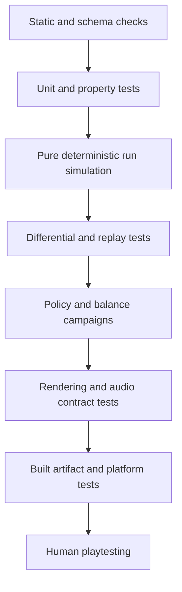

# Automated Gameplay QA Laboratory

This document defines the automatic testing system that should bring each build to human playtesting with correctness, determinism, compatibility, and obvious balance failures already removed. It does not claim that bots can certify fun. Human availability never pauses safe technical progress: automation must exhaust every objective check, package the unresolved experience questions, and continue dependency-ordered reversible work.

## Current implemented foundation

The repository now includes a seeded reference-core laboratory under [src/vibesnake/qa](../../src/vibesnake/qa). It exercises the production `Snake`, `Food`, and `ScoreManager` implementations without rendering or audio.

It currently provides:

- Food-seeking, survival, and abusive-input policies.
- Separate seeded streams for gameplay placement and policy decisions inside the harness.
- Per-step checks for body-index synchronization, valid coordinates, legal food overlap, growth accounting, score monotonicity, timer validity, combo bounds, direction reversal, and report consistency.
- Immediate replay of every scenario and SHA-256 trace comparison.
- Reproducible scenario identity through policy, seed, step count, and fixed delta.
- JSON report schema version 2 with ordered events, win state, action traces, outcome aggregates, failure codes, and trace hash.
- Property-based generated input sequences through Hypothesis.
- A compact versioned Python-to-C# movement fixture with 100 cases and 25,600 step-level comparisons, including each command's queue-acceptance result.
- Thirty-five targeted cross-language cases spanning every current combo, speed, length, and score-ceiling boundary, queue rejection and overflow, monotonic combo expiry, normalized random respawns, collision precedence, tail movement, wrapping, exact starvation outcomes, full-grid victory, and ordered events.
- Eight targeted Shield cases built from the production Python `Snake`, `PowerUpManager`, and `ShieldPowerUp`, covering collection on entry, pickup and active expiry, collision consumption and prevention, expiry precedence, starvation bypass, the simultaneous collision and starvation boundary, normalized state, and ordered power events.
- Eight hundred ninety-two native xUnit contracts with 90 percent line and branch floors per measured module. Current coverage is 95.77/90.50 percent Rules line/branch, 94.14/90.40 percent Persistence line/branch, 95.98/94.00 percent creator-validator line/branch, and 94.79/90.47 percent aggregate. The wrapper requires Rules and Persistence to appear exactly once, while Coverlet's minimum-module threshold also gates the creator validator. The real Godot scene smoke uses isolated replay storage (1-4 envelopes), mirror-completes terminal death steps, browses and controls verified deterministic playback, and asserts structured log event codes including `run_dead`, `replay_finalized`, `run_start`, and `achievements_load`.
- Required `progression-qualification-v1` evidence covers twenty exact goals across three lanes and pacing tiers, one persisted highlight, canonical human-only metrics, zero repetition-only goals, bounded reduced-motion notifications, eight curated sets across quiet and maximum Vibe profiles, rules isolation, keyboard/controller cosmetic selection and loadout round-trip, twelve events across four Tour tiers, canonical rival/station references, locked-event rejection, fixed-seed practice, keyboard/controller start/return, same-seed identity, replay/rematch availability, and score/progression isolation. Human distribution count remains exactly zero and AI evidence cannot be presented as a human target.
- Required `content-curation-qualification-v1` evidence binds all 95 runtime-radio asset IDs exactly once to the eight canonical station review queues, enforces 11-to-13-track candidate balance, distinct station identities, cleared rights, structural MPEG integrity, zero radio duplicates, zero suspicious temporary/test filename tokens, and zero current approvals. It also locks the deterministic `content-credits-v1` manifest-only generator while explicitly retaining zero core-music candidates, full-decode/loudness/listening evidence, production manifests, and export-eligible files.
- Required `creator-content-qualification-v1` evidence locks two native validation commands, two closed schemas, two examples, sixteen personality codes, fifteen pack/compatibility codes, canonical manifests, core-then-ordinal optional resolution, hard duplicate-ID collision rejection, and `executesContent: false` plus `arbitraryCodeSupported: false`. Source and assembly-reference checks reject process, reflection/native/dynamic load, scripting, network, Pygame, and Godot dependencies.
- Required `localization-qualification-v1` evidence locks 509 stable English IDs, 67 exact parameterized templates, thirteen migrated shell flows, 18 resolved onboarding IDs, 24 feedback IDs, and 24 exact broadcast caption IDs. It also requires deterministic `qps-ploc` output with at least 1.3 expansion, preserved input-glyph parameters, zero missing fallback-font glyphs, logical-canvas fit at 150 percent text, and zero direct draw, prompt, static status, composed status, or audited domain-presentation expressions.
- Required `spectator-experience-qualification-v1` evidence locks all ten measured world-bible rivals, fifty authored event lines, ten distinct sheds and station bindings, twelve seeds across three classes, four playback speeds, three explanation levels, four informational prediction choices, raw keyboard/controller routes, deterministic equal-rules lanes, typed overlays, presentation-only switching and fallbacks, bounded stall recovery, exact AI-state-free human seed challenges, ten local standings and challenge records, seven milestone types, atomic persistence, privacy, and zero wagering, currency, or human-progression awards.
- Required `optional-lore-qualification-v1` evidence locks 41 schema-bound entries across exact 19/14/8 Surface, Discoverable, and Archive counts; all eight stations, ten rivals, and nine mutations; six discoverable and four archive content kinds; initial and complete unlock sets; zero missing copy IDs, broken continuity, or unsafe critical entries; raw keyboard/controller routes; offline availability; critical-copy namespace separation; rules isolation; and zero progression awards.
- Required `offline-comparison-qualification-v1` evidence locks schema-1 stable tamper-evident seed codes, complete rules/content/configuration identity, exact seed reconstruction, three allowed options, four household slots, a 16 MiB import bound, source-preserving atomic no-overwrite import, modified and incompatible rejection, raw keyboard/controller routes, equal-rules live ghost play, ghost-state isolation, exact 26-field private run cards, atomic idempotent export, fresh deletion consent, lossless cancel, exact delete, progression isolation, and core-offline operation. Household handoff, maximum-text-scale platform review, and live ghost readability remain pending.
- Required `replay-browser-qualification-v2` evidence locks the exact 14-field metadata/status entry, 0.5x/1x/2x/4x playback speeds, explicit verified/incompatible/modified/unreadable badges, HUD toggle, pause/step/restart/return, atomic export, two-step stale-safe deletion, lossless cancel, export preservation, progression isolation, and raw keyboard/controller completion routes.
- Required `capture-sharing-qualification-v1` evidence locks default-off clean capture, six hidden overlay families, raw keyboard/controller completion routes, four replay speeds, deterministic replay seek/reset, rules-state isolation, explicit verified run-summary export, atomicity and idempotence, the exact closed 24-field schema, complete version/rules/integrity metadata, and player-identity/private-path exclusions. Retained Windows, macOS, and Linux captures plus trailer composition remain human gates.
- Required `input-cadence-qualification-v1` evidence runs nine real InputMap cases: keyboard, D-pad, and stick crossed with low, normal, and stressed render schedules. Every case accepts and consumes the same rapid five-turn stream exactly once, leaves no queued input, reaches the same final rules hash, and rejects passive stick drift.
- Required `settings-screen-qualification-v1` evidence locks 6 nonempty sections and 34 described rows, preference schema 7 with schema-1/2/3/4/5/6 migration, raw keyboard and controller completion routes, Vibe adaptation opt-out/category isolation, default-off local playtest consent, uniform bounded stick-deadzone application, D-pad digital fallback at the maximum deadzone, single-instance Master mono downmix, section restore, separate tutorial reset, lossless reset cancellation, confirmed reset, atomic save/reload, and a visible recoverable save-failure path.
- Required `local-playtest-summary-qualification-v1` evidence locks default-off consent, schema-7 preference round-trip, terminal seeded human capture, the exact 26-field schema-2 allowlist, exact nine-row nested power summaries, identity-verified schema-1 migration, ten forbidden privacy field families, a 200-summary and 512 KiB source cap, a newest-20 export cap, local-only export, lossless deletion cancellation, confirmed permanent source/export deletion, and absence of an upload surface through raw keyboard and controller routes.
- Required `human-playtest-handoff-v1` evidence hash-locks the reviewed V070-06 protocol, four cohorts, formative/targeted/fresh stages, fifteen scenarios including the six power-synergy cases, six recovery profiles, reviewed fixed seeds, thirteen build-identity and nineteen observation fields, severity and repeat rules, privacy exclusions, and eleven prerequisite artifact paths. It must report zero retained human sessions, `experienceVerified: false`, and no human target ranges until reviewed participant evidence exists.
- Required `power-decision-qualification-v1` evidence hash-locks all nine power definitions, four tactical families, anti-redundancy eligibility, product reachability and compatibility, pre-collection offer visibility, active and held-state readability, all eight aggregate lifecycle stages, schema-2 local-only summaries, six seeded synergy scenarios, config identity separation, and the default-off, unwired Mutation Fork prototype. Human route quality and the prototype decision remain explicitly unverified.
- Required `onboarding-qualification-v2` evidence locks title-first startup for a new profile, an explicit optional Help offer, direct-play choice, eight deterministic action lessons, active keyboard/controller prompts, skip, completion, replay, isolated reset, and the prohibition on tutorial score, achievement, or replay writes.
- Required `run-end-qualification-v1` evidence locks summary order, exact collision/starvation attribution, relevant recovery guidance, fair-category personal-best persistence, terminal-input restart rejection, confirm-only keyboard/controller restart, unlock summary, and menu/settings/replay access.
- Required `player-data-recovery-qualification-v1` evidence locks five separate allowlisted reset categories, exact confirmation, cancel-without-write, verified backup before removal, corruption detection and restore rejection, conflict refusal without overwrite, successful restore, keyboard/controller routes, and visible recovery locations.
- Required `bare-arcade-loop-qualification-v1` evidence locks one-rules-step input response, exact bounded buffer order, production-token graphical contrast, fatal-cell visibility, wrap continuity, host-smoke p95/max pacing, same-step death attribution, deliberate restart, zero transient reset residue, six cross-aspect/accessibility semantic frames, linked handoff evidence, and an explicit `pending` human-feel checklist.
- Required `feedback-matrix-qualification-v1` evidence locks unique coverage for all 19 ordered rules events and 15 shell actions, one dominant channel per row, complete accessibility alternatives, all 31 fallbacks, safe priority/cooldown/polyphony/ducking/shake ranges, explicit stacking/interruption, authored absence, zero unapproved asset implication, and flash/hitstop safety.
- Required `sfx-catalog-qualification-v1` evidence locks the 31-cue procedural fallback inventory, unique PCM fingerprints and runtime IDs, exact provenance/license declarations, measured peak bounds, no clipping, distinct navigation/combo/restart/achievement/death identities, nine one-to-one power activations, candidate exclusion, and rules isolation. Authored loudness and listening remain explicit pending gates.
- Required `shell-presentation-v1` evidence measures the owned fallback font and both palettes, requires the full prompt-family/shape matrix with text fallback, and proves distinct non-color state markers, paged long catalogs, and horizontal/vertical layout budgets at 150 percent text scale.
- Required `accessibility-presentation-v1` evidence crosses default, reduced-motion, flash-free, and combined profiles. It prohibits full-screen flashes, proves protective-profile shake is zero, retains the standard or longer caption window and all 31 cues/critical text, and requires an unchanged deterministic rules hash.
- Required `candidate-accessibility-audit-v1` evidence cross-binds accessibility presentation, shell presentation, settings, input cadence, audio, multimodal feedback, and viewport records by exact SHA-256. Twelve ordered audit areas must pass. The gate requires keyboard-only and controller-only routes, independent remapping, single-action navigation, separated audio, mono output, visual alternatives, reduced motion, flash safety, P1 required-flow severity, and 150 percent text across all eight supported display classes. The release matrix requires 24 display rows across Windows, macOS, and Linux while retaining five explicit human checks.
- Required `mouse-input-qualification-v1` evidence drives the live shell with nine scaled main-menu targets, left confirm, right Back, middle pause, vertical and horizontal wheel navigation, and a head-relative gameplay click. It rejects letterbox input and proves keyboard/controller binding documents remain unchanged. Physical mouse and pointer-focus review remain outside automation.
- Required `manual-product-matrix-handoff-v1` evidence hash-binds the V090-07 contract, locks four platform/architecture rows, 36 exact flows, 144 platform-flow cells, four device classes, eight settings profiles, 14 session fields, three result fields, and five pending physical gates. Protocol qualification records zero manual sessions, `manualExecutionComplete: false`, and `releaseAcceptance: false`. Supplied sessions fail on missing cells/devices/profiles, mixed revisions or platform artifacts, unsafe evidence paths, or any failed/blocked required flow.
- Required `external-validation-handoff-v1` evidence hash-binds the V090-08 contract and its human-playtest, manual-matrix, accessibility-guide, and execution-guide prerequisites. It locks four cohorts, three artifact platforms, four input classes, seven accessibility profiles, six comprehension checks, four de-identified report families, exact clean candidate and finding records, retained safe evidence files, fix-trigger and gate-rerun links, and P0 through P2 release rules. Protocol qualification records zero candidates, sessions, findings, and crashes with `externalValidationComplete: false` and `releaseAcceptance: false` until controlled execution is supplied.
- Required `release-materials-handoff-v1` evidence hash-binds the ten-document V090-09 foundation. A final record must match the expected source revision and canonical application version, all three artifact-manifest hashes and OS/size disclosures, all four physical-input evidence sets, offline and save-location claims, separate content byte counts, six recognized screenshot roles, two recognized video roles, and eight evidence-linked marketing claims. Every retained file has an exact SHA-256. Current pending markers prevent the alpha documents from being presented as final candidate material.
- Required `release-rehearsal-handoff-v1` evidence hash-binds the V090-10 contract and release-material, signing, packaging, and recovery prerequisites. A final record must retain candidate, previous, and manifest files for all three platforms; 33 passing acquisition, signature, lifecycle, optional-content, rollback, and removal cells; unchanged protected user-data hashes; the migration fixture set; complete withdrawal; and verified publish, halt, replace, and communicate roles. Every referenced file is covered by one exact SHA-256 map.
- Required `stable-promotion-handoff-v1` evidence fixes tag and version `1.0.0`, requires ten accepted upstream decisions for one source revision, and hash-verifies every public artifact, manifest, provenance bundle, checksum file, approved optional pack, public install result, and preserved release record. The exact stable compatibility acknowledgements prevent a packaging-only change from weakening scored rules, migration, category identity, missing-content visibility, accessibility regression, or offline-core promises.
- Required `multimodal-feedback-v1` evidence locks four timer/text/shape/color hunger phases, four readable combo milestone states with shared score motion and a static reduced-motion fallback, nine unique power icon/name/state/cue contracts, pre-consumption protection telegraphs, two distinct death symbols and cues, and default/muted/reduced-motion/flash-free/combined profiles with at least two surviving death-attribution channels and an unchanged rules hash.
- Required `radio-behavior-qualification-v1` evidence locks catalog projection from validated manifests, complete station/track/pack metadata, shuffle without immediate repeat, explicit single-track repeat, pause/resume, station switching and last-track identity, end-of-track advance, mute/help state, missing-track recovery, missing-pack core continuity, packaged inventory, MP3 adapter presence, keyboard/controller station cycling, and radio/gameplay RNG plus rules-state isolation.
- Required `broadcast-qualification-v1` evidence locks eight complete planned station identities, explicit zero-approved state, four permitted host boundaries, ordinary-combo track continuity, track and host shuffle bags, cooldown and resume, event-aware ducking, critical-cue priority, caption fallback, an eight-segment run cap, adaptive-layer refusal, and radio/gameplay RNG plus rules-state isolation. Authored broadcast content remains a separate approval and listening gate.
- Required `mode-contract-qualification-v2` evidence locks `classic@1` and `vibe@1`, effective score categories, exact feature boundaries, 64 by 33 board, pause, seed, restart, keyboard/controller selection, deterministic hashes, default-on bounded Vibe adaptation, opt-out isolation, and cross-mode score isolation. Classic must survive beyond the Vibe starvation limit, spawn no power, retain combo zero, and award exactly 10 points per food; Vibe must retain pressure and full scoring. Required `adaptive-fairness-qualification-v1` evidence separately proves policy bounds and states, closed inputs, deterministic hashes, preference round-trip, score metadata, achievement eligibility, and all three score categories.
- Required `balance-laboratory-v1` evidence runs nine deterministic policies against three mode variants and twelve reviewed seeds. It locks ten hostile scenarios, 324 paired runs, at least 124,242 step comparisons, 27 distributions, 16-hex state hashes, verified outlier replay files and SHA-256 values, and a null first divergence. Required `observed-balance-baseline-evidence-v1` uses a separate reviewed 100-seed corpus for 2,700 runs and 27 hash-locked distributions. It records score, survival, length, food, combo, power, death, and outcome metrics while requiring the `ai-simulation-observation` classification and no human target ranges.
- Required `balance-experiment-guard-v1` evidence hash-locks the target-first, one-family experiment registry. Until structured human review establishes ranges, it requires zero targets, zero experiments, and `tuningEligible: false`; average score alone can never authorize a candidate.
- Required `score-identity-qualification-v1` evidence locks eight run-purpose/seed pairs, two separately competitive contexts, 14 schema-2 personal-best fields, 18 schema-1 history fields, a ten-score category cap, visible schema-1 personal-best migration to `Legacy 0.2`, and the hash-locked 25-achievement Classic/Vibe audit. Tutorial, practice, AI, replay, modified, and legacy contexts cannot update current personal bests.
- Required `score-browser-qualification-v1` evidence locks raw keyboard/controller entry, category navigation, two-step import confirmation, lossless cancel, exact-once Python schema-1 import, source SHA-256 and byte preservation, visible noncompetitive `Legacy 0.2`, current native category separation, existing-best history seeding, and shared reset/recovery ownership.
- Required `visual-hierarchy-qualification-v1` evidence locks a 160-particle global cap, 64 particles per event, one 0.35-strength shake source, zero full-screen flashes, three popups, one overlay, three protection-first head outlines, and 3:1 foreground contrast against both board palettes. It writes hash-verified 640 by 360 PNG review frames for quiet, maximum-safe busy, starvation warning, reduced-motion recovery, and flash-free game-over states while proving rules isolation. Platform pixel and subjective peripheral-vision review stay explicitly pending.
- Required `performance-qualification-v1` evidence captures 40 live frame samples each for minimum, default, and maximum-safe effects; records average, p50, p95, p99, maximum, and driver availability; and rejects sustained shared-host regressions above 25 ms average or 60 ms p95. The p99 and maximum remain diagnostics so one scheduler outlier cannot fail an otherwise healthy shared-runner distribution, and failed packaged runs retain their measurements. The 60 ms tail ceiling accommodates timer batching on shared macOS runners without relaxing the 25 ms sustained-work ceiling. The maximum scene accounts for all 2,112 board cells, 160 particles, three popups, 12 audio channels, and 2,303 of the 2,400 permitted logical draw submissions. Exact 256-step hashes must match across profiles. The 16.67 ms target is published but not accepted from an unnamed shared runner.
- Required `vibe-level-qualification-v1` evidence locks five exact combo thresholds and complete background, HUD, trail, particle, camera, music, stinger, and static-signal budgets. Four upward transitions plus combo break fire once. Thirteen fixed scenes cover every level, transition, break, recovery, and both deaths. Seven default/accessibility profiles preserve static identity, zero flashes, requested motion/particle limits, exact rules state, and score category. Gameplay contrast stays above 4.56:1 across level and high-contrast backgrounds.
- Strict canonical-state restoration with schema 3, rules, RNG, geometry, command-queue, session achievement counters, and terminal-state validation under `fnv1a64-canonical-json-v4`.
- Generated native state-machine campaigns spanning eight seeds and 512 operations per seed, with command abuse, repeated restoration, session-counter parity, terminal restoration, and restart equivalence checks.
- Versioned pure-rules property campaign report (`rules-property-campaign-v1` / `property_campaign.json`) and inventory eligibility evidence (`content-eligibility-evidence-v1` / `content_eligibility.json`).
- Schema 1 `AchievementsDocument` / `AchievementsStore` profile unlocks with shell load/save and `ApplyProfileUnlocks` candidate suppression; Python `CoreSimulation` accepts `already_unlocked_achievements` for dual-runtime experiments.
- Logical Godot keyboard and any-controller actions, focus-loss pause safety, audio-bus registration, fallback-cue execution, typed Shield feedback priority, and clean headless shutdown checks.
- A deterministic public content inventory with path safety, strict classification, SHA-256 hashes, bounded JSON, MPEG structural, and decoded PNG integrity, duplicate reporting, rights state, export eligibility, and release-blocker output. Export eligibility remains zero until pack quality and credit gates pass.
- A 51-package universal Python lock with exact SHA-256 hashes and an input digest, locked NuGet restore with transitive vulnerability audit, full-tree Ruff format and lint gates, and an executable anti-slop policy over active source and canonical docs.
- A strict schema 1 content-pack laboratory with exact approved allowlists, rights-derived credits, file hashes and sizes, game and ruleset ranges, station metadata, dependency checks, canonical encoding, and isolated optional-pack rejection.
- Schema 1 native first-divergence bundles that retain the shortest executed prefix reaching a mismatch, expected and actual normalized state and events, native canonical state and hash, fixture identity, seed, engine contract, platform metadata, and an exact test-filter reproduction command.
- A canonical replay schema with explicit `vibesnake-core@4` rules identity, RNG and state-hash algorithms, optional canonical capture time and explicit seeds, embedded schema 3 initial state, step-indexed logical actions, deterministic checkpoints, final observed outcome, fixed compatibility diagnostics, deterministic verification-work accounting, strict encoding, and SHA-256 payload integrity.
- A live recorder that retains rejected logical attempts, compares each Godot step with a private deterministic mirror, compares final canonical state, enforces command, step, lifecycle, and serialized-size bounds, and never saves a divergent recording.
- A platform-neutral replay store that performs bounded strict UTF-8 inspection, separates compatibility from deterministic verification, lists generated summaries newest first without payload reads, projects verified player-facing metadata and explicit failure states on a background boundary, preserves external sources, serializes save/export/delete decisions across processes, writes atomically without overwrite, deduplicates by verified payload, prepares stale-safe content-hashed deletion consent, and fails closed at explicit stored/export count and byte limits.
- Pure clock-free replay playback with verified construction, deterministic advance, exact reset and seek, plus Godot keyboard/controller browse, closed speed selection, pause, step, back-ten, HUD toggle, restart, return, export, delete-cancel/delete-confirm, focus-loss, and disconnect smoke coverage.
- Shared Python fixtures that declare `vibesnake-core@4` and either `positions-injected-or-random-output-normalized-v2` or `positions-and-power-state-injected-v1`, with native assertions that reject mismatched identity or randomness scope, prove random-stream use, preserve non-respawn food, compare random food placement through legal-free-cell outcomes instead of false coordinate equivalence, and compare the injected Shield lifecycle exactly.
- A Windows x64 packaged-player gate that exports and launches outside the checkout, requires deterministic state hash `600f29e8919a9400`, owns the player process through clean exit, rejects engine warnings and leaked objects, inspects 199 distribution files, rejects Python and development payloads, detects the current checkout path and fixed development-path signatures in project payloads, rejects packed export locks, and writes per-file SHA-256 evidence.
- A CI-friendly exit status.

Run the quick laboratory directly:

```powershell
python -m vibesnake.qa --seeds 0 1 2 3 4 --steps 500 --output qa_reports/core.json
python -m vibesnake.qa.shared_traces --check
python -m vibesnake.qa.shared_rule_traces --check
python -m vibesnake.qa.shared_power_traces --check
python -m vibesnake.qa.shared_phase_shift_traces --check
python -m vibesnake.qa.shared_last_stand_traces --check
python -m vibesnake.qa.shared_remaining_power_traces --check
```

Add `--verbose` only when scoring logs are useful. `qa_reports/` is ignored because generated evidence belongs in CI artifacts or an explicitly retained test record, not normal source commits.

### Honest boundary

The core adapter mirrors the current coordinator's ordering and legacy global gameplay randomness. The focused power adapter executes the production Shield and manager lifecycle with injected positions and state, but it does not compare random spawn coordinates or presentation. The laboratory does not yet execute the other eight powers, near misses, DDA, AI, persistence, menus, rendering, or authored audio end to end. It is a behavior reference and migration oracle. The initial C# kernel is real but incomplete, so neither side alone defines every target behavior yet. Reviewed differences and excluded fields are tracked in [PARITY_DECISIONS.md](PARITY_DECISIONS.md). The 0.4 deterministic `RunEngine` must replace the adapters as the authoritative simulation target.

## Quality model



Each layer answers a different question. More simulation seeds do not compensate for a missing artifact test, and pixel snapshots do not compensate for a weak rules oracle.

## Required deterministic architecture

The final rules engine must have no dependency on Godot, Pygame, audio, rendering, wall-clock time, files, environment variables, or platform APIs. One fixed step receives state and commands, then returns new state and typed events.

### Inputs

- Ruleset and rules version.
- Initial state or new-run parameters.
- Fixed gameplay tick.
- Logical commands, not raw key codes.
- Explicit gameplay and AI random-stream states.
- Versioned content definitions needed by the rules.

### Outputs

- Complete canonical `RunState`.
- Ordered typed `RunEvent` list.
- Stable state hash.
- Optional diagnostic counters excluded from game behavior.

### Random-stream contract

Use separate, named, serializable streams for gameplay, AI decisions, cosmetic effects, radio selection, and non-gameplay copy. The gameplay algorithm and its version are part of the replay contract. Never rely on the unspecified future behavior of a platform's default random class.

### Time contract

- Rules advance only by integer fixed steps.
- Presentation interpolates between states and cannot change rules.
- Pause advances no gameplay step.
- Focus loss has an explicit policy and cannot leak buffered commands.
- Performance tests measure wall time, but correctness tests never pass or fail from shared-runner timing.

## Scenario schema

The versioned scenario format should support:

| Field | Purpose |
| --- | --- |
| `scenario_schema_version` | Safe evolution of fixtures |
| `scenario_id` and tags | Stable selection and reporting |
| `ruleset_id` and `rules_version` | Prevent invalid comparisons |
| Seeds by named stream | Exact reproduction |
| Initial state | Natural start or a targeted edge case |
| Policy or explicit command trace | Generated exploration or exact regression |
| Step limit and terminal expectation | Bound execution and state expected outcomes |
| Content overrides | Exercise one power, timer, or balance value |
| Required events | Assert milestones or resolution order |
| Forbidden events | Assert safety and non-occurrence |
| Invariants and metric probes | Add scenario-specific oracles |
| Artifact attachments | Reference screenshots, audio captures, logs, or replay files |

A failure prints a one-command reproduction, seed, first divergent step, expected and actual hashes, recent commands, relevant state slice, and artifact paths. Generated failures are minimized into permanent regression fixtures where possible.

## Invariant catalog

### State and geometry

- Every occupied cell is a valid grid cell.
- Ordered body and collision index represent the same coordinates under the active overlap rules.
- The head exists exactly once unless a documented phase state allows otherwise.
- Food, visible powers, and detached obstacles satisfy their exclusion contracts.
- A full grid resolves through the documented victory or food-absent state, never an infinite spawn loop.

### Input and stepping

- Illegal reversal is rejected.
- A valid buffered sequence is consumed in order with a bounded queue.
- One fixed step moves at most once.
- Pause, hitstop, focus loss, and menus cannot consume a gameplay command silently.
- Controller hot-plug never changes the rules command stream for the same logical input.

### Score and progression

- Score never decreases inside a run.
- Each score change has exactly one typed source event.
- Combo, multiplier, length, food count, and bonuses remain within their versioned formulas.
- AI and replay runs never advance human progression.
- Restart finalizes at most one run and resets every transient field.

### Powers and death

- Offer, spawn, collection, activation, duration, consumption, expiry, and cleanup occur at most once per instance.
- Collision resolution follows Phase Shift, recovery immunity, Shield, Last Stand, then death.
- Starvation bypasses Shield and may consume Last Stand.
- Duplicate and cross-family rules are enforced by the spawn director.
- Every active modifier is removed on restart and mode change.

### Persistence and content

- Save writes are atomic and future schemas are never overwritten.
- Replay, score, content pack, and custom personality identifiers are versioned.
- Invalid imported data fails closed with a precise report and leaves the original intact.
- Missing optional content never prevents a core run.

## Automated player portfolio

One strong bot leaves blind spots. The laboratory needs deliberately different policies:

| Policy | What it explores |
| --- | --- |
| Idle | Starvation, focus, and no-input behavior |
| Input chaos | Duplicate inputs, reversal attempts, buffer pressure, pause and restart races |
| Safe survivor | Long state sequences, wrapping, timer pressure, and cleanup |
| Food seeker | Growth, respawn, combo, score, and full-grid pressure |
| Power hunter | Every power lifecycle and interaction |
| Risk seeker | Near misses, recovery resources, boost, and high-intensity states |
| Boundary walker | Edges, corners, wraps, viewport mapping, and obstacle expiry |
| Scripted oracle | Exact known command and event traces |
| AI personality | Advertised behavior and seeded league differences |
| Replay ghost | Record, load, seek, resume, and divergence behavior |

Policies are test instruments, not claims about human behavior. Procedural personas can approximate styles and find divergent outcomes, but human observation remains necessary.

## Campaign tiers

Campaigns are triggered by change risk, merge state, and release state rather than calendar estimates.

| Gate | Required campaign |
| --- | --- |
| Local change | Targeted unit, property, and smallest reproducing scenarios |
| Pull request | Fixed smoke corpus across every policy and changed ruleset |
| Protected branch | Expanded seed corpus, replay comparison, persistence faults, and headless shell smoke |
| Balance candidate | Large policy matrix with distribution comparison and outlier replay retention |
| Release candidate | Full rules, content, artifact, OS, input, audio, display, save, reliability, and accessibility matrix |

Seed corpora are versioned. Always include low integers, previous failure seeds, boundary-state fixtures, and sampled seeds recorded with the report. A failed seed becomes a permanent regression unless the old expectation was invalid and the decision is documented.

## Balance laboratory

Balance reports should group by ruleset, rules version, policy, seed corpus, and content version. Useful measures include:

- Survival steps and death cause.
- Food, score, length, combo tiers, and time between food.
- Power offers, detours, collections, activations, expiries, saves, and death adjacency.
- Near-miss frequency and conversion into score or death.
- Time spent at each Vibe Level.
- Route entropy, wrap use, repeated loops, and unreachable targets.
- AI target selection, risk acceptance, and personality separation.
- Restart and transient-state leak counts.

Distribution changes require a declared reason, automated comparison, and eventual human review before final balance promotion. Human unavailability does not halt experiments or implementation. It leaves the experience conclusion pending. Use medians, percentiles, histograms, and effect sizes rather than trusting one mean. Do not make CI flaky by failing on a tiny sample's random fluctuation. Fixed corpora can enforce exact expectations; exploratory corpora produce reviewable evidence.

Automatic balance can detect dominant powers, useless offers, impossible seeds, extreme starvation, score inflation, and AI personality collapse. It cannot establish boredom, fairness perception, emotional payoff, music fatigue, or whether a difficult choice feels meaningful.

`native-ai-league-v1` runs all ten built-in personalities over the twelve reviewed QA seeds. Its 120 runs retain score, survival, food efficiency, power preference, risk exposure, dead-end rate, route efficiency, decision-trace hashes, final rules hashes, and rules-version grouping. A mirrored controller/run pair compares every one of 98,984 steps. Six counterfactual controllers per run change one trait to the opposite extreme while consuming the same random samples on the same observed states; all sixty now exceed the 100-basis-point materiality floor. `ai-personality-qualification-v1` independently reruns the matrix, checks one declared measured behavior range per built-in, hardens the shared custom schema, and locks truthful overlay/status data. AI identities are canonical, noncompetitive, and never written to score persistence.

## Property, model, and differential testing

- Property tests generate values and command sequences, then minimize a failure.
- Stateful tests generate operations such as start, turn, pause, collect, die, reset, save, load, and replay while checking invariants after each operation.
- Model-based tests compare the product with a smaller explicit state machine for menus, persistence, and content lifecycle.
- Differential tests run one scenario through the Python reference and the new C# engine, comparing normalized events and state hashes at every step.
- Metamorphic tests apply transformations that should preserve a relation, such as rotating a symmetric board and command trace, changing cosmetic selection, muting audio, or changing render frame rate while preserving rules outcomes.

Hypothesis already supplies generated action sequences to the Python foundation. The final C# core should use an equivalent property-based tool and preserve failing seeds in shared fixture files.

The implemented differential foundation compares normalized state and ordered events rather than cross-language hashes because Python does not yet implement the target PCG state or canonical JSON hash. Fixture metadata lists comparison and exclusion scope. Exact starvation ordering, collision precedence, full-grid victory, and Shield lifecycle are now accepted and compared. Random food respawn positions, the other eight powers, risk bonuses, and other unported systems remain excluded until their decisions and adapters close.

## Presentation automation

### Rendering

- Render every screen at each supported aspect ratio, text scale, contrast mode, motion profile, and input-prompt family.
- Capture stable reference frames at fixed presentation clocks and cosmetic seeds.
- Use semantic masks for critical regions so harmless particle variation does not hide layout regressions.
- Check bounds, clipping, focus visibility, safe areas, text overflow, minimum target size, head-food contrast, and fatal-cell visibility.
- Retain diff images when a threshold fails.

Intentional golden-image changes require an independent checker and remain subject to later art review. Golden images cannot judge whether art direction is excellent.

### Audio

- Assert typed event to bus, cue, priority, ducking, cooldown, and accessibility-caption mappings.
- Decode every shipped file and reject missing, corrupt, silent, clipped, duplicate, or manifest-mismatched assets.
- Measure peak, true-peak where supported, integrated loudness, duration, leading silence, and channel layout against content policy.
- Simulate overlapping critical cues and radio to ensure the priority mixer remains intelligible.
- Record station shuffle sequences and prevent immediate repeats.

Listening review on multiple devices remains mandatory for release, but its absence does not block further automated audio integration, measurement, or fault testing.

## Performance and reliability

Dedicated performance jobs run on named hardware or controlled virtual machines. They report fixed-step throughput, render frame percentiles, allocation rates, memory growth, startup, content scan, save latency, and audio underruns. Shared CI timing is informational unless the runner is controlled.

Reliability campaigns include:

- Repeated run, death, restart, menu, mode, and quit cycles.
- Long headless simulations with periodic state hashes.
- Controller and audio-device add, removal, and remap events.
- Focus loss and display-mode changes at every state.
- Read-only paths, full disk simulation, interrupted writes, corrupt files, future schemas, and non-ASCII paths.
- Missing, invalid, truncated, duplicate, and incompatible content packs.
- Replay load, seek, resume, and version rejection.
- Memory and handle leak checks across repeated scene transitions.

## Cross-platform artifact matrix

Windows, macOS, and Linux are first-class 1.0 platforms. Each platform builds on its native CI runner and tests the exact exported artifact outside the checkout.

The current workflow defines build, scripted headless launch, logical binding and focus checks, fallback-audio execution, isolated replay user data, warning and leak rejection, artifact inspection, manifest generation, and upload for all three systems. Release rows additionally run 100 fresh-profile launches and a candidate lifecycle preflight through the actual exported player. The lifecycle covers hash-identical repair, preferences schemas 1 through 6, personal-best schema 1, local-playtest-summary schema 1, source preservation, future-schema rejection without overwrite, optional-pack and player-data recovery, and application removal with data retained. Every packaged smoke mirrors 100,000 balanced-AI steps per Classic and Vibe ruleset, restarts 100 spectator sessions while checking reset state and eleven exact Godot resource samples, injects all seven roadmap fault classes, verifies local crash and first-divergence reports, and measures 120 live frames across three exact effects profiles. `release-matrix-qualification-v1` then requires exactly three rows from one source revision and build mode, one state hash and lock-set digest, manifest-bound unsigned signing readiness, immutable read-only installs, deterministic package hashes, 300 clean launches, 24 platform-fixture migration results, 600,000 compared steps, 300 spectator restarts, 21 fault rows, both triage report types, 360 performance samples, and one performance rules hash before provenance can run. Protected signing, selected-channel lifecycle, real cross-version rollback, retained Release execution, named-hardware performance acceptance, and final platform integration remain unclaimed until release evidence exists.

The required 1.0 matrix expands that foundation to input prompts, physical controller lifecycle, audio-device failure, display modes, save migration, optional content, logs, crash reporting, clean removal, and complete artifact identity. macOS must additionally verify signing, hardened runtime, notarization, stapling, and both supported CPU architectures. Windows must verify Authenticode when signing is enabled. Linux must verify executable permissions, the declared library baseline, desktop entry behavior, and supported display and audio paths.

## Automation-first continuation policy

Automation should reduce the human task to questions that cannot be answered mechanically. Before recording any player-facing system as ready for observation, automatically produce a handoff bundle containing:

- Exact application, ruleset, content, scenario, and source revision identities.
- Fixed seeds and minimized command traces for quiet, pressure, recovery, death, restart, and maximum-intensity states.
- Replays, normalized events, state hashes, screenshots, semantic masks, audio captures, cue timelines, performance traces, and accessibility-profile outputs.
- Input latency and buffer-consumption evidence for keyboard and controller action streams.
- Contrast, clipping, focus, text-scale, critical-cell occlusion, flash, motion, peak, loudness, ducking, cooldown, polyphony, and caption results.
- Balance distributions, effect sizes, dominant or useless strategy flags, outlier seeds, mutation survivors, and coverage gaps.
- A short list of experience questions that remain genuinely unautomatable.

If no human reviewer is available, label the build `automated-qualified, experience-unverified`, retain the bundle, and continue with the next reversible roadmap task whose technical prerequisites pass. Do not mark a human acceptance item complete, publish a fun claim, freeze a subjective tuning choice, or promote a release based on that label.

## Human validation handoff

A build is ready for focused human playtesting only when:

- No known severity-1 or severity-2 correctness issue remains in scope.
- Changed rules pass exact, property, stateful, replay, and relevant differential tests.
- The fixed seed corpus has no unexplained invariant or divergence failure.
- Balance reports contain no unreviewed extreme outlier or dominant strategy signal.
- Required screens, cues, content, and platform artifacts pass automated validation.
- The build records rules, seed, content, and revision identity for every test run.

Human testers then spend their attention on comprehension, control feel, tension, agency, surprise, fatigue, aesthetics, emotional payoff, and desire to replay. Their absence is an evidence gap, not an engineering stop signal.

## Research and tooling basis

- [Hypothesis stateful testing](https://hypothesis.readthedocs.io/en/latest/stateful.html): generates operation sequences, checks invariants after rules, and minimizes failures into short reproductions.
- [Search-based automated play testing with an EFSM](https://zenodo.org/records/5140432): demonstrates model-based action generation, meaningful model coverage, mutation detection, and discovery of unknown faults in a game.
- [Automated playtesting with procedural personas](https://ieee-cog.org/2019/papers/paper_127.pdf): supports using distinct automated play styles instead of treating one optimal agent as representative.
- [MDA framework](https://aaai.org/papers/ws04-04-001-mda-a-formal-approach-to-game-design-and-game-research/): reinforces the boundary between mechanically verified behavior and the player-facing experience that still needs human evaluation.
