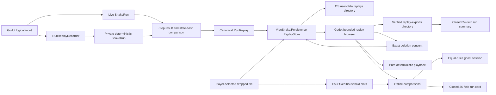

# Replay Recording and Storage

[Documentation hub](../README.md)

This document owns the current native replay contract. It covers verified
capture, storage, browser, playback, stable seed challenges, local ghosts, and
privacy-safe sharing. Retained-platform, accessibility, and final trailer work
remain release gates.

## Current capability

The native slice can now:

- record every logical direction attempt received between fixed rules steps,
  including attempts rejected by the bounded movement queue;
- compare each live step with a private deterministic mirror before accepting it
  into the recording;
- finalize a canonical replay only when the final live state and mirror state
  match exactly;
- verify checkpoints and outcome before a replay reaches storage;
- write terminal Godot runs atomically below the operating system user-data
  directory;
- reload and verify the exact saved file before reporting success;
- list bounded generated replay names newest first without reading payloads, then inspect each entry on a background boundary before presenting trusted metadata;
- open the replay browser through the `R` or Controller North action;
- show capture date, mode, rules version, score, seed, duration in steps, and an explicit verified, incompatible, modified, or unreadable badge without displaying internal filenames or hashes;
- load and verify a selected replay on the background operation boundary;
- play at 0.5x, 1x, 2x, or 4x, pause, step once, seek back ten steps, toggle clean capture, restart, and return through keyboard or controller actions;
- toggle a clean gameplay or replay view through the remappable Help action on keyboard or controller, hiding six presentation-only overlay families without changing rules state;
- export only verified replays atomically to a bounded player-visible export directory and write a closed privacy-safe run-summary sidecar;
- prepare content-hashed deletion consent, cancel without changing data, reject stale consent, or permanently delete exactly one selected stored replay while preserving exports;
- pause playback on focus loss or last-controller disconnect;
- inspect one dropped external replay without copying, modifying, migrating, or
  deleting the source; and
- preserve incompatible future files while reporting the exact compatibility
  reason;
- encode stable `VS1` seed codes that bind rules, core content, mode,
  configuration, gameplay seed, and allowed challenge options;
- explicitly copy verified replays into four fixed household rival slots while
  preserving every import source;
- run a verified ghost beside a newly created equal-rules player run without
  allowing ghost commands or state to enter player collision, score, random
  state, or persistence; and
- atomically export a closed 26-field run card with verified run facts and no
  player identity or private path.

Playback and clean capture are deterministic and read-only with respect to
profiles, achievements, scores, rules state, and live runs. Household ghost
races use the isolated seeded-challenge score context and cannot award ordinary
human progression. Retained multi-platform capture and ghost review, final
trailer composition, and final accessibility polish remain open.

## Ownership and trust boundaries



`VibeSnake.Rules` owns commands, deterministic execution, replay construction,
compatibility, integrity, verification, and clock-free playback. It has no file,
clock, Godot, or platform dependency. `VibeSnake.Persistence` owns bounded file
inspection, verified browser projection, stored timestamps, opaque replay IDs,
user-data paths supplied by the application, atomic writes and exports, and
content-hashed deletion consent. The Godot application supplies capture time,
routes input, loads selected files through persistence, and owns player-facing
status. It does not implement replay rules, parse replay JSON, or construct file
paths for selected stored entries.

## Envelope identity

| Contract | Current value | Failure behavior |
| --- | --- | --- |
| Replay schema | `1` | A different schema returns `UnsupportedSchema` and remains untouched |
| Kind | `vibesnake-run-replay` | A different kind returns `UnsupportedKind` |
| Rules identity | `vibesnake-core@4` | A different ID or version is rejected before execution |
| Random algorithm | `pcg-xsh-rr-32-v1` | An unknown algorithm is rejected before execution |
| State hash | `fnv1a64-canonical-json-v4` | An unknown algorithm is rejected before execution |
| Config hash | `sha256-canonical-runconfig-v3` | Envelope stores effective `configHash`; mode identity, starvation/combo/speed/length switches, DDA enabled state, and adaptive policy are bound into it, and verification rejects restore or mid-run identity drift (`ConfigIdentityDiverged`) |
| App version | Optional shell-supplied string | Present on new captures; omitted on legacy envelopes; not used for rules determinism |
| Capture time | Optional shell-supplied canonical UTC string | New product captures use `yyyy-MM-ddTHH:mm:ss.fffZ`; omitted on legacy envelopes; never read from a rules-layer clock |
| Explicit seeds | Optional gameplay and AI seed pair | New product captures store both; the current shared-master-stream contract requires equality; omitted together on legacy envelopes |
| Integrity | `sha256-canonical-replay-payload-v1` | A changed payload returns `IntegrityMismatch` |
| Embedded state | Canonical state schema 3 | Invalid or impossible state returns `InvalidPayload`; schema 2 states remain intact and fail compatibility |

The envelope stores the canonical initial state, ordered logical attempts by
step, deterministic checkpoints, final tick, status, death cause, score, and
state hash. Canonical serialization and the complete envelope are limited to 16
MiB. A replay can contain at most 100,000 rules steps and 64 logical attempts in
one step.

## Live recording invariants

`RunReplayRecorder` begins from a running `SnakeRun` and restores a private
mirror from the same canonical state. On each fixed step it:

1. retains the ordered logical attempts exactly as the Godot shell received
   them;
2. applies those attempts to the mirror through the real direction queue;
3. advances the mirror through the real rules step;
4. compares the complete `RunStepResult`, including ordered events and state
   hash, with the live result; and
5. compares the live state hash with the mirror state hash before committing the
   replay step.

Finalization also compares the complete canonical live and mirror states and
builds the envelope through the same constructor used by offline capture. This
mirror proof avoids replaying the whole run again on the terminal gameplay
frame. The persistence boundary independently verifies the completed envelope
before writing it. Command, step, lifecycle, divergence, and serialized-size
failures make the recorder unusable for that run without interrupting gameplay.
An unusable recording is never saved.

## Storage contract

The application supplies an absolute user-data root. The store owns only its
`replays` child directory. A generated filename has this form:

```text
yyyyMMddTHHmmssfffZ_<64-lowercase-hex-payload-hash>.vibesnake-replay.json
```

Writes use UTF-8 without a byte-order mark. The store writes a unique temporary
file in the destination directory, flushes it to stable storage, then performs a
same-directory move without overwrite. A conflicting destination is preserved
and reported. A retry with identical content is idempotent, including a retry at
a later clock value, because existing files are matched by payload hash and
compared with a bounded stream.

The complete duplicate, quota, temporary-write, and final-move transaction holds
an exclusive `.vibesnake-replay-store.lock` file. Cooperating game processes
therefore cannot both pass the same capacity check or create duplicate payloads
under different timestamps. Lock acquisition has a bounded wait and returns
`Busy` without changing replay data when another process owns the transaction.

Storage is fail-closed at 256 replay files or 256 MiB of replay data. The
low-level listing uses the same bounds, validates generated names, ignores
invalid manual names, and returns stable newest-first summaries without loading
payloads. The player-facing browser then loads and verifies each bounded entry
on a background operation. Verified rows receive the complete 14-field metadata
and status projection. Unsupported compatible shapes show `INCOMPATIBLE`,
integrity or deterministic divergence shows `MODIFIED`, malformed/unreadable
content shows `UNREADABLE`, and only deterministic success shows `VERIFIED`.
Reaching a limit does not delete or replace an existing file. The player
receives an actionable result telling them to archive or remove reviewed
replays before retrying. Automatic pruning is deliberately absent because
replay deletion is a player-data operation.

Verified exports use canonical UTF-8 and same-directory atomic moves below
`user://replay-exports/`. They are independently bounded at 256 files and 256
MiB, are idempotent by destination/content, and never modify the stored source.
Export is unavailable for incompatible, modified, unreadable, or missing
entries. The replay reset/recovery category owns `replays/`, `replay-exports/`,
and `offline-challenges/` so a confirmed category reset backs up and restores
the whole player-visible replay and challenge library.

The same explicit verified-export action writes one
`vibesnake-run-capture-summary-v1` sidecar below `replay-exports/`. Its schema is
closed at exactly 24 fields and includes application, rules, mode, score
category, configuration, replay integrity, capture time, gameplay seed, and
outcome metadata. It contains no player identity, arbitrary text, machine path,
or `user://` path. Summary exports are independently capped at 256 files and 4
MiB, use same-directory write-through temporary files and no-overwrite moves,
and return an idempotent success only when the existing bytes match exactly.

Per-item deletion never takes a path from presentation. A read-only plan binds
the opaque replay ID, stored timestamp, byte count, and current file SHA-256 to
the displayed confirmation. Confirmation reacquires the cross-process store
lock and rechecks every bound fact. A changed plan returns
`ChangedSinceConsent`; cancellation calls no write; success deletes one exact
stored file and preserves all exports. Incompatible or modified generated files
can still be removed after the same exact consent.

## Import and compatibility behavior

Stored names reject path separators, drive or alternate-stream separators,
control characters, and wrong extensions. External inspection requires an
absolute path and opens the source read-only. Before JSON parsing, the store:

- rejects files larger than 16 MiB;
- bounds reads if a file changes size while open;
- rejects a UTF-8 byte-order mark and malformed UTF-8; and
- preserves the source for every success and failure result.

Compatibility and deterministic verification are separate results. A replay can
have a canonical, integrity-valid envelope and still fail deterministic
verification at a checkpoint. The UI reports that distinction instead of
silently treating every failure as corruption.

Verification has a deterministic 16,000,000 work-unit budget in addition to the
size and step caps. It rejects an impossible body-size and step-count product
before executing it, then charges actual body hashing, every potential full-grid
food scan, and both potential full-grid power-spawn passes before each step.
Godot runs save, selected-browser-file, latest-file, and dropped-file operations
as one background operation at a time, while the main thread remains responsive.
Replay work gates new runs, a terminal save is retained behind any active
inspection, and normal quit or window-close requests wait for save completion.
A monotonic five-second deadline releases exit if local I/O never returns, and
unexpected teardown uses the same bounded final save-drain window.
Compatibility messages never echo untrusted contract identifiers, and displayed
status text is control-character sanitized and limited to 240 characters.

## Playback contract

`RunReplayPlayback` verifies its replay before exposing a snapshot. The shell
decides when to request another step; playback itself never reads wall time.
Every advance applies the recorded logical attempts for that rules step through
the real direction queue, then executes the real rules transition. Reset and
seek reconstruct the same initial state and hashes, including backward seeks.
The final replay step may legitimately retain a buffered direction when the
capture ended before that command was consumed.

The Godot playback screen reuses the run renderer but cannot persist achievement
candidates, scores, or profile changes. Confirm or Pause toggles play, Right
steps once, Left seeks back ten steps, Up/Down changes the closed 0.5x/1x/2x/4x
speed set, Help toggles clean capture, Replay restarts, and Back returns to the
browser. Clean capture hides run HUD, replay controls, terminal, audio-status,
debug, and spectator overlay families. Every action has keyboard and
controller defaults and renders the active binding while visible. The
presentation timer controls only pacing and never enters canonical state.

## Automated proof

The native contract suite covers live rejected-input capture, terminal runs,
step-result and live-state divergence, command bounds, lifecycle misuse,
canonical round trips, future schemas, integrity tampering, invalid UTF-8,
oversized-file guards, path traversal, alternate-stream names,
read-only external inspection, conflicting writes, sequential and concurrent
idempotent retries, cross-process lock contention, concurrent capacity checks,
file-count and byte limits, bounded newest-first listing, complete verified
metadata, explicit incompatible/modified/unreadable classification, opaque-ID
loading, verified atomic export, export idempotence/capacity/conflict/failure,
exact deletion planning, invalid/stale/busy deletion rejection, export
preservation, invalid generated-name isolation, deterministic verification work limits, bounded untrusted
diagnostics, I/O failures, compatible-but-divergent files, capture-metadata
validation, exact playback advance/reset/seek behavior, closed run-summary
schema and privacy exclusions, summary atomicity/idempotence/no-overwrite,
capacity, lock contention, unavailable replay, and I/O failure behavior.

The real Godot scene smoke records a terminal run, saves it under an explicit
isolated user-data root, reloads it, inspects it through the external boundary,
checks actionable future-schema feedback, opens the populated replay browser,
loads verified playback in the background, exercises speed and HUD controls,
steps and restarts it, exports through raw keyboard input, prepares and cancels
deletion across controller/keyboard, prepares and confirms deletion across
keyboard/controller, verifies exports remain and progression is unchanged,
toggles clean capture through raw keyboard and controller routes, verifies all
six overlay families are hidden while deterministic seek/reset and rules state
remain unchanged, checks the privacy-safe summary export, checks
focus/controller pause safety, verifies the background latest-replay action,
and exits without warnings or leaked objects.
`replay-browser-qualification-v2` retains these facts as exact JSON evidence.
`capture-sharing-qualification-v1` separately retains the capture and sharing
facts, including the exact 24-field summary schema and identity/path exclusions.
The editor and packaged-player scripts require one through four isolated replays,
reject leftover atomic temporary files, and validate the replay-browser evidence.

Run the complete native check from the repository root:

```powershell
./scripts/test_native.ps1
```

Run the outside-checkout packaged-player check with:

```powershell
./scripts/test_native_export.ps1
```

## Offline comparison contract

`SeedChallengeDescriptor` is a closed schema-1 identity. Its `VS1` code uses
canonical ordered JSON, base64url payload encoding, and a 16-lowercase-hex
SHA-256 prefix. A reader rejects malformed, changed, future, unsupported-rules,
unsupported-content, unsupported-mode, unsupported-configuration, and
unsupported-option codes. Accepted codes recreate only a canonical product
configuration and exact gameplay seed. They contain no player identity,
arbitrary text, path, AI decisions, or mutable rules state.

`OfflineChallengeStore` owns exactly four `HOUSEHOLD RIVAL` slots below
`user://offline-challenges/ghosts/`. Import is an explicit copy from the fixed
`user://imports/household-rival.vibesnake-replay.json` inbox in the current
shell. The source must be an absolute, verified, challenge-compatible replay no
larger than 16 MiB. Validation hashes the source before and after inspection;
the store then takes a bounded cross-process lock, writes through a temporary
file, and moves without overwrite. An occupied slot, changed source, modified
replay, incompatible schema, missing file, or size failure writes no slot and
never modifies or removes the source.

`GhostRaceSession` creates the player from the challenge and advances the
verified replay through `RunReplayPlayback`. The ghost is a presentation and
comparison snapshot only. Its inputs, body, collision, score, powers, random
state, and outcome never enter the player `SnakeRun`. The Godot shell draws the
ghost as a distinct outline behind the player and shows slot, ghost score,
score delta, and length delta. The player's run remains replay-recordable under
the isolated seeded-challenge score identity and awards no ordinary
progression.

Run cards live below `user://offline-challenges/run-cards/`. The closed
`vibesnake-offline-run-card-v1` schema has exactly 26 fields and is derived from
a verified replay playback. It records application, rules, content, mode,
configuration, seed code, score, peak combo, length, steps, outcome, station,
collected powers, selected look, and replay verification. It explicitly records
that player identity and private paths are absent. Exports use write-through
temporary files and no-overwrite moves, are idempotent only for identical
bytes, and are bounded to 64 cards and 4 MiB total.

Per-slot deletion uses a read-only plan binding slot, byte count, and current
SHA-256. Confirmation reacquires the store lock and rejects a changed plan.
Cancellation writes nothing. Success deletes one copied slot and never affects
the original import source or an exported card.

`offline-comparison-qualification-v1` is generated by the real Godot smoke. It
requires stable and tamper-detecting codes, exact seed reconstruction, all four
slots, source-preserving atomic import, modified and incompatible rejection,
raw keyboard and controller routes, an equal-rules live ghost, ghost-state
isolation, readable private cards, idempotent export, exact deletion,
progression isolation, and no network surface. Household handoff language,
maximum-text-scale presentation on Windows, macOS, and Linux, and live ghost
readability remain human checks.

## Remaining replay work

The dependency-ordered roadmap still requires minimized failure promotion,
retained cross-platform replay, ghost, and clean-capture pixels, final trailer
composition, household usability review, and accessibility review.
Current documents must not imply that these remaining human or platform
observations are complete.
