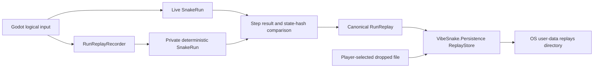

# Replay Recording and Storage

[Documentation hub](../README.md)

This document owns the current native replay contract. It distinguishes the
verified 0.3 capture and storage foundation from the replay browser, playback,
ghost, sharing, and trailer-capture work planned for later versions.

## Current capability

The native slice can now:

- record every logical direction attempt received between fixed rules steps,
  including attempts rejected by the bounded movement queue;
- compare each live step with a private deterministic mirror before accepting it
  into the recording;
- finalize a canonical replay only when the final live state and mirror state
  match exactly;
- verify checkpoints and outcome before a replay reaches storage;
- write terminal Godot runs atomically below the operating system user-data
  directory;
- reload and verify the exact saved file before reporting success;
- verify the latest stored replay through the `R` or Controller North action;
- inspect one dropped external replay without copying, modifying, migrating, or
  deleting the source; and
- preserve incompatible future files while reporting the exact compatibility
  reason.

This is a trustworthy capture and inspection path, not replay playback. The
browser and playback UX remain in roadmap version 0.8.0.

## Ownership and trust boundaries



`VibeSnake.Rules` owns commands, deterministic execution, replay construction,
compatibility, integrity, and verification. It has no file, clock, Godot, or
platform dependency. `VibeSnake.Persistence` owns bounded file inspection,
timestamps, user-data paths supplied by the application, and atomic writes. The
Godot application owns input routing and player-facing status. It does not
implement replay rules or parse replay JSON.

## Envelope identity

| Contract | Current value | Failure behavior |
| --- | --- | --- |
| Replay schema | `1` | A different schema returns `UnsupportedSchema` and remains untouched |
| Kind | `vibesnake-run-replay` | A different kind returns `UnsupportedKind` |
| Rules identity | `vibesnake-core@4` | A different ID or version is rejected before execution |
| Random algorithm | `pcg-xsh-rr-32-v1` | An unknown algorithm is rejected before execution |
| State hash | `fnv1a64-canonical-json-v3` | An unknown algorithm is rejected before execution |
| Integrity | `sha256-canonical-replay-payload-v1` | A changed payload returns `IntegrityMismatch` |
| Embedded state | Canonical state schema 2 | Invalid or impossible state returns `InvalidPayload` |

The envelope stores the canonical initial state, ordered logical attempts by
step, deterministic checkpoints, final tick, status, death cause, score, and
state hash. Canonical serialization and the complete envelope are limited to 16
MiB. A replay can contain at most 100,000 rules steps and 64 logical attempts in
one step.

## Live recording invariants

`RunReplayRecorder` begins from a running `SnakeRun` and restores a private
mirror from the same canonical state. On each fixed step it:

1. retains the ordered logical attempts exactly as the Godot shell received
   them;
2. applies those attempts to the mirror through the real direction queue;
3. advances the mirror through the real rules step;
4. compares the complete `RunStepResult`, including ordered events and state
   hash, with the live result; and
5. compares the live state hash with the mirror state hash before committing the
   replay step.

Finalization also compares the complete canonical live and mirror states and
builds the envelope through the same constructor used by offline capture. This
mirror proof avoids replaying the whole run again on the terminal gameplay
frame. The persistence boundary independently verifies the completed envelope
before writing it. Command, step, lifecycle, divergence, and serialized-size
failures make the recorder unusable for that run without interrupting gameplay.
An unusable recording is never saved.

## Storage contract

The application supplies an absolute user-data root. The store owns only its
`replays` child directory. A generated filename has this form:

```text
yyyyMMddTHHmmssfffZ_<64-lowercase-hex-payload-hash>.vibesnake-replay.json
```

Writes use UTF-8 without a byte-order mark. The store writes a unique temporary
file in the destination directory, flushes it to stable storage, then performs a
same-directory move without overwrite. A conflicting destination is preserved
and reported. A retry with identical content is idempotent, including a retry at
a later clock value, because existing files are matched by payload hash and
compared with a bounded stream.

The complete duplicate, quota, temporary-write, and final-move transaction holds
an exclusive `.vibesnake-replay-store.lock` file. Cooperating game processes
therefore cannot both pass the same capacity check or create duplicate payloads
under different timestamps. Lock acquisition has a bounded wait and returns
`Busy` without changing replay data when another process owns the transaction.

Storage is fail-closed at 256 replay files or 256 MiB of replay data. Reaching a
limit does not delete or replace an existing file. The player receives an
actionable result telling them to archive or remove reviewed replays before
retrying. Automatic pruning is deliberately absent because replay deletion is a
player-data operation.

## Import and compatibility behavior

Stored names reject path separators, drive or alternate-stream separators,
control characters, and wrong extensions. External inspection requires an
absolute path and opens the source read-only. Before JSON parsing, the store:

- rejects files larger than 16 MiB;
- bounds reads if a file changes size while open;
- rejects a UTF-8 byte-order mark and malformed UTF-8; and
- preserves the source for every success and failure result.

Compatibility and deterministic verification are separate results. A replay can
have a canonical, integrity-valid envelope and still fail deterministic
verification at a checkpoint. The UI reports that distinction instead of
silently treating every failure as corruption.

Verification has a deterministic 16,000,000 work-unit budget in addition to the
size and step caps. It rejects an impossible body-size and step-count product
before executing it, then charges actual body hashing, every potential full-grid
food scan, and both potential full-grid power-spawn passes before each step.
Godot runs save, latest-file, and dropped-file operations as one background
operation at a time, while the main thread remains responsive. Replay work gates
new runs, a terminal save is retained behind any active inspection, and normal
quit or window-close requests wait for save completion. A monotonic five-second
deadline releases exit if local I/O never returns, and unexpected teardown uses
the same bounded final save-drain window.
Compatibility messages never echo untrusted contract identifiers, and displayed
status text is control-character sanitized and limited to 240 characters.

## Automated proof

The native contract suite covers live rejected-input capture, terminal runs,
step-result and live-state divergence, command bounds, lifecycle misuse,
canonical round trips, future schemas, integrity tampering, invalid UTF-8,
oversized-file guards, path traversal, alternate-stream names,
read-only external inspection, conflicting writes, sequential and concurrent
idempotent retries, cross-process lock contention, concurrent capacity checks,
file-count and byte limits, deterministic verification work limits, bounded
untrusted diagnostics, I/O failures, and compatible-but-divergent files.

The real Godot scene smoke records a terminal run, saves it under an explicit
isolated user-data root, reloads it, inspects it through the external boundary,
checks actionable future-schema feedback, verifies the background latest-replay
action, and exits without warnings or leaked objects. The editor and
packaged-player scripts
require exactly one final replay and reject leftover atomic temporary files. Two
clean Windows exports have passed this contract with identical artifact
manifests.

Run the complete native check from the repository root:

```powershell
./scripts/test_native.ps1
```

Run the outside-checkout packaged-player check with:

```powershell
./scripts/test_native_export.ps1
```

## Remaining replay work

The dependency-ordered roadmap still requires minimized failure promotion,
cross-platform retained replay evidence, published user-data paths, profile and
score metadata integration, a replay browser, deterministic playback controls,
ghost and challenge presentation, and accessibility review. No current document
should describe those features as implemented.
